## 架构篇
1. ES是什么，适用于什么场景
```
Elasticsearch 是一个分布式、RESTful API风格的搜索和数据分析引擎
```
2. 如何理解RESTful风格
```
1996年推出HTTP/1.0
2000年提出RESTful
2000年ebay推出商业化API
2000年全球第一款塞班智能手机出售
2001年微软推出Windows Mobile
2005年推出ajax，js异步接口调用
2008年IOS、Android应用推出
在常规的HTTP API设计中，会在url中指定接口含义，比如获取用户信息 /getUserInfo?userId=x; 修改用户信息/updateUserInfo?userId=x;
在RESTFul风格：用URL定位资源，看http method知道怎么干，看http status code就知道结果如何。这种风格的难点在于对资源的抽象，当前业务普遍繁多且定制化严重，很难对业务抽象出准确的资源定义。所以并不要建议在项目中瞎使用RESTFul风格，它比较适用于资源单一，并且比较粗粒度的公共服务化接口。
HTTP Method对应的资源操作行为如下：
GET 用来获取资源；
POST 用来新建资源；
PUT 用来更新资源；
DELETE 用来删除资源
Restful论文：https://www.ics.uci.edu/~fielding/pubs/dissertation/top.htm
```
3. 节点 Node、集群 Cluster 和分片 Shards
```
ElasticSearch 是分布式数据库，允许多台服务器协同工作，每台服务器可以运行多个实例。单个实例称为一个节点（node），一组节点构成一个集群（cluster）。分片是底层的工作单元，文档保存在分片内，分片又被分配到集群内的各个节点里，每个分片仅保存全部数据的一部分。
```
 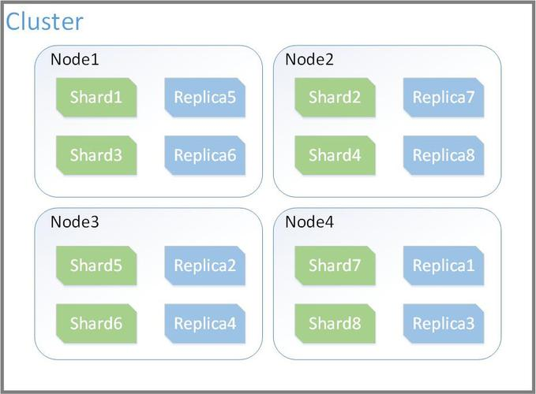

4. 节点类型
```
Master节点：管理集群的变更，如创建/删除索引、节点健康状态检测、节点上/下线等
数据节点：用于数据落地存储，执行数据增删改查操作
协调节点：负责接收请求，转发指令，聚合结果
Ingest节点：ingest 节点可以看作是数据前置处理转换的节点，支持 pipeline管道设置，可以使用 ingest 对数据进行过滤、转换等操作，类似于 logstash 中 filter 的作用，功能相当强大。默认情况下，所有节点都启用Ingest，因此任何节点都可以处理Ingest任务。我们也可以创建专用的Ingest节点

以上节点都可以配置成独立的，也可以一个节点扮演多个角色。默认情况下，所有节点都是协调节点、数据节点、Ingest节点
混合部署（左图）:默认方式，这种方式可能会出现大量聚合结果影响本节点的数据查询，有条件就使用分层部署，单独用几台机器作为协调节点
分层部署（右图）:协调节点不承载数据
```
 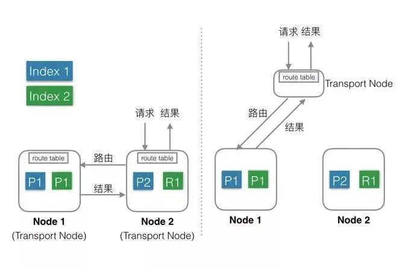

5. 集群发现机制
```
提供了两种方案供选择
1.广播：配置相同的集群名在局域网内广播，发现就抱团
2.单播：通过文件配置部分机器的ip列表，互相传播并把自己发现的节点告诉已发现节点
```

6. 节点选举原理
```
Node启动后，首先要通过节点发现功能加入集群。ZenDiscovery是ES自己实现的一套用于节点发现和选主等功能的模块，没有依赖Zookeeper等工具。只有候选的主节点（master：true）才能成为主节点

大概原理：
		先根据节点的clusterStateVersion（包含了整个群集中所有分片的元信息）比较，clusterStateVersion越大，优先级越高。clusterStateVersion相同时，进入compareNodes，其内部按照节点的Id比较(Id为节点第一次启动时随机生成)。通过设置最小主节点数大于一半来防止脑裂，投票数要大于等于最小主节点数
		
		当前涉及到集群的主流选主方案基本是两个方向
1.依赖Zookeeper（zab算法），方案简单。缺点是多了一个组件。例如kafka
2.使用成熟的算法实现，例如RAFT算法。相比 Paxos， Raft 一直以来就是以易于理解著称。Redis Cluster就是用了Raft算法

另外还有些集群头铁，自己瞎写算法，例如ES集群（当年还没有RAFT算法），迭代好几年了在某些场景下仍然有bug。
7.X之后的ES，采用一种新的选主算法，实际上是 Raft 的实现，但并非严格按照 Raft 论文实现，而是做了一些调整
```

7. 数据分片算法是怎样的
```
hash(<文档id>) % <主分片数量> 根据结果映射到不同的分片
副本数量可以增加但是分片数量不能变更，因为数据是取模路由到分片的，由服务端协调节点完成。
子文档数据插入时要指定parentid，确保按照关联把父子文档映射到一个分片
```

8. ES构造索引的流程
 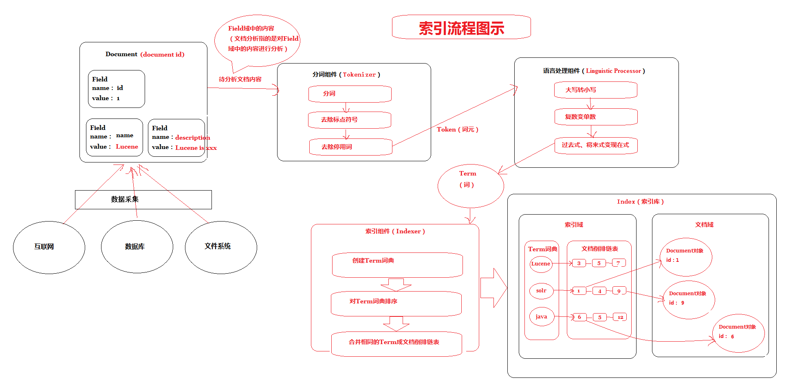

9. 检索数据流程
```
数据检索主要分为两个阶段，query阶段和fetch阶段
1.客户端向协调节点请求搜索top N条数据，协调节点进入第一阶段：将查询请求转发给其他节点
2.收到Query请求的节点在内部查询并打基本分排序，向协调节点返回m条
3.协调节点收到响应列表（包含docID/排序字段），进行rescore重新打分、综合排序、并获得N个docID
4.协调节点进入第二阶段：根据这些排序后的docID向集群对应节点发起获取N个Document
5.协调节点获得返回的N条Document，并返回给客户端

同一个分片可能存在多个副本，是怎么决定要分配给哪个副本查的呢？
副本选择的方式有如下几种：
根据偏好参数指定分片副本
感知副本选择
自适应副本选择
轮询分片的方式选择副本（默认）
```
 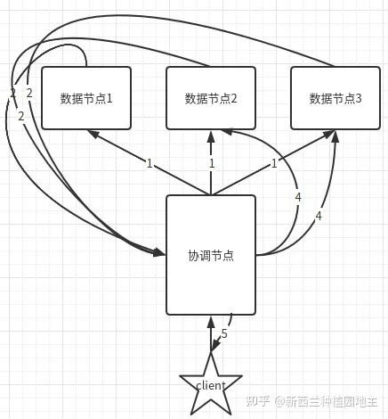


10. 索引 Index、Mapping、类型 Type 和文档 Document
```
对比我们比较熟悉的 MySQL 数据库：
index -> db
mapping -> schema
type-> table
document -> row
```

11. ES的版本演化
```
https://www.modb.pro/db/130339
```
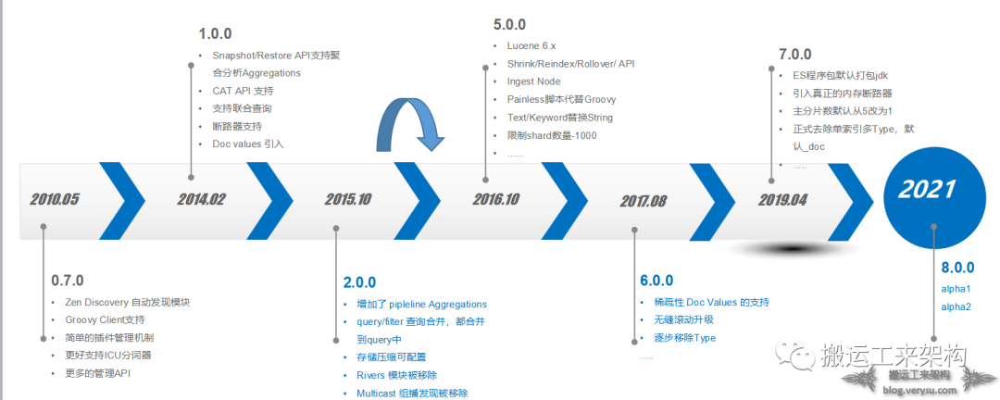

12. ES支持事务吗？
```
基于搜索应用场景的设计，并不支持事务，所以ES设计上才能更加简单
```

## 底层-Lucene
1. ES和Lucene的关系
```
   Elasticsearch 使用了Apache Lucene，后者是 Doug Cutting(Apache Hadoop 之父) 使用 Java 开发的全文检索工具库，其内部使用的是被称为倒排索引的数据结构，其设计是为全文检索结果的低延迟提供服务。文档是 Elasticsearch 的数据单位，对文档中的词项进行分词，并创建去重词项的有序列表，将词项与其在文档中出现的位置列表关联，便形成了倒排索引
```

2. Lucene索引的构成
```
Lucene index 由一堆 Segment 的集合加上一个提交点组成
Segment：也叫段，相当于一个数据集。segment是不可变的，只会整体删除重新构建
Commit point：提交点，保存着所有segment列表
```
 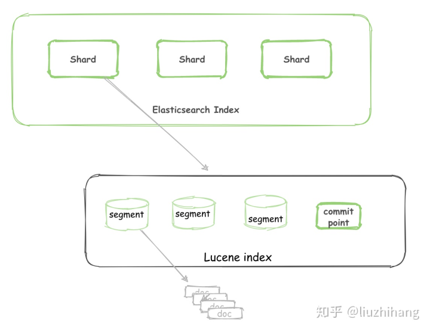

3. 什么是倒排索引，倒排索引是如何实现的
```
从一个文档中查找某些单词叫做正向索引，这是我们传统的阅读搜索方式。
在文档很多的情况下，我们想查找出存在指定单词的文档，这种方式与传统方式相反，所以叫反向索引也叫倒排索引。
Mysql数据库中的二级索引其实也是反向的，通过字段值去找记录。但现在倒排索引专指使用词汇搜索文档的情况，所以mysql的二级索引不能称其为倒排索引。
   
   底层结构如下图所示，Term Index 不存储所有的单词，只存储单词前缀，底层是Trie Tree，占用空间小可直接加载到内存。
   lucene 在这里还做了两点优化，一是 term dictionary 在磁盘上面是分 block 保存的，一个 block 内部利用公共前缀压缩。比如都是 Ab 开头的单词就可以把 Ab 省去。二是 term index 在内存中是以 FST（finite state transducers）的数据结构保存的。有两点优势：①空间占用小。通过对词典中单词前缀和后缀的重复利用，压缩了存储空间。②查询速度快。O(len(str)) 的查询时间复杂度。
   通过字典树找到单词所在的block，也就是单词的大概位置，再在块里二分查找，找到对应的单词，再找到单词对应的文档列表。
```
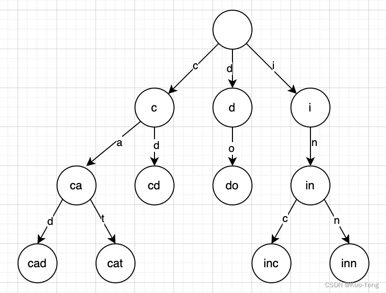
 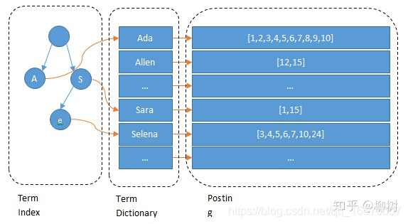

4. 详细说下Segment是个什么概念
```
首先segment是个逻辑概念，是一系列不同类型文件的集合。数据在写入的过程中，达到一定条件会保存当前segment，开启一个新的segment写入。数据是由若干份segment组成，每个segment只保存了部分数据。
```
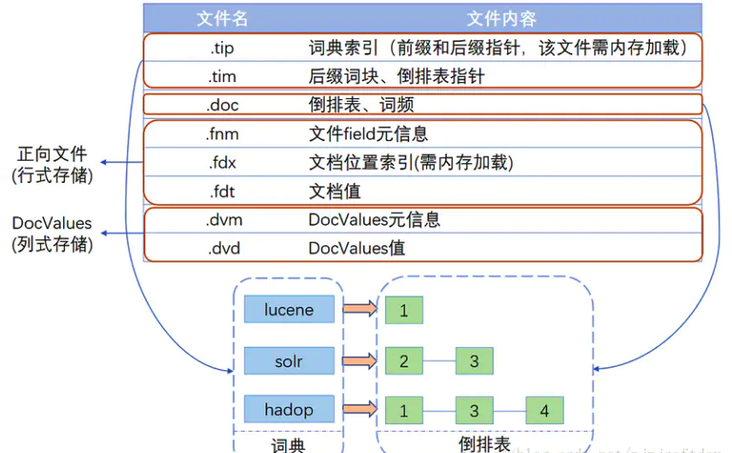
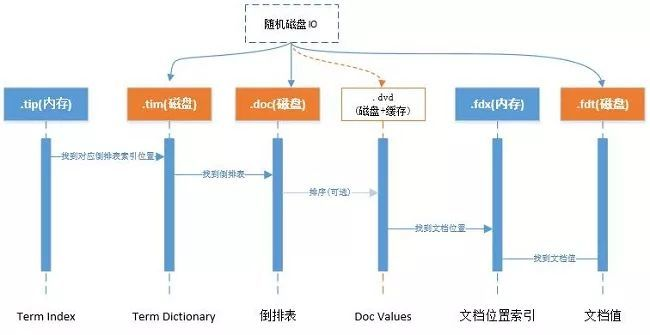

5. 描述下写入操作的流程
```
1. Document 不断写入到 In-memory buffer（此时Document不可读）
2. 追加 translog（相当于redolog，用于故障恢复。每隔 5s 会 fsync 到磁盘）
3. buffer 中的数据会每秒 refresh 到 cache（磁盘高速缓存）中，并生成新的segment（此时Document才可读，这就是ES的可见性并不是准实时的原因）
4. buffer 被清空，记录 commit point，cache 内的 segment 被 fsync 刷新到磁盘。 删除translog
```
 

6. segment可变吗
```
segment 不可改变，所以 docment 并不能从之前的 segment 中移除或更新。
   所以每次 commit，生成 commit point 时，会有一个 .del 文件，里面会列出被删除的 document（逻辑删除）。而查询时，获取到的结果在返回前会经过 .del 过滤。
   更新时，也会标记旧的 docment 被删除，写入到 .del 文件，同时会写入一个新的文件。此时查询会查询到两个版本的数据，但在返回前会被移除掉一个。
```

7. 说下segment合并
```
每 1s 执行一次 refresh 都会将内存中的数据创建一个 segment。
segment 数目太多会带来较大的麻烦。 每一个 segment 都会消耗文件句柄。更重要的是，每个搜索请求都必须轮流检查每个 segment ；所以 segment 越多，搜索也就越慢。
ElasticSearch 有一个后台进程专门负责 segment 的合并，定期执行 merge 操作，将多个小 segment 文件合并成一个 segment，在合并时被标识为 deleted 的 doc（或被更新文档的旧版本）不会被写入到新的 segment 中。合并完成后，然后将新的 segment 文件 flush 写入磁盘；然后创建一个新的 commit point 文件，标识所有新的 segment 文件，并排除掉旧的 segement 和已经被合并的小 segment；然后打开新 segment 文件用于搜索使用，等所有的检索请求都从小的 segment 转到 大 segment 上以后，删除旧的 segment 文件，这时候，索引里 segment 数量就下降了。
```
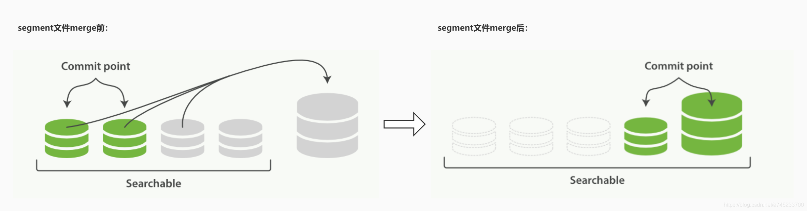

8. 为什么segment合并可以做到不中断正常读写
```
因为segment是不可变的，在合并的过程中不会出现对操作过的segment的改变
```

9. 为什么mysql和lucene使用的索引形式不同
```
搜索引擎的场景面向的是select多、insert少、update更少的场景，segment可以设计为不变的，并且在磁盘上连续存储。经压缩后可以加载到内存，没有磁盘随机IO。而Mysql要读写兼备，数据变化频繁，主要解决磁盘的随机IO。
```

10. 说下ES的读写一致性
```
1. 由于数据是先写入buffer，而索引是在segment生成，所以写入之后并不能立刻读到，除非buffer的数据refresh到了cache。
要解决这个层面的读写一致性，需要在写入后，代码调用refresh方法强制写入cache
2. 还有另一个层面的读写一致性在主副本层面
es提供了三种写一致性的设置：consistency：one、all、quorum
one：写入主节点就算成功
quorum（默认）：write的时候，W>N/2，即参与写入操作的节点数W，必须超过副本节点数N的一半。如果是quorum策略，则读取要保证一致性的话，就得使用read quorum，读取N个副本中的W个然后仲裁得到最新数据。或者是指定从primary上面去读
all：所有副本都写入才算成功
```

11. 说下ES的NRT？
```
NRT(Near Realtime):近实时的意思，概念挺唬人的，就是因为写入的时候是写在buffer中，每秒钟刷到cache，所以不能实时读取到
```

12. ES如何保证数据不丢失
```
		refresh行为会立即把缓存中的文档写入segment中，但是此时新创建的segment是写在文件系统的缓存中的。如果出现断电等异常，那么这部分数据就丢失了。所以es会定期执行flush操作，将缓存中的segment全部写入磁盘并确保写入成功，同时创建一个commit point，整个过程就是一个完整的commit过程。
		但是如果断电的时候，缓存中的segment还没有来得及被commit到磁盘，那么数据依旧会产生丢失。为了防止这个问题，es中又引入了translog文件。
		但是translog本身也是写入到缓存的，每5秒钟刷一次盘。如果宕机会丢失5s的数据。可以设置每次写入都强制刷盘translog，但是性能会比较慢。需要根据自身的需求来合理定制方案。
		
		既然buffer中的数据是每秒refresh到cache中，那么translog每5秒钟刷一次盘还有什么意义呢？因为cache中的数据由操作系统控制刷盘，时机不确定。详细步骤如下：
		当达到默认的30分钟时候，translog也会变得非常大，这个时候index要执行一次flush操作，同时会生成一个新的translog文件，并且要执行full commit操作
1. 内存buffer里的所有document会被生成一个新的segment
2. 然后segment被refresh到系统cache后，内存buffer会被清空
3. 接着commit point会被写入到磁盘上
4. filesystem cache会被flush到磁盘上
5. 最后旧的translog会被删除，并会生成一个新的translog
```
## ES使用
1. GET、POST、PUT、DELETE 请求方法分别对应什么操作
```
GET 用来获取资源；
POST 用来新建资源；
PUT 用来更新资源；
DELETE 用来删除资源；

实际上ES中的put和post同样都具备创建和更新的功能
*put需要精确到某一个资源文件，这样才能进行对数据的更新和创建操作，创建时需要指定_create参数。例如：PUT crm/user_info/1/_create
*post能对整个资源集合进行操作，如果没有指定具体修改的文件id，那么post指令会自动生成一个唯一的id进行文件的创建，并将数据写入该文件中。如果指定了文件id，那么就会根据填写的参数对数据进行创建和更新操作

由上可见，直接用POST操作更新和创建即可
```

2. 什么是DSL，简述其语法和常用查询
```
Domain Specific Language 领域专用语言， Elasticsearch提供了基于JSON的DSL来定义查询。 DSL由叶子查询子句和复合查询子句两种子句组成。
```
 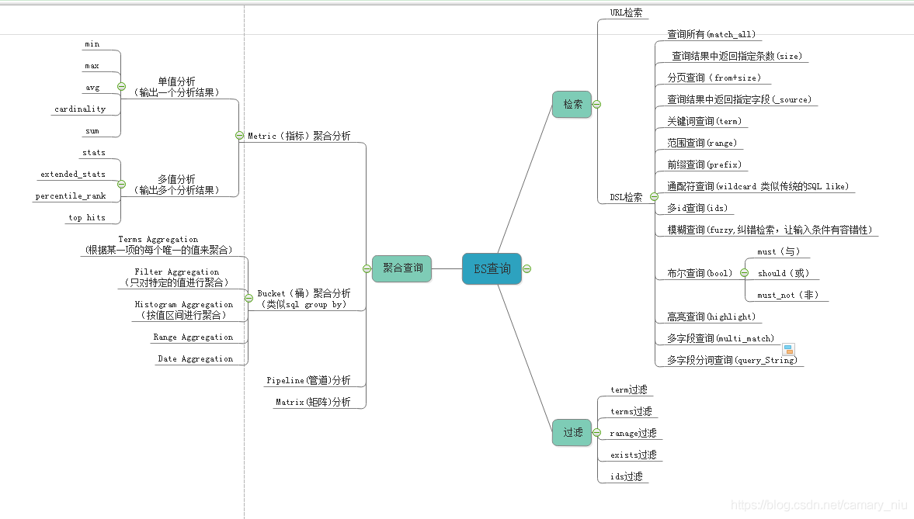

3. bool组合查询包含哪四种？查询结果是不同操作的并集还是交集
```
{
    "bool":{
        "must":[],
        "should":[],
        "must_not":[],
        "filter":{}
    }
}

must、must_not、should和filter，前三个是数组，filter是对象
must：    必须匹配。贡献算分
must_not：过滤子句，必须不能匹配，但不贡献算分
should：  选择性匹配，单独使用时至少满足一条(与must子句使用时可都不满足)。贡献算分
filter：  过滤子句，必须匹配，但不贡献算分

查询结果是这几个操作的综合含义，既要这样又要这样最好这样不能那样
```

4. 常用筛选方法，must和filter的区别
```
filter关注的是，文档是否匹配查询条件，结果只有两个，是和否。没有其它额外的计算，不打分。会自动被ES缓存结果，效率进一步提高
```

5. 条件更新
```rust
POST people/update_by_query
{
    "script": {
        "source": "ctx._source['phone']='null'"
    },
    "query":{
        "term":{
            "phone":{
                "value": "0"
            }
        }
    }
}
```

6. 条件删除
```rust
POST /索引名称/_delete_by_query   
{
    "query": {
        "bool": {
            "must_not": [
                {
                    "match": {
                        "test": "字段值"
                    }
                }
            ]
        }
  	}
}
```

7. text和keyword的区别
```
text会分词，需要用match匹配查询，不能用term等精准查询
keyword不会分词，需要用term精准查询，也支持match
```

8. 如果查询一句完整的话怎样查询
```
使用match_phrase，短语查询。可以保证搜索结果含有一整句话。
在kibana的使用过程中，
messgae:查询某句话  使用的match查询
messgae:"查询某句话" （双引号括起来）  使用的match_phrase查询
```

9. bulk是什么
```
可以批量对多个索引进行增加或者删除等操作，减少网络请求次数，可以显著的提高索引的速度
在crm的etl中对es进行写入时就使用了bulk
```

10. 如何实现分页查询
```
主要有三种方案：
1.from, size，因为es是分片的需要每个分片都执行分页后再汇总，所以要求from+size不能超过1万。防止系统消耗过大
2.scroll，对数量没限制，适合实时性要求不高的。因为会在请求接收到之后对结果做快照，所以后续数据改动难以感知到
3.seach after 相当于记录了order字段的返回值，下次拿着起点值过滤即可，只能查询下一页。而且排序值要保持唯一，否则结果并不准确，例如有10条相同值的数据“dog”，第一页只展示了5条“dog”，下一页如果用>"dog"会错过5条，这只是举例，要注意实际的排序字段含义。
```

11. es分页原理
```
假如查询是 from 1000， size 10
```
 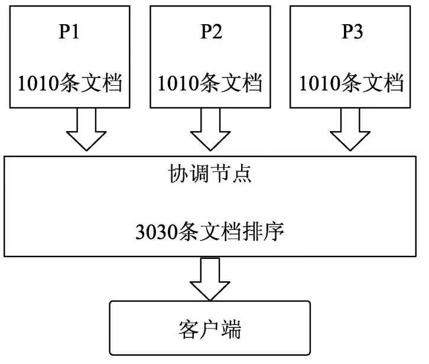

12. scroll查询（crm中有用到）
```
使用scroll会生成一个当前查询条件结果的快照，后面的每次滚屏（或者叫翻页）都是基于这个快照的结果，也就是即使有新的数据进来也不会查询到。可以用于大数据量的依次拉取或者实时性要求不高的分页
scroll还可以指定多个切片slice，相当于切分成多个部分，用多线程来请求，crm中这么用的

第一个请求的结果返回了属于第一个切片（id：0）的文档，第二个请求的结果返回了属于第二个切片的文档。默认情况下，使用以下公式：floorMod(hashCode(切片编号), 分片数) 例如，如果分片数等于 2 并且用户请求了 4 个切片，则切片 0 和 2分配给第一个分片，切片 1 和 3 分配给第二个分片。
参考链接：https://www.elastic.co/guide/en/elasticsearch/reference/6.2/search-request-scroll.html?spm=a2c6h.12873639.article-detail.7.4bc148104fTyZf
```

```rust
curl -XGET 'localhost:9200/twitter/tweet/_search?scroll=1m&pretty' -H 'Content-Type: application/json' -d'
{
    "size": 100,
    "query": {
        "match" : {
            "title" : "elasticsearch"
        }
    }
}
'
```

```rust
curl -XGET 'localhost:9200/_search/scroll?pretty' -H 'Content-Type: application/json' -d'
{
    "scroll" : "1m", 
    "scroll_id" : "DXF1ZXJ5QW5kRmV0Y2gBAAAAAAAAAD4WYm9laVYtZndUQlNsdDcwakFMNjU1QQ==" 
}
'
```

13. nested、父子Type有什么用
```
nested object数据类型：ES在保存的时候不会有扁平化处理。两者对比见下图

ES 提供了类似关系型数据库中 Join 的实现，可以用父子Type的形势来实现
注意：父子文档的查询数据需要放到一个分片中
CRM中的join查询是依赖了父子Type
详见：https://blog.csdn.net/huanglu0314/article/details/126651963（里边有扁平化、非扁平化的解释）
```
 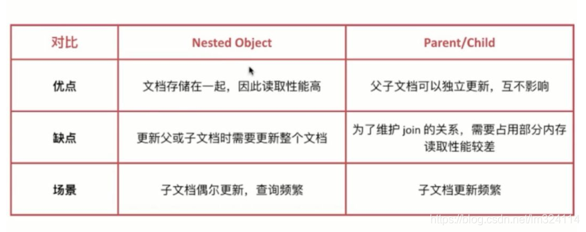

14. 在es6中已经不建议使用type，在es7中已经彻底移除type，只有一个默认type。那么CRM需求在新的es版本中应该如何满足
```
虽然废弃了父子Type，但依然支持关联查询。
新版本中有join字段，可以用来进行关联查询，查询方式依然使用has_child和has_parent
初步参考：https://blog.csdn.net/w1014074794/article/details/119355162
```

15. CRM中的=0条件是怎么实现的
```
mustnot结合has_child使用
```

16. 聚合查询有哪几种
```rust
1. 分桶聚合，类似于group by
GET food/_search
{
  "size": 0, //关闭hit(source)数据的显示 
  "aggs": {
    "tags_aggs": {
      "terms": {
        "field": "Tags", 
        "size": 20,  //显示的桶的个数,常用于分页,
        "order": {
          "_count": "asc" //按照每个桶统计的数量进行升序排列
        }
      }
    }
  }
}

2. 指标聚合，相当于没有group by的min、max等
GET food/_search
{
  "size": 0, //关闭hit(source)数据的显示 
  "aggs": {
    "max_price":{
      "max": {
        "field": "Price"
      }
    },
    "min_price":{
      "min": {
        "field": "Price"
      }
    },
    "avg_price":{
      "avg": {
        "field": "Price"
      }
    },
    "sum_price":{
      "sum":{
        "field": "Price"
      }
    }
  }
}

3. 管道聚合，管道聚合主要用于对聚和结果的二次聚合，举个例子，这里需要计算某个商城中的各个品牌手机价格平均值中最小的手机品牌
GET food/_search
{
  "size": 0, 
  "aggs": {
    "type_bucket": {
      //首先按照Type字段进行分桶
      "terms": {
        "field": "Type"
      },
      //因为要计算各个分桶的平均值,所以在分桶的基础上做指标聚合
      "aggs": {
        "price_bucket": {
          "avg": {
            "field": "Price"
          }
        }
      }
    },
    //这里通过buckets_path实现查找平均值最低的食物分类的桶
    "min_bucket":{
      "min_bucket": {
        "buckets_path": "type_bucket>price_bucket"
      }
    }
  }
}

```

17. es 正排索引
```
es中的正排索引就是Doc Values。Doc Values 是在索引时与 倒排索引 同时生成。也就是说 Doc Values 和 倒排索引 一样，基于 Segement 生成并且是不可变的。同时 Doc Values 和 倒排索引 一样序列化到磁盘，这样对性能和扩展性有很大帮助。
Doc Values结构如下所示，像其名字一样，记录了doc->values的映射，主要用于聚合时。Doc Values对每个字段默认开启，如果某个字段不需要聚合排序等功能可以单独关掉
```

```text
Doc      Terms
-----------------------------------------------------------------
Doc_1 | brown, dog, fox, jumped, lazy, over, quick, the
Doc_2 | brown, dogs, foxes, in, lazy, leap, over, quick, summer
Doc_3 | dog, dogs, fox, jumped, over, quick, the
-----------------------------------------------------------------
```

18. 客户端是如何选择协调节点发送请求的？
```
CRM使用的是TransportClient客户端
TransportClient利用transport模块远程连接一个ElasticSearch集群。它并不加入到集群中，只是简单的获得一个或者多个初始化的transport地址，并以轮询的方式与这些地址进行通信
```

19. ES常用的JAVA客户端
```
ES目前有4种客户端：Jest client、Rest client、Transport client、Node client

1. Node client（2.3弃用）:需要单独建立一个节点，连接该节点进行操作，该节点不能存储数据，也不能成为主节点。
2. Transport client（7.0弃用）:是不需要单独一个节点，脱离在集群之外。
		Transport client、Node client都是通过9300端口，使用 Elasticsearch 的原生传输协议和集群交互。（集群交互的端口都是通过9300）
3. Java Low Level REST Client: 低级别的REST客户端，通过http与集群交互，用户需自己编组请求JSON串，及解析响应JSON串。兼容所有ES版本。
4. Java High Level REST Client: 高级别的REST客户端，基于低级别的REST客户端，增加了编组请求JSON串、解析响应JSON串等相关api。使用的版本需要保持和ES服务端的版本一致，否则会有版本问题。
```

## 深入篇
4. context、SearchContext
5. 集群架构
6. 倒排索引的结构
7. 列存储
8. FST 是什么？
9. 用最新版本的ES怎么实现CRM的需求
10. ES如何避免脑裂：minimum_master_nodes