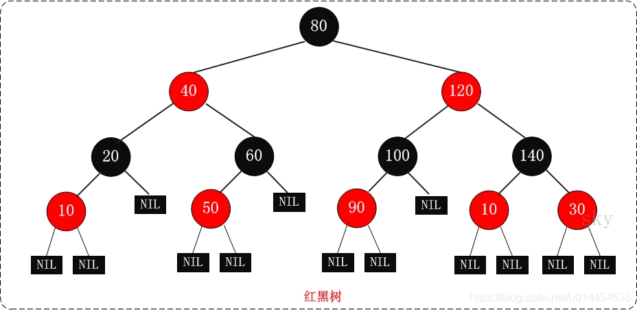

# Java 集合框架

Java 集合， 也叫作容器，主要是由两大接口派生而来：一个是 Collection接口，主要用于存放单一元素；另一个是 Map 接口，主要用于存放键值对。对于Collection 接口，下面又有三个主要的子接口：List、Set 和 Queue。

Java 集合框架如下图所示：


## ArrayList和LinkedList有什么区别

1. 数据结构不同
* ArrayList基于数组实现
* LinkedList基于双向链表实现


2. 多数情况下，ArrayList更利于查找，LinkedList更利于增删
* ArrayList基于数组实现，get(int index)可以直接通过数组下标获取，时间复杂度是O(1)；
* LinkedList基于链表实现，get(int index)需要遍历链表，时间复杂度是O(n)；
* 当然，get(E element)这种查找，两种集合都需要遍历，时间复杂度都是O(n)。
* ArrayList增删如果是数组末尾的位置，直接插入或者删除就可以了，但是如果插入中间的位置，就需要把插入位置后的元素都向前或者向后移动，甚至还有可能触发扩容；
* 双向链表的插入和删除只需要改变前驱节点、后继节点和插入节点的指向就行了，不需要移动元素。

3. 是否支持随机访问
* ArrayList基于数组，所以它可以根据下标查找，支持随机访问，当然，它也实现了 RandomAccess 接口，这个接口只是用来标识是否支持随机访问。
* LinkedList基于链表，所以它没法根据序号直接获取元素，它没有实现 RandomAccess 接口，标记不支持随机访问。

4. 内存占用
* ArrayList基于数组，是一块连续的内存空间，LinkedList基于链表，内存空间不连续，它们在空间占用上都有一些额外的消耗
* ArrayList是预先定义好的数组，可能会有空的内存空间，存在一定空间浪费
* LinkedList每个节点，需要存储前驱和后继，所以每个节点会占用更多的空间

## ArrayList的扩容机制了解吗

ArrayList是基于数组的集合，数组的容量是在定义的时候确定的，如果数组满了，再插入，就会数组溢出。所以在插入时候，会先检查是否需要扩容，如果当前容量+1超过数组长度，就会进行扩容。

ArrayList的扩容是创建一个1.5倍的新数组，然后把原数组的值拷贝过去。


## ArrayList怎么序列化的知道吗？ 为什么用transient修饰数组？

ArrayList的序列化不太一样，它使用transient修饰存储元素的elementData的数组，transient关键字的作用是让被修饰的成员属性不被序列化。

为什么ArrayList不直接序列化元素数组呢？

出于效率的考虑，数组可能长度100，但实际只用了50，剩下的50不用其实不用序列化，这样可以提高序列化和反序列化的效率，还可以节省内存空间。

那ArrayList怎么序列化呢？

ArrayList通过两个方法readObject、writeObject自定义序列化和反序列化策略，实际直接使用两个流ObjectOutputStream和ObjectInputStream来进行序列化和反序列化。


## 快速失败(fail-fast)和安全失败(fail-safe)了解吗？

快速失败（fail—fast）：快速失败是Java集合的一种错误检测机制
* 在用迭代器遍历一个集合对象时，如果线程A遍历过程中，线程B对集合对象的内容进行了修改（增加、删除、修改），则会抛出Concurrent Modification Exception。
* 原理：迭代器在遍历时直接访问集合中的内容，并且在遍历过程中使用一个 modCount 变量。集合在被遍历期间如果内容发生变化，就会改变modCount的值。每当迭代器使用hashNext()/next()遍历下一个元素之前，都会检测modCount变量是否为expectedmodCount值，是的话就返回遍历；否则抛出异常，终止遍历。
* 注意：这里异常的抛出条件是检测到 modCount！=expectedmodCount 这个条件。如果集合发生变化时修改modCount值刚好又设置为了expectedmodCount值，则异常不会抛出。因此，不能依赖于这个异常是否抛出而进行并发操作的编程，这个异常只建议用于检测并发修改的bug。
* 场景：java.util包下的集合类都是快速失败的，不能在多线程下发生并发修改（迭代过程中被修改），比如ArrayList 类。

安全失败（fail—safe）
* 采用安全失败机制的集合容器，在遍历时不是直接在集合内容上访问的，而是先复制原有集合内容，在拷贝的集合上进行遍历。
* 原理：由于迭代时是对原集合的拷贝进行遍历，所以在遍历过程中对原集合所作的修改并不能被迭代器检测到，所以不会触发Concurrent Modification Exception。
* 缺点：基于拷贝内容的优点是避免了Concurrent Modification Exception，但同样地，迭代器并不能访问到修改后的内容，即：迭代器遍历的是开始遍历那一刻拿到的集合拷贝，在遍历期间原集合发生的修改迭代器是不知道的。
* 场景：java.util.concurrent包下的容器都是安全失败，可以在多线程下并发使用，并发修改，比如CopyOnWriteArrayList类。

## 有哪几种实现ArrayList线程安全的方法？

fail-fast是一种可能触发的机制，实际上，ArrayList的线程安全仍然没有保证，一般，保证ArrayList的线程安全可以通过这些方案：

* 使用 Vector 代替 ArrayList。（不推荐，Vector是一个历史遗留类）
* 使用 Collections.synchronizedList 包装 ArrayList，然后操作包装后的 list。相当于在内部操作加了同步
* 使用 CopyOnWriteArrayList 代替 ArrayList。
* 在使用 ArrayList 时，应用程序通过同步机制去控制 ArrayList 的读写。

## CopyOnWriteArrayList了解多少？

CopyOnWriteArrayList就是线程安全版本的ArrayList。

它的名字叫CopyOnWrite——写时复制，已经明示了它的原理。

CopyOnWriteArrayList采用了一种读写分离的并发策略。CopyOnWriteArrayList容器允许并发读，读操作是无锁的，性能较高。至于写操作，比如向容器中添加一个元素，则首先将当前容器复制一份，然后在新副本上执行写操作，结束之后再将原容器的引用指向新容器。


## 能说一下HashMap的数据结构吗？

JDK1.7的数据结构是数组+链表。

说一下JDK1.8的数据结构吧：

JDK1.8的数据结构是数组+链表+红黑树。

数据结构示意图如下：


其中，桶数组是用来存储数据元素，链表是用来解决冲突，红黑树是为了提高查询的效率。

* 数据元素通过映射关系，也就是散列函数，映射到桶数组对应索引的位置
* 如果发生冲突，从冲突的位置拉一个链表，插入冲突的元素
* 如果链表长度>8 & 数组大小>=64，链表转为红黑树
* 如果红黑树节点个数<6 ，转为链表

## 你对红黑树了解多少？为什么不用二叉树/平衡树呢？

红黑树本质上是一种二叉查找树，为了保持平衡，它又在二叉查找树的基础上增加了一些规则：
* 根节点永远是黑色的；
* 所有的叶子节点都是黑色的（注意这里说叶子节点其实是图中的 NULL 节点）； 
* 每个红色节点的两个子节点一定都是黑色；
* 同一路径，不存在连续的红色节点；
* 从任一节点到其子树中每个叶子节点的路径都包含相同数量的黑色节点；



之所以不用二叉树：
红黑树是一种平衡的二叉树，插入、删除、查找的最坏时间复杂度都为 O(logn)，避免了二叉树最坏情况下的O(n)时间复杂度。

之所以不用平衡二叉树：
平衡二叉树是比红黑树更严格的平衡树，为了保持保持平衡，需要旋转的次数更多，也就是说平衡二叉树保持平衡的效率更低，所以平衡二叉树插入和删除的效率比红黑树要低。

- 红黑树插入时的不平衡，不超过两次旋转就可以解决；删除时的不平衡，不超过三次旋转就能解决

## 红黑树怎么保持平衡的知道吗？
红黑树有两种方式保持平衡：旋转和染色。

* 旋转：旋转分为两种，左旋和右旋


* 染⾊：


## HashMap的put流程知道吗？

* 首先进行哈希值的扰动，获取一个新的哈希值。(key == null) ? 0 : (h = key.hashCode()) ^ (h >>> 16);
* 判断tab是否为空或者长度为0，如果是则进行扩容操作。
```java
if ((tab = table) == null || (n = tab.length) == 0)
    n = (tab = resize()).length;
```
* 根据哈希值计算下标，如果对应下标正好没有存放数据，则直接插入即可否则需要覆盖。tab[i = (n - 1) & hash])
* 判断tab[i]是否为树节点，否则向链表中插入数据，是则向树中插入节点。
* 如果链表中插入节点的时候，链表长度大于等于8，则需要把链表转换为红黑树。treeifyBin(tab, hash);
* 最后所有元素处理完成后，判断是否超过阈值；threshold，超过则扩容。

## HashMap怎么查找元素的呢？

* 使用扰动函数，获取新的哈希值
* 计算数组下标，获取节点
* 当前节点和key匹配，直接返回
* 否则，当前节点是否为树节点，查找红黑树
* 否则，遍历链表查找

## HashMap的哈希/扰动函数是怎么设计的?
HashMap的哈希函数是先拿到 key 的hashcode，是一个32位的int类型的数值，然后让hashcode的高16位和低16位进行异或操作。
这么设计是为了降低哈希碰撞的概率。

```java
    static final int hash(Object key) {
        int h;
        // key的hashCode和key的hashCode右移16位做异或运算
        return (key == null) ? 0 : (h = key.hashCode()) ^ (h >>> 16);
    }
```

## 为什么哈希/扰动函数能降hash碰撞？

因为 key.hashCode() 函数调用的是 key 键值类型自带的哈希函数，返回 int 型散列值。int 值范围为 -2147483648~2147483647，加起来大概 40 亿的映射空间。

只要哈希函数映射得比较均匀松散，一般应用是很难出现碰撞的。但问题是一个 40 亿长度的数组，内存是放不下的。

假如 HashMap 数组的初始大小才 16，就需要用之前需要对数组的长度取模运算，得到的余数才能用来访问数组下标。

源码中模运算就是把散列值和数组长度-1 做一个 "与&" 操作，位运算比取余 % 运算要快。
```java
bucketIndex = indexFor(hash, table.length);

static int indexFor(int h, int length) {
     return h & (length-1);
}
```

顺便说一下，这也正好解释了为什么 HashMap 的数组长度要取 2 的整数幂。因为这样（数组长度 - 1）正好相当于一个 “低位掩码”。`与`操作的结果就是散列值的高位全部归零，只保留低位值，用来做数组下标访问。以初始长度 16 为例，16-1=15。2 进制表示是 0000 0000 0000 0000 0000 0000 0000 1111。和某个散列值做`与`操作如下，结果就是截取了最低的四位值。


这样是要快捷一些，但是新的问题来了，就算散列值分布再松散，要是只取最后几位的话，碰撞也会很严重。如果散列本身做得不好，分布上成等差数列的漏洞，如果正好让最后几个低位呈现规律性重复，那就更难搞了。

这时候 扰动函数 的价值就体现出来了，看一下扰动函数的示意图：


右移 16 位，正好是 32bit 的一半，自己的高半区和低半区做异或，就是为了混合原始哈希码的高位和低位，以此来加大低位的随机性。而且混合后的低位掺杂了高位的部分特征，这样高位的信息也被变相保留下来。

## 为什么HashMap的容量是2的倍数呢
* 第一个原因是为了方便哈希取余
将元素放在table数组上面，是用hash值%数组大小定位位置，而HashMap是用hash值&(数组大小-1)，却能和前面达到一样的效果，这就得益于HashMap的大小是2的倍数，2的倍数意味着该数的二进制位只有一位为1，而该数-1就可以得到二进制位上1变成0，后面的0变成1，再通过&运算，就可以得到和%一样的效果，并且位运算比%的效率高得多

HashMap的容量是2的n次幂时，(n-1)的2进制也就是1111111***111这样形式的，这样与添加元素的hash值进行位运算时，能够充分的散列，使得添加的元素均匀分布在HashMap的每个位置上，减少hash碰撞。

* 第二个方面是在扩容时，利用扩容后的大小也是2的倍数，将已经产生hash碰撞的元素完美的转移到新的table中去
我们可以简单看看HashMap的扩容机制，HashMap中的元素在超过负载因子*HashMap大小时就会产生扩容。


## 如果初始化HashMap，传一个17的值new HashMap<>，它会怎么处理
就是初始化时，传的不是2的倍数时，HashMap会向上寻找离得最近的2的倍数，所以传入17，但HashMap的实际容量是32。

## 你还知道哪些哈希函数的构造方法呢
HashMap里哈希构造函数的方法叫：
除留取余法：H（key)=key%p（p<=N）,关键字除以一个不大于哈希表长度的正整数p，所得余数为地址，当然HashMap里进行了优化改造，效率更高，散列也更均衡。

除此之外，还有这几种常见的哈希函数构造方法：
* 直接定址法
  * 直接根据key来映射到对应的数组位置，例如1232放到下标1232的位置。
* 数字分析法
  * 取key的某些数字（例如十位和百位）作为映射的位置
* 平方取中法
  * 取key平方的中间几位作为映射的位置
* 折叠法
  * 将key分割成位数相同的几段，然后把它们的叠加和作为映射的位置


## 解决哈希冲突有哪些方法呢？
我们到现在已经知道，HashMap使用链表的原因为了处理哈希冲突，这种方法就是所谓的：
* 链地址法：在冲突的位置拉一个链表，把冲突的元素放进去。

除此之外，还有一些常见的解决冲突的办法：
* 开放定址法：开放定址法就是从冲突的位置再接着往下找，给冲突元素找个空位。 
  * 线行探查法: 从冲突的位置开始，依次判断下一个位置是否空闲，直至找到空闲位置
  * 平方探查法: 从冲突的位置x开始，第一次增加1^2个位置，第二次增加2^2…，直至找到空闲的位置
* 换种哈希函数，重新计算冲突元素的地址
* 建立公共溢出区：再建一个数组，把冲突的元素放进去。

## 为什么HashMap链表转红黑树的阈值为8呢

树化发生在table数组的长度大于64，且链表的长度大于8的时候。

红黑树节点的大小大概是普通节点大小的两倍，所以转红黑树，牺牲了空间换时间，更多的是一种兜底的策略，保证极端情况下的查找效率。

阈值为什么要选8呢？和统计学有关。理想情况下，使用随机哈希码，链表里的节点符合泊松分布，出现节点个数的概率是递减的，节点个数为8的情况，发生概率仅为0.00000006。

至于红黑树转回链表的阈值为什么是6，而不是8？是因为如果这个阈值也设置成8，假如发生碰撞，节点增减刚好在8附近，会发生链表和红黑树的不断转换，导致资源浪费。

## 扩容在什么时候呢？为什么扩容因子是0.75
为了减少哈希冲突发生的概率，当当前HashMap的元素个数达到一个临界值的时候，就会触发扩容，把所有元素rehash之后再放在扩容后的容器中，这是一个相当耗时的操作。

而这个临界值threshold就是由加载因子和当前容器的容量大小来确定的，假如采用默认的构造方法：
临界值（threshold ）= 默认容量（DEFAULT_INITIAL_CAPACITY） * 默认扩容因子（DEFAULT_LOAD_FACTOR）

那就是大于16x0.75=12时，就会触发扩容操作。

那么为什么选择了0.75作为HashMap的默认加载因子呢？

简单来说，这是对空间成本和时间成本平衡的考虑。

我们都知道，HashMap的散列构造方式是Hash取余，负载因子决定元素个数达到多少时候扩容。

假如我们设的比较大，元素比较多，空位比较少的时候才扩容，那么发生哈希冲突的概率就增加了，查找的时间成本就增加了。

我们设的比较小的话，元素比较少，空位比较多的时候就扩容了，发生哈希碰撞的概率就降低了，查找时间成本降低，但是就需要更多的空间去存储元素，空间成本就增加了。

## 那扩容机制了解吗?

HashMap是基于数组+链表和红黑树实现的，但用于存放key值的桶数组的长度是固定的，由初始化参数确定。

那么，随着数据的插入数量增加以及负载因子的作用下，就需要扩容来存放更多的数据。而扩容中有一个非常重要的点，就是jdk1.8中的优化操作，可以不需要再重新计算每一个元素的哈希值。

因为HashMap的初始容量是2的次幂，扩容之后的长度是原来的二倍，新的容量也是2的次幂，所以，元素，要么在原位置，要么在原位置再移动2的次幂。

看下这张图，n为table的长度，图a表示扩容前的key1和key2两种key确定索引的位置，图b表示扩容后key1和key2两种key确定索引位置。


元素在重新计算hash之后，因为n变为2倍，那么n-1的mask范围在高位多1bit(红色)，因此新的index就会发生这样的变化：


所以在扩容时，只需要看原来的hash值新增的那一位是0还是1就行了，是0的话索引没变，是1的化变成原索引+oldCap，看看如16扩容为32的示意图：


## jdk1.8对HashMap主要做了哪些优化呢？为什么？
jdk1.8 的HashMap主要有五点优化：

1. 数据结构：数组 + 链表改成了数组 + 链表或红黑树
   原因：发生 hash 冲突，元素会存入链表，链表过长转为红黑树，将时间复杂度由O(n)降为O(logn)
2. 链表插入方式：链表的插入方式从头插法改成了尾插法
  * 简单说就是插入时，如果数组位置上已经有元素，1.7 将新元素放到数组中，原始节点作为新节点的后继节点，1.8 遍历链表，将元素放置到链表的最后。
  * 原因：因为 1.7 头插法扩容时，头插法会使链表发生反转，多线程环境下会产生环。
3. 扩容rehash：扩容的时候 1.7 需要对原数组中的元素进行重新 hash 定位在新数组的位置，1.8 采用更简单的判断逻辑，不需要重新通过哈希函数计算位置，新的位置不变或索引 + 新增容量大小。
  * 原因：提高扩容的效率，更快地扩容。
4. 扩容时机：在插入时，1.7 先判断是否需要扩容，再插入，1.8 先进行插入，插入完成再判断是否需要扩容；
5. 散列函数：1.7 做了四次移位和四次异或，jdk1.8只做一次。
  * 原因：做 4 次的话，边际效用也不大，改为一次，提升效率。

## 你能自己设计实现一个HashMap吗？

不要慌，红黑树版咱们多半是写不出来，但是数组+链表版还是问题不大的，详细可见：[手写HashMap，快手面试官直呼内行！](https://mp.weixin.qq.com/s/Z9yoRZW5itrtgbS-cj0bUg)

整体的设计：
散列函数：hashCode()+除留余数法
冲突解决：链地址法
扩容：节点重新hash获取位置

## HashMap 是线程安全的吗？多线程下会有什么问题？
HashMap不是线程安全的，可能会发生这些问题：

* 多线程下扩容死循环。JDK1.7 中的 HashMap 使用头插法插入元素，在多线程的环境下，扩容的时候有可能导致环形链表的出现，形成死循环。因此，JDK1.8 使用尾插法插入元素，在扩容时会保持链表元素原本的顺序，不会出现环形链表的问题。
* 多线程的 put 可能导致元素的丢失。多线程同时执行 put 操作，如果计算出来的索引位置是相同的，那会造成前一个 key 被后一个 key 覆盖，从而导致元素的丢失。此问题在 JDK 1.7 和 JDK 1.8 中都存在。
* put 和 get 并发时，可能导致 get 为 null。线程 1 执行 put 时，因为元素个数超出 threshold 而导致 rehash，线程 2 此时执行 get，有可能导致这个问题。这个问题在 JDK 1.7 和 JDK 1.8 中都存在。


## 解决HashMap线程不安全的问题呢？
Java 中有 HashTable、Collections.synchronizedMap、以及 ConcurrentHashMap 可以实现线程安全的 Map。

* HashTable 是直接在操作方法上加 synchronized 关键字，锁住整个table数组，粒度比较大；
* Collections.synchronizedMap 是使用 Collections 集合工具的内部类，通过传入 Map 封装出一个 SynchronizedMap 对象，内部定义了一个对象锁，方法内通过对象锁实现；
* ConcurrentHashMap 在jdk1.7中使用分段锁，在jdk1.8中使用CAS+synchronized。

## 能具体说一下ConcurrentHashmap的实现吗？
ConcurrentHashmap线程安全在jdk1.7版本是基于分段锁实现，在jdk1.8是基于CAS+synchronized实现。

1.7分段锁
从结构上说，1.7版本的ConcurrentHashMap采用分段锁机制，里面包含一个Segment数组，Segment继承于ReentrantLock，Segment则包含HashEntry的数组，HashEntry本身就是一个链表的结构，具有保存key、value的能力能指向下一个节点的指针。

实际上就是相当于每个Segment都是一个HashMap，默认的Segment长度是16，也就是支持16个线程的并发写，Segment之间相互不会受到影响。


put流程

* 整个流程和HashMap非常类似，只不过是先定位到具体的Segment，然后通过ReentrantLock去操作而已，后面的流程，就和HashMap基本上是一样的。
* 计算hash，定位到segment，segment如果是空就先初始化
* 使用ReentrantLock加锁，如果获取锁失败则尝试自旋，自旋超过次数就阻塞获取，保证一定获取锁成功
* 遍历HashEntry，就是和HashMap一样，数组中key和hash一样就直接替换，不存在就再插入链表，链表同样操作

get流程
get也很简单，key通过hash定位到segment，再遍历链表定位到具体的元素上，需要注意的是value是volatile的，所以get是不需要加锁的。

1.8 CAS+synchronized
jdk1.8实现线程安全不是在数据结构上下功夫，它的数据结构和HashMap是一样的，数组+链表+红黑树。它实现线程安全的关键点在于put流程。

put流程
1. 首先计算hash，遍历node数组，如果node是空的话，就通过CAS+自旋的方式初始化
```java
 tab = initTable();
private final Node<K,V>[] initTable() {
    Node<K,V>[] tab; int sc;
    while ((tab = table) == null || tab.length == 0) {
        //如果正在初始化或者扩容
        if ((sc = sizeCtl) < 0)
            //等待
            Thread.yield(); // lost initialization race; just spin
        else if (U.compareAndSwapInt(this, SIZECTL, sc, -1)) {   //CAS操作
            try {
                if ((tab = table) == null || tab.length == 0) {
                    int n = (sc > 0) ? sc : DEFAULT_CAPACITY;
                    @SuppressWarnings("unchecked")
                    Node<K,V>[] nt = (Node<K,V>[])new Node<?,?>[n];
                    table = tab = nt;
                    sc = n - (n >>> 2);
                }
            } finally {
                sizeCtl = sc;
            }
            break;
        }
    }
    return tab;
}
```

2. 如果当前数组位置是空则直接通过CAS自旋写入数据
```java
static final <K,V> boolean casTabAt(Node<K,V>[] tab, int i,
                                    Node<K,V> c, Node<K,V> v) {
    return U.compareAndSwapObject(tab, ((long)i << ASHIFT) + ABASE, c, v);
}
```

3. 如果hash==MOVED，说明需要扩容，执行扩容
```java
else if ((fh = f.hash) == MOVED)
    tab = helpTransfer(tab, f);
                
final Node<K,V>[] helpTransfer(Node<K,V>[] tab, Node<K,V> f) {
    Node<K,V>[] nextTab; int sc;
    if (tab != null && (f instanceof ForwardingNode) &&
        (nextTab = ((ForwardingNode<K,V>)f).nextTable) != null) {
        int rs = resizeStamp(tab.length);
        while (nextTab == nextTable && table == tab &&
               (sc = sizeCtl) < 0) {
            if ((sc >>> RESIZE_STAMP_SHIFT) != rs || sc == rs + 1 ||
                sc == rs + MAX_RESIZERS || transferIndex <= 0)
                break;
            if (U.compareAndSwapInt(this, SIZECTL, sc, sc + 1)) {
                transfer(tab, nextTab);
                break;
            }
        }
        return nextTab;
    }
    return table;
}     
```

4. 如果都不满足，就使用synchronized写入数据，写入数据同样判断链表、红黑树，链表写入和HashMap的方式一样，key hash一样就覆盖，反之就尾插法，链表长度超过8就转换成红黑树


get查询
get很简单，和HashMap基本相同，通过key计算位置，table该位置key相同就返回，如果是红黑树按照红黑树获取，否则就遍历链表获取。

## HashMap 内部节点是有序的吗？
HashMap是无序的，根据 hash 值随机插入。如果想使用有序的Map，可以使用LinkedHashMap 或者 TreeMap。

## 讲讲 LinkedHashMap 怎么实现有序的？
LinkedHashMap维护了一个双向链表，有头尾节点，同时 LinkedHashMap 节点 Entry 内部除了继承 HashMap 的 Node 属性，还有 before 和 after 用于标识前置节点和后置节点。


可以实现按插入的顺序或访问顺序排序。


## 讲讲 TreeMap 怎么实现有序的？
TreeMap 是按照 Key 的自然顺序或者 Comparator 的顺序进行排序，内部是通过红黑树来实现。所以要么 key 所属的类实现 Comparable 接口，或者自定义一个实现了 Comparator 接口的比较器，传给 TreeMap 用于 key 的比较。


## 讲讲HashSet的底层实现
HashSet 底层就是基于 HashMap 实现的。（ HashSet 的源码⾮常⾮常少，因为除了 clone() 、 writeObject() 、 readObject() 是 HashSet⾃⼰不得不实现之外，其他⽅法都是直接调⽤ HashMap 中的⽅法。

HashSet的add方法，直接调用HashMap的put方法，将添加的元素作为key，new一个Object作为value，直接调用HashMap的put方法，它会根据返回值是否为空来判断是否插入元素成功。

```java
public boolean add(E e) {
    return map.put(e, PRESENT)==null;
}
```


而在HashMap的putVal方法中，进行了一系列判断，最后的结果是，只有key在table数组中不存在的时候，才会返回插入的值。

```java
if (e != null) { // existing mapping for key
    V oldValue = e.value;
    if (!onlyIfAbsent || oldValue == null)
        e.value = value;
    afterNodeAccess(e);
    return oldValue;
}
```
