#### 1.谈谈对象的内存布局
```
	对象实例数据会考虑内存对齐，会对对象进行字段重排（类型指针指向的类对象上已体现），原则把短字段对齐到32或64位，最终会对包含对象头和对象数据整个对象大小，判断是否8字节的整数倍，不是则进行填充0进行对齐。
		对象的最小内存，普通对象16字节，数组对象24个字节（不考虑指针压缩的情况的下）。
		一个缓存行的长度是64个字节。
```
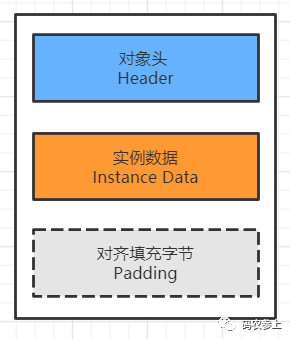
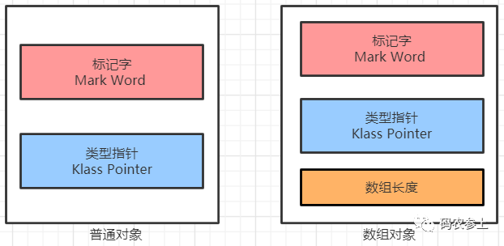
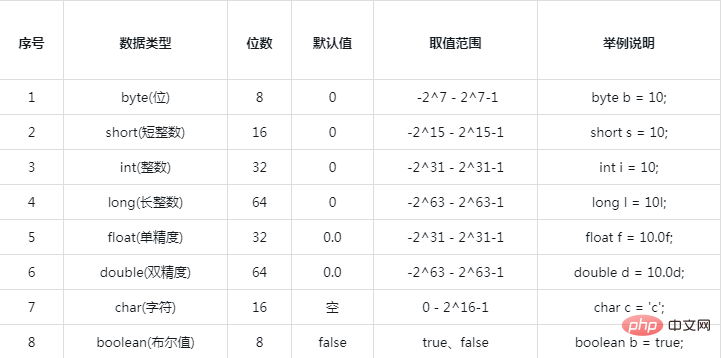

#### 2.你知道的垃圾回收器有哪些？

		jdk1.8默认，Parallel Scavenge(并行 复制算法)和Parallel Old(并发 标记-清除)
		Parallel（Scavenge+Old）、CMS（不能单独使用，需要Serial、ParNew 这两个新生代配合）、G1、ZGC、Shenandoah

 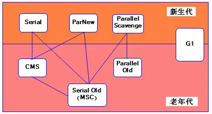

图中展示了7种作用于不同分代的收集器，如果两个收集器之间存在连线，则说明它们可以搭配使用。虚拟机所处的区域则表示它是属于新生代还是老年代收集器。

新生代收集器（全部的都是复制算法）：Serial、ParNew、Parallel Scavenge
老年代收集器：CMS（标记-清理）、Serial Old（标记-整理）、Parallel Old（标记整理）
整堆收集器： G1（一个Region中是标记-清除算法，2个Region之间是复制算法） 
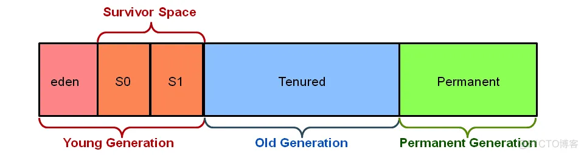

##### Parallel（Scavenge+Old）：
##### jdk 7和8 默认使用的垃圾回收器，特点是并行处理，缺点整个过程中用户线程是暂停状态。
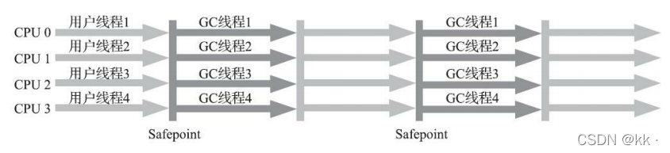

##### CMS
##### 全称：Concurrent Mark Sweep，翻译过来是**并发标记清除**，特点是部分过程是并发处理的，并发阶段用户线程是可以工作的。
		CMS(Concurrent Mark Sweep)收集器是一种以获取最短回收停顿时间为目标的收集器。目前很大一部分的Java应用集中在互联网网站或者基于浏览器的B/S系统的服务端上，这类应用通常都会较为 关注服务的响应速度，希望系统停顿时间尽可能短，以给用户带来良好的交互体验。CMS收集器就非常符合这类应用的需求。


##### **G1垃圾收集器**

		G1（Garbage-First）是一款面向服务端应用的垃圾收集器，主要针对配备多核cpu及大容量内存的机器，以及高概率满足GC停顿时间的同时，还兼顾高吞吐量的的性能特征
		在JDK1.7版本正式启用，移除了Experimental的标识，是JDK 9以后的默认垃圾回收器，取代了CMS 回收器以及Parallel + Parallel Ol的组合。被Oracle官方称为**“全功能垃圾收集器”**。
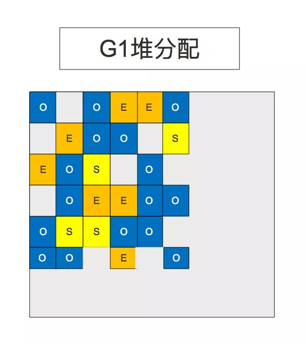
O表示老生代（Old），E表示Eden，S表示Survivor
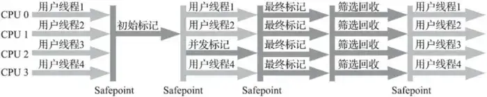

##### ZGC
- JDK11 中开始推出，追求超低时延，源自 Azul System 的 C4
- 目标
  - 停顿时间不超过10ms（JDK16已经达到不超过1ms）**
  - 停顿时间不会随着堆的大小，或者活跃对象的大小而增加
  - 支持8MB~4TB级别的堆，JDK15后已经可以支持16TB
- 支持 NUMA
	部分特点：堆空间无代概念，染色指针+Forwarding Tabels实现更充分的并发。
	
	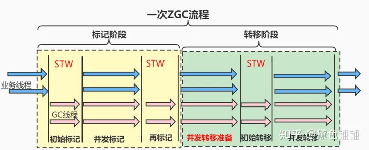


#### 3.GC Root有哪些?

**Java中可以作为GC Roots的对象**
1、[虚拟机](https://so.csdn.net/so/search?q=虚拟机&spm=1001.2101.3001.7020)栈（javaStack）（栈帧中的局部变量区，也叫做局部变量表）中引用的对象。
2、方法区中的类静态属性引用的对象。
3、方法区中常量引用的对象。
4、本地方法栈中JNI([Native](https://so.csdn.net/so/search?q=Native&spm=1001.2101.3001.7020)方法)引用的对象

※G1的每一个Region会有一张*Remember Set*来记录别的Region指向它的引用

※ZGC摒弃了在G1中耗费大量内存和计算资源去维护的记忆集(Remember Set), 改用名为连接矩阵(Connection Matrix) 的全局数据结构来记录跨Region的引用关系。从而降低了处理跨带指针时的记忆集维护消耗以及伪共享问题的发生概率

#### 4. 垃圾收集有哪些算法，各自的特点？

##### 1. Mark-Sweep（标记-清除）算法

标记-清除算法分为两个阶段：***\*标记阶段和清除阶段\****，标记出来活着的内存，然后清理掉死掉的对象占用
缺点：容易产生内存碎片

##### 2. Copying（复制）算法

以空间换时间，分出两块大小相同的区域做复制使用，A区域程序使用，B区域垃圾回收备用。
第一步标记，标记活着的对象
第二步复制，把A区活着的对象拷贝到B区
第三步，清理整个A区
第四步，A，B身份互换
缺点：空间代价高。


##### 3. Mark-Compact（标记-整理）算法

其中的标记过程仍然与“标记-清除”算法一样，但后续步骤不是直接对可 回收对象进行清理，而是让所有存活的对象都向内存空间一端移动，然后直接清理掉边界以外的内存。

##### 4. Generational Collection（分代收集）算法
这是一个综合方案，把堆内存划分出多个代，每一代采用不同的收集方法
 
eden，S0，S1 采用标记-复制，每次把eden+非备用Survivor区复制到，备用survivor区，然后清理两块整区域。
Tenured采用标记-整理

#### 5.类加载的过程?
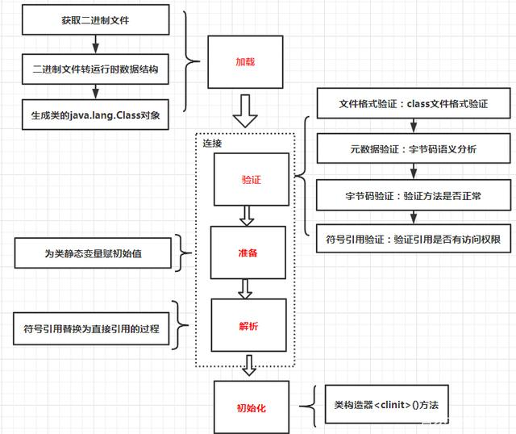
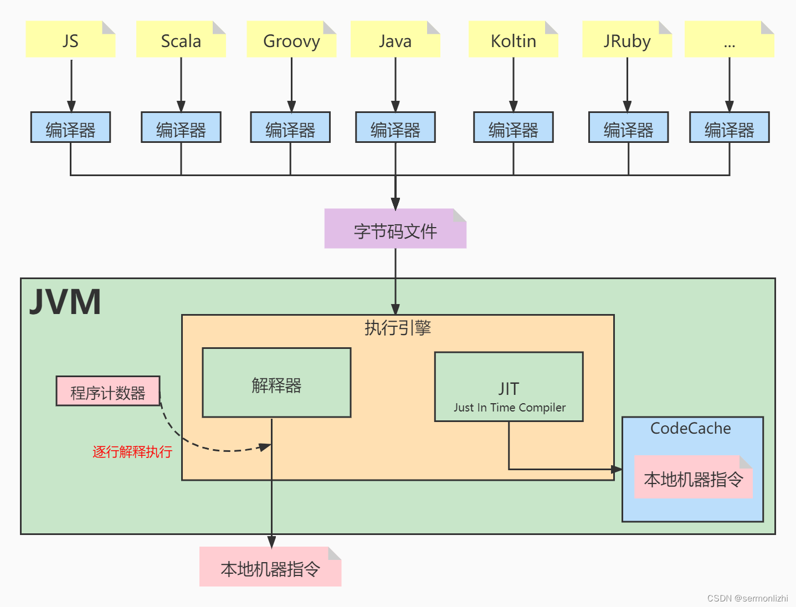

#### 6.java有哪些类加载器？什么是双亲委派模型？
```
		当一个类加载器收到类加载任务时，会先交给自己的父加载器去完成，因此最终加载任务都会传递到最顶层的BootstrapClassLoader，只有当父加载器无法完成加载任务时，才会尝试自己来加载。
		用双亲委派模型来组织类加载器之间的关系，有一个显而易见的好处就是：Java类随着它的类加载器一起具备了一种带有优先级的层次关系。例如类java.lang.Object，它存放在rt.jar之中，无论哪一个类加载器要加载这个类，最终都是委派给处于模型最顶端的启动类加载器进行加载，因此Object类在程序的各种类加载器环境中都是同一个类。
    相反，如果没有使用双亲委派模型，由各个类加载器自行去加载的话，如果用户自己编写了一个称为java.lang.Object类，并放在程序的ClassPath中，那系统中将会出现多个不同的Object类，Java类型体系中最基础的行为也就无法保证，应用程序也将会变得一片混乱。
```
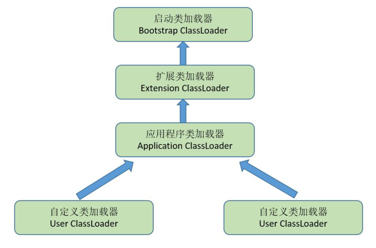

**双亲委派机制优势：**

**避免类的重复加载**
当自己程序中定义了一个和Java.lang包同名的类，此时，由于使用的是双亲委派机制，会由启动类加载器去加载JAVA_HOME/lib中的类，而不是加载用户自定义的类。此时，程序可以正常编译，但是自己定义的类无法被加载运行。

**保护程序安全**
防止核心API被随意篡改。通过委托方式，不会去篡改核心.class，即使篡改也不会去加载，即使加载也不会是同一个.class对象了。不同的加载器加载同一个.class也不是同一个Class对象。这样保证了Class执行安全。 

双亲委派模型并不是一个具有强制性约束的模型，而是Java设计者推荐给开发者们的类加载器实现方式。在Java的世界中大部分的类加载器都遵循这个模型，但也有例外的情况，比如OSGi为实现模块化热部署破坏了这个模型。

#### 7.介绍一下Java 内存结构（运行时数据区)。

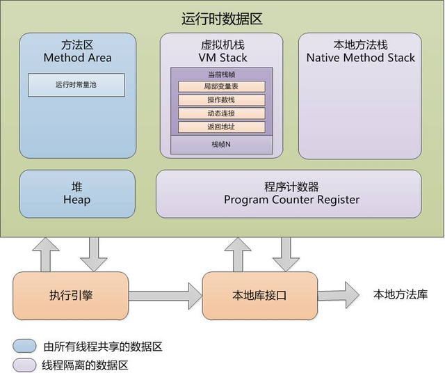


#### 8.你知道“内存对齐”吗？（内存对齐，对齐填充）

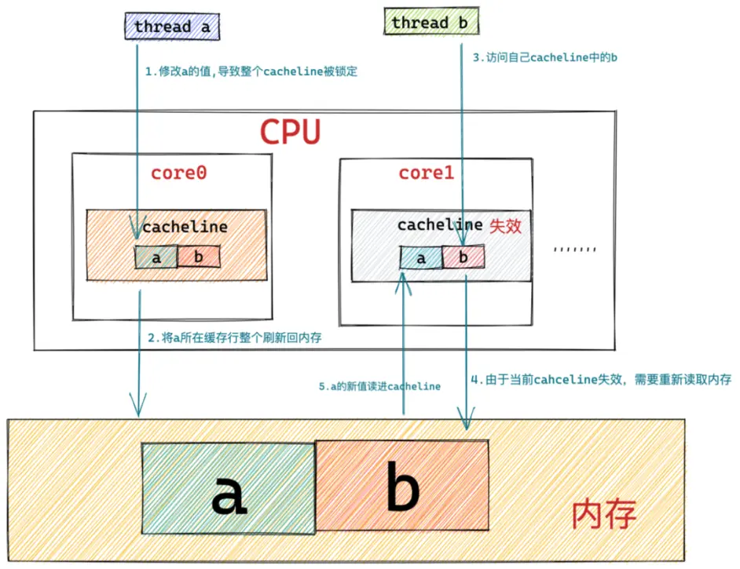

内存和cpu缓存交换数据是以cacheline（缓存行）为单位，目前主流的处理器cacheline 大小为64字节
java有个@Contended 注解显示指定某个字段或某个类的所有字段，独占一行 cacheline（底层是补0实现）。
对齐和补齐主要解决的问题：

1. 提升性能，由于对象字段大小不一，如果不对齐可能造成一个字段夸行，比如一个long字段8字节，4字节在a行，4字节在b行，一次装载就需要两次操作。
2. 解决伪共享问题
```
		什么是伪共享，假设两个变量a、b在同一个缓存行，cpu1、cpu2都加载了这个缓存行，cpu1读写a，cpu2读写b。当cpu1更改了a之后，缓存行变为脏缓存，那么cpu2即使不读写a，也必须重新刷缓存保持缓存行的数据是干净的。这样看下来两个非并发的操作会并发的操作同一个缓存行，导致性能降低。怎么理解伪共享的字面意思呢，这种情况看上去像是多个cpu核心共享了一个变量，并发导致缓存刷新，但其实并非真正共享同一个变量，而是因为缓存行的存在导致的并发。
```


#### 9.jvm运行时区内容

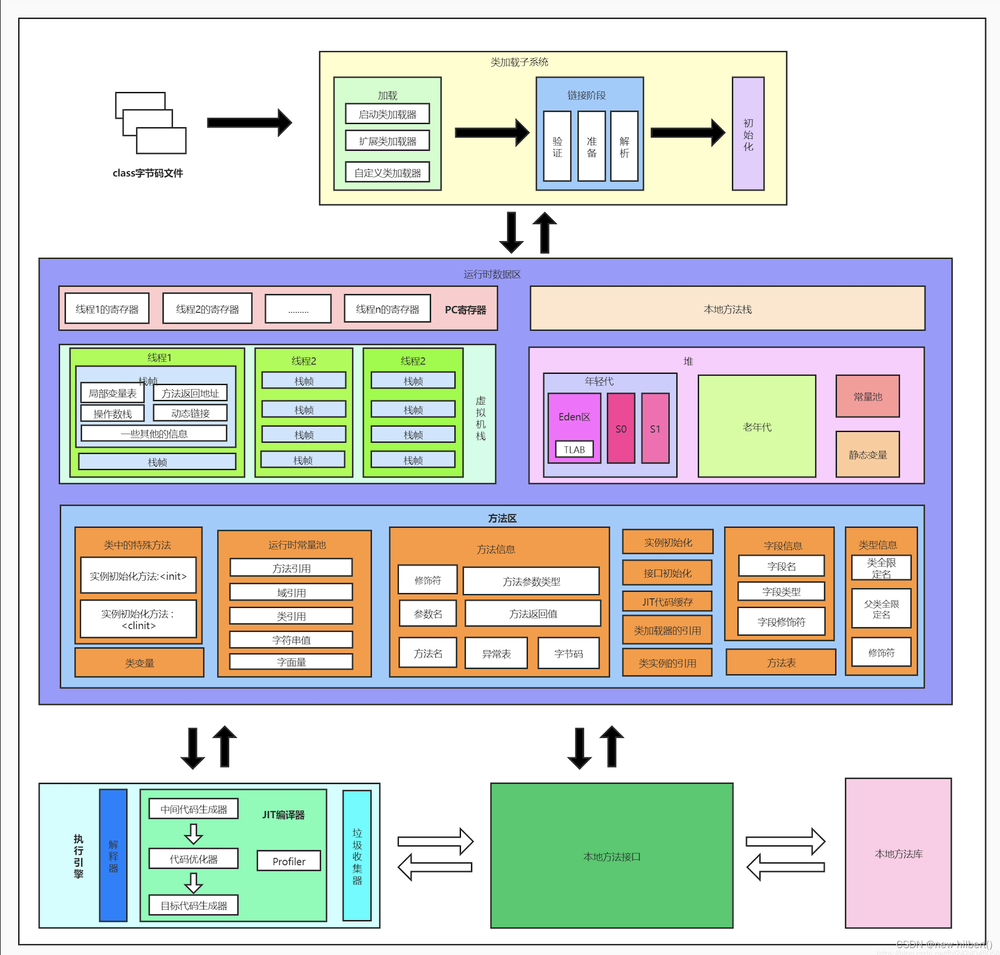

#### 10.你对染色指针了解多少？
**染色指针是一种直接将少量额外的信息存储在指针上的技术**
染色指针**直接把标记信息记在引用对象的指针上**（这个时候，与其说可达性分析是遍历对象图来标记对象，还不如说是遍历“引用图”来标记“引用”了。）
参照资料：https://cloud.tencent.com/developer/article/1857112
				https://tech.meituan.com/2020/08/06/new-zgc-practice-in-meituan.html


#### 11. 垃圾回收的时机
##### Young GC/Minor GC：
```
大多数情况下，对象在新生代Eden区中分配。当Eden区没有足够空间进行分配时，虚拟机将发起一次Minor GC。
```

##### Full GC：
		在发生Minor GC之前，虚拟机必须先检查老年代最大可用的连续空间是否大于新生代所有对象总 空间，如果这个条件成立，那这一次Minor GC可以确保是安全的。如果不成立，则虚拟机会先查看- XX:HandlePromotionFailure参数的设置值是否允许担保失败(Handle Promotion Failure);如果允许，那会继续检查老年代最大可用的连续空间是否大于历次晋升到老年代对象的平均大小，如果大于，将尝试进行一次Minor GC，尽管这次Minor GC是有风险的;如果小于，或者-XX: HandlePromotionFailure设置不允许冒险，那这时就要改为进行一次Full GC
		分代管理：HotSpot虚拟机中多数收集器都采用了分代收集来管理堆内存，那内存回收时就必须能决策哪些存活对象应当放在新生代，哪些存活对象放在老年代中。为做到这点，虚拟机给每个对象定义了一个对象年龄(Age)计数器，存储在对象头中。对象通常在Eden区里诞生，如果经过第一次 Minor GC后仍然存活，并且能被Survivor容纳的话，该对象会被移动到Survivor空间中，并且将其对象年龄设为1岁。对象在Survivor区中每熬过一次Minor GC，年龄就增加1岁，当它的年龄增加到一定程 度(默认为15)，就会被晋升到老年代中。对象晋升老年代的年龄阈值，可以通过参数-XXM axTenuringThreshold设置。

注意：在jvm发展当中，发展出了各种垃圾回收器，叫法各有不同。因为ZGC已经没有分代，都是采用标记复制算法的区域收集。

- Young GC/Minor GC：只收集young gen的GC
- Old GC：只收集old gen的GC。只有CMS的concurrent collection是这个模式
- Mixed GC：收集整个young gen以及部分old gen的GC。只有G1有这个模式 
- **Full GC：**收集整个堆，包括young gen、old gen、perm gen（如果存在的话），较为通用的叫法

##### ZGC：
 ```
 ZDirector和ZStat都是通过时钟触发器来控制是否执行业务。  
 ZDirector提供了4种触发垃圾回收的方法，分别是基于固定时间间隔、预热规则、分配速率和主动触发规则。ZDirector依次判断这4种规则是否满足，实际上这也说明了规则的优先级。  
 ```

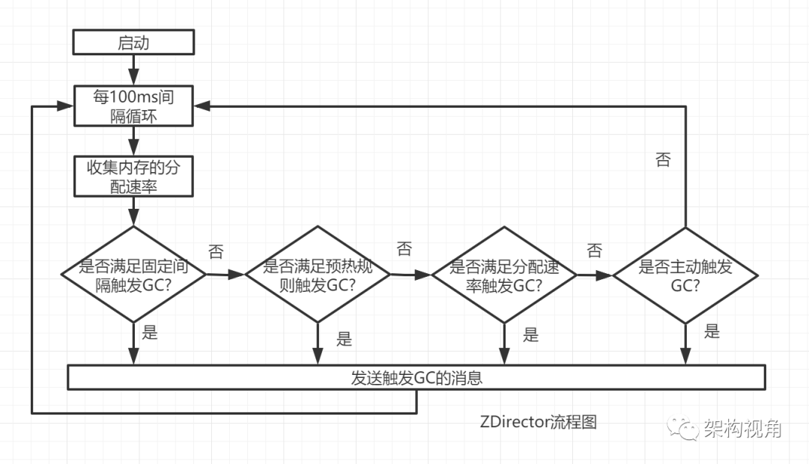

###### 固定时间：
		时间间隔由一个参数ZCollectionInterval来控制，这个参数的默认值为0，表示不需要触发垃圾回收。实际工作中，可以根据场景设置该参数。

###### 预热：
		设计这一规则的目的是当JVM刚启动时，还没有足够的数据来主动触发垃圾回收的启动，所以设置了预热规则。
		预热规则指的是JVM启动后，当发现堆空间使用率达到10%、20%和30%时，会主动地触发垃圾回收。ZGC设计前3次垃圾回收可由预热规则触发，也就是说当垃圾回收触发（无论是由预热规则，还是主动触发垃圾回收）的次数超过3次时，预热规则将不再生效。 

###### 根据分配速率
```
这一规则设计的思路是：
1）收集数据：在程序运行时，收集过去一段时间内垃圾回收发生的次数和执行的时间、内存分配的速率MEMratio和当前空闲内存的大小MEMfree。
2）计算：根据过去垃圾回收发生的情况预测下一次垃圾回收发生的时间TIMEgc，按照内存分配的速率预测空闲内存能支撑应用程序运行的实际时间TIMEoom，例如TIMEoom=MEMfree/MEMratio。
3）设计规则：如当TIMEoom小于TIMEgc（垃圾回收的时间），则可以启动垃圾回收。这个规则的含义是如果从现在起到OOM发生前开始执行垃圾回收，刚好在OOM发生前完成垃圾回收的动作，从而避免OOM。在ZGC中ZDirector是周期运行的，所以在计算时还应该把OOM的时间减去采样周期的时间，采样周期记为TIMEinterval，则规则为TIMEoom<TIMEgc+TIMEinterval时触发垃圾回收。 
```

###### 主动触发
		ZDirector提供的第四个规则是主动触发规则，该规则是为了应用程序在吞吐量下降的情况下，当满足一定条件时，还可以执行垃圾回收。这里满足一定条件指的是：
	1）从上一次垃圾回收完成到当前时间，应用程序新增使用的内存达到堆空间的10%。
	2）从上一次垃圾回收完成到当前时间已经过去了5min，记为TIMEelapsed。
	如果这两个条件同时满足，预测垃圾回收时间为TIMEgc，定义规则：如果NUMgc * TIMEgc < TIMEelapsed，则触发垃圾回收。其中NUMgc是ZGC设计的常量，假设应用程序的吞吐率从50%下降到1%，需要触发一次垃圾回收。 
	注意：ZDirector虽然实现为并发线程，但在ZGC中只有一个，所以ZDirector不会涉及并发的问题。


## 参考资料

[从源码中探索新一代垃圾回收器 ZGC](https://cloud.tencent.com/developer/article/1857112)
[新一代垃圾回收器ZGC的探索与实践](https://tech.meituan.com/2020/08/06/new-zgc-practice-in-meituan.html)
