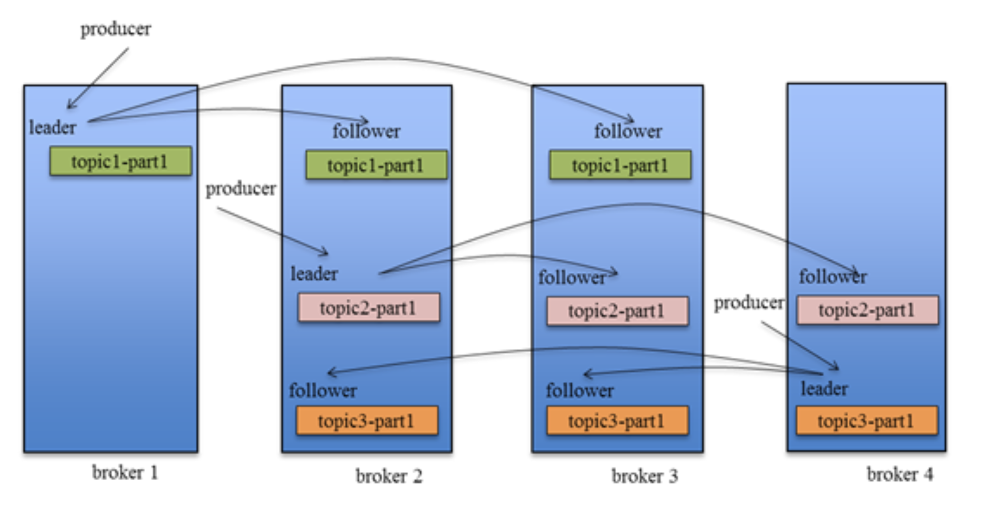
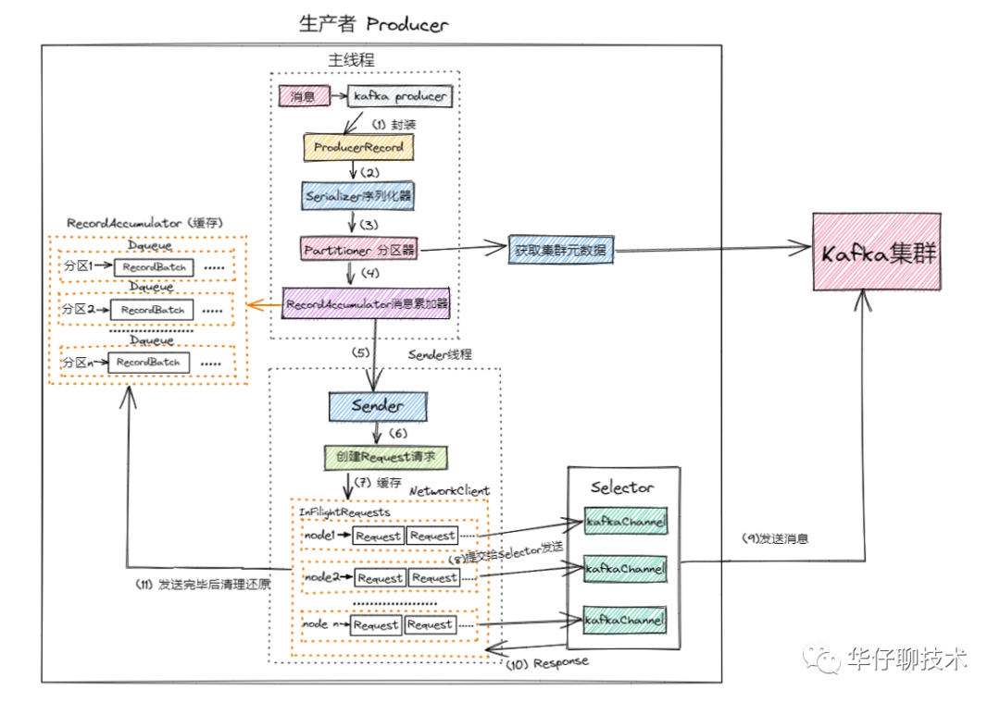
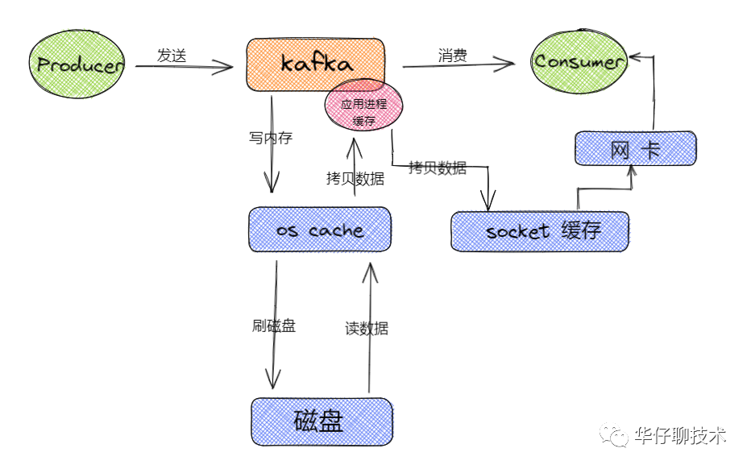
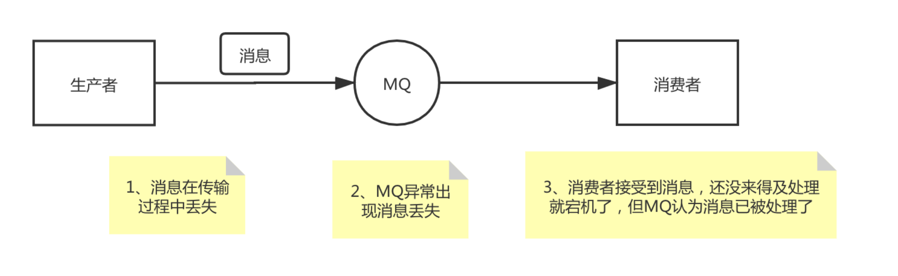

# Kafka 题库

## Apache Kafka是什么
Apache Kafka是一款分布式流处理平台，用于实时构建流处理应用。它有一个核心的功能广为人知，即作为企业级的消息引擎被广泛使用（通常也会称之为消息总线message bus）

## Kafka 与传统消息系统之间的区别

| 对比  | kafka | ActiveMQ | redis            |
|-----|-------|-----|------------------|
| 开发语言 | scala（Linkedin开发的） | Java | C语言              |
| 吞吐量 | 百万级(磁盘顺序读写) | 万级(磁盘随机读写) | 十万级              |
| 游标位置 | 客户端自己管理，可重复读取| ActiveMQ来管理，无法读取历史数据 | 不支持历史数据重复消费      |
| 时效性 |    ms级 |  ms级| ms级 |
| 工作模型 | 只有topic，但是每个topic可以有很多partition分区 |  queue、topic | 订阅一个或多个频道(topic) |

核心三点
* Kafka 持久化日志，这些日志可以被重复读取和无限期保留
* Kafka 是一个分布式系统：它以集群的方式运行，可以灵活伸缩，在内部通过复制数据提升容错能力和高可用性
* Kafka 支持实时的流式处理
* https://dunwu.github.io/bigdata-tutorial/kafka/Kafka%E6%B5%81%E5%BC%8F%E5%A4%84%E7%90%86.html#_1-%E7%AE%80%E4%BB%8B

## Kafka 的设计是什么样的

Kafka 将消息以 topic 为单位进行归纳

将向 Kafka topic 发布消息的程序成为 producer

将预订 topics 并消费消息的程序成为 consumer

Kafka 以集群的方式运行，可以由一个或多个服务组成，每个服务叫做一个 broker

producers 通过网络将消息发送到 Kafka 集群，集群向消费者提供消息

## Kafka 如何保证高可用

Kafka 的基本架构组成是：由多个 broker 组成一个集群，每个 broker 是一个节点；当创建一个 topic 时，这个 topic 会被划分为多个 partition，每个 partition 可以存在于不同的 broker 上，每个 partition 只存放一部分数据。

这就是天然的分布式消息队列，就是说一个 topic 的数据，是分散放在多个机器上的，每个机器就放一部分数据。

在 Kafka 0.8 版本之前，是没有 HA 机制的，当任何一个 broker 所在节点宕机了，这个 broker 上的 partition 就无法提供读写服务，所以这个版本之前，Kafka 没有什么高可用性可言。

在 Kafka 0.8 以后，提供了 HA 机制，就是 replica 副本机制。每个 partition 上的数据都会同步到其它机器，形成自己的多个 replica 副本。所有 replica 会选举一个 leader 出来，消息的生产者和消费者都跟这个 leader 打交道，其他 replica 作为 follower。写的时候，leader 会负责把数据同步到所有 follower 上去（**实际过程是follower副本请求leader副本拉取**），读的时候就直接读 leader 上的数据即可。Kafka 负责均匀的将一个 partition 的所有 replica 分布在不同的机器上，这样才可以提高容错性。



## Kafka 消息是采用 Pull 模式，还是 Push 模式

消费者使用pull模式从Broker订阅消息

push模式很难适应消费速率不同的消费者，如果push的速度太快，容易造成消费者拒绝服务或网络拥塞；如果push的速度太慢，容易造成消费者性能浪费。

但是采用pull的方式也有一个缺点，就是当Broker没有消息时，消费者会陷入不断地轮询中，为了避免这点，kafka有个参数可以让消费者阻塞知道是否有新消息到达。

## 什么是消费者组

消费者组是Kafka独有的概念，即消费者组是Kafka提供的可扩展且具有容错性的消费者机制。

消费者组，可以订阅多个主题。

在消费者组中，多个实例共同订阅一个或多个主题，实现共同消费。同一个组下的每个实例都配置有相同的组ID，同一组下的每个实例会被分配不同的订阅分区。当某个Consumer挂掉的时候，其他Consumer会自动地承担起它负责消费的分区。 因此，消费者组在一定程度上也保证了消费者程序的高可用性。

理解 Consumer Group 记住下面这三个特性
* Consumer Group 下可以有一个或多个 Consumer 实例。这里的实例可以是一个单独的进程，也可以是同一进程下的线程。在实际场景中，使用进程更为常见一些。
* Group ID 是一个字符串，在一个 Kafka 集群中，它标识唯一的一个 Consumer Group。
* Consumer Group 下所有实例订阅的主题的单个分区，只能分配给组内的某个 Consumer 实例消费。

## 在Kafka中，ZooKeeper的作用是什么

目前，Kafka使用ZooKeeper存放集群元数据、成员管理、Controller选举，以及其他一些管理类任务。

之后，等KIP-500提案完成后，Kafka将完全不再依赖于ZooKeeper。

“存放元数据”是指主题分区的所有数据都保存在 ZooKeeper 中，且以它保存的数据为权威，其他 “人” 都要与它保持对齐。
“成员管理” 是指 Broker 节点的注册、注销以及属性变更，等等。
“Controller 选举” 是指选举集群 Controller，而其他管理类任务包括但不限于主题删除、参数配置等。
KIP-500 思想，是使用社区自研的基于Raft的共识算法，替代ZooKeeper，实现Controller自选举

## 解释下Kafka中位移（offset）的作用

在Kafka中，每个主题分区下的每条消息都被赋予了一个唯一的ID数值，用于标识它在分区中的位置。这个ID数值，就被称为位移，或者叫偏移量。一旦消息被写入到分区日志，它的位移值将不能被修改。

每个分区都是独立一套的offset，同时新写入的消息的offset，也是这个分区的最新最大的offset。

## Kafka 为什么那么快

### Reactor多路复用模型
Kafka SocketServer 是基于Java NIO 开发的，采用了 Reactor 的模式(已被大量实践证明非常高效，在 Netty 和 Mina 中广泛使用)。Kafka Reactor 的模式包含三种角色：
* Acceptor
* Processor
* Handler


1. Acceptor：1个接收线程，负责监听新的连接请求，同时注册OP_ACCEPT 事件，将新的连接按照"round robin"方式交给对应的 Processor 线程处理
2. Processor：N个处理器线程，其中每个 Processor 都有自己的 selector，它会向 Acceptor 分配的 SocketChannel 注册相应的 OP_READ 事件，N 的大小由“num.networker.threads”决定
3. KafkaRequestHandler：M个请求处理线程，包含在线程池KafkaRequestHandlerPool内部，从RequestChannel的全局请求队列requestQueue中获取请求数据并交给KafkaApis处理，M的大小由“num.io.threads”决定
4. RequestChannel：其为Kafka服务端的请求通道，该数据结构中包含了一个全局的请求队列 requestQueue和多个与Processor处理器相对应的响应队列responseQueue，提供给Processor与请求处理线程KafkaRequestHandler和KafkaApis交换数据的地方
5. NetworkClient：其底层是对 Java NIO 进行相应的封装，位于Kafka的网络接口层。Kafka消息生产者对象—KafkaProducer的send方法主要调用NetworkClient完成消息发送
6. SocketServer：其是一个NIO的服务，它同时启动一个Acceptor接收线程和多个Processor处理器线程。提供了一种典型的Reactor多线程模式，将接收客户端请求和处理请求相分离
7. KafkaServer：代表了一个Kafka Broker的实例；其startup方法为实例启动的入口
8. KafkaApis：Kafka的业务逻辑处理Api，负责处理不同类型的请求；比如“发送消息”、“获取消息偏移量—offset”和“处理心跳请求”等


### 生产消息流程

生产者发送到 Kafka集群的详细流程如下图所示:


* 首先来一条消息后,生产者源码里面会对消息进行封装成 ProducerRecord对象。
* 封装成对象后会对该对象进行序列化[涉及网络传输], 调用Serializer组件进行序列化, 序列化后进行发送。
* 在发送前要确定一件事, 到底要把这条消息发送到哪个主题的哪个分区, 这个时候就需要通过 Partitioner 分区器 从 Kafka Broker集群中获取集群元数据,  获取到元数据后就可以进行发送了。
* 在0.8版本之前, 这个时候来了一条消息就会封装成一个请求发送到Broker, 这种情况下, 性能是非常差的, 在0.8版本之后, 进行简单的改进, 性能得到了指数级上升, 即来了一条消息后不会立马发送出去, 而是先写入到一个缓存(RecordAccumulator)队列中,封装成一个个批次(RecordBatch)。
* 这个时候会有一个sender线程会将多个批次封装成一个请求(Request), 然后进行发送, 这样会减少很多请求,提高吞吐量。这个时候有个问题,  一条消息过来后没有立即发送出去,而是封装成了批次, 这样会不会有延迟的问题,  默认的batch.size是16K, 写满会立即发送, 如果写不满, 也会在规定的时间进行发送(linger.ms = 500ms)
* 发送的时候 每个Request请求对应多路复用器(Selector)中的每个kafka channel 然后将数据发送给Broker集群
* 在封装Batch批次和Request请求的过程中, 还涉及一个重要的设计理念即内存池方案, 在后面的服务端内存池部分进行详细说明

### 顺序写磁盘 + OS Cache

首先 Kafka 为了保证磁盘写入性能，通过基于操作系统的页缓存来实现文件写入的。

操作系统本身有一层缓存，叫做 page cache，是在内存里的缓存，我们也可以称之为 os cache，意思就是操作系统自己管理的缓存。那么在写磁盘文件的时候，就可以先直接写入 os cache 中，也就是仅仅写入内存中，接下来由操作系统自己决定什么时候把 os cache 里的数据真的刷入到磁盘中, 这样大大提高写入效率和性能。 

如下图所示:


另外还有一个非常关键的操作，就是 kafka 在写数据的时候是以磁盘顺序写的方式来进行落盘的，即将数据追加到文件的末尾，而不是在文件的随机位置来修改数据，对于普通机械磁盘，如果是随机写的话，涉及到磁盘寻址的问题，导致性能确实极低，但是如果只是按照顺序的方式追加文件末尾的话，这种磁盘顺序写的性能基本可以跟写内存的性能差不多的。

### 零拷贝技术(zero-copy)

从 Kafka 消费数据, 在消费的时候实际上就是从 Kafka 的磁盘文件读取数据然后发送给下游的消费者
* 先检查要读取的数据是否在 os cache 中，如果不在的话就从磁盘文件读取数据后放入 os cache。
* 接着从 os cache 里面 copy 数据到应用程序进程的缓存里面, 在从应用程序进程的缓存里 copy 数据到操作系统层面的 socket缓存里面, 后再从 socket 缓存里面读取数据后发送到网卡, 后从网卡发送到下游的消费者。


从上图可以看出, 整个过程有两次没必要的拷贝操作，这两次拷贝过程中, 还发生了好几次上下文的切换, 所以相对来说是比较消耗性能的
* 从操作系统的 os cache  拷贝数据到应用程序进程的缓存。
* 接着又从应用程序缓存里拷贝到操作系统的socket缓存中。

kafka 为了解决这个问题, 在读取数据的时候就引入了零拷贝技术。即让操作系统的 os cache 中的数据直接发送到网卡后传出给下游的消费者，中间跳过了两次拷贝数据的步骤，从而减少拷贝的 CPU 开销, 减少用户态内核态的上下文切换次数,  从而优化数据传输的性能, 而Socket缓存中仅仅会拷贝一个描述符过去，不会拷贝数据到Socket缓存。如下图所示:


常见的零拷贝思路主要有两种实现方式:
* 直接I/O: 数据直接跳过内核, 在用户空间与 I/O 设备之间进行传递, 内核在这种情况下只是进行必要的辅助工作
* copy-on-write: 写时复制, 数据不需要提前进行拷贝, 而是在当需要修改的时候再进行部分数据的拷贝
  

这里, Kafka 主要使用到了 mmap  和 sendfile 的方式来实现零拷贝,  对应java里面的 MappedByteBuffer 和 FileChannel.transferIO。

Kafka，写日志的时候，也使用零拷贝技术。

[Kafka顺序读写与零拷贝](https://codeantenna.com/a/LPAWE6TuW5)

### 压缩传输

压缩不仅可以更快地从生产者传输到代理, 还可以在复制过程中进行更快的传输。压缩有助于提高吞吐量, 降低延迟并提高磁盘利用率。

在 Kafka 中, 压缩可能会发生在两个地方: 生产者端和Broker端, 一句话总结下压缩和解压缩, 即 Producer 端压缩, Broker 端保持, Consumer 端解压缩。

Kafka 支持多种压缩算法: lz4, snappy, gzip,  从Kafka 2.1.0 开始新增了 ZStandard 算法, 该算法是 Facebook 开源的压缩算法,  能提供超高的压缩比。

Producer、Broker、Consumer 要使用相同的压缩算法, 在 Producer 向 Broker 写入数据, Consumer 向 Broker 读取数据的时候可以不用解压缩, 只需要在终 Consumer 到消息的时候才进行解压缩, 这样可以节省大量的网络和磁盘开销。

默认情况下, 在 Kafka 生产者中不启用压缩。

### 客户端内存池设计


在前面我们讲解了一条消息生产的详细流程, 中间涉及到了批次(Batch)和请求(Request), 在这个过程中, Kafka还有一个重要的设计理念 即内存池方案, 这里就详细讲述下内存池的实现过程.
* 这里简化下流程, 来一条消息会先进行封装然后序列化后会计算出分区号, 并把这个消息存储到缓存里面
* 这个缓存里面也是有设计的 即批次队列, 那么这个批次队列是使用什么策略存储呢? 一个分区对应一个队列, 这里有个重要的数据结构:Batches, 这个数据结构是Key-value形式, key是消息主题的分区, value是一个队列, 里面存储的发送到对应分区的批次
* 那么假设这个时候 我们有个2个topic, 每个topic有2个分区, 那么是不是总共有4个的分区即4个队列, 每个队列里面都有一个个批次,  这个时候消息算出来分区后就会写入队列的新一个批次
* Sender线程就会检测这个批次(Batch)是否已经写满,或者时间是否到达, 如果满足Sender线程就会取出封装成Request就会发送
* 封装批次会用到内存, Sender发送完毕内存会进行回收, 在Java中如果频繁操作内存和回收,会遇到头疼的FullGC的问题, 工作线程的性能就会降低, 整个生产者的性能就会受到影响, Kafka的解决方案就是内存池, 对内存块的使用跟数据库的连接池一样
* 整个Buffer Poll 内存池大小是**32M** , 内存池分为两个部分, 一个部分是内存队列, 队列里面有一个个内存块(16K), 另外一部分是可用内存,   一条消息过来后会向内存池申请内存块, 申请完后封装批次并写入数据, sender线程就会发送并响应, 然后清空内存放回内存池里面进行反复使用, 这样就大大减少了GC的频率, 保证了生产者的稳定和高效, 性能会大大提高

## Kafka producer发送数据，ack为0，1，-1分别是什么意思

* 1（默认） 数据发送到Kafka后，经过leader成功接收消息的的确认，就算是发送成功了。在这种情况下，如果leader宕机了，则会丢失数据。
* 0  生产者将数据发送出去就不管了，不去等待任何返回。这种情况下数据传输效率最高，但是数据可靠性确是最低的。
* -1  producer需要等待ISR（健康队列）中的所有follower都确认接收到数据后才算一次发送完成，可靠性最高。当ISR中所有Replica都向Leader发送ACK时，leader才commit，这时候producer才能认为一个请求中的消息都commit了。

## Kafka如何保证消息不丢失

首先需要弄明白消息为什么会丢失，对于一个消息队列，会有 生产者、MQ、消费者 这三个角色，在这三个角色数据处理和传输过程中，都有可能会出现消息丢失。



消息丢失的原因以及解决办法：

### 消费者异常导致的消息丢失
消费者可能导致数据丢失的情况是：消费者获取到了这条消息后，还未处理，Kafka 就自动提交了 offset，这时 Kafka 就认为消费者已经处理完这条消息，其实消费者才刚准备处理这条消息，这时如果消费者宕机，那这条消息就丢失了。

消费者引起消息丢失的主要原因就是消息还未处理完 Kafka 会自动提交了 offset，那么只要关闭自动提交 offset，消费者在处理完之后手动提交 offset，就可以保证消息不会丢失。但是此时需要注意重复消费问题，比如消费者刚处理完，还没提交 offset，这时自己宕机了，此时这条消息肯定会被重复消费一次，这就需要消费者根据实际情况保证幂等性。

### 生产者数据传输导致的消息丢失
对于生产者数据传输导致的数据丢失主常见情况是生产者发送消息给 Kafka，由于网络等原因导致消息丢失，对于这种情况也是通过在 producer 端设置 acks=all 来处理，这个参数是要求 leader 接收到消息后，需要等到所有的 follower 都同步到了消息之后，才认为本次写成功了。如果没满足这个条件，生产者会自动不断的重试。

### Kafka 导致的消息丢失
Kafka 导致的数据丢失一个常见的场景就是 Kafka 某个 broker 宕机，，而这个节点正好是某个 partition 的 leader 节点，这时需要重新重新选举该 partition 的 leader。如果该 partition 的 leader 在宕机时刚好还有些数据没有同步到 follower，此时 leader 挂了，在选举某个 follower 成 leader 之后，就会丢失一部分数据。

对于这个问题，Kafka 可以设置如下 4 个参数，来尽量避免消息丢失：
* 给 topic 设置 replication.factor 参数：这个值必须大于 1，要求每个 partition 必须有至少 2 个副本；
* 在 Kafka 服务端设置 min.insync.replicas 参数：这个值必须大于 1，这个参数的含义是一个 leader 至少感知到有至少一个 follower 还跟自己保持联系，没掉队，这样才能确保 leader 挂了还有一个 follower 节点。
* 在 producer 端设置 acks=all，这个是要求每条数据，必须是写入所有 replica 之后，才能认为是写成功了；
* 在 producer 端设置 retries=MAX（很大很大很大的一个值，无限次重试的意思）：这个参数的含义是一旦写入失败，就无限重试，卡在这里了。

还有一种情况是leader副本的消息是写入page cache中的，在还没有刷盘的情况下断电会丢消息，也是通过配置副本确认机制来解决

## Kafka 如何保证消息的顺序性

在某些业务场景下，我们需要保证对于有逻辑关联的多条MQ消息被按顺序处理，比如对于某一条数据，正常处理顺序是新增-更新-删除，最终结果是数据被删除；如果消息没有按序消费，处理顺序可能是删除-新增-更新，最终数据没有被删掉，可能会产生一些逻辑错误。对于如何保证消息的顺序性，主要需要考虑如下两点：
* 如何保证消息在 Kafka 中顺序性；
* 如何保证消费者处理消费的顺序性。
  
### 如何保证消息在 Kafka 中顺序性

对于 Kafka，如果我们创建了一个 topic，默认有三个 partition。生产者在写数据的时候，可以指定一个 key，比如在订单 topic 中我们可以指定订单 id 作为 key，那么相同订单 id 的数据，一定会被分发到同一个 partition 中去，而且这个 partition 中的数据一定是有顺序的。

### 如何保证消费者处理消费的顺序性
对于某个 topic 的一个 partition，只能被同组内部的一个 consumer 消费，如果这个 consumer 内部还是单线程处理，那么其实只要保证消息在 MQ 内部是有顺序的就可以保证消费也是有顺序的。

## Kafka中的ISR、AR代表什么？ISR的伸缩指什么

* OSR: outof sync  Replicas  剔出的副本队列 
* ISR：in sync  Replicas 健康的副本同步队列 
* AR:Assigned Replicas 所有副本
ISR是由leader维护，follower从leader同步数据有一些延迟（包括延迟时间replica.lag.time.max.ms和延迟条数replica.lag.max.messages两个维度，当前最新的版本0.10.x中只支持replica.lag.time.max.ms这个维度），任意一个超过阈值都会把follower剔除出ISR，存入OSR（Outof-Sync Replicas）列表，新加入的follower也会先存放在OSR中。

* AR=ISR+OSR。

## 描述下 Kafka 中的领导副本（Leader Replica）和追随者副本（Follower Replica）的区别

Kafka副本当前分为领导者副本和追随者副本。

只有Leader副本才能对外提供读写服务，响应Clients端的请求。

Follower副本只是采用异步拉（PULL）的方式，被动地同步Leader副本中的数据，并且在Leader副本所在的Broker宕机后，随时准备应聘Leader副本。

pull方式的加分点：

强调Follower副本也能对外提供读服务。自Kafka 2.4版本开始，社区通过引入新的Broker端参数，允许Follower副本有限度地提供读服务。
强调Leader和Follower的消息序列在实际场景中不一致。通常情况下，很多因素可能造成Leader和Follower之间的不同步，比如程序问题，网络问题，broker问题等，短暂的不同步我们可以关注（秒级别），但长时间的不同步可能就需要深入排查了，因为一旦Leader所在节点异常，可能直接影响可用性。
注意：之前确保一致性的主要手段是高水位机制（HW），但高水位值无法保证Leader连续变更场景下的数据一致性，因此，社区引入了**Leader Epoch**机制，来修复高水位值的弊端。


## kafka选举
* Broker Controller的选举
```
最先在Zookeeper上创建临时节点/controller成功的Broker就是Controller
https://blog.csdn.net/wypblog/article/details/121059218
```
* leader副本的选举，见下一个段落详细讲解
* Group Coordinator，负责消费组选主，严格意义上不能算是主的概念。
  * 每个consumer group 都会选择一个broker作为自己的coordinator，他是负责监控整个消费组里的各个分区的心跳，以及判断是否宕机，和开启rebalance的。
  * 首先对group id 进行hash，接着对_consumer_offsets的分区数量进行取模，默认分区数量是50_
  * consumer_offsets的分区数量可以通过offsets.topic.num.partitions来设置，找到分区以后，这个分区所在的broker机器就是coordinator机器。 

* 消费组选主
  * 在Kafka的消费端，会有一个消费者协调器以及消费组，组协调器（Group Coordinator）需要为消费组内的消费者选举出一个消费组的leader。
  * 如果消费组内还没有leader，那么第一个加入消费组的消费者即为消费组的leader，如果某一个时刻leader消费者由于某些原因退出了消费组，那么就会重新选举leader，选举方式如下：
  * 在组协调器中消费者的信息是以HashMap的形式存储的，其中key为消费者的member_id，而value是消费者相关的元数据信息。而leader的取值为HashMap中的第一个键值对的key（等同于随机）。
  * 消费组的Leader和Coordinator没有关联。消费组的leader负责Rebalance过程中消费分配方案的制定。

```
private val members = new mutable.HashMap[String, MemberMetadata]
leaderId = members.keys.headOption
```

## Leader副本选举策略有几种

Leader副本选举对用户是完全透明的，它是由Controller独立完成的。你需要回答的是，在哪些场景下，需要执行分区Leader选举。每一种场景对应于一种选举策略。

* OfflinePartition Leader选举：每当有分区上线时，就需要执行Leader选举。所谓的分区上线，可能是创建了新分区，也可能是之前的下线分区重新上线。这是最常见的分区Leader选举场景。

* ReassignPartition Leader选举：当你手动运行kafka-reassign-partitions命令，或者是调用Admin的alterPartitionReassignments方法执行分区副本重分配时，可能触发此类选举。假设原来的AR是[1，2，3]，Leader是1，当执行副本重分配后，副本集合AR被设置成[4，5，6]，显然，Leader必须要变更，此时会发生Reassign Partition Leader选举。

* PreferredReplicaPartition Leader选举：当你手动运行kafka-preferred-replica-election命令，或自动触发了Preferred Leader选举时，该类策略被激活。所谓的Preferred Leader，指的是AR中的第一个副本。比如AR是[3，2，1]，那么，Preferred Leader就是3。

* ControlledShutdownPartition Leader选举：当Broker正常关闭时，该Broker上的所有Leader副本都会下线，因此，需要为受影响的分区执行相应的Leader选举。


这4类选举策略的大致思想是类似的，即从AR中挑选首个在ISR中的副本，作为新Leader。

## Kafka的哪些场景中使用了零拷贝（Zero Copy）

在Kafka中，体现Zero Copy使用场景的地方有两处：基于mmap的索引和日志文件读写所用的TransportLayer。

先说第一个。索引都是基于MappedByteBuffer的，也就是让用户态和内核态共享内核态的数据缓冲区，此时，数据不需要复制到用户态空间。不过，mmap虽然避免了不必要的拷贝，但不一定就能保证很高的性能。在不同的操作系统下，mmap的创建和销毁成本可能是不一样的。很高的创建和销毁开销会抵消Zero Copy带来的性能优势。由于这种不确定性，在Kafka中，只有索引应用了mmap，最核心的日志并未使用mmap机制。

再说第二个。TransportLayer是Kafka传输层的接口。它的某个实现类使用了FileChannel的transferTo方法。该方法底层使用sendfile实现了Zero Copy。对Kafka而言，如果I/O通道使用普通的PLAINTEXT，那么，Kafka就可以利用Zero Copy特性，直接将页缓存中的数据发送到网卡的Buffer中，避免中间的多次拷贝。相反，如果I/O通道启用了SSL，那么，Kafka便无法利用Zero Copy特性了。

## 为什么Kafka不支持读写分离

在 Kafka 中，生产者写入消息、消费者读取消息的操作都是与 leader 副本进行交互的，从而实现的是一种主写主读的生产消费模型。

Kafka 并不支持主写从读，因为主写从读有 2 个很明显的缺点:

数据一致性问题。数据从主节点转到从节点必然会有一个延时的时间窗口，这个时间 窗口会导致主从节点之间的数据不一致。某一时刻，在主节点和从节点中 A 数据的值都为 X， 之后将主节点中 A 的值修改为 Y，那么在这个变更通知到从节点之前，应用读取从节点中的 A 数据的值并不为最新的 Y，由此便产生了数据不一致的问题。
延时问题。类似 Redis 这种组件，数据从写入主节点到同步至从节点中的过程需要经历网络→主节点内存→网络→从节点内存这几个阶段，整个过程会耗费一定的时间。而在 Kafka 中，主从同步会比 Redis 更加耗时，它需要经历网络→主节点内存→主节点磁盘→网络→从节点内存→从节点磁盘这几个阶段。对延时敏感的应用而言，主写从读的功能并不太适用。

## auto.offset.reset


auto.offset.reset关乎kafka数据的读取，是一个非常重要的设置。常用的二个值是latest和earliest，默认是latest。

1，earliest 当各分区下有已提交的offset时，从提交的offset开始消费；无提交的offset时，从头开始消费

2，latest 当各分区下有已提交的offset时，从提交的offset开始消费；无提交的offset时，消费新产生的该分区下的数据

提交过offset，latest和earliest没有区别，但是在没有提交offset情况下，用latest直接会导致无法读取旧数据。

[怎么重设消费者组位移](https://learn.lianglianglee.com/%E4%B8%93%E6%A0%8F/Kafka%E6%A0%B8%E5%BF%83%E6%8A%80%E6%9C%AF%E4%B8%8E%E5%AE%9E%E6%88%98/30%20%20%E6%80%8E%E4%B9%88%E9%87%8D%E8%AE%BE%E6%B6%88%E8%B4%B9%E8%80%85%E7%BB%84%E4%BD%8D%E7%A7%BB%EF%BC%9F.md)

## 消费端Rebalance 机制
Rebalance 本质上是一种协议，规定了一个 Consumer Group 下的所有 Consumer 如何达成一致，来分配订阅 Topic 的每个分区。比如某个 Group 下有 20 个 Consumer 实例，它订阅了一个具有 100 个分区的 Topic。正常情况下，Kafka 平均会为每个 Consumer 分配 5 个分区。这个分配的过程就叫 Rebalance。

那么 Consumer Group 何时进行 Rebalance 呢？Rebalance 的触发条件有 3 个。
* 组成员数发生变更。比如有新的 Consumer 实例加入组或者离开组，抑或是有 Consumer 实例崩溃被“踢出”组。
* 订阅主题数发生变更。Consumer Group 可以使用正则表达式的方式订阅主题，比如 consumer.subscribe(Pattern.compile(“t.*c”)) 就表明该 Group 订阅所有以字母 t 开头、字母 c 结尾的主题。在 Consumer Group 的运行过程中，你新创建了一个满足这样条件的主题，那么该 Group 就会发生 Rebalance。
* 订阅主题的分区数发生变更。Kafka 当前只能允许增加一个主题的分区数。当分区数增加时，就会触发订阅该主题的所有 Group 开启 Rebalance。

### Rebalance的弊端
首先，Rebalance 过程对 Consumer Group 消费过程有极大的影响。如果你了解 JVM 的垃圾回收机制，你一定听过万物静止的收集方式，即著名的 stop the world，简称 STW。在 STW 期间，所有应用线程都会停止工作，表现为整个应用程序僵在那边一动不动。Rebalance 过程也和这个类似，在 Rebalance 过程中，所有 Consumer 实例都会停止消费，等待 Rebalance 完成。这是 Rebalance 为人诟病的一个方面。

其次，目前 Rebalance 的设计是所有 Consumer 实例共同参与，全部重新分配所有分区。其实更高效的做法是尽量减少分配方案的变动。例如实例 A 之前负责消费分区 1、2、3，那么 Rebalance 之后，如果可能的话，最好还是让实例 A 继续消费分区 1、2、3，而不是被重新分配其他的分区。这样的话，实例 A 连接这些分区所在 Broker 的 TCP 连接就可以继续用，不用重新创建连接其他 Broker 的 Socket 资源。

要避免 Rebalance，还是要从 Rebalance 发生的时机入手。我们在前面说过，Rebalance 发生的时机有三个：
* 组成员数量发生变化
* 订阅主题数量发生变化
* 订阅主题的分区数发生变化
  

后面两个通常都是运维的主动操作，所以它们引发的 Rebalance 大都是不可避免的。接下来，我们主要说说因为组成员数量变化而引发的 Rebalance 该如何避免。

Consumer 实例增加的情况很好理解，当我们启动一个配置有相同 group.id 值的 Consumer 程序时，实际上就向这个 Group 添加了一个新的 Consumer 实例。此时，Coordinator 会接纳这个新实例，将其加入到组中，并重新分配分区。通常来说，增加 Consumer 实例的操作都是计划内的，可能是出于增加 TPS 或提高伸缩性的需要。总之，它不属于我们要规避的那类“不必要 Rebalance”。

重点优化Consumer退组导致的Rebalance
1、第一类非必要 Rebalance 是因为未能及时发送心跳，导致 Consumer 被“踢出”Group 而引发的。因此，你需要仔细地设置session.timeout.ms 和 heartbeat.interval.ms的值。我在这里给出一些推荐数值，你可以“无脑”地应用在你的生产环境中。

* 设置 session.timeout.ms = 6s。
* 设置 heartbeat.interval.ms = 2s。
* 要保证 Consumer 实例在被判定为“dead”之前，能够发送至少 3 轮的心跳请求，即 session.timeout.ms >= 3 * heartbeat.interval.ms。

2、第二类非必要 Rebalance 是 Consumer 消费时间过长导致的。
我之前有一个客户，在他们的场景中，Consumer 消费数据时需要将消息处理之后写入到 MongoDB。显然，这是一个很重的消费逻辑。MongoDB 的一丁点不稳定都会导致 Consumer 程序消费时长的增加。
此时，max.poll.interval.ms参数值的设置显得尤为关键。如果要避免非预期的 Rebalance，你最好将该参数值设置得大一点，比你的下游最大处理时间稍长一点。就拿 MongoDB 这个例子来说，如果写 MongoDB 的最长时间是 7 分钟，那么你可以将该参数设置为 8 分钟左右。

### 延迟消息怎么实现的
原生Kafka默认是不支持延时消息的，需要开发者自己实现一层代理服务，比如发送端将消息发送到延时Topic，代理服务消费延时Topic的消息然后转存起来，代理服务通过一定的算法，计算延时消息所附带的延时时间是否到达，然后将延时消息取出来并发送到实际的Topic里面，消费端从实际的Topic里面进行消费。

### Kafka中如何找到offset对应的Message消息
[Kafka中如何找到offset对应的Message消息](https://codeantenna.com/a/2KQHECO6y8)
partion->segment>index->log


## 参考文档
[基于kafka实现延迟队列](https://zhuanlan.zhihu.com/p/365802989)
[简谈Kafka中的NIO网络通信模型](https://www.jianshu.com/p/a6b9e5342878)
[Kafka面试题](https://github.com/cosen1024/Java-Interview/blob/main/MQ/Kafka%E9%9D%A2%E8%AF%95%E9%A2%98.md)
[Kafka学习之路](https://www.cnblogs.com/qingyunzong/category/1212387.html)
[Kafka三高架构设计剖析](https://z.itpub.net/article/detail/E543E327B1D601F5EB8A6D4E87148E2B)
[消费者组重平衡能避免吗](https://learn.lianglianglee.com/%E4%B8%93%E6%A0%8F/Kafka%E6%A0%B8%E5%BF%83%E6%8A%80%E6%9C%AF%E4%B8%8E%E5%AE%9E%E6%88%98/17%20%20%E6%B6%88%E8%B4%B9%E8%80%85%E7%BB%84%E9%87%8D%E5%B9%B3%E8%A1%A1%E8%83%BD%E9%81%BF%E5%85%8D%E5%90%97%EF%BC%9F.md)