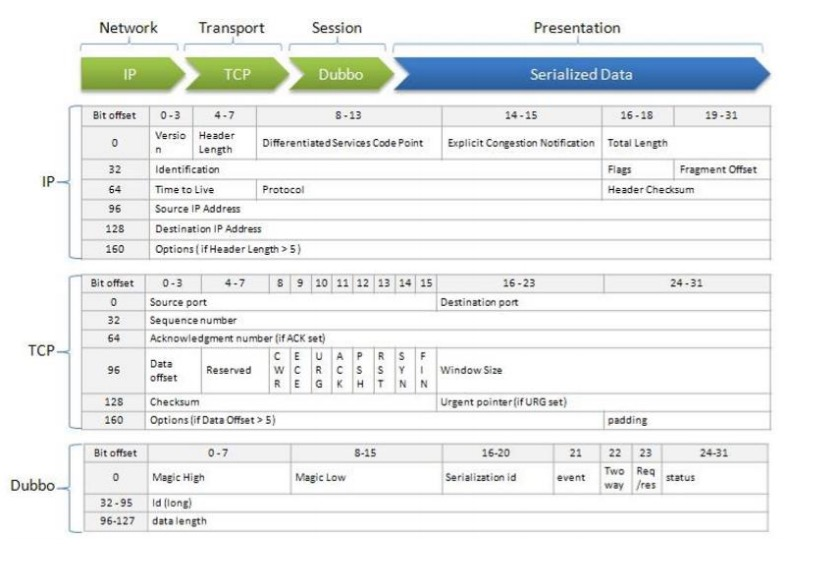
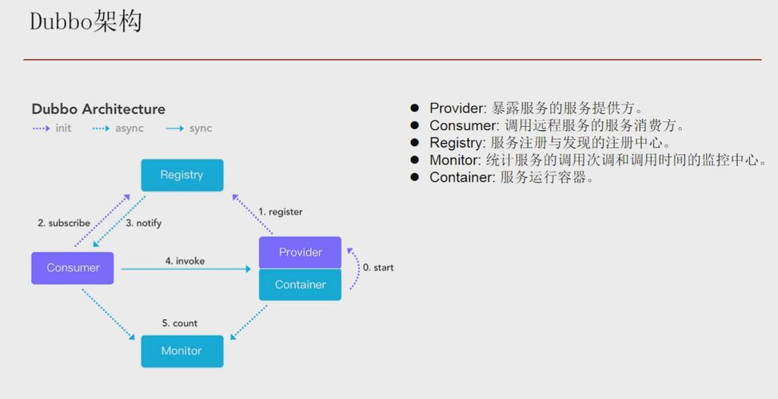
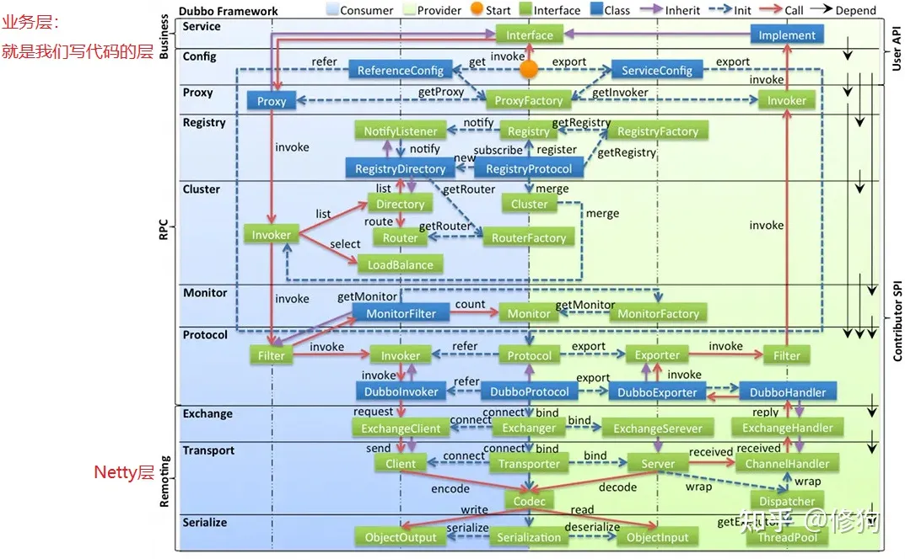
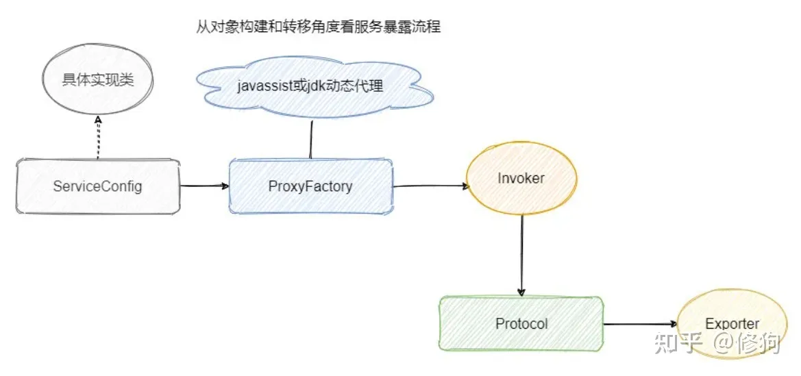
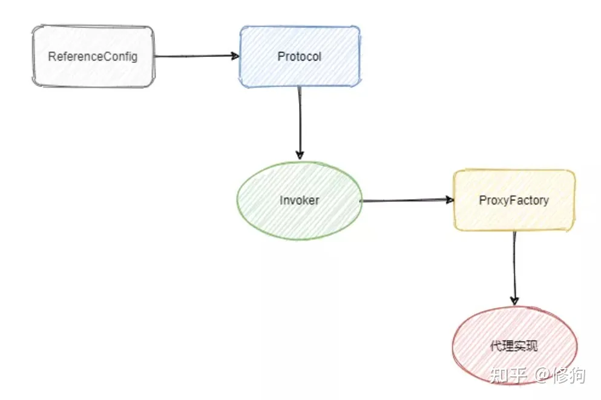
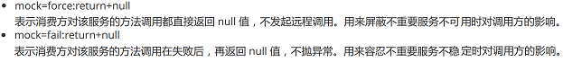
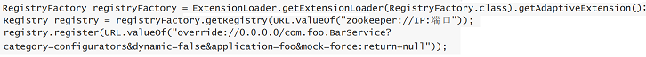
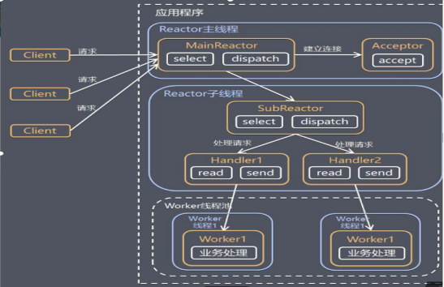

## 1.Dubbo是什么？

是一款高性能、轻量级的开源Java RPC框架，它提供了三大核心能力：面向接口的远程方法调用，智能容错和负载均衡，以及服务自动注册和发现。



## 2. Dubbo中的核心角色有哪些？



- Container**：** 服务运行容器，负责加载、运行服务提供者。
- Provider**：** 暴露服务的服务提供方，会向注册中心注册自己提供的服务。
- Consumer**：** 调用远程服务的服务消费方，会向注册中心订阅自己所需的服务。
- Registry**：** 服务注册与发现的注册中心。注册中心会返回服务提供者地址列表给消费者。
- Monitor： 统计服务的调用次数和调用时间的监控中心。服务消费者和提供者会定时发送统计数据到监控中心。

## 3. Dubbo 中的 Invoker 概念了解么？

- - 服务提供 `Invoker`
  - 服务消费 `Invoker`
- 我们需要调用一个远程方法，我们需要动态代理来屏蔽远程调用的细节吧！我们屏蔽掉的这些细节就依赖对应的 `Invoker` 实现， `Invoker` 实现了真正的远程服务调用
- 这里顺便解释下Exporter和Invoker的区别，Exporter持有Invoker的实例，Exporter是暴露对象，是起到暴露和撤回暴露作用的

## 4. Dobbo的分层架构(工作原理)




- Service业务层：就是我们写代码的层，我们使用rpc只需要关注该层就行，主要是定义接口和实现类。
- config 配置层：Dubbo 相关的配置。支持代码配置，同时也支持基于Spring来做配置，以 `ServiceConfig`, `ReferenceConfig` 为中心
- proxy 服务代理层：调用远程方法像调用本地的方法一样简单的一个关键，真实调用过程依赖代理类，以 `ServiceProxy` 为中心。
- registry 注册中心层：封装服务地址的注册与发现。
- cluster 路由层：封装多个提供者的路由及负载均衡，并桥接注册中心，以 `Invoker` 为中心。
- monitor 监控层：RPC 调用次数和调用时间监控，以 `Statistics` 为中心。
- protocol 远程调用层：封装 RPC 调用，以 `Invocation`, `Result` 为中心。
- exchange 信息交换层：封装请求响应模式，同步转异步，以 `Request`, `Response` 为中心。
- transport 网络传输层：抽象 mina 和 netty 为统一接口，以 `Message` 为中心。
- serialize 数据序列化层 ：对需要在网络传输的数据进行序列化。


## 5. Dubbo 的 SPI 机制了解么？为什么 Dubbo 不用 JDK的 SPI，而是要自己实现?

- SPI（Service Provider Interface） 是`调用方`来制定接口规范，提供给外部来实现，`调用方在调用时则`选择自己需要的外部实现。SPI机制被大量用在开源项目中(比如Dubbo，SpringBoot...)，它可以帮助我们进行功能扩展。

- SPI 的具体原理是这样的：我们将接口的实现类放在配置文件中，我们在程序运行过程中读取配置文件，通过反射加载实现类。这样，我们可以在运行的时候，动态替换接口的实现类。

- 一些配置类就可以使用SPI进行加载，如果我们需要进行扩展，就自定义类放在指定文件夹下。

- Java本身就提供了 SPI 机制的实现。不过，Dubbo 没有直接用，而是对 Java 原生的 SPI 机制进行了增强，以便更好满足自己的需求。

- 因为 Java SPI 在查找扩展实现类的时候遍历 SPI 的配置文件并且将实现类全部实例化，假设一个实现类初始化过程比较消耗资源且耗时，但是你的代码里面又用不上它，这就产生了资源的浪费。

- 因此 Dubbo 就自己实现了一个 SPI，给每个实现类配了个名字，通过名字去文件里面找到对应的实现类全限定名然后加载实例化，**按需加载**。

  ```properties
  Java SPI文件示例：
  com.mysql.jdbc.Driver
  com.mysql.fabric.jdbc.FabricMySQLDriver
  ```

  ```properties
  Dubbo SPI文件示例：
  adaptive=org.apache.dubbo.common.compiler.support.AdaptiveCompiler
  jdk=org.apache.dubbo.common.compiler.support.JdkCompiler
  javassist=org.apache.dubbo.common.compiler.support.JavassistCompiler
  ```
  
## 6. 如何扩展 Dubbo 中的默认实现？

- 比如说我们想要实现自己的负载均衡策略，我们创建对应的实现类 `XxxLoadBalance` 实现 `LoadBalance` 接口或者 `AbstractLoadBalance` 类。
- 我们将这个是实现类的路径写入到`resources` 目录下的 `META-INF/dubbo/org.apache.dubbo.rpc.cluster.LoadBalance`文件中即可。

```java
public class XxxLoadBalance implements LoadBalance {
 		public <T> Invoker<T> select(List<Invoker<T>> invokers, Invocation invocation) 
   			throws RpcException {
  			// ...
 		}
}
```

## 7. 服务暴露**：**生成代理类**，**将信息注册到ZK

- 组装URL：Spring IOC 容器刷新完毕之后，会根据配置参数组装成 URL， 然后根据 URL 的参数来进行代理类的生成。

  随着dubbo版本升级，在服务启动时，服务暴露时机会有所不同，总体都是在IOC容器启动后，会进行暴露工作。

- 生成代理类：会通过 `proxyFactory.getInvoker`，利用 javassist 来进行动态代理，封装真的实现类。

- 根据协议生成**暴露对象**(exporter)：通过 URL(类似：“dubbo://service-host/com.foo.FooService?version=1.0.0”) 参数选择对应的协议来进行 protocol.export，默认是 Dubbo 协议。

  - 自适应：代理类会根据 Invoker 里面的 URL 参数得知具体的协议，然后通过 Dubbo SPI 机制选择对应的实现类进行 export。

- 注册到ZK：将 export 得到的 exporter 存入一个 Map 中，供之后的远程调用查找，然后会向注册中心注册提供者的信息。

基于扩展点自适应机制，通过 URL 的 `registry://` 协议头识别，就会调用 `RegistryProtocol` 的 `export()` 方法，将 `export` 参数中的提供者 URL，先注册到注册中心。

再重新传给 `Protocol` 扩展点进行暴露： `dubbo://service-host/com.foo.FooService?version=1.0.0`，然后基于扩展点自适应机制，通过提供者 URL 的 `dubbo://` 协议头识别，就会调用 `DubboProtocol` 的 `export()` 方法，打开服务端口。



## 8. 服务引用

获取远程调用的类，生成代理类。可以看作服务暴露的逆过程。

- 组装URL：会根据配置参数组装成 URL， 然后根据 URL 的参数来进行代理类的生成。(2种时机)

    - 饿汉式：饿汉式是通过实现 Spring 的`InitializingBean`接口中的 `afterPropertiesSet`方法，容器通过调用 `ReferenceBean`的 `afterPropertiesSet`方法时引入服务。(在Spring启动时，给所有的属性注入实现类，包含远程和本地的实现类)。要开启dubbo:reference标签
    - 懒汉式：只有当这个服务**被注入到其他类中**时启动引入流程，也就是说用到了才会开始服务引入。
```
		如果对Spring创建Bean的过程不太了解，以上可能存在疑问。首先，ReferenceBean实现了FactoryBean接口，获取实例需要调用getObject方法。Spring容器本身也支持懒加载和非懒加载。如果在懒加载的情况下，dubbo的饿汉式和懒汉式没有区别。区别在Spring非懒加载的时候。
当容器启动时，会创建非懒加载和单例bean，如果是FactoryBean，则默认仅仅会创建FactoryBean实例，而不调用getObject方法。getObject方法是在实际被引用时才调用创建。也就是说Spring本身对于FactoryBean包装的实例就是懒汉式。dubbo在配置饿汉式时做了额外逻辑，就是在FactoryBean初始化之后就通过afterPropertiesSet方法直接调用getObject创建被包装的实例。
```
- 从ZK中获取需要的服务提供者的信息：得到Map。

- 根据协议解析传过来的exporter：

    - 协议的不同，获取的路径也不同：本地，直接，从ZK。

- 生成代理类：供消费者使用Netty进行远程调用。invoker。

    

## 9. 服务调用

1. 服务调用是在生成代理对象后，使用Netty，生成Netty Client进行远程调用。Netty Server通过执行返回调用结果。
2. 在调用之前，就会进行智能容错和负载均衡。
3. 首先客户端调用接口的某个方法，实际调用的是代理类，代理类会通过 cluster 从 directory(invoker的集合) 中获取一堆 invokers(如果有一堆的话)，然后进行 router 的过滤（其中看配置也会添加 mockInvoker 用于服务降级），然后再通过 SPI 得到 loadBalance 进行一波负载均衡。

## 10. 容错机制：先负载均衡获得一个invoker，调用失败进行容错，再负载均衡。

- 首先在服务引入的时候，将多个远程调用都塞入 Directory 中，然后通过 Cluster 来封装这个目录，封装的同时提供各种容错功能，比如 FailOver、FailFast 等等，最终暴露给消费者的就是一个 invoker。

- 然后消费者调用的时候会目录里面得到 invoker 列表，当然会经过路由的过滤，得到这些 invokers 之后再由 loadBalance 来进行负载均衡选择一个 invoker，最终发起调用。

## 11. dubbo常见的容错机制

- Failover Cluster(默认)
  - 失败自动切换，当出现失败，重试其它服务器。
  - 通常用于读操作，但重试会带来更长延迟。


- Failfast Cluster
  - 快速失败，只发起一次调用，失败立即报错。
  - 通常用于非幂等性的写操作，比如新增记录。


- Failsafe Cluster
  - 失败安全，出现异常时，直接忽略。
  - 通常用于写入审计日志等操作。


- Failback Cluster
  - 失败自动恢复，后台记录失败请求，定时重发。
  - 通常用于消息通知操作。


- Forking Cluster

  - 并行调用多个服务器，只要一个成功即返回。

  - 通常用于实时性要求较高的读操作，但需要浪费更多服务资源。

## 12. Dubbo 为什么默认用 Javassist？
```
注意，这里说的是默认使用，dubbo也有jdk动态代理的实现
```
- 很简单，就是快，且字节码生成方便。

- 其他常见的动态代理： JDK 的动态代理、ASM、cglib。
  - ASM 比 Javassist 更快，但是没有快一个数量级，而Javassist 只需用字符串拼接就可以生成字节码，而 ASM 需要手工生成，成本较高，比较麻烦。
  
## 13. Dubbo 支持哪些序列化方式?
- JDK 自带的序列化：不支持跨语言调用 ；性能差
- JSON：性能差
- ProtoBuf ：支持跨语言
- hessian2(默认)：支持跨语言
- Protostuff：支持跨语言
- Kryo：新引入的，只支持JAVA
- FST：新引入的，只支持JAVA

## 14. Dubbo 支持哪些协议，每种协议的应用场景，优缺点？

**1、** dubbo：单一长连接和 NIO 异步通讯，适合大并发小数据量的服务调用，以及消费者远大于提供者。传输协议 TCP，异步， Hessian 序列化；

**2、** rmi：采用 JDK 标准的 rmi 协议实现，传输参数和返回参数对象需要实现Serializable 接口，使用 java 标准序列化机制，使用阻塞式短连接，传输数据包大小混合，消费者和提供者个数差不多，可传文件，传输协议 TCP。多个短连接， TCP 协议传输，同步传输，适用常规的远程服务调用和 rmi 互操作。在依赖低版本的 Common-Collections 包， java 序列化存在安全漏洞；

**3、** http：基于 Http 表单提交的远程调用协议，使用 Spring 的 HttpInvoke 实现。多个短连接，传输协议 HTTP，传入参数大小混合，提供者个数多于消费者，需要给应用程序和浏览器 JS 调用；

**4、** webservice：基于 WebService 的远程调用协议，集成 CXF 实现，提供和原生 WebService 的互操作。多个短连接，基于 HTTP 传输，同步传输，适用系统集成和跨语言调用；

**5、** hessian：集成 Hessian 服务，基于 HTTP 通讯，采用 Servlet 暴露服务，Dubbo 内嵌 Jetty 作为服务器时默认实现，提供与 Hession 服务互操作。多个短连接，同步 HTTP 传输， Hessian 序列化，传入参数较大，提供者大于消费者，提供者压力较大，可传文件；

**6、** Redis：基于 Redis 实现的 RPC 协议

## 15. 服务提供者能实现失效踢出是什么原理？

服务失效踢出基于zookeeper的临时节点原理。

### 16. 服务调用是阻塞的吗？

默认是阻塞的，可以异步调用，没有返回值的可以这么做。

## 17. Dubbo 怎么实现降级

Dubbo中服务降级如何实现的呢？主要四种方式：

　　1、在dubbo管理控制台配置服务降级(屏蔽和容错)

　　　　

　　　　

　　2、指定返回简单值或者null

　　　　

 　　　如果是注解则使用@Reference(mock="return null") @Reference(mock="return 简单值")，也支持@Reference(mock="force:return null")。

　　3、使用java代码 动态写入配置中心

　　　　

　　4、整合hystrix，后续介绍hystrix进行详细介绍。


### 18. Dubbo 的注册中心集群挂掉，发布者和订阅者之间还能通信么？

可以通讯。启动 Dubbo 时，消费者会从 Zookeeper 拉取注册的生产者的地址接口等数据，缓存在本地。每次调用时，按照本地存储的地址进行调用。

### 19. Dubbo 和 Spring Cloud 的关系？

Dubbo 是 SOA 时代的产物，它的关注点主要在于服务的调用，流量分发、流量监控和熔断。而 Spring Cloud 诞生于微服务架构时代，考虑的是微服务治理的方方面面，另外由于依托了 Spirng、Spirng Boot 的优势之上，两个框架在开始目标就不一致， Dubbo定位服务治理、 Spirng Cloud 是一个生态。

## 20. Dubbo默认使用什么注册中心，还有别的选择吗？

推荐使用 Zookeeper 作为注册中心，还有 Redis、Multicast、Simple 注册中心，但不推荐。

## 21. Dubbo Monitor 实现原理是什么？

Consumer 端在发起调用之前会先走filter 链； provider 端在接收到请求时也是先走filter 链， 然后才进行真正的业务逻辑处理。

默认情况下，在consumer 和provider 的filter 链中都会有Monitorfilter。

1、MonitorFilter 向DubboMonitor 发送数据

2、DubboMonitor 将数据进行聚合后（默认聚合1min 中的统计数据）暂存到ConcurrentMap<Statistics, AtomicReference> statisticsMap，然后使用一个含有3 个线程（线程名字：DubboMonitorSendTimer）的线程池每隔1分钟，调用SimpleMonitorService 遍历发送statisticsMap 中的统计数据，每发送完毕一个，就重置当前的Statistics 的AtomicReference

3、SimpleMonitorService 将这些聚合数据塞入BlockingQueue queue 中（ 队列大小为100000）

4、SimpleMonitorService 使用一个后台线程（线程名为：DubboMonitorAsyncWriteLogThread）将queue 中的数据写入文件（该线程以死循环的形式来写）

5、SimpleMonitorService 还会使用一个含有1 个线程（ 线程名字：DubboMonitorTimer）的线程池每隔5min 钟， 将文件中的统计数据画成图表 

## 22. Dubbo 集群的负载均衡有哪些策略

- RandomLoadBalance：随机。随机的选择一个。是Dubbo的**默认**负载均衡策略。(加权/不加权)
- RoundRobinLoadBalance：轮询。轮询选择一个。(加权/不加权)
- LeastActiveLoadBalance：最少活跃数。每个服务维护一个活跃数计数器。当A机器开始处理请求，该计数器加1，此时A还未处理完成。若处理完毕则计数器减1。而B机器接受到请求后很快处理完毕。那么A,B的活跃数分别是1，0。当又产生了一个新的请求，则选择B机器去执行(B活跃数最小)，这样使慢的机器A收到少的请求。
- ConsistentHashLoadBalance：一致性哈希。相同参数的请求总是落在同一台机器上。

## 23. Dubbo 如何优雅停机？

1、低版本的 dubbo 优雅停机有很多问题，建议升级 dubbo 版本到相对稳定的版本（2.6.3进一步优化了dubbo优雅停机和 2.6.5 修复了leastactive loadbalance的预热问题） dubbo 2.5.x 升级到 2.7.15

2、Dubbo 是通过 JDK 的 ShutdownHook 来完成优雅停机的（高版本优化了，放到了 spring ContextClosedEvent 事件里面）。所以如果用户使用 kill -9 PID 等强制关闭指令，是不会执行优雅停机的，只有通过 kill PID 时，才会执行.

**真实项目中依赖关系比较复杂，开发要保证先停掉所有 dubbo 消费的地方（比如消费 kafka 消息然后调用 dubbo 服务, 定时任务调用 dubbo 服务等），然后再触发 dubbo 的优雅停机**

4、JDK 的 ShutdownHook 的执行顺序是并发加无序执行的，建议统一放到 spring ContextClosedEvent 里面，由自己编排需要停机的任务顺序 

在dubbo2.5之后，引入了qos。qos在dubbo内置了四个命令服务，运维或运维工具可以通过qos发送主动下线功能（下线注册，但不下线服务），等到流量完全停止，在下线pod或关闭服务

<table>
<thead>
<tr>
<th>命令</th>
<th>作用</th>
</tr>
</thead>
<tbody>
<tr>
<td>ls</td>
<td>能够列出来该实例服务提供者与调用者状态</td>
</tr>
<tr>
<td>online</td>
<td>服务上线，可以指定某个接口，也可以什么也不指定，这样就是全部</td>
</tr>
<tr>
<td>offline</td>
<td>服务下线，可以指定某个接口，也可以什么也不指定，这样就是全部</td>
</tr>
<tr>
<td>help</td>
<td>查看命令的用途，不带参数显示全部命令，带参数只显示指定的</td>
</tr>
</tbody>
</table>

#### 什么是ShutdownHook？

在Java程序中可以通过添加关闭钩子，实现在程序退出时关闭资源、平滑退出的功能。 
使用Runtime.addShutdownHook(Thread hook)方法，可以注册一个JVM关闭的钩子，这个钩子可以在以下几种场景被调用： 

1. 程序正常退出 
2. 使用System.exit() 
3. 终端使用Ctrl+C触发的中断 
4. 系统关闭 
5. 使用Kill pid命令干掉进程 

## 24. dubbo客户端和服务端线程模型是怎样的？

 

Dubbo 提供了五种线程派发策略，默认策略是 all，即所有消息都会被派发到业务线程池执行。

 

all（默认） ：所有消息都派发到Server线程池，包括请求，响应，连接事件，断开事件，心跳等。
direct： 所有消息都不派发到Server线程池，全部在 IO 线程上直接执行。
message ：只有请求响应消息派发到Server线程池，其它连接断开事件，心跳等消息，直接在 IO 线程上执行。
execution： 只有请求消息派发到Server线程池，不含响应，响应和其它连接断开事件，心跳等消息，直接在 IO 线程上执行。
connection： 在 IO 线程上，将连接断开事件放入队列，有序逐个执行，其它消息派发到线程池。

## 25. provider 有哪些属性

* interface：接口
* ref：实现类
* registry：注册中心
* protocol：协议
* version：版本号
* timeout：调用超时时间
* retries：超时重试次数

```xml
<bean id="dubboRegistryConfig" class="org.apache.dubbo.config.RegistryConfig">
    <property name="address" value="${dubbo.registry.url}"/>
</bean>

<bean id="dubboProtocolConfig" class="org.apache.dubbo.config.ProtocolConfig">
    <property name="port" value="-1"/>
    <property name="parameters">
        <map>
            <entry key="accessLogLevel" value="${dubbo.access_log_level}"/>
        </map>
    </property>
</bean>

<bean id="signUpNotificationService" class="org.apache.dubbo.config.spring.ServiceBean">
    <property name="interface" value="com.xxx.api.SignUpNotificationService"/>
    <property name="ref" ref="signUpNotificationServiceImpl"/>
    <property name="registry" ref="dubboRegistryConfig"/>
    <property name="protocol" ref="dubboProtocolConfig"/>
    <property name="version" value="${dubbo.reference.version}"/>
    <property name="timeout" value="${dubbo.export.timeout}"/>
    <property name="retries" value="0"/>
</bean>
```

## 26. consumer 有哪些属性
```
与provider几乎相同
```

## 27. dubbo是如何发起一个调用的
[《Dubbo系列》-Dubbo的服务调用过程](https://juejin.cn/post/6875847496082391053#heading-16)

## 28. dubbo的泛化调用是什么原理
​		泛化调用的用法如下，底层是根据传入的接口配置，生成invoker，并生成GenericService代理类来调用invoker
```java
RegistryConfig registry = new RegistryConfig();
//设置注册中心地址
registry.setAddress(“”);

ReferenceConfig<GenericService> reference = new ReferenceConfig<GenericService>();
reference.setApplication(application);
reference.setRegistry(registry);
//接口名
reference.setInterface("service.api.DataTableAuditManageService");
reference.setGeneric(true);
ReferenceConfigCache cache = ReferenceConfigCache.getCache();
GenericService genericService = cache.get(reference);

//调用
Object result = genericService.$invoke("selectArAuditAccSensitiveSingleLogList", parameterTypes, new Object[]{params});
```

