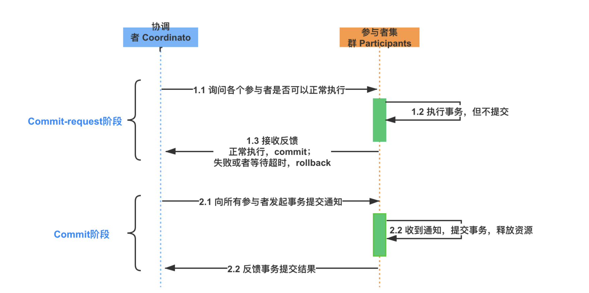
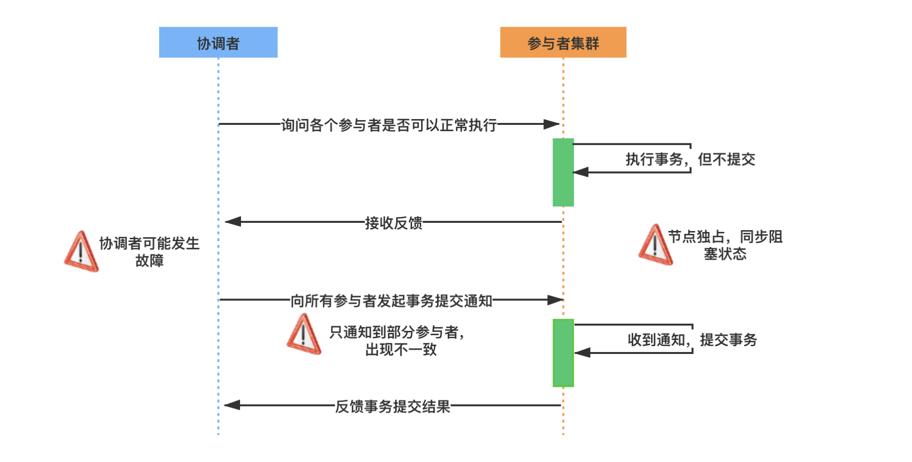
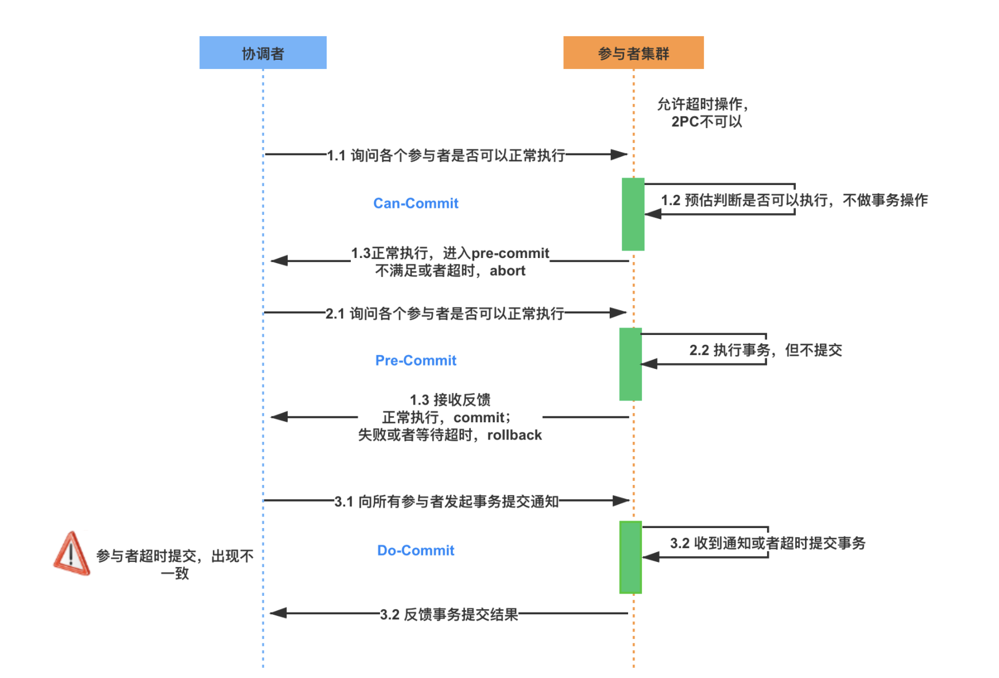
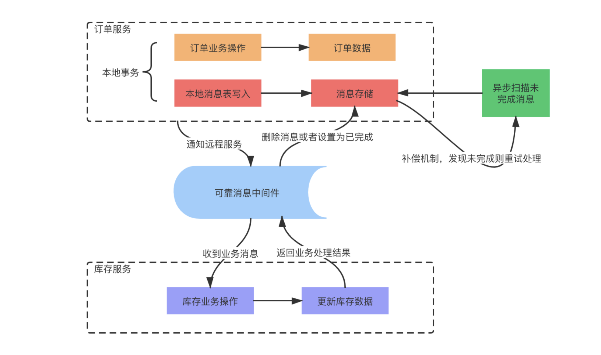

# 分布式事务 

## 概念

​		顾名思义，分布式事务关注的是分布式场景下如何处理事务，是指事务的参与者、支持事务操作的服务器、存储等资源分别位于分布式系统的不同节点之上。

​		简单来说，分布式事务就是一个业务操作，是由多个细分操作完成的，而这些细分操作又分布在不同的服务器上；事务，就是这些操作要么全部成功执行，要么全部不执行

## 产生的原因

​		分布式事务是伴随着系统拆分出现的，前面我们说过，分布式系统解决了海量数据服务对扩展性的要求，但是增加了架构上的复杂性，在这一点上，分布式事务就是典型的体现。在实际开发中，分布式事务产生的原因主要来源于存储和服务的拆分。

## 解决方案

​		分布式事务的解决方案，典型的有两阶段和三阶段提交协议、 TCC 分段提交，和基于消息队列的最终一致性设计。

### 2PC 两阶段提交

​		两阶段提交（2PC，Two-phase Commit Protocol）是非常经典的强一致性、中心化的原子提交协议，在各种事务和一致性的解决方案中，都能看到两阶段提交的应用。

二阶段提交算法的成立是基于以下假设的：
* 在该分布式系统中，存在一个节点作为协调者（Coordinator），其他节点作为参与者（Participants），且节点之间可以进行网络通信；
* 所有节点都采用预写式日志，日志被写入后被保存在可靠的存储设备上，即使节点损坏也不会导致日志数据的丢失；
* 所有节点不会永久性损坏，即使损坏后仍然可以恢复。

两阶段提交中的两个阶段，指的是 Commit-request 阶段和 Commit 阶段，两阶段提交的流程如下：

①提交请求阶段
		在提交请求阶段，协调者将通知事务参与者准备提交事务，然后进入表决过程。在表决过程中，参与者将告知协调者自己的决策：同意（事务参与者本地事务执行成功）或取消（本地事务执行故障），在第一阶段，参与节点并没有进行Commit操作。

②提交阶段
		在提交阶段，协调者将基于第一个阶段的投票结果进行决策：提交或取消这个事务。必须当且仅当所有的参与者同意提交，协调者才会通知各个参与者提交事务，否则协调者将通知各个参与者取消事务。

两阶段提交存在的问题

* 资源被同步阻塞
  * 在执行过程中，所有参与节点都是事务独占状态，当参与者占有公共资源时，那么第三方节点访问公共资源会被阻塞。
* 协调者可能出现单点故障
  * 一旦协调者发生故障，参与者会一直阻塞下去。
* 在 Commit 阶段出现数据不一致
  * 在第二阶段中，假设协调者发出了事务 Commit 的通知，但是由于网络问题该通知仅被一部分参与者所收到并执行 Commit，其余的参与者没有收到通知，一直处于阻塞状态，那么，这段时间就产生了数据的不一致性

### 3PC 三阶段提交

​		三阶段提交协议（3PC，Three-phase_commit_protocol）是在 2PC 之上扩展的提交协议，主要是为了解决两阶段提交协议的阻塞问题，从原来的两个阶段扩展为三个阶段，增加了超时机制。

​		为了解决二阶段协议中的同步阻塞等问题，三阶段提交协议在协调者和参与者中都引入了超时机制，并且把两阶段提交协议的第一个阶段拆分成了两步：询问，然后再锁资源，最后真正提交。

三阶段中的 Three Phase 分别为 CanCommit、PreCommit、DoCommit 阶段。

* CanCommit 阶段
  * 3PC 的 CanCommit 阶段其实和 2PC 的准备阶段很像。协调者向参与者发送 Can-Commit 请求，参与者如果可以提交就返回 Yes 响应，否则返回 No 响应。

* PreCommit 阶段
  * 协调者根据参与者的反应情况来决定是否可以继续事务的 PreCommit 操作。根据响应情况，有以下两种可能。
  * A. 假如协调者从所有的参与者获得的反馈都是 Yes 响应，那么就会进行事务的预执行：
    * 发送预提交请求，协调者向参与者发送 PreCommit 请求，并进入 Prepared 阶段；
    * 事务预提交，参与者接收到 PreCommit 请求后，会执行事务操作；
    * 响应反馈，如果参与者成功执行了事务操作，则返回 ACK 响应，同时开始等待最终指令。
  * B. 假如有任何一个参与者向协调者发送了 No 响应，或者等待超时之后，协调者都没有接到参与者的响应，那么就中断事务：
    * 发送中断请求，协调者向所有参与者发送 abort 请求；
    * 中断事务，参与者收到来自协调者的 abort 请求之后，执行事务的中断。

* DoCommit 阶段
  * 该阶段进行真正的事务提交，也可以分为以下两种情况。
  * A. 执行提交
    * 发送提交请求。协调者接收到参与者发送的 ACK 响应后，那么它将从预提交状态进入到提交状态，并向所有参与者发送 doCommit 请求。
    * 事务提交。参与者接收到 doCommit 请求之后，执行正式的事务提交，并在完成事务提交之后释放所有事务资源。
    * 响应反馈。事务提交完之后，向协调者发送 ACK 响应。
    * 完成事务。协调者接收到所有参与者的 ACK 响应之后，完成事务。
  * B. 中断事务 协调者没有接收到参与者发送的 ACK 响应，可能是因为接受者发送的不是 ACK 响应，也有可能响应超时了，那么就会执行中断事务。
  * C.超时提交 参与者如果没有收到协调者的通知，超时之后会执行 Commit 操作。

####  三阶段提交做了哪些改进

* 引入超时机制
在 2PC 中，只有协调者拥有超时机制，如果在一定时间内没有收到参与者的消息则默认失败，3PC 同时在协调者和参与者中都引入超时机制。

* 添加预提交阶段
在 2PC 的准备阶段和提交阶段之间，插入一个准备阶段，使 3PC 拥有 CanCommit、PreCommit、DoCommit 三个阶段，PreCommit 是一个缓冲，保证了在最后提交阶段之前各参与节点的状态是一致的。

* 三阶段提交协议存在的问题
三阶段提交协议同样存在问题，具体表现为，在阶段三中，如果参与者接收到了 PreCommit 消息后，出现了不能与协调者正常通信的问题，在这种情况下，参与者依然会进行事务的提交，这就出现了数据的不一致性。

### TCC 分段提交

TCC是Try、Confirm、Cancel三个词语的缩写。

TCC 是一个分布式事务的处理模型，将事务过程拆分为 Try、Confirm、Cancel 三个步骤，在保证强一致性的同时，最大限度提高系统的可伸缩性与可用性。

### 基于消息补偿的最终一致性
异步化在分布式系统设计中随处可见，基于消息队列的最终一致性就是一种异步事务机制，在业务中广泛应用。

在具体实现上，基于消息补偿的一致性主要有本地消息表和第三方可靠消息队列等。

本地消息表是一种业务耦合的设计，消息生产方需要额外建一个事务消息表，并记录消息发送状态，消息消费方需要处理这个消息，并完成自己的业务逻辑，另外会有一个异步机制来定期扫描未完成的消息，确保最终一致性。

 

* 系统收到下单请求，将订单业务数据存入到订单库中，并且同时存储该订单对应的消息数据，比如购买商品的 ID 和数量，消息数据与订单库为同一库，更新订单和存储消息为一个本地事务，要么都成功，要么都失败。
* 库存服务通过消息中间件收到库存更新消息，调用库存服务进行业务操作，同时返回业务处理结果。
* 消息生产方，也就是订单服务收到处理结果后，将本地消息表的数据删除或者设置为已完成。
* 设置异步任务，定时去扫描本地消息表，发现有未完成的任务则重试，保证最终一致性。

