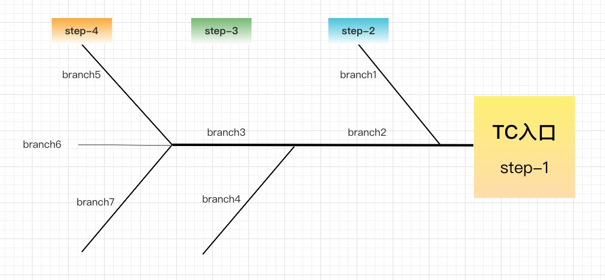

# 一条TCC

###### 1. 原理图
```
Try: 尝试执行业务
	完成所有业务检查（一致性）
	预留必须业务资源（准隔离性）

Confirm: 确认执行业务
	真正执行业务
	不作任何业务检查
	只使用Try阶段预留的业务资源
	Confirm操作满足幂等性

Cancel: 取消执行业务
	释放Try阶段预留的业务资源
	Cancel操作满足幂等性
```

 

###### 2. 使用方法

**配置Consumer Bean**

```xml
<bean id="tccService" class="org.apache.dubbo.config.spring.ReferenceBean">
     <property name="interface" value="com.xxx.tcc.api.TccService"/>
     <property name="registry" ref="dubboRegistryConfig"/>
     <property name="check" value="false"/>
     <property name="version" value="${dubbo.reference.version}"/>
     <property name="timeout" value="3000"/>
     <property name="retries" value="0"/>
</bean>
```

**引用jar包，配置Spring Bean**

```xml
<!--TCC-->
<bean id="compensableTransactionInterceptor" class="com.xxx.common.utils.tcctransaction.interceptor.CompensableTransactionInterceptor" init-method="init" />
<bean id="configurableTransctionAspect" class="com.xxx.common.utils.tcctransaction.spring.ConfigurableTransctionAspect" init-method="init" />
```

**添加@Compensable注解**
```java
对应的接口上也要加此注解，后续会讲到
@Compensable(confirmMethod = "orderDeductionPointConfirm", cancelMethod = "orderDeductionPointCancel")
@Override
public boolean orderDeductionPoint(PointEntity point) {
  	。。。。。。
}

@Override
public boolean orderDeductionPointConfirm(String transId, String branId) {
		。。。。。。
}

@Override
public boolean orderDeductionPointCancel(String transId, String branId) {
		。。。。。。
}
```

**配置Consumer的代理方式**

```xml
主事务所在服务要配置代理，如果只是提供子事务，被别人调用，可以不配置

全局配置
<dubbo:consumer proxy="tccJdk"></dubbo:consumer>

单独配置
<bean id="yitcoinInnerService" class="org.apache.dubbo.config.spring.ReferenceBean">
    <property name="interface" value="com.xxx.yitcoin.api.YitcoinInnerService"/>
    <property name="registry" ref="dubboRegistryConfig"/>
    <property name="timeout" value="3000"/>
    <property name="check" value="false"/>
    <property name="version" value="${dubbo.reference.version}"/>
    <property name="retries" value="0"/>
    <property name="proxy" value="tccJdk"/>
</bean>
```


###### 3. 实现原理

```
在开源项目changmingxie/tcc-transaction的基础上简化修改的。有条件的可以看原项目
github地址：https://github.com/changmingxie/tcc-transaction
官网地址：http://mengyun.org/zh-cn/index.html
```

**关键概念**
```
transId：分布式事务Id
step:事务的层级，主事务是step-1，后续的嵌套子事务依次加1，step-x可能与多个同层次事务对应
branchId：每个子事务的唯一id，存在主事务的invokeList中
```

**流程简述**

```
①ConfigurableTransctionAspect切面会切入加了@Compensable注解的方法，用CompensableTransactionInterceptor拦截器进行逻辑增强。
②拦截器生成事务信息，调用原方法逻辑，保存事务信息到redis中。
③consumer端调用子事务时，通过tccjdk proxy为子事务生成branchId，并把branchId存到主事务的invokeList中。并把branchId通过DubboExtProperty传递给子事务。DubboExtProperty是一条对dubbo的改造，也可以直接用dubbo原生的RPCContext做同样的事情。
④子事务接到请求时，重复步骤②生成子事务的信息
⑤如果子事务又去调用子事务或者子事务结束主事务又调用其他子事务，那么依然是重复③或者④的逻辑即可
⑥主事务的所有调用完毕后，开始统一调用所有子事务的confirm或者cancel。最后调用主事务自己的confirm或者cancel。

另外，在com.xxx.tcc.service.BackendTccServiceImpl#init中有定时任务来处理confirm失败的事务，再次调用
```

 

 


