## 概述
###### 1. 什么是分库分表？

```
分表：从单张表拆分成多张表的过程，将数据散落在多张表内
分库：从单个数据库拆分成多个数据库的过程，将数据散落在多个数据库中
```
 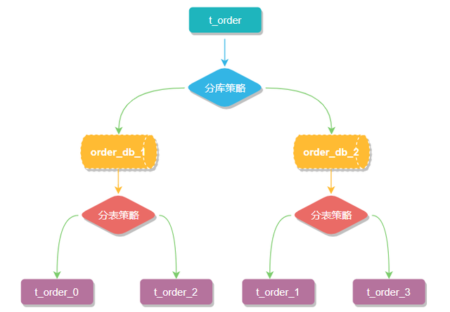

###### 2. 为什么分库分表？

```
如果单表的数据量太大，读写性能略显费劲时，需要对数据进行分表，加快读写性能
当数据库的并发量过大，已经超过了单个数据库的并发容量时，就需要分库来分散压力
※由上可知，分库分表并不一定是一起出现的，要根据实际情况进行应用。在项目设计初期，根据项目的预估容量来判断瓶颈在哪里，瓶颈在表就分表，瓶颈在库就分库，两个都有瓶颈就即分库又分表，如果没有瓶颈就不要瞎鸡巴分
```
 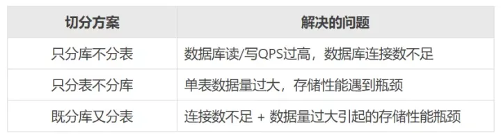

###### 3. 如何评估分多少张表，分多少库

```xml
		预估未来支撑的数据容量，单张表容纳数据量X，然后得出需要分多少张表。至于单表数据多少合适，没有固定的数量公式，基本要控制在1000万内，阿里建议500万，我们之前是200万，公司有钱浪费的话搞个100万都没问题。只要还未出现瓶颈就能继续用，开始预估可以稍微大点到1000万，到时候感觉性能出现问题再扩容。
		分库的时候除了要考虑平时的业务峰值读写QPS外，还要考虑到诸如双11大促期间可能达到的峰值，需要提前做好预估。预估总并发和连接数，了解单库的并发和连接数，得出分库的数量。一般连接数根据cpu的数量乘以10以内即可，上线之前在这附近设置几个档位做下压测看下实际效果。以公司的数据库实例为例，cpu是4核，实例那边最大是1000多。客户端连接数最大是maxActive=100。这个其实需要根据实例最佳性能对应的连接数除以机器数再稍微加一点即可，100太大了。
 <bean id="dataSource" class="org.apache.tomcat.jdbc.pool.DataSource" destroy-method="close">
        <property name="poolProperties">
            <bean class="org.apache.tomcat.jdbc.pool.PoolProperties">
                <property name="driverClassName" value="com.mysql.jdbc.Driver"/>
                <property name="url" value="${com.xxx.datasource.url}"/>
                <property name="username" value="${com.xxx.datasource.username}"/>
                <property name="password" value="${com.xxx.datasource.password}"/>
                <property name="jmxEnabled" value="false"/>
                <property name="testWhileIdle" value="false"/>
                <property name="initialSize" value="1"/>
                <property name="maxActive" value="100"/>
                <property name="maxIdle" value="${com.xxx.datasource.maxIdle}"/>
                <property name="minIdle" value="${com.xxx.datasource.minIdle}"/>
                <property name="defaultAutoCommit" value="false"/>
                <property name="maxWait" value="1000"/>
                <property name="removeAbandoned" value="true"/>
                <property name="removeAbandonedTimeout" value="60"/>
                <property name="testOnBorrow" value="true"/>
                <property name="testOnReturn" value="false"/>
                <property name="validationQuery" value="/* ping */ SELECT 1"/>
                <property name="validationInterval" value="60000"/>
                <property name="validationQueryTimeout" value="3"/>
                <property name="timeBetweenEvictionRunsMillis" value="${com.xxx.datasource.timeBetweenEvictionRunsMillis}"/>
                <property name="minEvictableIdleTimeMillis" value="${com.xxx.datasource.minEvictableIdleTimeMillis}"/>
                <property name="jdbcInterceptors"
                          value="org.apache.tomcat.jdbc.pool.interceptor.ConnectionState;org.apache.tomcat.jdbc.pool.interceptor.StatementFinalizer"/>
            </bean>
        </property>
    </bean>
```

###### 4. 数据切分类型

```
水平切分：不同库的表结构相同，例如按照用户id分片，不同的用户数据到不同的分片
垂直切分：不同库的表结构不同，例如在服务中有一块小业务并发量极高，可以把相关数据分到独立的库中，如果有多个关联性不大的高并发业务也可以拆分到多个库中
```

###### 5. 常用的分库分表方案

```
1. 应用层中间件
		就是重新实现JDBC的API，通过重新实现DataSource、PrepareStatement等操作数据库的接口，让应用层在基本（注意：这里用了基本）不改变业务代码的情况下透明地实现分库分表的能力。
		中间件给上层应用提供熟悉的JDBC API，内部通过sql解析、sql重写、sql路由等一系列的准备工作获取真正可执行的sql，然后底层再按照传统的方法（比如数据库连接池）获取物理连接来执行sql，最后把数据结果合并处理成ResultSet返回给应用层
		
	优点：无需额外部署，只要和应用绑定一起发布即可
	缺点：不能跨语言，比如Java写的sharding-jdbc显然不能用在C#项目中
	代表方案：阿里的TDDL、Sharding-JDBC、蘑菇街的TSharding、携程的Ctrip-DAL等
	
2. 中间层代理中间件
		这类分库分表中间件的核心原理是在应用和数据库的连接之间搭起一个代理层，上层应用以标准的MySQL协议来连接代理层，然后代理层负责转发请求到底层的MySQL物理实例，这种方式对应用只有一个要求，就是只要用MySQL协议来通信即可，所以用MySQL Workbench这种客户端都可以直接连接你的分布式数据库，自然也天然支持所有的编程语言。比较有代表性的产品有开创性质的Amoeba、Sharding-Proxy、阿里开源的Cobar、社区发展比较好的Mycat 等
```

###### 6. 分片策略有哪些
```
1. 按照range分，比如userid在0-1000万在一库，1000万-2000万的在2库
	优点：方便后期扩容
	缺点：热点数据可能不均衡，有些业务最近的数据可能更热，大部分的流量还是到了最新的库中，相当于没有分担压力
2. 按照hash取模分，对userId做hash后取模
	优点：热点数据均衡
	缺陷：不方便扩容，扩容后要有数据迁移
3. 结合range和hash的方式，在range的基础上，把每次扩容的机器编在一个组内，然后组内再hash取模（详见扩容方案）
```


## 疑难杂症
###### 1. 分库分表需要注意哪些问题
```
1. 全局pk（主键和唯一索引）的冲突检测不准确，需要高可用的全局自增主键
2. 分片键的选择。如没有选择好，可能会影响SQL执行效率，事务跨库等
3. 分布式事务
4. 可能会产生跨库或者夸表的join、排序、聚合等
5. 字典表的归属
6. 平滑分库
6. 数据迁移
7. 后期扩容
```

###### 2. 如何在尽量不停机的情况下，完成分库
```
假设要分两个库，新开一台数据库实例先作为从库同步原库的数据。
等数据同步完毕后，暂停主库写入，把从库断开同步，作为写库，切换程序的分库分表策略（可以做成开关，过程顺利的话可以做到秒级）
现在就成了两个数据库，观察没问题后，开定时任务对两个库做数据清洗只留下属于本库的数据
```

###### 3. 有没有好的后期扩容方案
```
①hash成倍扩容法
与如何在尽量不停机的情况下，完成分库道理一样，这里的vip是指虚拟IP的意思，增加虚拟ip先指向主库，后边主从同步好之后再把新的虚拟ip指向备库作为新主库
```
 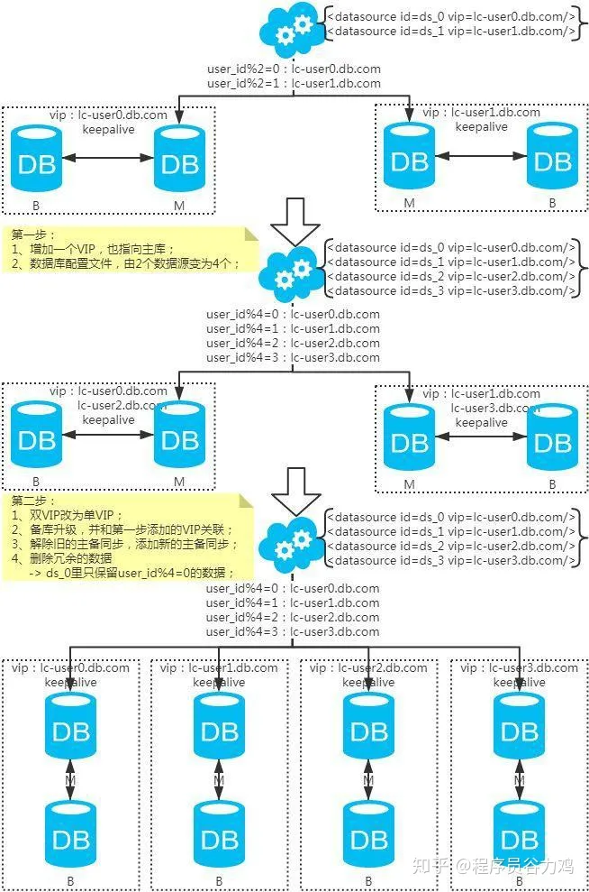

```
②双写迁移法（此方式不仅适用于后期扩容，初期接入时的数据迁移也适用，分库和分表都适用）
第一步：（同步双写）应用配置双写，部署；
第二步：（同步双写）将老库中的老数据复制到新库中；
第三步：（同步双写）以老库为准校对新库中的老数据；
第四步：（同步双写）应用去掉双写，部署；
```
 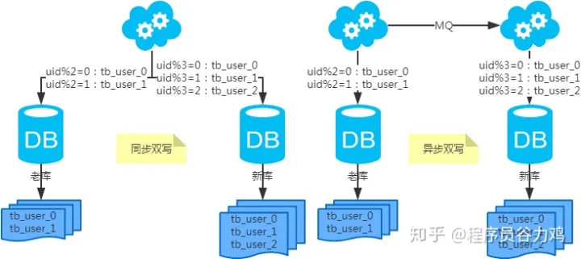

```
③range加hash的方式，把每次扩容的机器作为一个组
最初的分库规模可以认为是Group1，到瓶颈之后做扩容，这个时候把新扩容的实例作为Group2
推荐使用这种方法，简单易搞还不需要数据迁移。那Group2会不会比Group1的数据更热，这是有可能的，但是Group2中的数据也是hash到多个机器上，不会造成单台机器的数据过热。如果Group1的数据过冷，在下次扩容时可以让Group1再承担部分数据即可
```
 
 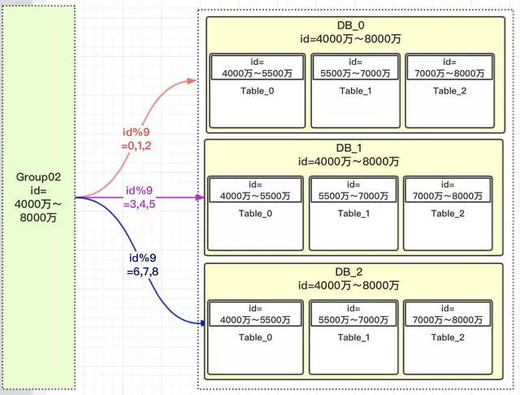

###### 4. 非partition key的查询问题
```
①映射法
把其他经常查询的列与分片key单独放一个表做映射。
问题：对数据的写入逻辑有侵入
```
 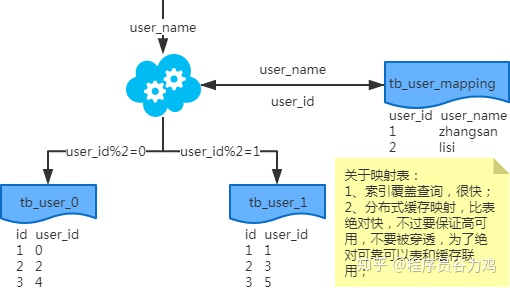

```
②基因法
例如userid作为分片key，但username也会进行查询，那么在生成userid时，userid的最后几位要用username的hash的后几位，这样两者的hash取模就一致了。注意，谁来继承谁的基因要根据业务灵活定。
问题：只能解决一个非分片键的查询
取模要用最后几位基因来取
```
 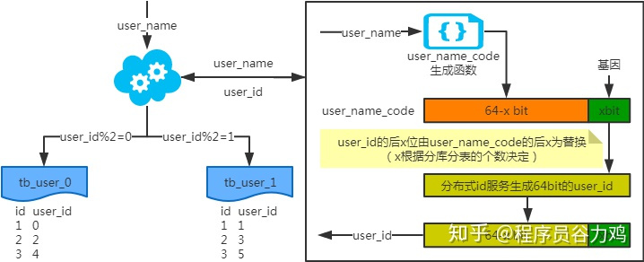
```
③数据副本
图中的NoSQL也可以用关系数据库，因为后台的查询并发会小很多。一般情况用ES，后台查询的模糊查询需求可能比较多
```
 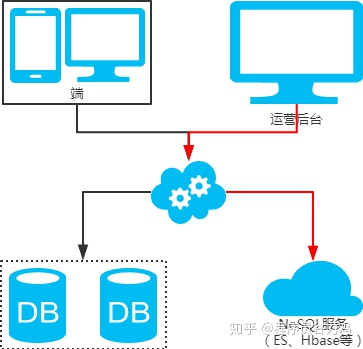

## ShardingSphere 方案
```
		ShardingSphere是一套开源的分布式数据库中间件解决方案组成的生态圈，它由Sharding-JDBC、Sharding-Proxy和Sharding-Sidecar（计划中）这3款相互独立的产品组成。 他们均提供标准化的数据分片、分布式事务和数据库治理功能，可适用于如Java同构、异构语言、容器、云原生等各种多样化的应用场景
官方文档：https://shardingsphere.apache.org/document/current/cn/overview/
```

#### Sharding-JDBC
```
		定位为轻量级Java框架，在Java的JDBC层提供的额外服务。它使用客户端直连数据库，以jar包形式提供服务，无需额外部署和依赖，可理解为增强版的JDBC驱动，完全兼容JDBC和各种ORM框架。通过使用 ShardingSphere-JDBC 接入端，可以满足高并发的 OLTP 场景下的性能要求。
>适用于任何基于Java的ORM框架，如：JPA, Hibernate, Mybatis, Spring JDBC Template或直接使用JDBC。
>基于任何第三方的数据库连接池，如：DBCP, C3P0, BoneCP, Druid, HikariCP等。
>支持任意实现JDBC规范的数据库。目前支持MySQL，Oracle，SQLServer和PostgreSQL
```
 

#### Sharding-Proxy
```
		定位为透明化的数据库代理端，提供封装了数据库二进制协议的服务端版本，用于完成对异构语言的支持。 目前先提供MySQL版本，它可以使用任何兼容MySQL协议的访问客户端(如：MySQL Command Client, MySQL Workbench等)操作数据，对DBA更加友好。
		ShardingSphere-Proxy 提供静态入口以及异构语言的支持，独立于应用程序部署，适用于实时分析的 OLAP 场景。
```
 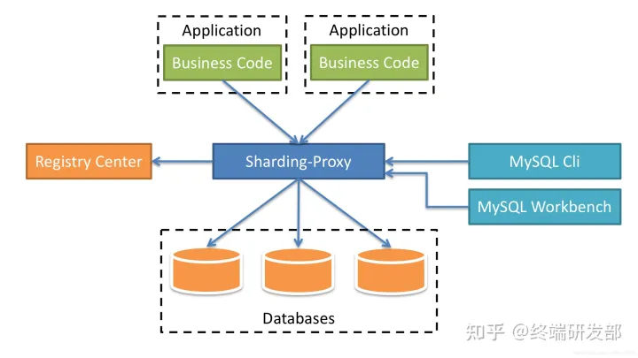

## Sharding-JDBC解读
```
官方文档：https://shardingsphere.apache.org/document/current/cn/overview/
```
 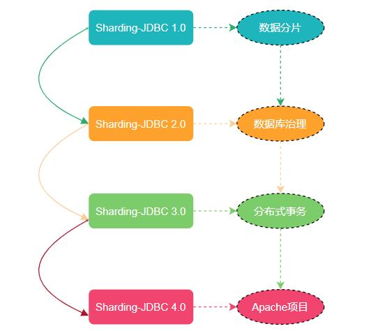

###### 1. 执行流程
 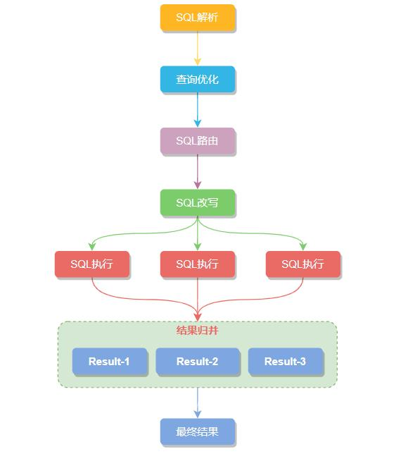

###### 2. 数据源配置

```xml
		<bean id="ds1" class="com.zaxxer.hikari.HikariDataSource" destroy-method="close">
        <property name="driverClassName" value="com.mysql.jdbc.Driver" />
        <property name="jdbcUrl" value="jdbc:mysql://localhost:3306/ds1" />
        <property name="username" value="root" />
        <property name="password" value="" />
    </bean>
    
    <bean id="ds2" class="com.zaxxer.hikari.HikariDataSource" destroy-method="close">
        <property name="driverClassName" value="com.mysql.jdbc.Driver" />
        <property name="jdbcUrl" value="jdbc:mysql://localhost:3306/ds2" />
        <property name="username" value="root" />
        <property name="password" value="" />
    </bean>
    
    <shardingsphere:data-source id="ds" database-name="foo_schema" data-source-names="ds1,ds2" rule-refs="..." />
```

###### 3. 广播表
```
指所有的分片数据源中都存在的表，表结构及其数据在每个数据库中均完全一致。 适用于数据量不大且需要与海量数据的表进行关联查询的场景，例如：字典表
操作广播表的业务场景尽量不要存在并发，保持低频修改
```

###### 4. 单表
```
指所有的分片数据源中仅唯一存在的表。 适用于数据量不大且无需分片的表，并且不存在与分片数据的关联查询
```

###### 5. 分片策略支持
```
		包含分片键和分片算法，由于分片算法的独立性，将其独立抽离。真正可用于分片操作的是分片键 + 分片算法，也就是分片策略。sharding-jdbc提供了常用的表达式配置、hash取模、range等分片算法，并支持自定义分片算法，如下是一个表达式方式的分片算法，用表达式实现了取模分片
```
```xml
    <sharding:standard-strategy id="databaseStrategy" sharding-column="user_id" algorithm-ref="inlineStrategyShardingAlgorithm" />
    <sharding:sharding-algorithm id="inlineStrategyShardingAlgorithm" type="INLINE">
        <props>
            <prop key="algorithm-expression">demo_ds_${user_id % 2}</prop>
        </props>
    </sharding:sharding-algorithm>
```

###### 6. 未命中分片字段是怎么处理的？
```
如果查询字段未命中分片，则会全库全表查询合并，性能较低，在实际使用的场景中不允许出现这种情况
```

###### 7. 读写分离支持
```
读写分离虽然可以提升系统的吞吐量和可用性，但同时也带来了数据不一致的问题
透明化读写分离所带来的影响，让使用方尽量像使用一个数据库一样使用主从数据库集群，是 Apache ShardingSphere 读写分离模块的主要设计目标
```
 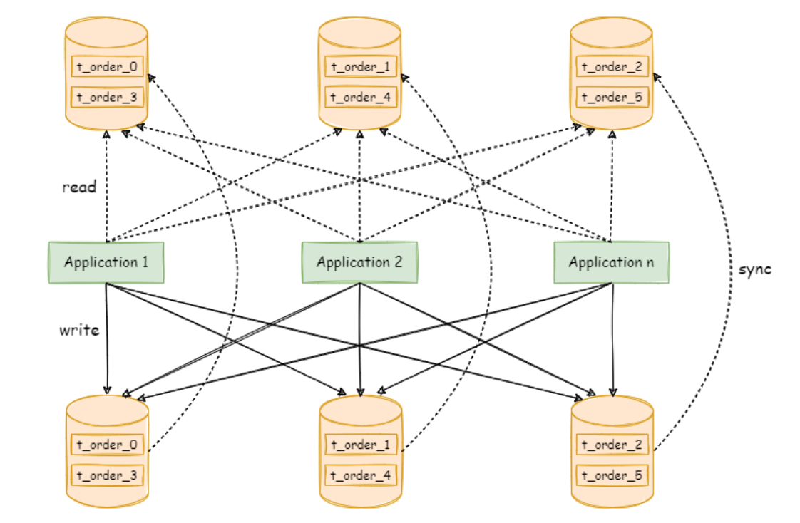
```xml
<!--从库负载均衡算法-->
<readwrite-splitting:load-balance-algorithm id="randomStrategy" type="RANDOM" />
<!--读写分离规则-->    
<readwrite-splitting:rule id="readWriteSplittingRule">
    <readwrite-splitting:data-source-rule id="demo_ds" load-balance-algorithm-ref="randomStrategy">
        <readwrite-splitting:static-strategy id="staticStrategy" write-data-source-name="demo_write_ds" read-data-source-names="demo_read_ds_0, demo_read_ds_1"/>
    </readwrite-splitting:data-source-rule>
</readwrite-splitting:rule>
<!--读写分离数据源-->
<shardingsphere:data-source id="readWriteSplittingDataSource" data-source-names="demo_write_ds, demo_read_ds_0, demo_read_ds_1" rule-refs="readWriteSplittingRule" />
```

###### 8. 读写分离一致性是怎么解决的?
```java
		首先读写分离一致性是怎么引入的？
		如下图所示，当请求1写数据到主库，请求2来读从库，此时数据可能尚未同步到从库，例如购买会员成功，马上拉取会员信息可能拉不到，我们可以在缓存上做处理，写事务提交后立刻更新缓存而不是常用的直接删除缓存，2s后再删除缓存防止更新的数据是错的。或者查询的时候带相应参数强制路由到主库查询。这种情况需要我们在业务和代码流程上做处理。
		另一种情况是当请求在事务中先写入数据，然后查询数据，这个时候如果走从库是不可能查到的，因为事务并未提交。这种情况是中间件可以帮我们解决的，如下两种方式
①当一个事务中出现读、写、读时，第一个读走读库，第二个写和第三个读走写库。只要中间出现写操作，那么后续的读都走读库（即使写的A表，后续读B表也是走主库）
②提供了在指定代码处强制走主库的Hint路由
  try (HintManager hintManager = HintManager.getInstance()) {
      hintManager.setMasterRouteOnly();
      updatexxx();
  }
  
※注意
读写分离的目的是在读多写少的场景下，让读业务走读库，来分担主库的压力。但并不是要达到所有读都要走读库的目标，这一点要正确理解，不要走极端。单纯的读业务走读库就已经分担了大部分压力，写业务里的读操作走写库是一件很正常的事情。
```
 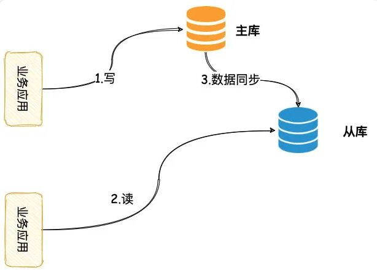

###### 9. 分布式事务
```
sharding-jdbc封装了Local、XA、BASE事务，开发者可根据自己的应用场景选取最合适的
SEATA官网：http://seata.io/zh-cn/docs/overview/what-is-seata.html
```


|          | *LOCAL*          | *XA*            | *BASE*              |
| :------- | :--------------- | :-------------- | ----------------- |
| 业务改造 | 无               | 无              | 需要 seata server |
| 一致性   | 不支持           | 支持            | 最终一致          |
| 隔离性   | 不支持           | 支持            | 业务方保证        |
| 并发性能 | 无影响           | 严重衰退        | 略微衰退          |
| 适合场景 | 业务方处理不一致 | 短事务 & 低并发 | 长事务 & 高并发   |

```xml
<!-- ShardingDataSource 的相关配置 -->
<!-- ...  -->
<bean id="transactionManager" class="org.springframework.jdbc.datasource.DataSourceTransactionManager">
    <property name="dataSource" ref="shardingDataSource" />
</bean>
<bean id="jdbcTemplate" class="org.springframework.jdbc.core.JdbcTemplate">
    <property name="dataSource" ref="shardingDataSource" />
</bean>
<tx:annotation-driven />

<!-- 开启自动扫描@ShardingSphereTransactionType，使用 Spring 原生的 AOP 在类和方法上进行增强 -->
<sharding:tx-type-annotation-driven />
```
```java
@Transactional
@ShardingSphereTransactionType(TransactionType.XA)  // 支持TransactionType.LOCAL, TransactionType.XA, TransactionType.BASE
public void insert() {
        jdbcTemplate.execute("INSERT INTO t_order (user_id, status) VALUES (?, ?)", (PreparedStatementCallback<Object>) ps -> {
        ps.setObject(1, i);
        ps.setObject(2, "init");
        ps.executeUpdate();
        });
}

```

###### 10. XA事务
```
		XA 协议是由 X/Open 组织提出的分布式事务处理规范，主要定义了事务管理器 TM 和局部资源管理器 RM 之间的接口。目前主流的数据库，比如 oracle、DB2 都是支持 XA 协议的。mysql 从 5.0 版本开始，innoDB 存储引擎已经支持 XA 协议。其实就是二阶段提交。
```
 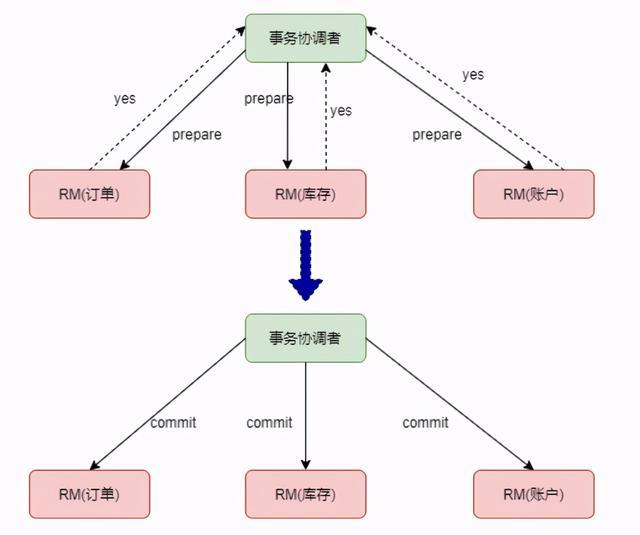

###### 11. 高可用能力（了解即可）
```
Apache ShardingSphere 不提供数据库高可用的能力，它通过第三方提供的高可用方案感知数据库主从关系的切换。 确切来说，Apache ShardingSphere 提供数据库发现的能力，自动感知数据库主从关系，并修正计算节点对数据库的连接。
```

###### 12. 影子库
```
		在基于微服务的分布式应用架构下，业务是通过一系列的服务、中间件的调用来完成，所以单个服务的压力测试已无法代表真实场景。在测试环境中，如果重新搭建一整与生产环境类似的压测环境，成本过高，并且往往无法模拟线上环境的复杂度以及流量。因此，业内通常选择全链路压测的方式，即在生产环境进行压测，这样所获得的测试结果能够准确地反应系统真实容量和性能水平。
		全链路压测是一项复杂而庞大的工作。需要各个微服务、中间件之间配合与调整，以应对不同流量以及压测标识的透传。 通常会搭建一整套压测平台以适用不同测试计划。在数据库层面需要做好数据隔离，为了保证生产数据的可靠性与完整性，需要将压测产生的数据转到压测环境数据库，防止压测数据对生产数据库中真实数据造成污染。这就要求业务应用在执行 SQL 前，能够根据透传的压测标识，做好数据分类，将相应的 SQL 路由到与之对应的数据源。

ShardingSphere提供了两种方案选择：
```
```xml
①基于列的影子算法 通过识别 SQL 中的数据，匹配路由至影子库的场景。适用于由压测数据名单驱动的压测场景
		<shadow:shadow-algorithm id="user-id-insert-match-algorithm" type="VALUE_MATCH">
        <props>
            <prop key="operation">insert</prop>
            <prop key="column">user_id</prop>
            <prop key="value">1</prop>
        </props>
    </shadow:shadow-algorithm>

    <shadow:rule id="shadowRule">
        <shadow:data-source id="shadow-data-source" production-data-source-name="ds" shadow-data-source-name="ds_shadow"/>
        <shadow:shadow-table name="t_user" data-sources="shadow-data-source">
        <shadow:algorithm shadow-algorithm-ref="user-id-insert-match-algorithm" />
        </shadow:shadow-table>
    </shadow:rule>
```
```sql
②基于 Hint 的影子算法 通过识别 SQL 中的注释，匹配路由至影子库的场景。 适用于由上游系统透传标识驱动的压测场景。如下sql的注释中指定了foo属性的值是bar，可以在xml中配置foo:bar到影子库
SELECT * FROM t_order WHERE order_id = xxx /*foo:bar,...*/
```

###### 13. 数据迁移
```
此处的数据迁移是指从单库单表状态，迁移至分库分表状态，帮助快速的接入分库分表。
目前的数据迁移解决方案为：使用一个全新的数据库集群作为迁移目标库

这种实现方式有以下优点：
①迁移过程中，原始数据没有任何影响
②迁移失败无风险
③不受分片策略限制

同时也存在一定的缺点：
①在一定时间内存在冗余服务器
②所有数据都需要移动

一次数据迁移包括以下几个主要阶段：
①准备阶段
	数据迁移模块会进行数据源连通性及权限的校验，同时进行存量数据的统计、日志位点的记录，最后根据数据量和用户设置的并行度，对任务进行分片
②存量数据迁移阶段
	存量迁移阶段采用 JDBC 查询的方式，直接从源端读取数据，基于配置的分片等规则写入到目标端
③增量数据同步阶段
	订阅并解析 binlog
④流量切换阶段
	在此阶段，可能存在一定时间的业务只读窗口期，通过设置数据库只读、控制源头写流量等方式，让源端数据节点中的数据短暂静态，确保增量同步完全完成
	
整个过程要引入ShardingSphere-Proxy，此处不做详细介绍，整个流程比较复杂
```

###### 14. 数据脱敏
```
		我们可以从加密模块存在的意义来理解。加密模块最终目的是希望屏蔽底层对数据的加密处理，也就是说我们不希望用户知道数据是如何被加解密的、如何将明文数据存储到 plainColumn、将密文数据存储到 cipherColumn、将辅助查询数据存储到 assistedQueryColumn。换句话说，我们不希望用户知道 plainColumn、cipherColumn 和 assistedQueryColumn 的存在和使用。
		所以，我们需要给用户提供一个概念意义上的列，这个列可以脱离底层数据库的真实列，它可以是数据库表里的一个真实列，也可以不是，从而使得用户可以随意改变底层数据库的 plainColumn、cipherColumn 和 assistedQueryColumn 的列名。或者删除 plainColumn，选择永远不再存储明文，只存储密文。 只要用户的 SQL 面向这个逻辑列进行编写，并在加密规则里给出 logicColumn 和 plainColumn、cipherColumn、assistedQueryColumn 之间正确的映射关系即可
```
  
```xml
		<encrypt:encrypt-algorithm id="name_encryptor" type="AES">
        <props>
            <prop key="aes-key-value">123456</prop>
        </props>
    </encrypt:encrypt-algorithm>

    <encrypt:encrypt-algorithm id="pwd_encryptor" type="assistedTest" />
    
    <encrypt:rule id="encryptRule">
        <encrypt:table name="t_user">
            <encrypt:column logic-column="username" cipher-column="username" plain-column="username_plain" encrypt-algorithm-ref="name_encryptor" />
            <encrypt:column logic-column="pwd" cipher-column="pwd" assisted-query-column="assisted_query_pwd" encrypt-algorithm-ref="pwd_encryptor" />
        </encrypt:table>
    </encrypt:rule>
```
 


###### 15. 实际应用，以优惠券的为例
```
参见coupon项目的配置
配置文件已拷贝到assets/applicationContext-database.xml
```


## 参考文档
[不用找了，大厂在用的分库分表方案，都在这了！](https://zhuanlan.zhihu.com/p/93643428)
[ShardingSphere 官网](https://shardingsphere.apache.org/document/current/cn/overview/)