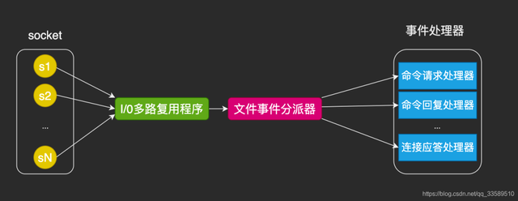
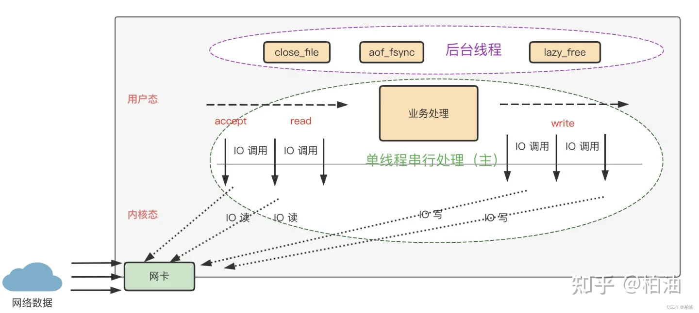
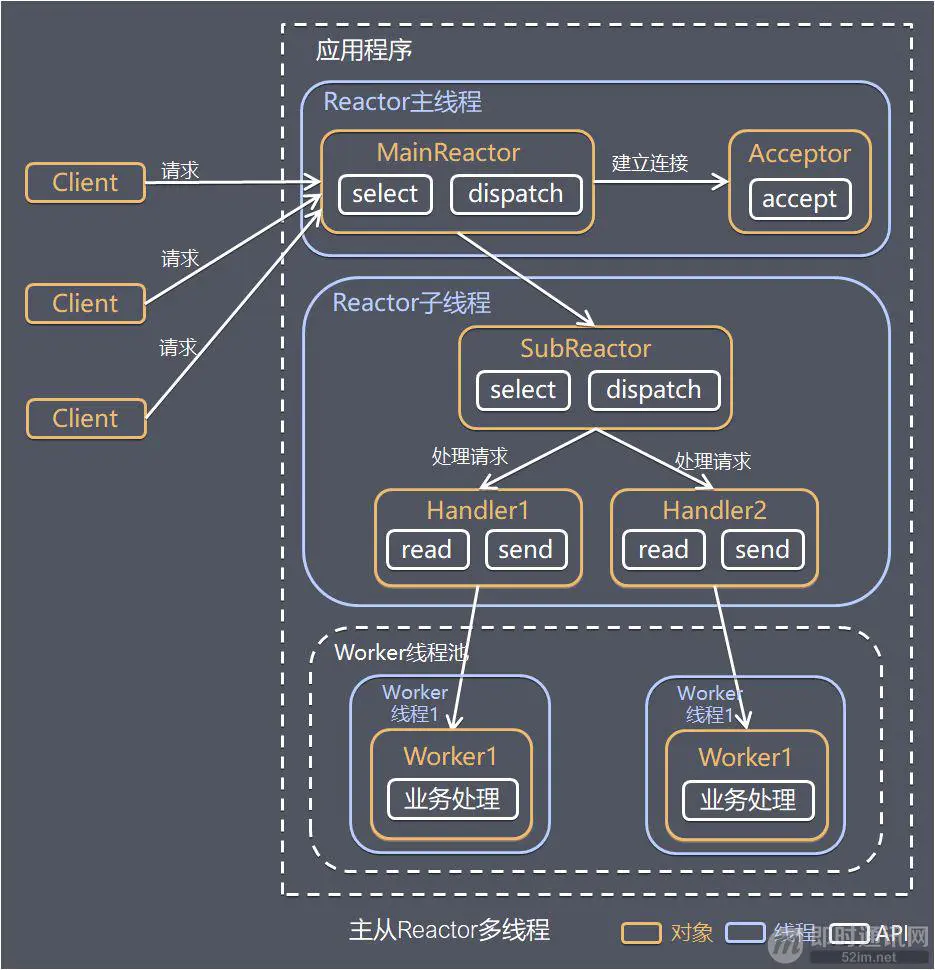
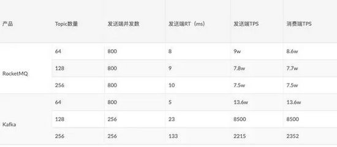

# 常用组件设计对比

```
本篇主要对比MySQL、Redis、ES、ZK、Kafka等在某些设计点上的异同。以及常规应用上的关联对比
```

## 持久化

```
持久化主要用于故障恢复的，故障恢复是一个可靠组件的重要特性，主要对比Mysql（Innodb）、ES、Redis、ZK、Kafka
```
| 组件 | 实现原因 | 实现方法 | 刷盘时机 |
| ---- | ---- | ---- |----|
| MySQL（InnoDB） | 为了解决磁盘瓶颈，数据会写入Buffer Pool内存区域，Buffer Pool中的脏页占比超过10%才会刷盘，存在脏页的情况下出现故障会导致内存数据丢失 | 采用WAL机制，先落redolog日志，通过redolog恢复数据 | redolog也是先写入redolog buffer，每秒钟刷盘一次，另外还有三种刷盘策略可配置，默认会选择事务提交时强制刷盘，保证数据的绝对安全 |
| ES | 为了解决磁盘瓶颈，数据会写入Buffer内存区域，Buffer 中的数据每秒刷新到操作系统的page cache中生成segment，存在page cache中的时间会比较久，数据未刷盘的情况下出现故障会导致内存数据丢失 | 采用WAL机制，先落translog日志，通过translog恢复数据 |translog也是先写入缓存中，每5秒钟刷盘一次。可以设置每次写入都强制刷盘translog，但是性能会比较慢。需要根据自身的需求来合理定制方案。|
| Redis | Redis是内存存储，本身就是与内存打交道，如果出现故障会丢失所有数据。 | RDB和AOF结合的形式来实现。RDB相当于内存快照，AOF相当于命令执行的log文件。与ZK类似 |RDB有固定的的触发场景和配置。<br />AOF也是先写入缓存，提供了三种刷盘机制，默认是1s刷一次。因为Redis是缓存，不建议作为数据存储，为了性能，丢失1s中的数据是可以接受的，重启后丢失的数据下次访问时再加载到缓存中即可|
| ZK | zk也是内存交互，如果出现故障会丢失所有数据 | 快照和事务日志文件结合的形式，与Redis方案一致 |可以通过配置snapCount配置每间隔事务请求个数，生成快照（ 为了避免集群中所有机器在同一时间进行快照，实际的快照生成时机为事务数达到 [snapCount/2  + 随机数(随机数范围为1 ~ snapCount/2 )] 个数时开始快照）<br />事务日志采用一次性开辟64M空间的文件，每次追加文件内容的形式写log|
| Kafka | Kafka需要支持历史消息读取，持久化是必然。虽然kafka没有自己在内存管理消息，但是使用了page cache，在消息消费及时的情况下，速度与内存操作没有差异，俗称空中接力，这是设计上的亮点。 | Kafka在写入数据时是先顺序写入到操作系统的page cache中。在消费数据时也是利用零copy从page cache中读数据。 |如果page cache的数据没落盘突然断电会导致数据丢失，page cache的落盘并没有采用每个消息都落盘的机制，而是用副本确认机制来确保消息同步到了follower副本上保证数据不丢（同时断电同时都没刷盘也有可能丢）。另外可以通过log.flush.interval.messages和log.flush.interval.ms来配置pagecache的flush间隔|


## 解决磁盘瓶颈
```
涉及到磁盘存储的组件，如何解决磁盘的IO瓶颈是设计的核心，甚至衍生出来的很多东西最终也是源自解决磁盘瓶颈，例如redolog等等。常见的解决磁盘瓶颈的方法有:设置内存buffer，启用pagecache，顺序追加文件，提前开辟文件空间。为了buffer区域的数据安全性，往往再增加log环节，log可以顺序存储，减少随机IO
```
| 组件 | 组件设计场景 | 实现方法 |
| ---- | ---- | ------ |
| MySQL（InnoDB） | 强事务性，读写皆频繁，不允许存在出错空间。随机IO的需求多 | 1.使用B+树做为索引的数据结构，减少节点层级，同级节点首尾相连有利于顺序遍历<br /> 2.增加buffer pool层，读写数据尽量在内存中操作，减少磁盘交互。策略性刷盘，例如脏页数量大于10%等<br /> 3.为redolog开启buffer和pagecache，策略性刷盘，文件顺序存储 |
| ES | 不支持事务，设计场景是搜索，主要用于读多写少更新更少的场景。允许适当的读延时，甚至允许故障情况下丢失极少数据 | 1.使用多个segment文件存储索引，segment是不可变的，如果数据出现变动会有额外的.del文件存储。segment合并会减少文件数量，合并过程不影响读写<br />2.为segment增加buffer以及pagecache层，buffer数据每1s刷到pagecache<br />3.为translog增加buffer层，每5s刷盘，会存在数据丢失的情况，也可以强制每次刷盘 |
| ZK | 不能算严格的事务，zk的事务是指对节点的增删改生成事务id。不允许出现数据丢失，严格保证数据安全性 | 事务log是通过提前开辟磁盘空间，顺序追加来实现的 |
| Redis | 不严格事务。面向缓存场景，允许丢失数据，不建议作为唯一的存储服务 | AOF文件是顺序存储，有buffer区域，默认是每秒刷盘 |
| Kafka | 支持事务。确保消息不能丢失 | kafka消息文件是顺序存储，也增加了pagecache，并且有副本保证数据的安全性。另外可以通过log.flush.interval.messages和log.flush.interval.ms来配置pagecache的flush间隔 |


## 集群

#### 节点发现，节点类型
| 组件 | 常用集群组件 | 节点发现方法 | 节点类型 |
| ---- | ---- | ------ | ---- |
| MySQL | 客户端分片：阿里的TDDL、Sharding-JDBC、蘑菇街的TSharding、携程的Ctrip-DAL<br/>代理分片：Sharding-Proxy、阿里的Cobar、Mycat | 直接配置数据源，没有自动发现 | 分片的全部是主库，主库挂从库 |
| Redis | 客户端分片：Redis cluster<br/>代理分片：twproxy，codis | 以Redis cluster为例，创建集群时就指定机器对应的槽位，无自动发现 | 分片的全部是主库，主库挂从库 |
| ES | - | 有两种方法（对比这几种常用的组件，只有ES是自动发现节点）<br/>1.配置相同的集群名在局域网内广播，发现就抱团<br/>2.通过文件配置部分机器的ip列表，互相传播并把自己发现的节点告诉已发现节点 | Master节点：管理集群的变更，如创建/删除索引、节点健康状态检测、节点上/下线等<br/>数据节点：用于数据落地存储，执行数据增删改查操作<br/>协调节点：负责接收请求，转发指令，聚合结果<br/>Ingest节点：ingest 节点可以看作是数据前置处理转换的节点，支持 pipeline管道设置，可以使用 ingest 对数据进行过滤、转换等操作 |
| ZK | - | 把所有机器的ip列表配置到每台机器上，建议此配置单独管理，确保所有机器的配置一致，无自动发现 | Leader：响应读写请求，发起提案，commit提案<br/>Follower：响应读请求，转发写请求到Leader |
| Kafka | - | 不同的broker配置到相同的zk地址即可，依赖zk发现集群 | Broker Controller：1.监听zk管理元数据，感知其他Broker的去留。2.负责topic分区和副本的状态的变化，副本Leader选举，执行重分配分区。<br/>其他Broker：不需要监听zk |

#### 选主
| 组件| 主的类型及职责 | 选主方法 |
| ---- | ---- |  ---- |
| ZK | leader节点：*负责进行投票的发起和决议* | ZAB协议，通过节点投票的方式，投票信息包括[zxid,sid]，zxid是事务id，越大越好，如果zxid相同则比较sid，越大越好。详细请参考share/zookeeper |
| ES | master节点：维护ES集群的元数据，比如创建删除索引；监控其他的节点，比如对故障节点进行剔除和协调故障恢复工作；此外master节点还负责分片具体分配给哪些节点。<br/>主副本：为了高可用，一份数据有多个副本，一个主副本多个从副本，相当于数据库中的主库和从库。但是ES本身是master节点来决定谁是主副本，并不由副本自己决定，这与Redis不同的 | 先根据节点的clusterStateVersion（包含了整个群集中所有分片的元信息）比较，clusterStateVersion越大，优先级越高。clusterStateVersion相同时，进入compareNodes，其内部按照节点的Id比较(Id为节点第一次启动时随机生成)。通过设置最小主节点数大于一半来防止脑裂，投票数要大于等于最小主节点数 |
| Kafka | Kafka中主的概念较多<br/>1.Broker Controller：这是机器从面的主节点，类似ZK leader和ES的master节点。1.监听zk管理元数据，感知其他Broker的去留。2.负责topic分区和副本的状态的变化，副本Leader选举，执行重分配分区。<br/>2.副本Leader：这是数据副本层面的leader，类似于ES的主副本。要负责同步数据到Follower本。由Controller从AR中挑选首个在ISR中的副本，作为新副本Leader。与ES的模式相同<br/>3.Group Coordinator：严格意义上不能算是主的概念。每个consumer group 都会选择一个broker作为自己的coordinator，他是负责监控整个消费组里的各个分区的心跳，以及判断是否宕机，和开启rebalance的。<br/>4.消费组leader：消费组的leader负责Rebalance过程中消费分配方案的制定 | 对应左侧不同的主，方案如下：<br/>1.依赖zk，最先在zk上创建临时节点/controller成功的Broker就是Controller<br/>2.Controller从AR中挑选首个在ISR中的副本，作为新副本Leader<br/>3.  首先对group id 进行hash，接着对分区数量进行取模，找到分区以后，这个分区所在的broker机器就是coordinator机器<br/>4.Group Coordinator把第一个加入消费组的消费者选为消费组的leader。如果leader退出，则重新选举。在组协调器中消费者的信息是以HashMap的形式存储的，其中key为消费者的member_id，而value是消费者相关的元数据信息。而leader的取值为HashMap中的第一个键值对的key（等同于随机） |
| Redis cluster | 这是去中心化的集群，所以不存在传统意义上的leader节点。每个分片都有一个master节点，当master节点下线时，对应的从节点会选出新的master节点。相当于其他组件中的主副本 | 从节点用Raft算法选主 |


#### 数据分片、转发、复制
| 组件| 分片算法 | 数据转发 | 数据复制 | 数据一致性 |
| ---- | ---- |  ---- | ---- | ---- |
| MySQL | 由客户端自己定，通常有hash取模和range分区 | - | 存在主从复制 | 从库会有延时，最终一致性 |
| Redis cluster | 在集群创建时，已经配置好了机器与槽位的对应关系。客户端会从服务节点拿到对应关系的元数据，直接定位到分片机器 | 只有在数据迁移过程中，会存在转发的情况 | 存在主从复制 | 从库会有延时，最终一致性 |
| ES | 由服务端转发，hash(<文档id>) % <主分片数量> 根据结果映射到不同的分片<br/>副本数量可以增加但是分片数量不能变更，因为数据是取模路由到分片的 | 由协调节点转发增删改查请求，并且汇集结果返回客户端 | 存在主副本复制 | 1. 由于数据是先写入buffer，而索引是在segment生成，所以写入之后并不能立刻读到，除非buffer的数据refresh到了cache。<br/>要解决这个层面的读写一致性，需要在写入后，代码调用refresh方法强制写入cache<br/>2. 主副本层面的复制延迟<br/>es提供了三种写一致性的设置：consistency：one、all、quorum<br/>one：写入主节点就算成功<br/>quorum（默认）：write的时候，W>N/2，即参与写入操作的节点数W，必须超过副本节点数N的一半。如果是quorum策略，则读取要保证一致性的话，就得使用read quorum，读取N个副本中的W个然后仲裁得到最新数据。或者是指定从primary上面去读<br/>all：所有副本都写入才算成功 |
| Kafka | 由客户端指定，默认是Utils.toPositive(Utils.murmur2(keyBytes)) % numPartitions | - | 存在主副本复制 | 副本不提供服务，一致性不是问题 |
| ZK | 无分片 | Follower节点在接收到写请求时会转发到master节点 | 存在master和follower节点的复制 | 顺序一致性和最终一致性 |

## 线程模型
#### Redis
```
		Redis 基于 Reactor 模式开发了自己的网络事件处理器 - 文件事件处理器
（file event handler，后文简称为 FEH），而该处理器又是单线程的，所以 redis 设计为单线程模型。
		Redis 作者 antirez 在 RedisConf 2019分享时曾提到：Redis 6 引入的多线程 IO 特性对性能提升至少是一倍以上。默认情况下，只针对写操作启用IO线程，如果读操作也需要的话，需要在配置文件中进行配置，因为读操作性能提升不明显。
		从 Redis 自身角度来说，因为读写网络的 read/write 系统调用占用了 Redis 执行期间大部分 CPU 时间，瓶颈主要在于网络的 IO 消耗。redis6.0充分利用多核cpu的能力分摊 Redis IO 读写负载
		※6.0之前单线程指的是处理客户端请求是单线程的。但是对于持久化，主动同步，大key处理，数据过期等功能都是其他线程完成。6.0之后的多线程仅仅是IO模块，命令处理模块仍然是单线程。
```
**Redis6之前的单线程模型**
 
 

**Redis6的多线程模型**
```
主线程也参与IO线程的任务，只是在IO方面多了几个线程来分担IO的操作，这个与主从Reactor模型不完全一致
```


#### kafka
```
kafka采用的主从Refactor多线程模型，但并未直接使用netty，因为netty本身太庞大，kafka不需要通信方面的高扩展能力
1. Acceptor：1个接收线程，负责监听新的连接请求，同时注册OP_ACCEPT 事件，将新的连接按照"round robin"方式交给对应的 Processor 线程处理
2. Processor：N个处理器线程，其中每个 Processor 都有自己的 selector，它会向 Acceptor 分配的 SocketChannel 注册相应的 OP_READ 事件
3. KafkaRequestHandler：M个请求处理线程，包含在线程池KafkaRequestHandlerPool内部
4. RequestChannel：其为Kafka服务端的请求通道，该数据结构中包含了一个全局的请求队列 requestQueue和多个与Processor处理器相对应的响应队列responseQueue，提供给Processor与请求处理线程KafkaRequestHandler和KafkaApis交换数据的地方
```


#### dubbo
```
Dubbo的线程模型其实就是netty的线程模型，主从Refactor多线程模型，下图中的Reactor子线程应该是多个
Reactor线程模型分为：
单 Reactor 单线程模型
单 Reactor 多线程模型
主从 Reactor 多线程模型
```



## 分布式锁

| 组件  | 实现方法                                                     | 优缺点                                                       |
| ----- | ------------------------------------------------------------ | ------------------------------------------------------------ |
| ZK    | 顺序临时节点，第一个节点拿到锁，其他的监听上一个节点。如果出现变更则拉取临时节点判断是否拿到锁，如果没有再次监听上一个节点。<br />可以直接使用curator框架的实现 | 安全性高，但是性能偏低，不适合高并发的场景，本身对接点的操作就涉及到几台机器的同步 |
| Redis | setNx或者lua脚本<br />可以直接使用Redssion的实现，用到了lua脚本，支持重入，还有看门狗自动检测延时过期机制 | 性能高，但不完善。不能用于安全性极高的场合。在主从同步时主节点挂掉后，数据丢失后，可能导致同时获取到锁。<br />拿到锁的客户端如果挂掉，会导致锁延迟释放 |


## 消息队列

| 组件     | 实现方法                            | 优缺点                                                       |
| -------- | ----------------------------------- | ------------------------------------------------------------ |
| Kafka    | 专业的分布式消息系统                | 高吞吐量，高可用，支持partition。功能简单，主要服务于高吞吐量的流式处理 |
| RocketMQ | 专业的分布式消息系统，参考kafka设计 | 为金融互联网领域而生，对于可靠性要求很高的场景。功能强大，有很多kafka没有的功能，例如：延时消息、定时消息、消息重试、消费组广播和集群消费等。 |
| Redis    | Stream                              | 性能高，不支持天然的partition，存在丢数据的风险，不能消费历史数据，消息不宜太大<br />Redis适合于对性能极高的小型快餐消息，有一定的安全容忍度 |
```
kafka与RocketMQ的吞吐量比较如下表，topic数量越少kafka性能越好，topic数量越多性能会急剧下降。在做业务系统时优选RocketMQ，因为业务复杂，topic数量相对较多，并且RocketMQ功能强大。如果是数据处理层面优选kafka，因为场景单一，吞吐量高。
```
 


