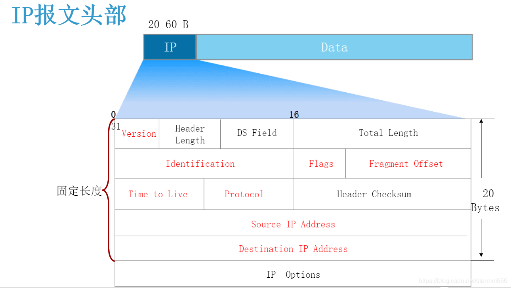
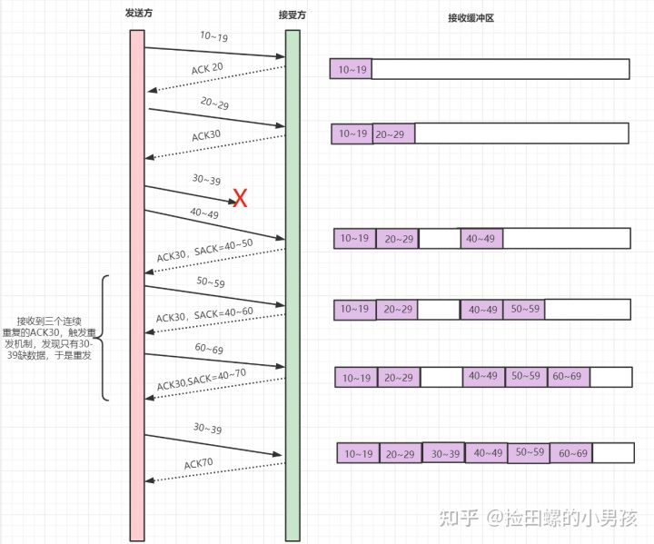
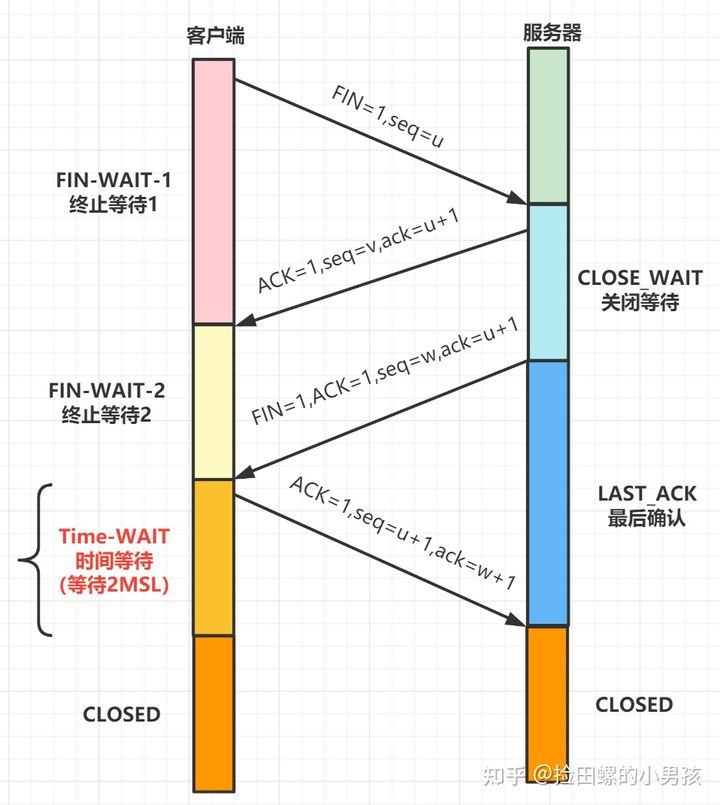
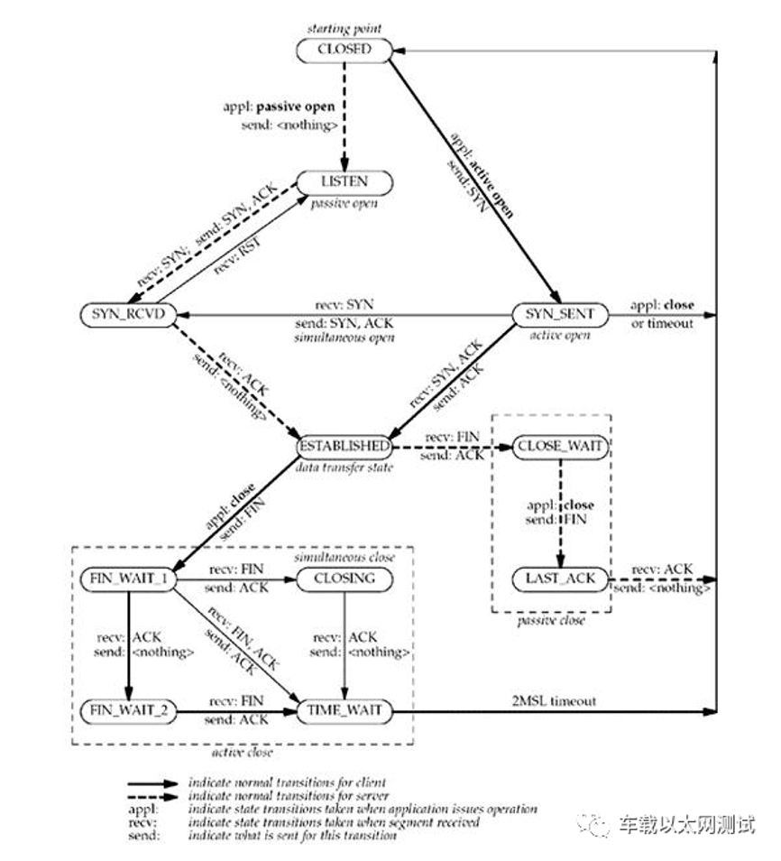
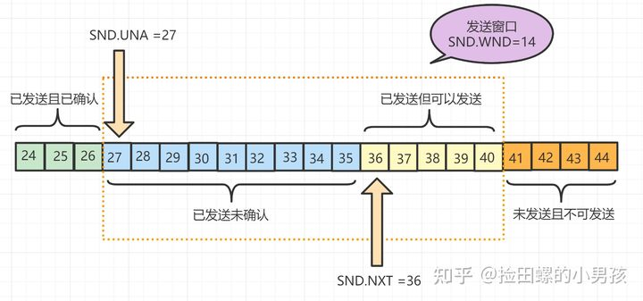
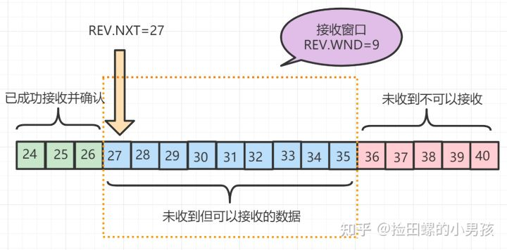
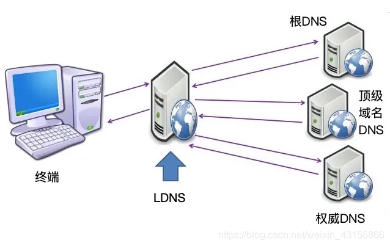
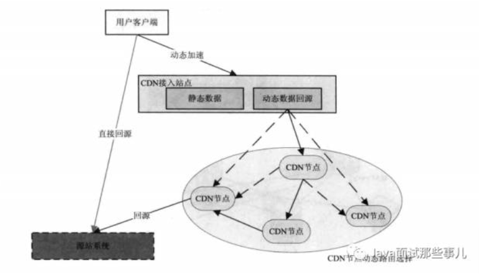
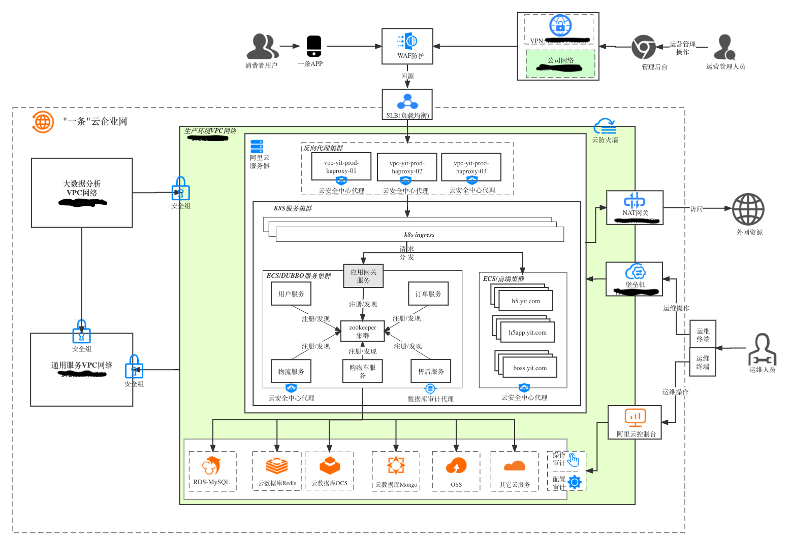

## TCP/IP
1. 简述OSI网络模型和TCP/IP网络模型
 

2. 简述下IP报文的结构？
 

3. 简述下TCP的报文结构？
 

4. 三次握手和四次挥手


5. 两次握手会有什么问题
```
		当客户端进行第一次握手时，发送了一个报文段，但是这个报文段因为网络的问题，迟迟没有到，这时，客户端又会再一次发送一个连接请求的报文段给服务端，这次成功接收，两者建立连接，并通信结束，关闭连接。这之后，因为网络延迟的那个报文段传到了服务端那里，服务端又以为客户端要建立新的连接，于是就同意了，向客户端发送确认。因为是二次握手，所以服务端后续要做的事情，就是等待客户端发送的消息，但是客户端是不会理会服务端传来的确认，所以服务端就会一直在等待客户端的数据，白白浪费了资源
```

6. TCP的延迟确认机制
```
		当发送没有携带数据的 ACK，它的网络效率也是很低的，因为它也有 40 个字节的 IP 头 和 TCP 头，但却没有携带数据报文。为了解决 ACK 传输效率低问题，所以就衍生出了 TCP 延迟确认。

TCP 延迟确认的策略：
1.当有响应数据要发送时，ACK 会随着响应数据一起立刻发送给对方
2.当没有响应数据要发送时，ACK 将会延迟一段时间，以等待是否有响应数据可以一起发送
3.如果在延迟等待发送 ACK 期间，对方的第二个数据报文又到达了，这时就会立刻发送 ACK
```

7. TCP的慢启动特性
```
		慢启动体现了一个试探的过程，刚接入网络的时候先发包慢点，探测一下网络情况，然后在慢慢提速。不要一上来就拼命发包，这样很容易造成链路的拥堵，出现拥堵了在想到要降速来缓解拥堵这就有点成本高了，毕竟无数的先例告诫我们先污染后治理的成本是很高的
```

8. 一次TCP连接的时间消耗大概在什么量级?
```
国内中等距离一次大概在100ms左右，主要耗时花在延迟确认机制上
```

9. TCP与UDP的区别
```
UDP效率高传输不可靠，UDP是无连接的
TCP传输可靠效率低，TCP面向连接的
TCP是点对点连接的，UDP一对一，一对多，多对多都可以
```

10. TCP是如何保证可靠性的
```
每个包都有对应的ACK包来确认
```

11. TCP重传机制
 

12. TIME-WAIT状态为什么需要等待2MSL
```
1个 MSL 保证四次挥手中主动关闭方最后的 ACK 报文能最终到达对端
1个 MSL 保证对端没有收到 ACK 那么进行重传的 FIN 报文能够到达
```
 
 

13. MSL：Maximum Segment Lifetime 最大段生命周期是什么？
```
		每个TCP实现必须选择一个MSL。它是任何报文段被丢弃前在网络内的最长时间。这个时间是有限的，因为TCP报文段以IP数据报在网络内传输，而IP数据报则有限制其生存时间的TTL时间。RFC 793指出MSL为2分钟，现实中常用30秒或1分钟
```

14. TCP滑动窗口是什么
```
		TCP 发送一个数据，需要收到确认应答，才会发送下一个数据。这样有个缺点，就是效率会比较低。为了解决这个问题，TCP引入了窗口，它是操作系统开辟的一个缓存空间。窗口大小值表示无需等待确认应答，而可以继续发送数据的最大值。TCP头部有个字段叫win，也即那个16位的窗口大小，它告诉对方本端的TCP接收缓冲区还能容纳多少字节的数据，这样对方就可以控制发送数据的速度，从而达到流量控制的目的。
```
```
TCP 滑动窗口分为两种: 发送窗口和接收窗口。发送端的滑动窗口包含四大部分，如下
发送端：已发送且已收到ACK确认、已发送但未收到ACK确认、未发送但可以发送（图中有错别字）、未发送也不可以发送
接收端：已成功接收并确认、未收到数据但可以接收、未收到数据并不可以接收的数据
```
 
 

15. TCP的粘包和拆包
```
		要发送的数据小于TCP发送缓冲区的大小，TCP将多次写入缓冲区的数据一次发送出去；接收数据端的应用层没有及时读取接收缓冲区中的数据，将发生粘包。要发送的数据大于TCP发送缓冲区剩余空间大小，将会发生拆包。
解决方案：
1.发送端将每个数据包封装为固定长度
2.在数据尾部增加特殊字符进行分割
3.将数据分为两部分，一部分是头部，一部分是内容体；其中头部结构大小固定，且有一个字段声明内容体的大小
```

16. 集线器、交换机、路由器分别做什么的？
```
集线器：工作在物理层，用广播的形式把数据传播给其他机器，搭建局域网
交换机：工作在数据链路层，可以根据MAC地址发送到指定的机器，搭建局域网
路由器：工作在网络层，通过IP把数据包路由到指定的机器，用于连接局域网
```

17. ARP协议是什么？
```
当源和目的主机处于同一个局域网时，源主机知道目的主机的IP地址时，源如何利用已知的目的IP地址确认其MAC地址呢？
ARP协议构造了网络层的IP地址和链路层MAC地址的映射关系。网络中的每个结点都维护了一个ARP表
```

18. OSPF协议是什么?
```
路由协议OSPF全称为Open Shortest Path First，也就是开放的最短路径优先协议。路由节点向相邻的节点广播自己知道的路由节点的状态图谱，最终每个节点都掌握了所有节点的分布，用最短路径算法来规划数据包的下一跳即可。
```

## DNS
1. DNS了解吗？
```
DNS是域名解析服务器，用来将域名解析成IP
```
2. DNS的工作流程
```
		浏览器会先看自身有没有对这个域名的缓存，如果有，就直接返回，如果没有，就去问操作系统，操作系统也会去看自己的缓存，如果有，就直接返回，如果没有，再去hosts文件看，也没有，才会去问LDNS（本地DNS，本地运营商提供的）
		LDNS会先看看自己有无域名的A记录，有直接返回，无再看看有没有各级域名的NS缓存，有的话直接到对应服务器解析。如果都没有再问根DNS服务器要，然后逐级向下查询
```
 

3. A记录、CNAME、NS等是什么
 

4. DNS劫持是什么，如何防止DNS劫持
```
		指攻击者利用其他攻击手段，篡改了某个域名的解析结果，使得指向该域名的IP变成了另一个IP，导致对相应网址的访问被劫持到另一个不可达的或者假冒的网址，从而实现非法窃取用户信息或者破坏正常网络服务的目的。
		DNS劫持并不好解决，因为解析服务器不在自己手里并不可控。
		HTTPDNS是一种解决方案，现在大厂的云服务也都支持。就是以HTTP接口的形式，对外提供通过域名查询ip的服务。例如：http://203.107.1.33/xx/d，其中，203.107.1.33是一个公网ip，是这个httpdns服务的对外ip，参数呢，主要就是两个：host和ip，host就是你要查的域名，ip是客户端的ip（如有，如果自身取不到自己的对外出口ip，服务也会默认取socket中的client ip，即客户端ip），所以，这个接口就模拟了dns服务器的dns查询功能。
		适合自己发起HTTP请求的场景，例如APP内部。
```

## CDN
1. CDN原理

```
将静态资源全国化分散部署，把请求转到离客户最近的服务器上，可以起到请求加速的作用。通常用于静态资源加速
```

2. GSLB

```
GSLB是全局负载均衡的意思，对分散在不同的地区的服务器做全局调度，是CDN的核心部分
```

3. 调度方式

```
DNS调度、302调度、IP欺骗调度（原理参考技术分享）
```

4. 如何防止CDN资源被盗用？

```
通过校验refer或者使用时间戳防盗链
[时间戳防盗链](https://developer.qiniu.com/fusion/kb/1670/timestamp-hotlinking-prevention)
```

5. CDN动态加速了解吗？
```
CDN的动态加速是在CDN的DNS解析过程中，通过动态的链路探寻出一条最优的路径，然后通过DNS的调度将所有请求调度到选定的这条路径上回源，从而加速用户访问速率
```
 


## HTTP
1. HTTP的传输层是什么协议

```
3.0之前是TCP，3.0是UDP
```

2. 介绍下常用的状态码

```
200:请求成功
301:资源被永久转移到其它URL
302:资源被临时转移到其它URL
404:请求的资源不存在(4打头的是客户端问题)
500:内部服务器错误(5打头的是服务器问题)
```

3. 有哪些请求方法（注意POST和PUT的语意区别）

| 序号 | 方法    | 描述                                                         |
| :--- | :------ | :----------------------------------------------------------- |
| 1    | GET     | 请求指定的页面信息，并返回实体主体。                         |
| 2    | HEAD    | 类似于 GET 请求，只不过返回的响应中没有具体的内容，用于获取报头 |
| 3    | POST    | 向指定资源提交数据进行处理请求（例如提交表单或者上传文件）。数据被包含在请求体中。POST 请求可能会导致新的资源的建立和/或已有资源的修改。 |
| 4    | PUT     | 从客户端向服务器传送的数据取代指定的文档的内容。             |
| 5    | DELETE  | 请求服务器删除指定的页面。                                   |
| 6    | CONNECT | HTTP/1.1 协议中预留给能够将连接改为管道方式的代理服务器。    |
| 7    | OPTIONS | 允许客户端查看服务器的性能。                                 |
| 8    | TRACE   | 回显服务器收到的请求，主要用于测试或诊断。                   |
| 9    | PATCH   | 是对 PUT 方法的补充，用来对已知资源进行局部更新 。           |

4. Connection: Keep-Alive 有什么用

```
代表要保持连接，允许多个请求共用一个连接。可以指定超时时间，多久没请求就可以关掉
```

5. 管线化是干嘛的

```
Keep-Alive只能在同一个连接上让多个请求依次发出。管线化可以在不等待返回的情况下就发出多个请求，但是要按请求顺序解析响应。
```

6. HTTP请求有哪几种超时时间

```
连接超时[ConnectTimeout]
响应超时[SocketTimeout]
连接池中获取连接超时[ConnectionRequestTimeout]
```

7. URL长度有限制吗

```
HTTP协议中并未规定长度限制
url的长度实际上是受到browser的限制，如IE限定url长度为2083字节，opera 是4050， Netscape 是8192，等等。既然是browser对URL长度的限制，那么不管是GET方法还是POST方法都存在这个限制。
那么对于server端，实验表明Server端对于URL的长度也是有限制的，具体要看实际使用的组件。
```

8. cookies机制和session机制的区别是什么

```
1）cookies数据保存在客户端，session数据保存在服务端；
2）cookies可以减轻服务器压力，但是不安全，容易进行cookies欺骗；
3）session安全一点，但是占用服务器资源，session的实现通常要依赖cookie
```

9. HTTP报文大概什么样

```
请求报文有4部分组成:
请求行
请求头部
空行
请求体

响应报文有4部分组成:
响应行
响应头
空行
响应体
```

10. HTTPS是解决什么问题的

```
防止中间人攻击
```

11. HTTPS握手流程

```
TCP三次握手结束之后。还有四次握手，一共七次握手。特殊情况下第三次握手可以跟后边的握手合并在一起，不做讨论。
具体如下：
TCP三次握手
客户端问服务端要证书
服务端返回证书
客户端用公钥加密随机数
服务端用私钥解密随机数，返回后握手完成
```

12. HTTPS证书是干嘛的

```
主要是用其中的公钥信息，用非对称加密的方式交换后续“对称加密的key”
证书本身是为了验证公钥有效性的，具体原理见文档末的参考文档
```

13. HTTPS有什么缺点
```
相对HTTP更加耗时
也更加消耗CPU资源，需要加解密
```

14. HTTPS正文交互为什么使用对称加密
```
对称加密更快，对服务器压力更小
```

15. 了解HTTP2和HTTP3吗
```
HTTP2解决了响应必须顺序返回的情况，防止一个耗时的响应影响后续的响应。HTTP2可以允许响应不按请求顺序返回，具体是通过给请求和响应做流编号来识别响应和请求的关系。
HTTP3是基于UDP协议，解决了TCP存在包丢失重传时影响解析后续数据包的问题，也叫行头阻塞问题
```

## SLB
1. 画下你们公司的运维架构/网络拓扑
 

2. 七层负载均衡和四层负载均衡有什么区别
```
以HTTP服务为例来说：
七层负载均衡是工作在网络的应用层，需要与客户端和server同时保持连接
四层负载均衡是工作在网络的传输层（TCP层面），只负责转发包即可，是一个三角传输的过程
```

## 高级 TODO下轮深入补充
1. 以太网、因特网是什么？
```
以太网可以简单理解为我们的局域网
因特网简单理解为公网
```

2. 说下在浏览器敲入baidu.com后发生的事情

第一轮动态请求，第二轮静态资源请求
数据在不同网络层次的流转


## 参考资料
[面试必备！TCP协议经典十五连问！](https://blog.csdn.net/l688899886/article/details/126039769)
[35 道 TCP 和 UDP 面试题（含答案+图解版）](https://zhuanlan.zhihu.com/p/494905923)
[Https的CA证书是如何验证其有效性的？](https://blog.csdn.net/wyn_365/article/details/121249426)
[【计算机网络】MAC地址、IP地址以及ARP协议](https://blog.csdn.net/qq_49893586/article/details/125246018)