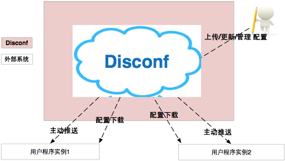
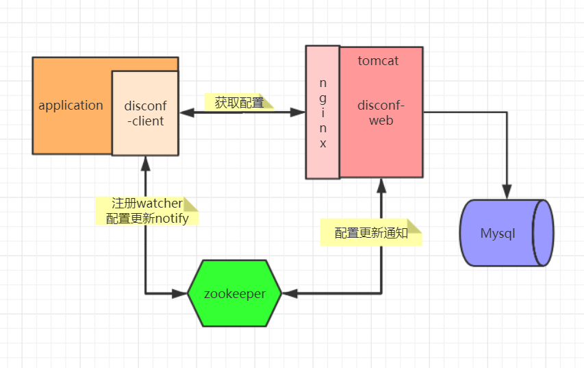
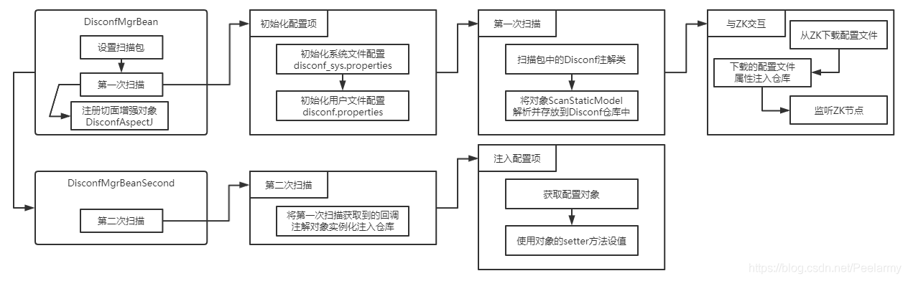
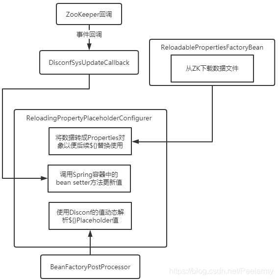

## Disconf实现原理

Disconf 是一个**分布式**配置管理平台（Distributed Configuration Management Platform），专注于各种分布式系统配置管理的通用组件/通用平台，提供统一的配置管理服务，是一套完整的基于zookeeper的分布式配置统一解决方案

下文所提到的配置仓库是指Disconf Client端的本地配置仓库，在DisconfCenterStore实例中用Map存储。

### 架构设计
 



* Disconf-client
  * 配置仓库容器模块：统一管理用户实例中本地配置文件和配置项的内存数据存储
  * 配置reload模块：监控本地配置文件的变动，并自动reload到指定bean
  * 扫描模块：支持扫描所有disconf注解的类和域
  * 下载模块：restful风格的下载配置文件和配置项
  * watch模块：监控远程配置文件和配置项的变化
  
* Disconf-web
  * 配置存储模块：管理所有配置的存储和读取
  * 配置管理模块：支持配置的上传、下载、更新
  * 通知模块：当配置更新后，实时通知使用这些配置的所有实例
  * 配置自检监控模块：自动定时校验实例本地配置与中心配置是否一致
  * 权限控制：web的简单权限控制

### Disconf-client原理分析

从启动流程入手开始分析，disconf.xml配置

```xml
    <!-- 使用disconf必须添加以下配置 -->
    <!-- 初始化Disconf-client -->
    <!-- 初始化Core模块，并极联初始化Watch，Fetcher，Restful模块 -->
    <!-- 配置文件和配置项的数据会注入到配置仓库里 -->
    <!-- 使用watch模块为所有配置关联ZK上的结点,如果节点不存在，客户端会自己创建节点 -->
    <bean id="disconfMgrBean" class="com.baidu.disconf.client.DisconfMgrBean"
          destroy-method="destroy" lazy-init="false">
        <property name="scanPackage" value="com.xxx"/>
    </bean>

    <!-- 主要是加载调用回调函数,进行配置的后续动态处理，起到锦上添花的作用，可有可无 -->
    <bean id="disconfMgrBean2" class="com.baidu.disconf.client.DisconfMgrBeanSecond"
          init-method="init" destroy-method="destroy" lazy-init="false">
    </bean>
    <!--实际上配置文件远程托管到disconf-web中用以上两个配置就足够了，下边的是结合本地配置-->
    <!-- 使用托管方式的disconf配置(无代码侵入, 配置更改会自动reload)-->
    <bean id="configproperties_disconf"
         class="com.baidu.disconf.client.addons.properties.ReloadablePropertiesFactoryBean">
        <property name="locations">
            <list>
                <value>classpath:/config.properties</value>
            </list>
        </property>
    </bean>

    <!--具有reloadable 的 property bean 扩展了 DefaultPropertyPlaceholderConfigurer 特性如下-->
    <!--1. 启动时 监控 动态config，并维护它们与相应bean的关系-->
    <!--2. 当动态config变动时，此configurer会进行reload -->
    <!--3. reload 时会 compare config value, and set value for beans-->
    <bean id="propertyConfigurer"
class="com.baidu.disconf.client.addons.properties.ReloadingPropertyPlaceholderConfigurer">
        <property name="ignoreResourceNotFound" value="true" />
        <property name="ignoreUnresolvablePlaceholders" value="true" />
        <property name="propertiesArray">
            <list>
                <ref bean="configproperties_disconf"/>
            </list>
        </property>
    </bean>

```



#### DisconfMgrBean

  * 实现了BeanDefinitionRegistryPostProcessor、PriorityOrdered接口

  * 初始化Order是最高优先级的，保证在第二次扫描实例之前实例化

  * Spring扫描了所有的Bean信息后，在所有Bean初始化（init）之前，DisconfMgrBean的postProcessBeanDefinitionRegistry方法将被调用，Disconf-Client会进行第一次扫描。

    所做的工作
    * 初始化Disconf-client自己的配置模块。

    * 初始化Scan模块。

    * 初始化Core模块，并极联初始化Watch，Fetcher，Restful模块。

    * 扫描用户类，整合分布式配置注解相关的静态类信息至配置仓库里。

    * 执行Core模块，从disconf-web平台上下载配置数据：配置文件下载到本地，配置项直接下载。

    * 配置文件和配置项的数据会注入到配置仓库里。

    * 使用watch模块为所有配置关联ZK上的结点,如果节点不存在，客户端会自己创建节点

* 注册切面，通过注解注入的字段是通过切面拦截返回配置值的

#### DisconfAspectJ

* 注册DisconfAspectJ切面，用来获取配置数据时进行拦截
* 该切面是 @DisconfItem 等注解配置的实现方案
```java
    @Override
    public void postProcessBeanDefinitionRegistry(BeanDefinitionRegistry registry) throws BeansException {

        ......

        // register java bean
        registerAspect(registry);
    }
    
    private void registerAspect(BeanDefinitionRegistry registry) {

        GenericBeanDefinition beanDefinition = new GenericBeanDefinition();
        beanDefinition.setBeanClass(DisconfAspectJ.class);
        beanDefinition.setLazyInit(false);
        beanDefinition.setAbstract(false);
        beanDefinition.setAutowireCandidate(true);
        beanDefinition.setScope("singleton");

        registry.registerBeanDefinition("disconfAspectJ", beanDefinition);
    }

```
* disconf.enable.remote.conf=true, 则优先从仓库获取配置数据，否则从实体类中获得
* 当仓库中不存在该值时，会直接获取当前属性的值


#### DisconfMgrBeanSecond
主要是加载调用回调函数，进行配置的后续动态处理，如果不需要回调则可以不用

#### 加载流程图
```sequence
title: Disconf-clent启动流程
participant DisconfMgrBean as firstBean
participant DisconfMgr as manager
participant DisconfMgrBeanSecond as secondBean

firstBean->firstBean:1、postProcessBeanDefinitionRegistry()
firstBean->manager:2、firstScan() 第一次扫描 静态扫描
manager->manager:3、scanMgr.firstScan 第一次扫描配置并入库保存
manager->manager:4、disconfCoreMgr.process 获取数据/注入/Watch
secondBean->secondBean:5、init()
secondBean->manager:6、DisconfMgr.getInstance().secondScan 第二次扫描, 动态扫描
manager->manager:7、scanMgr.secondScan() 扫描回调函数
manager->manager:8、disconfCoreMgr.inject2DisconfInstance() 获取数据/注入/Watch

```

**监听下载文件流程图**


#### ReloadablePropertiesFactoryBean
* 使用托管方式的加载disconf配置(无代码侵入, 配置更改会自动reload)
* 默认使用这种加载配置方式
* 入口是 setLocations() 方法
* DisconfMgr.getInstance().reloadableScan(realFileName)


#### ReloadingPropertyPlaceholderConfigurer
* 扩展了 DefaultPropertyPlaceholderConfigurer，实现了BeanFactoryPostProcessor，postProcessBeanFactory时解析bean中含有placeholder的bean，保存bean与配置的对应关系
* 与ReloadablePropertiesFactoryBean搭配使用刷新对象，当被监听的文件发生改变后则调用监听器的propertiesReloaded方法。该方法将会调用对应的属性对象setter方法进行赋值
* 最近的入口，当配置发生变化时，会触发com.baidu.disconf.client.addons.properties.IReloadablePropertiesListener.propertiesReloaded
* beanWrapper.setPropertyValue 修改bean的属性值，底层是通过反射去实现的
```sequence
title: 配置变更，动态修改bean的属性值
participant DisconfStoreFileProcessorImpl as fileProcessor
participant ReloadablePropertiesImpl as reconfigurableBean
participant ReloadablePropertiesFactoryBean as reloadablePropertiesFactoryBean
participant ReloadablePropertiesBase as reloadablePropertiesBase
participant ReloadingPropertyPlaceholderConfigurer as reloadingPropertyPlaceholderConfigurer

fileProcessor->fileProcessor: 1、inject2Store
fileProcessor->reconfigurableBean: 2、 ReloadConfigurationMonitor.reload()
reconfigurableBean->reloadablePropertiesFactoryBean: 3、 ReloadablePropertiesFactoryBean.this.reload(false)
reloadablePropertiesFactoryBean->reloadablePropertiesFactoryBean: 4、 reload
reloadablePropertiesFactoryBean->reloadablePropertiesFactoryBean: 5、 doReload
reloadablePropertiesFactoryBean->reloadablePropertiesBase: 6、 setProperties
reloadablePropertiesBase->reloadablePropertiesBase: 7、 notifyPropertiesChanged
reloadablePropertiesBase->reloadingPropertyPlaceholderConfigurer: 8、 propertiesReloaded
reloadingPropertyPlaceholderConfigurer->reloadingPropertyPlaceholderConfigurer: 9、 beanWrapper.setPropertyValue

```


#### NodeWatcher
* 配置变化实现类
* 实现了org.apache.zookeeper.Watcher接口
* 当监听发生变化时，会调用process接口，刷新仓库的值，并重新关注该节点

```sequence
title: 配置发生变化刷新流程
participant NodeWatcher as watch
participant DisconfSysUpdateCallback as callback
participant DisconfItemCoreProcessorImpl as itemProcessor

watch->watch:1、process()
watch->watch:2、callback() 执行回调逻辑
watch->callback:3、reload 
callback->itemProcessor:4、updateOneConfAndCallback 更新指定的配置并进行回调
itemProcessor->itemProcessor:5、updateOneConf、updateOneConf、updateOneConfItem 更新配置，并重新关注该节点
itemProcessor->itemProcessor:6、callOneConf、callUpdatePipeline 执行回调
```

### Disconf-web
* UserController
  * 登陆相关的接口
* ConfigNewController
  * 新建配置文件，不会推送给zk
* ConfigUpdateController
  * 更新配置文件，会推送给zk
* com.baidu.disconf.web.tasks.IConfigConsistencyMonitorService#check
  * 利用@Scheduled, 每30分钟执行一次
  * 校验web的配置与zk的数据的一致性

## 参考文档
[Disconf官方网站](https://disconf.readthedocs.io/)
[Disconf实现原理集合](https://www.jianshu.com/nb/32974100)
[disconf原理 “入坑”指南 ](https://www.cnblogs.com/xiangnanl/p/9865269.html)
[源码地址](https://github.com/knightliao/disconf)
