# IO知识与应用模型

## 简介

I/O输入/输出(Input/Output)，分为IO设备和IO接口两个部分。

在POSIX兼容的系统上，例如Linux系统，I/O操作可以有多种方式，比如DIO(Direct I/O)，AIO(Asynchronous I/O， 异步I/O)，Memory-Mapped I/O(内存映射I/O)等，不同的I/O方式有不同的实现方式和性能，在不同的应用中可以按情况选择不同的I/O方式。

下面我们主要是介绍IO的操作系统层面和应用层面的内容。


## 常见的五种IO模型

### 阻塞I/O（blocking I/O）

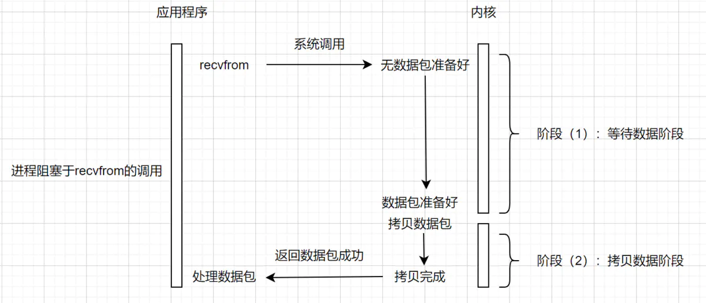

​		当用户进程调用了recvfrom这个系统调用，内核就开始了I/O的第一个阶段：准备数据。对于网络I/O来说，很多时候数据在一开始还没有到达（比如，还没有收到一个完整的UDP包），这个时候内核就要等待足够的数据到来。而在用户进程这边，整个进程会被阻塞，当数据准备好时，它就会将数据从内核拷贝到用户内存，然后返回结果，用户进程才解除阻塞的状态，重新运行起来。几乎所有的开发者第一次接触到的网络编程都是从listen()、send()、recv()等接口开始的，这些接口都是阻塞型的。阻塞I/O模型的特性总结如下表所示。

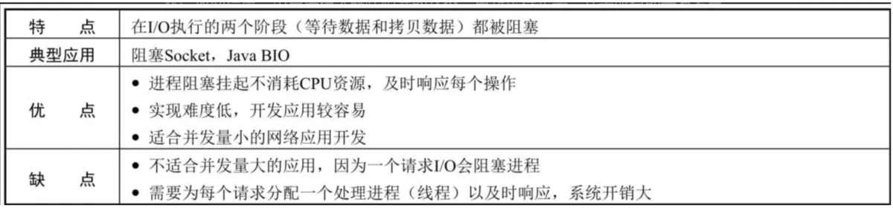

 

 

### 非阻塞I/O （nonblocking I/O）

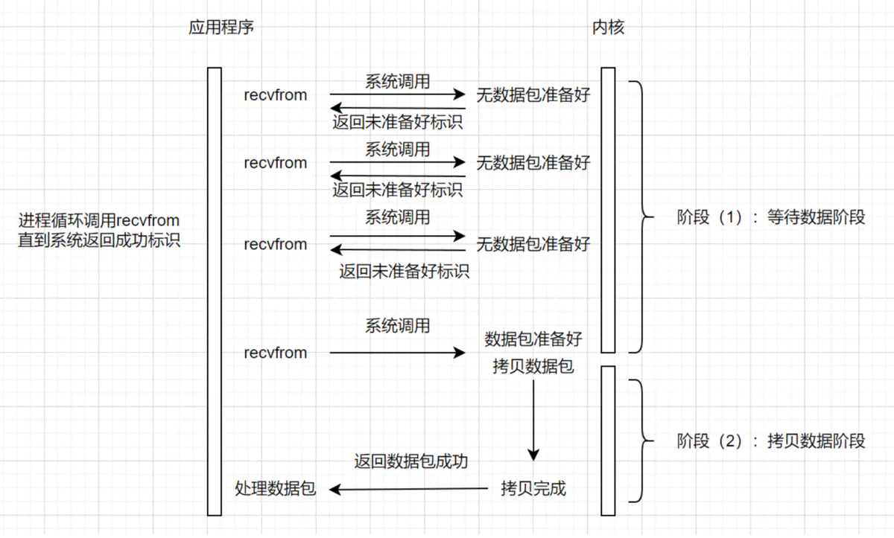

​		和上面的阻塞IO模型相比，非阻塞IO模型在内核数据没准备好，需要进程阻塞的时候，就返回一个错误，以使得进程不被阻塞。

- 进程发起IO系统调用后，如果内核缓冲区没有数据，需要到IO设备中读取，进程返回一个错误而不会被阻塞。
- 进程发起IO系统调用后，如果内核缓冲区有数据，内核就会把数据返回进程。


### 多路复用IO
```
IO多路复用体现在哪里，实现了一个线程可以监视多个文件句柄。非多路复用要一个线程伺候一个句柄。
```
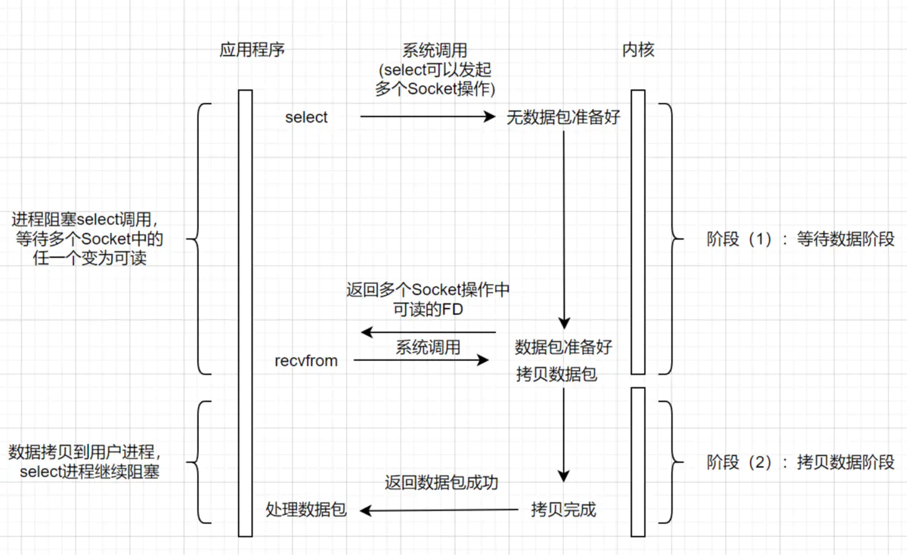

​		IO多路复用就解决了非阻塞式IO的缺点，即**它不会对内存进行轮询操作，当内核数据准备完毕，以事件通知机制告知应用进程**已经准备好了，在此之前，应用进程可以忙其他的工作，从而减少对性能的影响。通过多路IO复用，能使得一个进程同时处理多路IO，提升服务器吞吐量。

   多个进程的I/O可以注册到一个复用器（Selector）上，当用户进程调用该Selector，Selector会监听注册进来的所有I/O，如果Selector监听的所有I/O在内核缓冲区都没有可读数据，select调用进程会被阻塞，而当任一I/O在内核缓冲区中有可读数据时，select调用就会返回，而后select调用进程可以自己或通知另外的进程（注册进程）再次发起读取I/O，读取内核中准备好的数据，多个进程注册I/O后，只有一个select调用进程被阻塞。 

多路复用I/O模型的特性总结如下表所示。

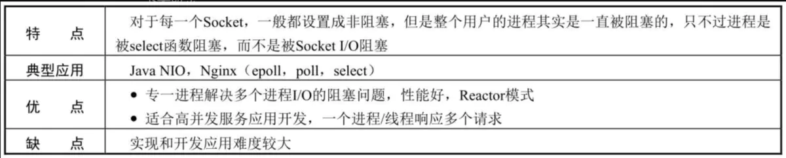

  其实I/O多路复用这里是通过Reactor模式，通过主动推的事件模型，让系统内核去遍历这些FD，有准备就绪的数据，就主动推给用户进程去处理。这里就涉及到几个系统调用函数：select、poll和epoll。


####  select

select 是操作系统提供的系统调用函数，通过它，我们可以把一个文件描述符的数组发给操作系统， 让操作系统去遍历，确定哪个文件描述符可以读写， 然后告诉我们去处理。细节如下：
 **（1）select 调用需要传入 fd 数组，需要拷贝一份到内核，高并发场景下这样的拷贝消耗的资源是惊人的。（可优化为不复制）
 （2）select 在内核层仍然是通过遍历的方式检查文件描述符的就绪状态，是个同步过程，只不过无系统调用切换上下文的开销。（内核层可优化为异步事件通知）
 （3）select 仅仅返回可读文件描述符的个数，具体哪个可读还是要用户自己遍历。（可优化为只返回给用户就绪的文件描述符，无需用户做无效的遍历）**
 select 的流程如下。

 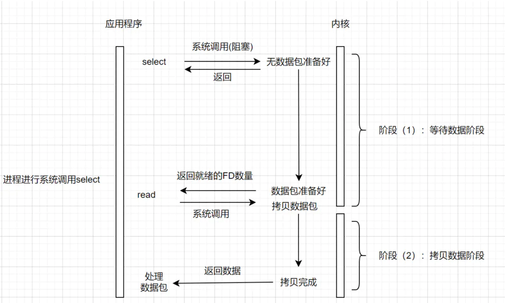

 

#### poll

​		poll 也是操作系统提供的系统调用函数，它和 select 的主要区别就是，去掉了 select 只能监听 1024 个文件描述符的限制。


#### epoll

epoll 是select 和 poll的加强版，它解决了 select 和 poll 的一些问题。
 **（1）内核中保存一份文件描述符集合，无需用户每次都重新传入，只需告诉内核修改的部分即可。
 （2）内核不再通过轮询的方式找到就绪的文件描述符，而是通过异步 IO 事件唤醒。
 （3）内核仅会将有 IO 事件的文件描述符返回给用户，用户也无需遍历整个文件描述符集合。**

##### epoll的三大步骤:

 

###### **Epoll第一步epoll_create:**

当某个进程调用epoll_create方法时，内核会创建一个eventpoll对象（epfd文件描述符）。eventpoll对象也是文件系统中的一员，和socket一样，它也会有等待队列

 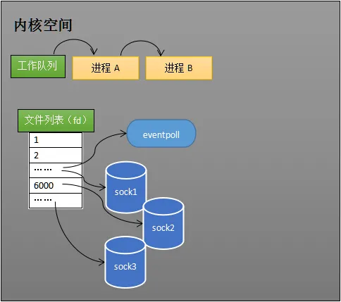

###### **Epoll的第二步epoll_ctl:**

可以用epoll_ctl添加和删除所要监听的socket。
eg:如果通过epoll_ctl添加sock1、sock2和sock3的监视，内核会将eventpoll添加到这三个socket的监视队列中。

 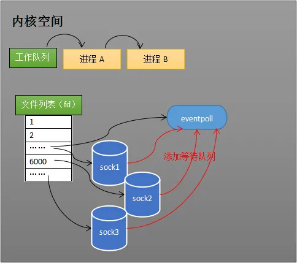

当socket收到数据后，中断程序会操作eventpoll的就绪队列rdlist，而不是直接操作读取数据的进程（如进程A）。当socket2、socket3收到数据后，中断程序让这两个socket进入rdlist。

 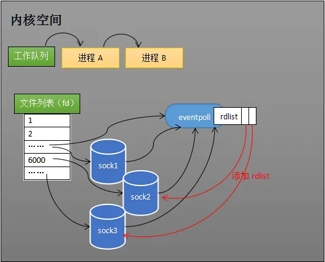

**Epoll的第三步：epoll_wait:**
当程序执行到epoll_wait时，如果rdlist非空则返回，如果rdlist为空则阻塞进程。

 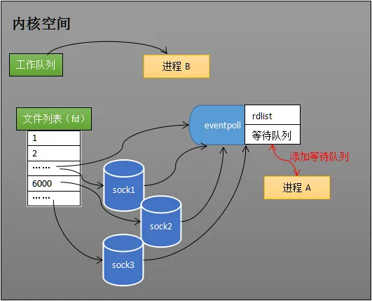

当socket接收到数据，中断程序一方面将其插入rdlist，另一方面唤醒eventpoll中的进程，进程A再次进入内核的工作队列，进程A进入运行状态。

#### kqueue

kqueue和epoll一样，都是用来替换select和poll的。不同的是kqueue被用在FreeBSD、NetBSD、 OpenBSD、DragonFly BSD 和 macOS中。

kqueue 不仅可以解决文件描述符事件，还能够用于各种其余告诉，例如文件批改监督、信号、异步 I/O 事件 (AIO)、子过程状态更改监督和反对纳秒级分辨率的计时器，此外kqueue提供了一种除了内核提供的事件之外，还能够应用用户定义的事件。 

 

### 信号驱动I/O （signal driven I/O (SIGIO)）

 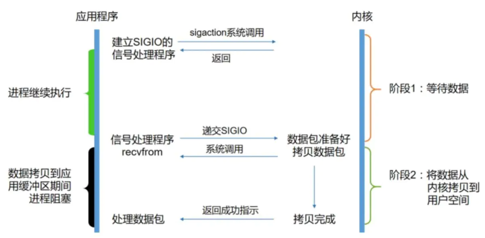

​		信号驱动I/O是指进程预先告知内核，向内核注册一个信号处理函数，然后用户进程返回不阻塞（IO多路复用的这个阶段是阻塞的），当内核数据就绪时会发送一个信号给进程，用户进程便在信号处理函数中调用I/O读取数据。从上图可以看出，实际上I/O内核拷贝到用户进程的过程还是阻塞的，信号驱动I/O并没有实现真正的异步，因为通知到进程之后，依然由进程来完成I/O操作。这和后面的异步I/O模型很容易混淆，需要理解I/O交互并结合五种I/O模型进行比较阅读。信号驱动I/O模型的特性总结如下表所示

 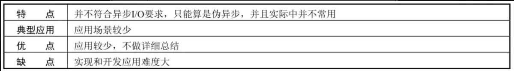

 

### 异步I/O （asynchronous I/O (the POSIX aio_functions)）

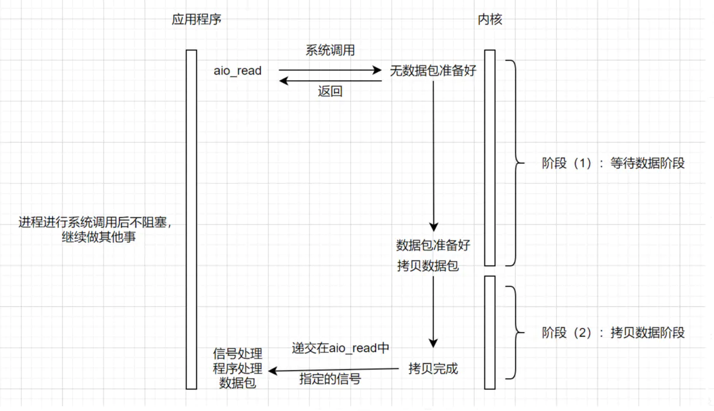

用户进程发起read操作之后，立刻就可以开始去做其它的事。而另一方面，从kernel的角度，当它收到一个asynchronous read之后，首先它会立刻返回，所以不会对用户进程产生任何block。然后，kernel会等待数据准备完成，然后将数据拷贝到用户内存，当这一切都完成之后，kernel会给用户进程发送一个signal，告诉它read操作完成了。


### 各种IO的阻塞对比

各个模型的阻塞状态对比流程图如下

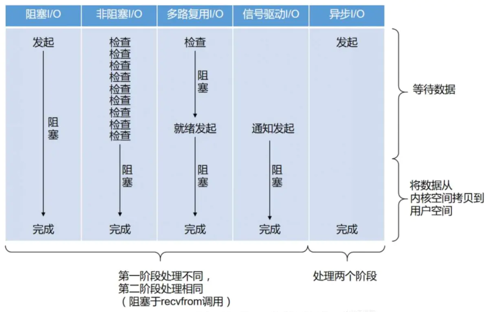


从上图可以看出，阻塞程度：阻塞I/O>非阻塞I/O>多路复用I/O>信号驱动I/O>异步I/O，效率是由低到高的。最后，再看一下下表，从多维度总结了各I/O模型之间的差异，可以加深理解。

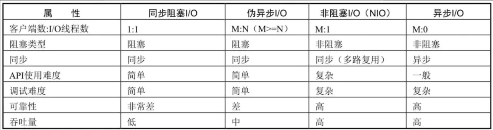


 

## JAVA的IO

### BIO

标准的阻塞性IO

```java
/**
 * 需要1+n个线程
 * @throws IOException
 */
public static void test_bio() throws IOException {
    ServerSocket serverSocket = new ServerSocket(9095);
    while (true) {
        System.out.println("start accept");

        //等待一个客户端连接
        Socket socket = serverSocket.accept();
        System.out.println("new conn: " + socket.getRemoteSocketAddress());

        //收到一个连接后，开启一个专属线程处理交互
        new Thread(() -> {
            try {
                BufferedReader reader = new BufferedReader(new InputStreamReader(socket.getInputStream()));
                String msg;
                while ((msg = reader.readLine()) != null) {
                    if (msg.equalsIgnoreCase("quit")) {
                        reader.close();
                        socket.close();
                        break;
                    } else {
                        System.out.println("receive msg: " + msg);
                    }
                }
            } catch (IOException e) {
                e.printStackTrace();
            }
        }).start();
    }
}
```

### NIO（New IO）

​		2002年，jdk1.4开始被正式发布了，做出的一个巨大的改变就是新增了NIO包。
​		java里的NIO，表示的是new IO。并非常见IO模型里的非阻塞性nonblocking I/O。它其实是一个复合型IO，复合nonblockingIO和多路复用IO。
 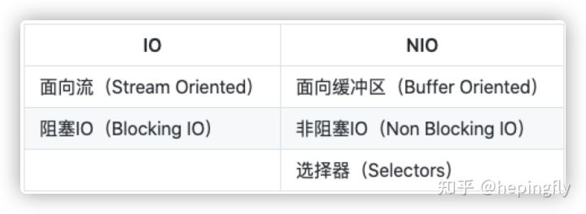

​		NIO支持面向缓冲区的、基于通道的IO操作并以更加高效的方式进行文件的读写操作，其核心API为Channel(通道)，Buffer(缓冲区), Selector(选择器)。Channel负责传输，Buffer负责存储。

```java
public static void test_nio() throws IOException {
    //创建ServerSocket通道，并设置为非阻塞，绑定本机端口
    ServerSocketChannel serverSocketChannel = ServerSocketChannel.open();
    serverSocketChannel.configureBlocking(false);
    serverSocketChannel.socket().bind(new InetSocketAddress(50111));
    //创建一个选择器Selector,
    Selector selector = Selector.open();
    //注册接收事件，即注册客户端的连接事件
    serverSocketChannel.register(selector, SelectionKey.OP_ACCEPT);
    while (true){
        //此为IO的多路复用机制，linux环境下用的是epoll函数，windows环境下用的是poll(windows系统无epoll)。
        int select = selector.select();
        Iterator<SelectionKey> it = selector.selectedKeys().iterator();
        while (it.hasNext()){
            SelectionKey key = it.next();
          	//业务处理
            handle(key);
            it.remove();
        }
    }
}
```


### NIO2.0（New IO 2.0）

​		在2011年7月28日，jdk1.7被正式发布。引入了AIO的实现

```java
/**
 * 0线程阻塞
 * @throws IOException
 */
public static void test_aio() throws IOException {
    AsynchronousServerSocketChannel serverSocketChannel = AsynchronousServerSocketChannel.open();
    serverSocketChannel.bind(new InetSocketAddress(9097));

    // 监听accept事件，处理事件的任务就可以在工作线程池上了
    serverSocketChannel.accept(null, new CompletionHandler<AsynchronousSocketChannel, Object>() {
        @Override
        public void completed(AsynchronousSocketChannel socketChannel, Object attachment) {
            try {
                System.out.println("accept new conn: " + socketChannel.getRemoteAddress());
                // 再次监听accept事件
                serverSocketChannel.accept(null, this);
                // 消息的处理
                while (true) {
                    ByteBuffer buffer = ByteBuffer.allocate(1024);
                    // 将数据读入到buffer中
                    Future<Integer> future = socketChannel.read(buffer);
                    if (future.get() > 0) {
                        buffer.flip();
                        byte[] bytes = new byte[buffer.remaining()];
                        // 将数据读入到byte数组中
                        buffer.get(bytes);

                        String content = new String(bytes, "UTF-8");
                        // 换行符会当成另一条消息传过来
                        if (content.equals("\r\n")) {
                            continue;
                        }
                        if (content.equalsIgnoreCase("quit")) {
                            socketChannel.close();
                            break;
                        } else {
                            System.out.println("receive msg: " + content);
                        }
                    }
                }
            } catch (Exception e) {
                e.printStackTrace();
            }
        }

        @Override
        public void failed(Throwable exc, Object attachment) {
            System.out.println("failed");
        }
    });
    // 阻塞住主线程，或者去忙别的
    System.in.read();
}
```

