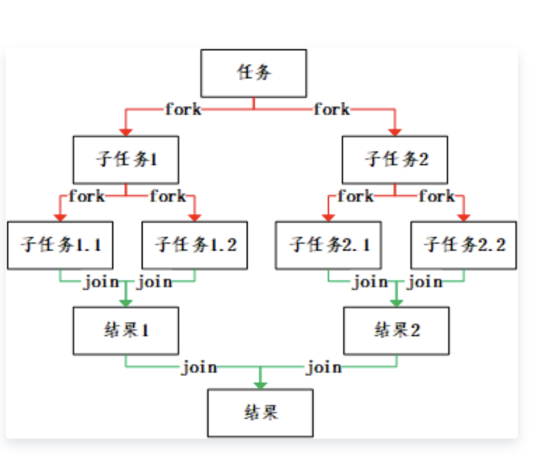
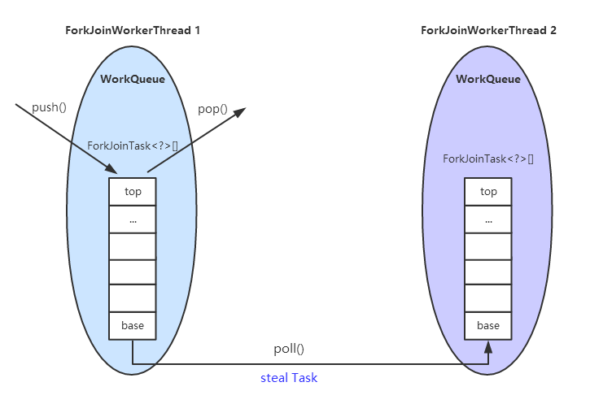
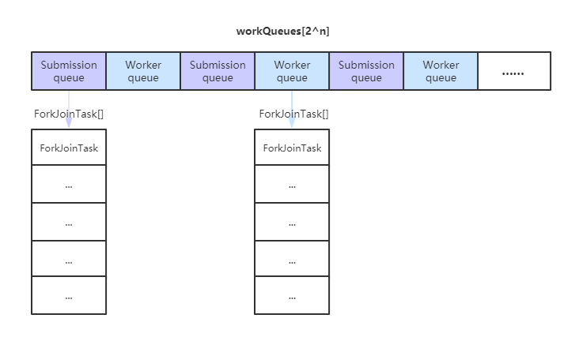

# ForkJoinPool实现原理

## 总体介绍
​		ForkJoinPool是自 Java7 开始，jvm提供的一个用于并行执行的任务框架。其主旨是将大任务分成若干小任务，之后再并行对这些小任务进行计算，最终汇总这些任务的结果。得到最终的结果。其广泛用在java8的stream中。
​		这个描述实际上比较接近于单机版的map-reduce。都是采用了分治算法，将大的任务拆分到可执行的小任务，之后并行执行，最终合并结果集。区别就在于ForkJoin机制只能在单个jvm上运行，而map-reduce则是在集群上执行。此外，ForkJoinPool采取工作窃取算法，以避免工作线程由于拆分了任务之后的join等待过程。这样处于空闲的工作线程将从其他工作线程的队列中主动去窃取任务来执行。这里涉及到的两个基本知识点是分治法和工作窃取。

## 知识铺垫
### 分治法
* 分治法的基本思想是将一个规模为N的问题分解为K个规模较小的子问题，这些子问题的相互独立且与原问题的性质相同，求出子问题的解之后，将这些解合并，就可以得到原有问题的解。是一种分目标完成的程序算法。
  

### 工作窃取
* 工作窃取是指当某个线程的任务队列中没有可执行任务的时候，从其他线程的任务队列中窃取任务来执行，以充分利用工作线程的计算能力，减少线程由于获取不到任务而造成的空闲浪费。在ForkJoinPool中，工作任务的队列都采用双端队列Deque容器。我们知道，在通常使用队列的过程中，我们都在队尾插入，而在队头消费以实现FIFO。而为了实现工作窃取。一般我们会改成工作线程在工作队列上LIFO（栈），而窃取其他线程的任务的时候，从队列头部取获取。


## 基本组成部分

### 常量 
* MAX_CAP
  * final，值为0x7fff
  * parallelism 的最大值
  
* SQMASK
  * final，值为0x007e
  * workQueues 数组最多64个偶数槽位
* SCANNING  
  * 标记是否正在运行任务
* LIFO_QUEUE
  * LIFO队列
* FIFO_QUEUE
  * FIFO队列 
* INITIAL_QUEUE_CAPACITY
  * WorkQueue的任务队列array初始队列容量，值为 1 << 13
* MAXIMUM_QUEUE_CAPACITY
  * WorkQueue的任务队列array最大队列容量， 值为 1 << 26

### 成员变量
* ctl 
  * 线程池的主要控制字段
  * long型(64位)，用来标识对工作线程进行添加、灭活、重新激活和对队列出列、入列操作。ctl 原子性地维护了活跃线程数、工作线程总数，和一个放置等待线程的队列
  
* runState
  * 运行状态锁，int型(32位)，只有 SHUTDOWN 状态是负数，其他都是整数，在并发环境更改状态必然要用到锁，ForkJoinPool 对线程池加锁和解锁分别由 lockRunState 和 unlockRunState 来实现
  * RSLOCK 线程池被锁定
  * RSIGNAL 线程池有线程需要唤醒 
  * STARTED 线程池已经初始化 
  * STOP 线程池停止
  * TERMINATED 线程池终止
  * SHUTDOWN 线程池关闭
  
* config
  * 将并行度和mode放到了一个int中，便于后续通过位操作计算
  * mode分为 FIFO_QUEUE(先进先出) 和 LIFO_QUEUE(后进先出), 默认为 LIFO_QUEUE
  
* workQueues
  * 数组大小一定为2的幂，最多64个偶数槽位
  * 本质上是work-stealing 模式的双端任务队列，内部存放 ForkJoinTask 对象任务  
  * 工作任务(Worker queues)存放在奇数位索引; 共享任务(submission/external queues)存放在偶数位索引

* factory
  * 产生线程的工厂方法
  * 默认值为java.util.concurrent.ForkJoinPool.DefaultForkJoinWorkerThreadFactory

* ueh
  * 每个worker出现异常之后的处理办法，类似于前面ThreadPoolExecutor的拒绝策略
  
* indexSeed
  * 用于生成工作线程索引
  
* stealCounter
  * 用于监控steal的计数器
  



### 构造函数
* parallelism 并行度
  * workQueues 的长度等都是根据这个并行度来计算的
```java
    externalSubmit()方法中：
        int n = (p > 1) ? p - 1 : 1;
        n |= n >>> 1; n |= n >>> 2;  n |= n >>> 4;
        n |= n >>> 8; n |= n >>> 16; n = (n + 1) << 1;
        workQueues = new WorkQueue[n];
```
* factory 产生线程的工厂
* handler 每个线程的异常处理器
* asyncMode WorkQueue 的模式：LIFO/FIFO

* java.util.concurrent.ForkJoinPool.commonPool
  * JVM内唯一的common线程池，支持读取系统变量
  * 默认的parallelism值为 Runtime.getRuntime().availableProcessors() - 1
  
## 常用方法
### invoke 
* 提交任务，并等待返回执行结果

```java
    public <T> T invoke(ForkJoinTask<T> task) {
        if (task == null)
            throw new NullPointerException();
        
        externalPush(task);
        return task.join();
    }
```

### submit
* 提交并立刻返回任务
```java
    public <T> ForkJoinTask<T> submit(ForkJoinTask<T> task) {
        if (task == null)
            throw new NullPointerException();
        externalPush(task);
        return task;
    }
```

### execute
* 只提交任务
```java
    public void execute(ForkJoinTask<?> task) {
        if (task == null)
            throw new NullPointerException();
        externalPush(task);
    }
```

## 核心模块

### ForkJoinWorkerThread
* 由ForkJoinWorkerThreadFactory创建，是ForkJoinPool的工作线程
* 工作线程中的ForkJoinPool.WorkQueue，是放在ForkJoinPool的workQueues奇数槽位上的
* 在执行自己workQueue中的task时，按照LIFO，窃取其他线程任务对中的task时，是FIFO


### ForkJoinPool.WorkQueue
* array
  * ForkJoinTask<?>[]
  * 当前对象的任务, 初始化的时候不会进行分配，采用懒加载的方式

* config
  * int
  * 用于存储线程池的index和model
  
* base
  * int
  * 下一个进行poll操作的索引
  
* top
  * int 
  * 下一个push操作的索引

* owner
  * 当前工作队列的工作线程，共享模式下为null
  
* currentJoin
  * ForkJoinTask<?>[]
  * 正在等待Join的任务

* currentSteal
  * ForkJoinTask<?>[]
  * 调用者偷来的任务
  
* growArray()
  * 首先是初始化，其次是判断，是否需要扩容，如果需要扩容则容量加倍

* push()
  * push方法是提供给工作队列自己push任务来使用的，共享队列push任务是在外部externalPush和externalSubmit等方法来进行初始化和push
  * 当队列中的任务数小于1的时候，才会调用signalWork()，这个地方一开始并不理解，实际上，我们需要注意的是，这个方法是专门提供给工作队列来使用的，那么这个条件满足的时候，说明工作队列空闲。如果这个条件不满足，那么工作队列中有很多任务需要工作队列来处理，就不会触发对这个队列的窃取操作

* pop()
  * pop操作也仅限于工作线程，对于共享对立中则不允许使用pop方法。这个方法将按LIFO后进先出的方式从队列中

* poll()
  * poll方法将从队列中按FIFO的方式取出task

### ForkJoinTask
* ForkJoinTask 实现了 Future 接口，说明它也是一个可取消的异步运算任务，实际上ForkJoinTask 是 Future 的轻量级实现，主要用在纯粹是计算的函数式任务或者操作完全独立的对象计算任务。fork 是主运行方法，用于异步执行；而 join 方法在任务结果计算完毕之后才会运行，用来合并或返回计算结果。
* 主要抽象子类有 RecursiveAction 和 RecursiveTask
  * RecursiveAction 没有返回值
  * RecursiveTask 有返回值
  * 拆分任务和计算任务的逻辑写在compute()中,  ForkJoinTask的exec()会调用compute()
  
* get()
  * 使用这个方法的话，其意义就是等待计算完成，然后返回结果
  
* invoke()
  * 开始执行此任务，在必要的时候等待完成，然后返回其结果

* invokeAll()
  * invokeAll() 会比单纯使用fork+join会节省一个线程。即当前的调用线程也会参与计算过程。如果不用invoke，只用fork和join，这样会造成当前线程浪费
  
```java
  public static void invokeAll(ForkJoinTask<?>... tasks) {
    Throwable ex = null;
    int last = tasks.length - 1;
    //除第0个之外的任务都会调用fork进行处理，而第0个会用当前线程进行处理
    for (int i = last; i >= 0; --i) {
        ForkJoinTask<?> t = tasks[i];
        if (t == null) {
            if (ex == null)
                ex = new NullPointerException();
        }
        else if (i != 0)
            t.fork();
            
        // t.doInvoke(), 由当前线程执行    
        else if (t.doInvoke() < NORMAL && ex == null)
            ex = t.getException();
    }
    //遍历，除第0个任务之外，所有任务都调用doJoin，也就是说当前线程必须等待其他任务都执行完成。
    for (int i = 1; i <= last; ++i) {
        ForkJoinTask<?> t = tasks[i];
        if (t != null) {
            if (ex != null)
                t.cancel(false);
            else if (t.doJoin() < NORMAL)
                ex = t.getException();
        }
    }
    if (ex != null)
        rethrow(ex);
}

```

## 执行流程
### 执行流程图


### ForkJoinPool
#### externalPush()
* 添加到任务队列。
* 提交成功之后，调用signalWork方法让其他的worker来窃取
  
```java
    /**
     * 尝试将任务添加到提交者当前的队列中，此方法只处理大多数情况，实际上是根据随机数指定一个workQueues的槽位，如果这个位置存在WorkQueue，则加入队列，然后调用signalWork通知其他工作线程来窃取。反之，则通过externalSubmit处理。这只适用于提交队列存在的普通情况。更复杂的逻辑参考externalSubmit。
     *
     * @param task the task. Caller must ensure non-null.
     */
    final void externalPush(ForkJoinTask<?> task) {
        WorkQueue[] ws; WorkQueue q; int m;
        //通过ThreadLocalRandom产生随机数
        int r = ThreadLocalRandom.getProbe();
        //线程池的状态
        int rs = runState;
        //如果ws已经完成初始化，且根据随机数定位的index存在workQueue,且cas的方式加锁成功
        if ((ws = workQueues) != null && (m = (ws.length - 1)) >= 0 &&
            //此处先用随机数和wq的size取&，之后再取SQMASK，这些操作将多余的位的值去除
            (q = ws[m & r & SQMASK]) != null && r != 0 && rs > 0 &&
            //cas的方式加锁 将q中位于QLOCK位置的内存的值如果为0，则改为1，采用cas的方式进行
            U.compareAndSwapInt(q, QLOCK, 0, 1)) {
            ForkJoinTask<?>[] a; int am, n, s;
            //判断q中的task数组是否为空，
            if ((a = q.array) != null &&
                //am为q的长度 这是个固定值，如果这个值大于n n就是目前队列中的元素，实际实这里是判断队列是否有空余的位置
                (am = a.length - 1) > (n = (s = q.top) - q.base)) {
                //j实际上是计算添加到workQueue中的index
                int j = ((am & s) << ASHIFT) + ABASE;
                //将task通过cas的方式插入a的index为j的位置
                U.putOrderedObject(a, j, task);
                //将队列q的QTOP位置的内存加1，实际上就是将TOP增加1
                U.putOrderedInt(q, QTOP, s + 1);
                //以可见的方式将q的QLOCK改为0
                U.putIntVolatile(q, QLOCK, 0);
                //此处，如果队列中的任务小于等于1则通知其他worker来窃取。为什么当任务大于1的时候不通知。而且当没有任务的时候发通知岂不是没有意义？此处不太理解
                if (n <= 1)
                    //这是个重点方法，通知其他worker来窃取
                    signalWork(ws, q);
                return;
            }
            U.compareAndSwapInt(q, QLOCK, 1, 0);
        }
        externalSubmit(task);
    }

```

#### externalSubmit()
* 创建新的队列，并进行初始化
* 这个地方将产生的无owoner的workQueue放置在索引k的位置，需要注意的是k的计算过程，k= r & m & SQMASK。r是随机数，m是数组的长度，而SQMASK最后一位不为1，这就导致不管r如何变化，得到的k最后一位都不为1，这就构造了一个偶数k最后一位为0，k不可能是奇数
  
```java
/**
 *externalPush的完整版本，处理那些不常用的逻辑。如第一次push的时候进行初始化、此外如果索引队列为空或者被占用，那么创建一个新的任务队列。
 *
 * @param task the task. Caller must ensure non-null.
 */
private void externalSubmit(ForkJoinTask<?> task) {
   //r是随机数，此处双重检测，确保r不为0
    int r;                                    // initialize caller's probe
    if ((r = ThreadLocalRandom.getProbe()) == 0) {
        ThreadLocalRandom.localInit();
        r = ThreadLocalRandom.getProbe();
    }
    //死循环
    for (;;) {
        WorkQueue[] ws; WorkQueue q; int rs, m, k;
        //move默认为false
        boolean move = false;
        //如果runstate小于0 则线程池处于SHUTDOWN状态，配合进行终止
        if ((rs = runState) < 0) {
            //终止的方法 并抛出异常，拒绝该任务
            tryTerminate(false, false);     // help terminate
            throw new RejectedExecutionException();
        }
        //如果状态不为STARTED 说明此时线程池可用
        else if ((rs & STARTED) == 0 ||     // initialize
                 //如果workQueues为null 或者其length小于1 则说明没用初始化
                 ((ws = workQueues) == null || (m = ws.length - 1) < 0)) {
            int ns = 0;
            //对线程池以CAS的方式加锁，从RUNSTATE变为RSLOCK，如果不为RUNSTATE则自旋
            rs = lockRunState();
            try {
                //如果状态为  RSIGNAL RSLOCK  说明加锁成功
                if ((rs & STARTED) == 0) {
                   //用cas的方式初始化STEALCOUNTER
                    U.compareAndSwapObject(this, STEALCOUNTER, null,
                                           new AtomicLong());
                    // create workQueues array with size a power of two
                    //创建workQueues的数组
                    //根据并行度计算得到config，此处确保p在SMASK范围内，即2个字节
                    int p = config & SMASK; // ensure at least 2 slots
                    //n判断p是否大于1，反之则默认按1处理
                    int n = (p > 1) ? p - 1 : 1;
                    //下列过程是找到大于n的最小的2的幂 这个过程之前在HashMap中演示过
                    n |= n >>> 1; n |= n >>> 2;  n |= n >>> 4;
                    n |= n >>> 8; n |= n >>> 16; n = (n + 1) << 1;
                    //根据并行度计算得到了n,之后根据n确定workQueues的array的大小，这个数组的大小不会超过2^16
                    workQueues = new WorkQueue[n];
                    //将ns的值修改为STARTED
                    ns = STARTED;
                }
            } finally {
                //最后将状态解锁 此时改为STARTED状态，这个计算过程有一点绕 
                unlockRunState(rs, (rs & ~RSLOCK) | ns);
            }
            //实际上这个分支只是创建了外层的workQueues数组，此时数组内的内容还是全部都是空的 
        }
        //如果根据随机数计算出来的槽位不为空，即索引处的队列已经创建，这个地方是外层死循环再次进入的结果
        //需要注意的是这个k的计算过程，SQMASK最低的位为0，这样就导致，无论随机数r怎么变化，得到的结果总是偶数。
        else if ((q = ws[k = r & m & SQMASK]) != null) {
            //如果这个槽位的workQueue未被锁定，则用cas的方式加锁 将其改为1
            if (q.qlock == 0 && U.compareAndSwapInt(q, QLOCK, 0, 1)) {
                //拿到这个队列中的array
                ForkJoinTask<?>[] a = q.array;
                //s为top索引
                int s = q.top;
                //初始化submitted状态
                boolean submitted = false; // initial submission or resizing
                try {                      // locked version of push
                    //与上面的externalPush一致，此处push到队列中
                    //先判断 数组不为空且数组中有空余位置，能够容纳这个task
                    if ((a != null && a.length > s + 1 - q.base) ||
                        //或者通过初始化的双端队列的数组不为null 
                        (a = q.growArray()) != null) {
                        //计算数组的index
                        int j = (((a.length - 1) & s) << ASHIFT) + ABASE;
                        //在索引index处插入task
                        U.putOrderedObject(a, j, task);
                        //将队列的QTOP加1
                        U.putOrderedInt(q, QTOP, s + 1);
                        //将提交成功状态改为true
                        submitted = true;
                    }
                } finally {
                    //最终采用cas的方式进行解锁 将队列的锁定状态改为0
                    U.compareAndSwapInt(q, QLOCK, 1, 0);
                }
                //如果submitted为true说明数据添加成功，此时调用其他worker来窃取
                if (submitted) {
                    //调用窃取的方法
                    signalWork(ws, q);
                    //退出
                    return;
                }
            }
            //move状态改为true
            move = true;                   // move on failure
        }
        //如果状态不为RSLOCK 上面两个分支都判断过了，那么此处说明这个索引位置没有初始化
        else if (((rs = runState) & RSLOCK) == 0) { // create new queue
           /new一个新队列
            q = new WorkQueue(this, null);
            //hint 记录随机数
            q.hint = r;
            //计算config SHARED_QUEUE 将确保第一位为1 则这个计算出来的config是负数，这与初始化的方法是一致的
            q.config = k | SHARED_QUEUE;
            //将scan状态改为INCATIVE
            q.scanState = INACTIVE;
            //用cas的方式加锁
            rs = lockRunState();  将创建的workQueue push到workQueues的数组中
            // publish index
            if (rs > 0 &&  (ws = workQueues) != null &&
                k < ws.length && ws[k] == null)
                //赋值
                ws[k] = q;                 // else terminated
            //解锁
            unlockRunState(rs, rs & ~RSLOCK);
        }
        else
            //将move改为true
            move = true;                   // move if busy
        if (move)
            //重新计算r
            r = ThreadLocalRandom.advanceProbe(r);
    }
}
```

#### signalWork()
* 判断worker是否充足，如果不够，则创建新的worker。
* 判断worker的状态是否被park了，如果park则用unpark唤醒。这样worker就可以取scan其他队列进行窃取了
  
```java

/**
 * 此处将激活worker Thread。如果工作线程太少则创建，反之则来进行窃取。
 *
 * @param ws the worker array to use to find signallees
 * @param q a WorkQueue --if non-null, don't retry if now empty
 */
final void signalWork(WorkQueue[] ws, WorkQueue q) {
    long c; int sp, i; WorkQueue v; Thread p;
    //如果ctl为负数  ctl初始化的时候就会为负数 如果小于0  说明有任务需要处理
    while ((c = ctl) < 0L) {                       // too few active
        //c为long，强转int 32位的高位都丢弃，此时如果没有修改过ctl那么低位一定为0 可参考前面ctl的推算过程，所以此处sp 为0 sp为0则说明没有空闲的worker
        if ((sp = (int)c) == 0) {                  // no idle workers
            //还是拿c与ADD_WORKER取& 如果不为0 则说明worker太少，需要新增worker
            if ((c & ADD_WORKER) != 0L)            // too few workers
                //通过tryAddWorker 新增worker
                tryAddWorker(c);
            break;
        }
        //再次缺认ws有没有被初始化 如果没有 退出
        if (ws == null)                            // unstarted/terminated
            break;
        //如果ws的length小于sp的最低位 退出
        if (ws.length <= (i = sp & SMASK))         // terminated
            break;
        //如果index处为空 退出
        if ((v = ws[i]) == null)                   // terminating
            break;
        //将sp的低32位取出
        int vs = (sp + SS_SEQ) & ~INACTIVE;        // next scanState
        //计算用sp减去 scanState
        int d = sp - v.scanState;                  // screen CAS
        long nc = (UC_MASK & (c + AC_UNIT)) | (SP_MASK & v.stackPred);
        //采用cas的方式修改ctl 实际上就是加锁 由于ctl的修改可能会导致while循环退出
        if (d == 0 && U.compareAndSwapLong(this, CTL, c, nc)) {
            v.scanState = vs;                      // activate v
            //如果p被park wait中
            if ((p = v.parker) != null)
                //将worker唤醒 
                U.unpark(p);
            //退出
            break;
        }
        //如果此队列为空或者没有task 也退出
        if (q != null && q.base == q.top)          // no more work
            break;
    }
}

```

#### tryAddWorker()
* 尝试添加一个新的工作线程，首先更新ctl中的工作线程数，然后调用createWorker()创建工作线程

```java
/**
 * 尝试新增一个worker，然后增加ctl中记录的worker的数量
 *
 * @param c incoming ctl value, with total count negative and no
 * idle workers.  On CAS failure, c is refreshed and retried if
 * this holds (otherwise, a new worker is not needed).
 */
private void tryAddWorker(long c) {
    //传入的c为外层调用方法的ctl add标记为false
    boolean add = false;
    do {
        long nc = ((AC_MASK & (c + AC_UNIT)) |
                   (TC_MASK & (c + TC_UNIT)));
        //如果此时ctl与外层传入的ctl相等 说明没有被修改
        if (ctl == c) {
            int rs, stop;                 // check if terminating
            //用cas的方式加锁
            if ((stop = (rs = lockRunState()) & STOP) == 0)
                //增加ctl的数量，如果成功 add为ture
                add = U.compareAndSwapLong(this, CTL, c, nc);
            //解锁
            unlockRunState(rs, rs & ~RSLOCK);
            //如果stop不为0 则说明线程池停止 退出
            if (stop != 0)
                break;
            //如果前面增加ctl中的数量成功，那么此处开始创建worker
            if (add) {
                createWorker();
                break;
            }
        }
    //这个while循环， 前半部分与ADD_WORKER取并，最终只会保留第48位，这个位置为1，同时c的低32为为0，
    } while (((c = ctl) & ADD_WORKER) != 0L && (int)c == 0);
}

```

#### createWorker()
* createWorker首先通过线程工厂创一个新的ForkJoinWorkerThread，然后启动这个工作线程（wt.start()）。如果期间发生异常，调用deregisterWorker处理线程创建失败的逻辑（deregisterWorker在后面再详细说明）。

```java

/**
 * 创建并启动一个worker，因为前面已经做了增加count，如果此处出现异常，创建worker不成功，则在deregisterWorker中会判断如果ex不为空，且当前为创建状态的话，会重新进入tryAddWorker方法。
 *
 * @return true if successful
 */
private boolean createWorker() {
    //创建线程的工厂方法
    ForkJoinWorkerThreadFactory fac = factory;
    Throwable ex = null;
    ForkJoinWorkerThread wt = null;
    try {
        //如果工厂方法不为空，则用这个工厂方法创建线程，之后再启动线程，此时newThread将与workQueue绑定
        if (fac != null && (wt = fac.newThread(this)) != null) {
            wt.start();
            return true;
        }
    //如果创建失败，出现了异常 则ex变量有值
    } catch (Throwable rex) {
        ex = rex;
    }
    deregisterWorker(wt, ex);
    return false;
}

```

#### registerWorker() 
* registerWorker是 ForkJoinWorkerThread 构造器的回调函数，用于创建和记录工作线程的 WorkQueue。注意在此为工作线程创建的 WorkQueue 是放在奇数索引的（代码行：i = ((s << 1) | 1) & m;）

#### deregisterWorker()
* 如果线程创建没有成功，那么count需要回收。以及进行一些清理工作


### ForkJoinWorkerThread
#### run()
* 在workQueue创建完成之后，下一步，这些线程的run方法调用后被启动。之后就进入了worker线程的生命周期了

```java

  public void run() {
        if (workQueue.array == null) { // only run once
            Throwable exception = null;
            try {
                onStart();
                pool.runWorker(workQueue);
            } catch (Throwable ex) {
                exception = ex;
            } finally {
                try {
                    onTermination(exception);
                } catch (Throwable ex) {
                    if (exception == null)
                        exception = ex;
                } finally {
                    pool.deregisterWorker(this, exception);
                }
            }
        }
    }

```

#### runWorker()
* 这是worker工作线程的执行方法。通过死循环，不断scan是否有任务，之后窃取这个任务进行执行

```java

/**
 * 通过调用线程的run方法，此时开始最外层的runWorker
 */
final void runWorker(WorkQueue w) {
   //初始化队列，这个方法会根据任务进行判断是否需要扩容
    w.growArray();                   // allocate queue
    //hint是采用的魔数的方式增加
    int seed = w.hint;               // initially holds randomization hint
    //如果seed为0 则使用1
    int r = (seed == 0) ? 1 : seed;  // avoid 0 for xorShift
    //死循环
    for (ForkJoinTask<?> t;;) {
       //调用scan方法 对经过魔数计算的r 之后开始进行窃取过程 如果能够窃取 则task不为空
        if ((t = scan(w, r)) != null)
            //运行窃取之后的task
            w.runTask(t);
        //反之则当前线程进行等待
        else if (!awaitWork(w, r))
            break;
        r ^= r << 13; r ^= r >>> 17; r ^= r << 5; // xorshift
    }
}

```

#### runTask()
* doExec 方法才是真正执行任务的关键，它是链接我们自定义 compute() 方法的核心，来看 doExec() 方法

```java

      final void runTask(ForkJoinTask<?> task) {
            if (task != null) {
                scanState &= ~SCANNING; // mark as busy
                  //Flag1: 记录当前的任务是偷来的，至于如何执行task，是我们写在compute方法中的，我们一会看doExec() 方法
                (currentSteal = task).doExec();
                U.putOrderedObject(this, QCURRENTSTEAL, null); // release for GC
                execLocalTasks();
                ForkJoinWorkerThread thread = owner;
                  //累加偷来的数量，亲兄弟明算帐啊，虽然算完也没啥实际意义
                if (++nsteals < 0)      // collect on overflow
                    transferStealCount(pool);
                  //任务执行完后，就重新更新scanState为SCANNING
                scanState |= SCANNING;
                if (thread != null)
                    thread.afterTopLevelExec();
            }
        }

```

### ForkJoinTask
#### doExec()
* 这里是我们逻辑拆分和执行的地方，ForkJoinWorkerThread中的runTask() 负责调用doExec()

```java

    final int doExec() {
        int s; boolean completed;
        if ((s = status) >= 0) {
            try {
                completed = exec();
            } catch (Throwable rex) {
                return setExceptionalCompletion(rex);
            }
            if (completed)
                s = setCompletion(NORMAL);
        }
        return s;
    }
    
    //RecursiveTask 重写的内容
    protected final boolean exec() {
        result = compute();
        return true;
    }

```

#### fork()
* 如果当前线程是 ForkJoinWorkerThread 类型，也就是说已经通过上文注册的 Worker，那么直接调用 push 方法将 task 放到当前线程拥有的 WorkQueue 中，否则就再调用 externalPush
```java

    public final ForkJoinTask<V> fork() {
        Thread t;
        if ((t = Thread.currentThread()) instanceof ForkJoinWorkerThread)
            ((ForkJoinWorkerThread)t).workQueue.push(this);
        else
            ForkJoinPool.common.externalPush(this);
        return this;
    }

    final void push(ForkJoinTask<?> task) {
        ForkJoinTask<?>[] a; ForkJoinPool p;
        int b = base, s = top, n;
        if ((a = array) != null) {    // ignore if queue removed
            int m = a.length - 1;     // fenced write for task visibility
            U.putOrderedObject(a, ((m & s) << ASHIFT) + ABASE, task);
            U.putOrderedInt(this, QTOP, s + 1);
            if ((n = s - b) <= 1) {
                if ((p = pool) != null)
                    p.signalWork(p.workQueues, this);
            }
            else if (n >= m)
                growArray();
        }
    }

```

#### join()
* join 的核心调用在 doJoin

```java
    public final V join() {
        int s;
        if ((s = doJoin() & DONE_MASK) != NORMAL)
            reportException(s);
        return getRawResult();
    }
    
    private int doJoin() {
    
        int s; Thread t; ForkJoinWorkerThread wt; ForkJoinPool.WorkQueue w;
        //如果status小于0 则直接返回s 
        return (s = status) < 0 ? s :
            ((t = Thread.currentThread()) instanceof
            //判断是否是工作队列
            ForkJoinWorkerThread) ?
            (w = (wt = (ForkJoinWorkerThread)t).workQueue).
            tryUnpush(this) && (s = doExec()) < 0 ? s :
            //等待join
            wt.pool.awaitJoin(w, this, 0L) :
            //外部等待执行完毕
            externalAwaitDone();
    }


```

## stream
* 使用默认的ForkJoinPool, java.util.concurrent.ForkJoinPool.commonPool
* fork()+join()的实现 java.util.stream.ForEachOps.ForEachTask.compute

```java
        List<String> list = Lists.newArrayList("1", "2", "3", "4", "5", "6", "7", "8", "9", "10");

		list.parallelStream().forEach(s -> {
			System.out.println("thread name:" + Thread.currentThread().getName() + ", value:" + s);
		});

```

* 使用自定义的ForkJoinPool
```java
        ForkJoinPool forkJoinPool = new ForkJoinPool(8);
		forkJoinPool.submit(() -> list.parallelStream().forEach(s -> {
			System.out.println("thread name:" + Thread.currentThread().getName() + ", value:" + s);
		})).join();

```

## 参考文档
[ForkJoinPool大型图文现场](https://segmentfault.com/a/1190000039267451)
[ForkJoinPool的使用及基本原理](https://cloud.tencent.com/developer/article/1704658)
[ForkJoinPool源码分析之一(外部提交及worker执行过程)](https://cloud.tencent.com/developer/article/1705833)
[ForkJoinPool源码分析之二(WorkQueue源码）](https://cloud.tencent.com/developer/article/1707610)
[ForkJoinPool源码分析之三(ForkJoinTask源码）](https://cloud.tencent.com/developer/article/1732607)
[ForkJoinPool源码分析之四（ForkJoinWorkerThread源码）](https://cloud.tencent.com/developer/article/1734489)