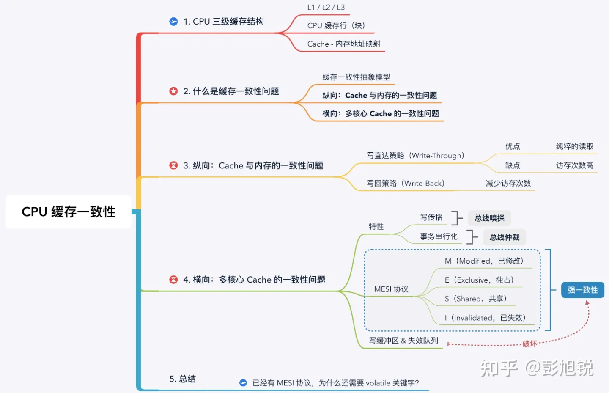
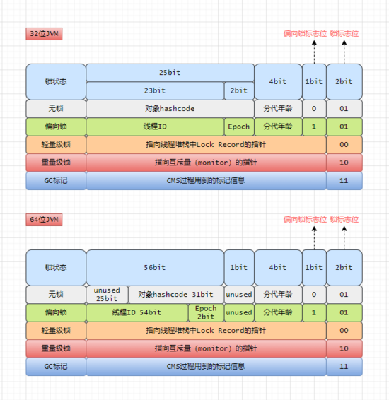
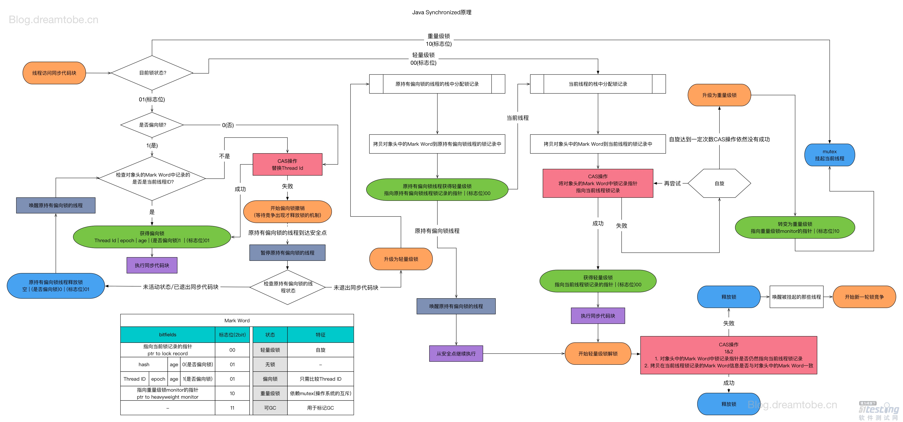

# 并发控制
## 并发控制的由来

​		我们希望多个事务尽可能的并行执行，充分的使用多CPU或多服务实例，以提高整体效率。但是并行执行的事务之间相互影响会导致数据状态的不一致，由此就产生了并发问题，需要对并发进行有效的控制和协调。

 

## 计算机内的并发
​		计算机内的并发问题，主要是多线程间共享数据造成。同一时刻同一变量对不同线程呈现不同的状态值，即可见性问题。

#### 可见性问题的根源
​		可见性的问题根源在于，计算机采用多CPU，而每个CPU都有自己的缓存，L1和L2是每个核心独有的，L3是所有核心共享的。由于性能问题，采用的是非强一致性协议，会导致多线程在同一时间访问同一数据时，访问的值不一致。
 

#### 数据一致性问题

- 主存和cache的不一致
```
有两种策略解决主存和cache的不一致问题
		1.写直达策略：在修改cache时就修改内存
		2.写回策略：只有在cache块被淘汰出cache时，发现是脏cache块就修改内存
```
- 多核心cache的不一致
```
要解决多核心cache的不一致问题，需要具备两个核心特性。
		1.写传播（总线嗅探）： 每个 CPU 核心的写入操作，需要传播到其他 CPU 核心；
		2.事务串行化（总线仲裁）： 各个 CPU 核心所有写入操作的顺序，在所有 CPU 核心看起来是一致。

		MESI 协议能够满足以上 2 点特性，通过 “M已修改、E独占、S共享、I已失效” 4 个状态实现了 CPU Cache 的一致性，四种状态针对的是cache块（或者叫cache line），S共享状态代表cache块和主存数据一样，在修改数据时先获得cache块的独占权，并把其他核心的cache块状态修改为已失效；只有在需要的时候才将数据写回内存，当一个 CPU 核心要求访问已失效状态的cahce块时，会先要求其它核心先将数据写回内存，再从内存读取。
		现代 CPU 为了提高并行度，会增加 写缓冲区 & 失效队列 将 MESI 协议的请求异步化，从内存的视角看就是指令重排，破坏了 CPU Cache 的一致性。

》写缓冲区（Store Buffer）
		由于在写入操作之前，CPU 核心 1 需要先广播 RFO 请求获得独占权，在其它核心回应 ACK 之前，当前核心只能空等待，这对 CPU 资源是一种浪费。因此，现代 CPU 会采用 “写缓冲区” 机制：写入指令放到写缓冲区后并发送 RFO 请求后，CPU 就可以去执行其它任务，等收到 ACK 后再将写入操作写到 Cache 上。

》失效队列（Invalidation Queue）
		由于其他核心在收到 RFO 请求时，需要及时回应 ACK。但如果核心很忙不能及时回复，就会造成发送 RFO 请求的核心在等待 ACK。因此，现代 CPU 会采用 “失效队列” 机制：先把其它核心发过来的 RFO 请求放到失效队列，然后直接返回 ACK，等当前核心处理完任务后再去处理失效队列中的失效请求。
```


#### CPU缓存一致性总结

		

## 内存屏障
​		由于CPU优化后的缓存一致性协议，采用的非强一致性协议，所以针对有强一致性需求的程序，提供了内存屏障指令，通过内存屏障指令来对内存同步提供强行干预的能力。注意，在java中有时候也会看到**内存屏障**的说法，比如在垃圾回收的三色标记处，可以看到写内存屏障的说法，与这里不是一回事，这里说的是cpu层面的**读写屏障**。
内存屏障有两个作用

- 阻止屏障两侧的指令重排序
- 强制把写缓冲区/高速缓存中的脏数据等写回主内存，让缓存中相应的数据失效

#### 读屏障 smp_rmb()

​		这是linux内核提供的函数，封装的cpu屏障指令，在invalid queue的数据被刷完之后再执行屏障后的读操作。这个屏障实质保障了屏障后的读，读取到的都是最新数据

#### 写屏障 smp_wmb()

​	 	这是linux内核提供的函数，封装的cpu屏障指令，在store buffer的数据被刷完之后再执行屏障后的写操作。

#### 读写屏障 smp_mb()

​		这是linux内核提供的函数，封装的cpu屏障指令，同时具有读屏障和写屏障功能。

#### Java中内存屏障的使用

```
以上明确了cpu层面的读写屏障，Java中volatile、synchronized、Lock等也提到了内存屏障的概念，我们看一下是不是一回事
```

**Volatile**

```
Volatile保证了多线程下的可见性和禁止重排序
在每个volatile写操作的前面插入一个StoreStore屏障
在每个volatile写操作的后面插入一个StoreLoad屏障
在每个volatile读操作的前面插入一个LoadLoad屏障
在每个volatile读操作的后面插入一个LoadStore屏障
		注意，以上四种内存屏障是jvm提供的，与cpu的读写屏障不同，仅仅是为了禁止指令重排。最底层是通过cpu的lock前缀实现的，Lock不是一种内存屏障，但是它能完成类似内存屏障的功能。Lock会对CPU总线和高速缓存加锁，可以理解为CPU指令级的一种锁。类似于Lock指令。
		在具体的执行上，Lock它先对总线和缓存加锁，然后执行后面的指令，在Lock锁住总线的时候，其他CPU的读写请求都会被阻塞，直到锁释放。最后释放锁后会把高速缓存中的脏数据全部刷新回主内存，且这个写回内存的操作会使在其他CPU里缓存了该地址的数据无效，其他线程获取到总线锁才可以继续执行。
		从以上表述可以看出，volatile在JVM层面的原理是内存屏障，在cpu层面的原理是Lock前缀
```
 
```java
public class VolatileDemo {
   public volatile boolean v;
   public boolean tempShare=false;
   public boolean tempShare1;
  
   public void write(){
       //插入 StoreStore (刷Store Buffer)
       v=tempShare;
       //插入 StoreLoad（全能屏障，刷Store Buffer，刷Invalidate Queue）
   }
  
   public void read(){
       //插入 LoadLoad（刷Invalidate Queue ）
       tempShare1= v;
       //插入 LoadStore（实质同loadload，只是抽象概念，刷Invalidate Queue）
   }
}
```

**Synchronized**

```
synchronized底层通过获取屏障和释放屏障的配对使用保证有序性，加载屏障和存储屏障的配对使用保正可见性。最后又通过锁的排他性保障了原子性与线程安全。
```

 


**Final**
- 写final域：在写final域完毕，构造体结束之前，会插入一个StoreStore屏障，保证前面的对final写入对其他线程/CPU可见，并阻止重排序。
- 读final域：在读final域前插入了LoadLoad屏障。

  

**Lock**
Java中除synchronized锁机制外，其他各种锁都是基于volatile和cas来实现，而CAS机制里，又是用内存屏障来保证C的有效性


## 并发控制核心工具-锁
```
java提供了两种方式来加锁，一种是关键字：synchronized，一种是concurrent包下的lock锁。
```
#### synchronized 

```java
//隐试synchronized (this)包装整个方法体
public synchronized void testSynchronized1(){
    int a=1;
}

public void testSynchronized2(){
  //局部加锁，并可指定锁对象
  synchronized (this.lock){
      int a=1;
  }
  int b=2;
}
```

**Java对象头和monitor是实现synchronized的基础**！
**Java对象头**:Hotspot虚拟机的对象头。
主要包括两部分数据：**Mark Word（标记字段）、Class Pointer（类型指针）**。


**Mark Word**
		Mark word 用于存储对象自身的运行时数据，如哈希码（HashCode)、GC分代年龄、锁状态标志、线程持有的锁、偏向线程 ID、偏向时间戳等等，**它是实现轻量级锁和偏向锁的关键**. 
**Class Point**
 		Class point 是对象指向它的类元数据的指针，虚拟机通过这个指针来指向“类的实例”。类实例存储着类的元数据，比如各字段的偏移量；

****

 
##### identity_hashcode

对象的hashcode，运行期间调用System.identityHashCode()来计算，延迟计算，并把结果赋值到这里。

当对象加锁后，计算的结果31位不够表示，在偏向锁，轻量锁，重量锁，hashcode会被转移到Monitor中。

##### thread

偏向锁的线程ID， 当某个线程持有对象的时候，对象这里就会被置为该线程的ID。 在后面的操作中，就无需再进行尝试获取锁的动作。

##### epoch

偏向锁在CAS锁操作过程中，偏向性标识，表示对象更偏向哪个锁。

##### ptr_to_lock_record

轻量级锁状态下，指向栈中锁记录的指针。当锁获取是无竞争的时，JVM使用原子操作而不是OS互斥。这种技术称为轻量级锁定。在轻量级锁定的情况下，JVM通过CAS操作在对象的标题字中设置指向锁记录的指针。

 


##### ptr_to_heavyweight_monitor

重量级锁状态下，指向对象监视器Monitor的指针。如果两个不同的线程同时在同一个对象上竞争，则必须将轻量级锁升级到Monitor以管理等待的线程。在重量级锁定的情况下，JVM在对象的ptr_to_heavyweight_monitor设置指向Monitor的指针。

##### Lock Record

Lock Record是线程私有的数据结构，每一个线程都有一个可用Lock Record列表。每一个被锁住的对象Mark Word和一个Lock Record关联，对象头的MarkWord中的Lock Word指向Lock Record的起始地址。lock record在线程的Interpretered Frame上(解释帧)分配，并不分配到堆上。

#### Monitor（重量级锁实现）

​		synchronized 关键字在使用的时候，往往需要指定一个对象与之关联，例如：synchronized(this)，或者 synchronized(ANOTHER_LOCK)，synchronized 如果修饰的是实例方法，那么其关联的对象实际上是 this，如果修饰的是类方法，那么其关联的对象是 this.class。总之，synchronzied 需要关联一个对象，而这个对象就是 monitor object。 monitor 的机制中，monitor object 充当着维护 mutex以及定义 wait/signal API 来管理线程的阻塞和唤醒的角色，即管程本身。 

​		前面提到管程由信号量、等待队列、wait、notify等功能组成，在Java中，信号量由MarkWord中的锁标识实现；同时，java.lang.Object 类定义了 wait()，notify()，notifyAll() 方法，这些方法的具体实现，依赖于一个叫 ObjectMonitor 模式的实现，这是 JVM 内部基于 C++ 实现的一套机制，基本原理如下所示：

 

​		当一个线程需要获取 Object 的锁时，会被放入 EntrySet 中进行等待，如果该线程获取到了锁，成为当前锁的 owner。如果根据程序逻辑，一个已经获得了锁的线程缺少某些外部条件，而无法继续进行下去（例如生产者发现队列已满或者消费者发现队列为空），那么该线程可以通过调用 wait 方法将锁释放，进入 wait set 中阻塞进行等待，其它线程在这个时候有机会获得锁，去干其它的事情，从而使得之前不成立的外部条件成立，这样先前被阻塞的线程就可以重新进入 EntrySet 去竞争锁。这个外部条件在 monitor 机制中称为条件变量。

##### ObjectMonitor结构

在Java虚拟机(HotSpot)中，Monitor是基于C++实现的，由ObjectMonitor实现的，其大概结构如下：

```c++
ObjectMonitor() {
    _header       = NULL;
    _count        = 0;   // 重入次数
    _waiters      = 0,   // 等待线程数
    _recursions   = 0;
    _object       = NULL;
    _owner        = NULL;  // 当前持有锁的线程
    _WaitSet      = NULL;  // 调用了 wait 方法的线程被阻塞 放置在这里
    _WaitSetLock  = 0 ;
    _Responsible  = NULL ;
    _succ         = NULL ;
    _cxq          = NULL ;
    FreeNext      = NULL ;
    _EntryList    = NULL ; // 等待锁 处于block的线程 有资格成为候选资源的线程
    _SpinFreq     = 0 ;
    _SpinClock    = 0 ;
    OwnerIsThread = 0 ;
  }

```

 **此处基于C++提供的ObjectMonitor结构实现的Object的wait、notify等方法和Mark Word的标记完整地支持了管程（即Java的重量级锁）**

#### 锁优化

​		JVM中monitorenter和monitorexit字节码依赖于底层的操作系统的Mutex Lock来实现的，但是由于使用Mutex Lock需要将当前线程挂起并从用户态切换到内核态来执行，这种切换的代价是非常昂贵的；

​		在Java SE 1.6里Synchronied同步锁，一共有四种状态：`无锁`、`偏向锁`、`轻量级锁`、`重量级锁`，它会随着竞争情况逐渐升级，HotSpot JVM 支持锁降级，但是锁升降级效率较低，频繁升降级的话对性能就会造成很大影响。重量级锁降级发生于 STW 阶段，降级对象为仅仅能被 VMThread 访问而没有其他 JavaThread 访问的对象。 


##### 无锁

​	无锁状态下，如需要获得锁，只需要使用CAS操作来升级为偏向锁，且javaThread指针指向当前线程。

##### 偏向锁

​		对于总是由同一个线程多次获取，那么在同一个线程反复获取和释放锁，还没有锁的竞争的情况，使用偏向锁减少竞争。

​		当一个线程访问同步块并获取锁时，会在对象头和栈帧中的锁记录里存储锁偏向的线程ID，以后该线程在进入和推出同步块时不需要进行CAS操作来加锁和解锁。只需要简单地测试一下对象头的`Mark Word`里是否存储着指向当前线程的偏向锁。如果成功，表示线程已经获取到了锁。

​		仅在一个线程进入临界区时（包括多个轮流进入），允许偏向，一旦出现冲突立即膨胀为轻量级锁。 

##### 轻量级锁

​		引入轻量级锁的主要目的是在没有多线程竞争的前提下，减少传统的重量级锁使用操作系统互斥量产生的性能消耗。当关闭偏向锁功能或者多个线程竞争偏向锁导致偏向锁升级为轻量级锁，则会尝试获取轻量级锁。

​		轻量级锁允许一定时间的自旋等待，（认为即使发生冲突，也能在短时间内获得锁），一旦自旋超时，就膨胀为重量级锁。

##### 重量级锁

​		重量级锁通过对象内部的监视器（monitor）实现，其中monitor的本质是依赖于底层操作系统的Mutex Lock实现，操作系统实现线程之间的切换需要从用户态到内核态的切换，切换成本非常高。

**锁的升级流转图**



## 参考文章
[12 张图看懂 CPU 缓存一致性与 MESI 协议，真的一致吗？](https://zhuanlan.zhihu.com/p/584238332)