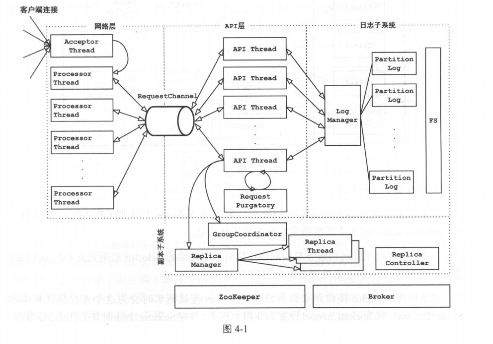
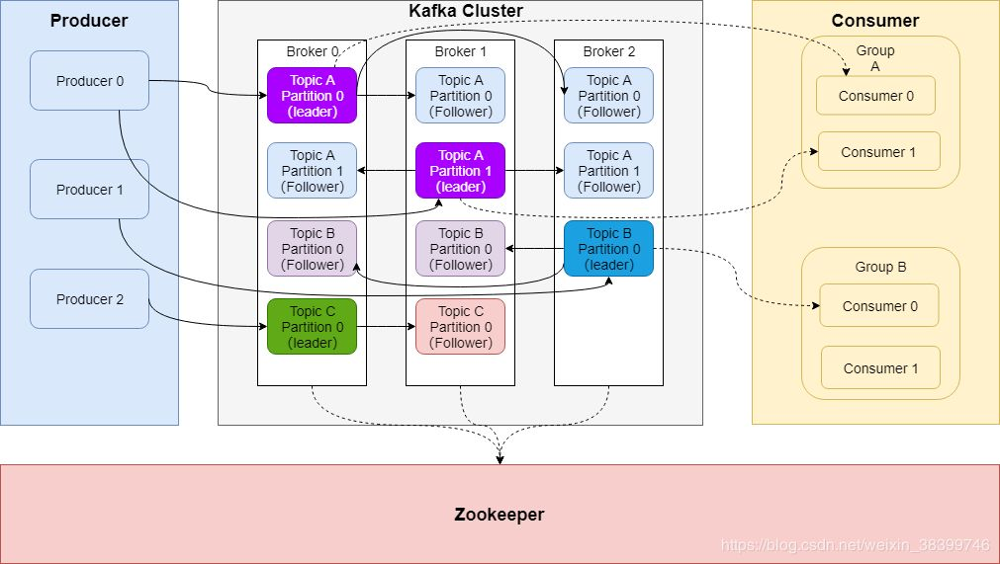
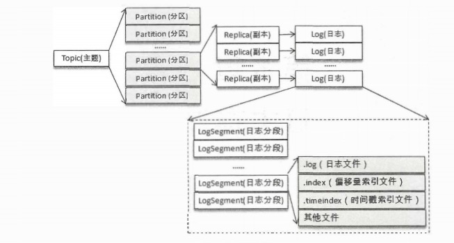
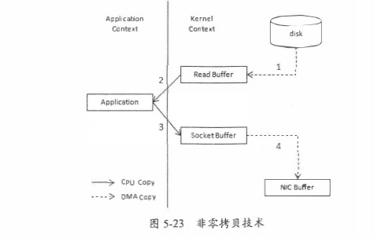
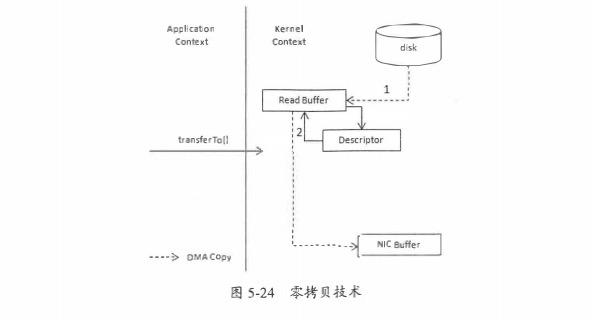
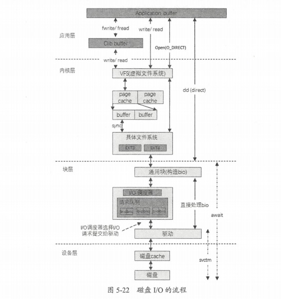

# kafka 架构与原理

## 简要介绍
​		Kafka 起初是由 Linkedin 公司采用 Scala 语言开发的一个多分区、多副本且基于 ZooKeeper协调的分布式消息系统，现己被捐献给 Apache 基金会。目前 Kafka 已经定位为一个分布式流式处理平台，它以高吞吐、可持久化、可水平扩展、支持流数据处理等多种特性而被广泛使用。目前越来越多的开源分布式处理系统如 loudera Storm Spark Flink 等都支持与 Kafka 集成。

## kafka 主要概念

 - Broker

   消息中间件处理结点，一个Kafka节点就是一个broker，多个broker可以组成一个Kafka集群。

 - Topic  主题

   一类消息，kafka管理的基本单位

 - Partition 分区

   topic物理上的分组，一个topic可以分为多个partition，每个partition是一个有序的队列。

 - Replica 副本

   Kafka 为分区引入了多副本 Replica 机制， 通过增加副本数量可以提升容灾能力。同一分区的不同副本中保存的是相同的消息，副本之间是一主多从的关系，其中 leader 副本负责处理读写请求，follower 副本只负责与 leader 副本的消息同步。副本处于不同的 broker ，当 leader 副本出现故障时，从follower 副本中重新选举新的 leader 副本对外提供服务。 Kafka 通过多副本机制实现了故障的自动转移，当 Kafka 集群中某个 broker 失效时仍然能保证服务可用。

 - Segment

   partition物理上由多个segment组成。

 - offset

   每个partition都由一系列有序的、不可变的消息组成，这些消息被连续的追加到partition中。partition中的每个消息都有一个连续的序列号叫做offset，用于partition唯一标识一条消息。

 - Producer 生产者

   负责发布消息到Kafka broker。

 - Consumer 消费者

   负责发布消息到Kafka broker。

 - Consumer Group

   每个Consumer属于一个特定的Consumer Group。

 - Controller
    在 Kafka 集群中会有一个或多个broker，其中有一个broker 会被选举为控制器(Kafka Controller)，它负责管理整个集群中所有分区和副本的状态。 

  当某个分区的leader副本出现故障时， 由控制器负责为该分区选举新的 leader副本。

  当检测到某个分区的 ISR集合发生变化时，由控制器负责通知所有broker更新其元数据信息。

  当使用kafka-topics.sh脚本为某个topic增加分区数量时， 同样还是由控制器负责分区的重新分配。

 - Zookeeper 注册中心，存储kafka的元信息以及做一些协调工作 

   

## kafka 整体架构


 





## 核心实现

- topic 创建

- 生产者生产

  生产者发送消息，首先会获取Topic的元数据信息，缓存中如果不存在topic元数据，则请求Broker 服务拉取元数据。

  - 拉取topic元数据，请求的Broker的选取：是选取的集群最小负载者（依据客户端记录的负载信息）

  - 拉取topic元数据触发时机： 

    条件1: 第一次发送，缓存中没有此topic元数据

    条件2: 据上次更新此topic元数据超过一定时间，超时时间配置，一般分钟级别，默认值各版本不同，有5分钟的，有10分钟的。

    条件3: topic请求异常，如果无法找到 partition 的 leader，向leader发送请求超时等。

   条件2和条件3，结合实现了对 kafka集群扩容和缩容的平滑支持。 

- 消费者消费

  同一group的消费者，在初始分配、新consumer加入、或组内consumer 退出时，会选举组内一个consumer充当‘组长‘，由组长进行组内consumer和对应partition的分配，分配后提交给服务端，由服务端分发到组内每个consumer

- 选主与再平衡

- 延迟消息

- 事务性

## 日志子系统

### 物理结构
```
由于生产者生产的消息会不断追加到 log 文件末尾，为防止 log 文件过大导致数据定位效率低下，Kafka 采取了 分片和 索引机制（默认产生1G数据时候进行分片），将每个 partition 分为多个 segment。每个 segment对应两个文件--“.index”文件和“.log”文件。这些文件位于一个文件夹下，该文件夹的命名规则为：topic 名称+分区序号。例如，first 这个 topic 有三个分区，则其对应的文件夹为 first-0,first-1,first-2
```
 

 

### 存储细节

kafka在日志存储的时候，采用了0拷贝技术，搭配操作系统虚拟页，避免了大量的消息造成的GC压力
并大量节省了IO部分操作

 

 

 

### 零拷贝事例代码

```
public void testSendfile() throws IOException {
60         String host = "localhost";
61         int port = 9026;
62         SocketAddress sad = new InetSocketAddress(host, port);
63         SocketChannel sc = SocketChannel.open();
64         sc.connect(sad);
65         sc.configureBlocking(true);
66 
67         String fname = "src/main/java/zerocopy/test.data";
68         FileChannel fc = new FileInputStream(fname).getChannel();
69         long start = System.nanoTime();
70         long nsent = 0, curnset = 0;
71         curnset = fc.transferTo(0, fc.size(), sc);
72         System.out.println("发送的总字节数:" + curnset + " 耗时(ns):" + (System.nanoTime() - start));
73         try {
74             sc.close();
75             fc.close();
76         } catch (IOException e) {
77             System.out.println(e);
78         }
79     }
```

## 应用场景 

- ESB、分布式事件流
- 日志系统、数据搜集器

## 参数配置

- num.partitions =1 每个topic的分区个数，若是在topic创建时候没有指定的话会被topic创建时的指定参数覆盖

- message.max.bytes =1000000 server可以接收的消息最大尺寸。重要的是，consumer和producer有关这个属性的设置必须同步，否则producer发布的消息对consumer来说太大。

- log.cleaner.delete.retention.ms=7 day 保存时间；保存压缩日志的最长时间；也是客户端消费消息的最长时间，荣log.retention.minutes的区别在于一个控制未压缩数据，一个控制压缩后的数据；会被topic创建时的指定时间覆盖。

- auto.offset.reset： 可理解为kafka consumer读取数据的策略，本地用的kafka版本为0.10，因此该参数可填earliest|latest|none。
  - earliest： 当各分区下有已提交的offset时，从提交的offset开始消费；无提交的offset时，从头开始消费
  - latest： 当各分区下有已提交的offset时，从提交的offset开始消费；无提交的offset时，消费新产生的该分区下的数据
  - none： topic各分区都存在已提交的offset时，从offset后开始消费；只要有一个分区不存在已提交的offset，则抛出异常
  
- auto.create.topics.enable：是否可以自动创建topic。默认是true，消费者或者生产者在获取topic的metadata的时候，如果不存在则自动创建。如果配置成false

  

  各参数参见https://www.cnblogs.com/gxc2015/p/9835837.html

