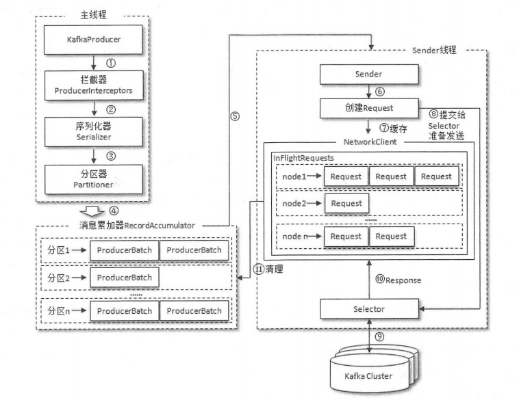
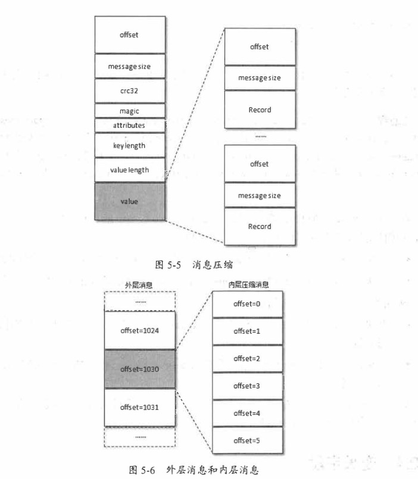
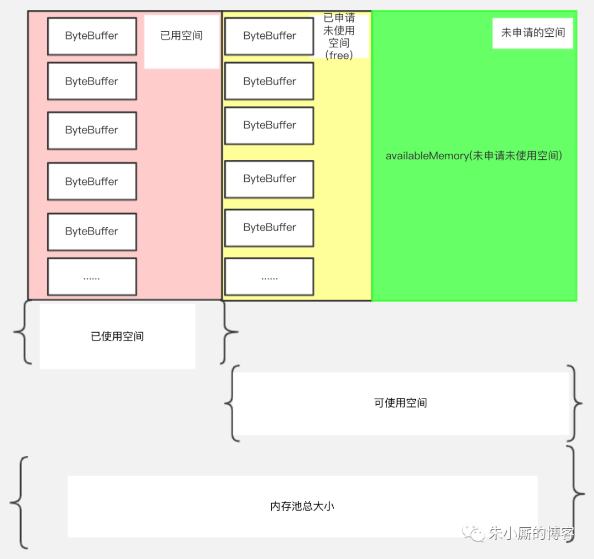
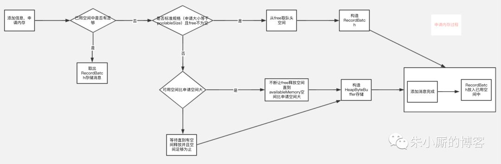
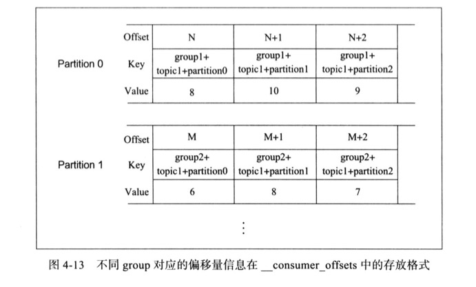
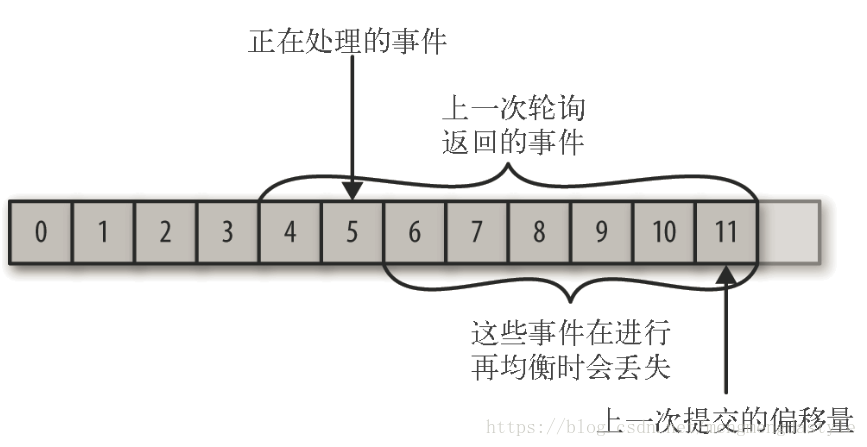
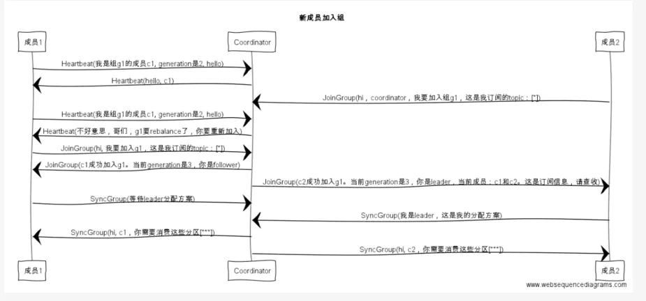

## 简要介绍
 kafka客户端主要由两部分组成，生产者和消费者。

## kafka 生产者

### 主架构图

 

### ProducerRecord 消息体

```java
public class ProducerRecord<K, V> {

  	//主题
    private final String topic; 
  	//分区，用户可以指定。null时系统会自动根据分区策略分配
    private final Integer partition; 
  	//消息头，附加一些元数据，用来扩展使用
    private final Headers headers; 
  	//可空，一般企业会在框架层加个空处理，不然会导致分区负载不均匀（分区器章节会详细说明），我们空处理是使用uuid生成缺省值
    private final K key; 
  	//消息的业务实体部分
    private final V value;
  	//消息时间戳，它有 CreateTime和LogAppendTime两种类型，前者表示消息创建的时间，后者表示消息追加到日志文件的时间
    private final Long timestamp;
}
```


### kafkaProducer 生产者

```java
//构建主要参数
Properties props = new Properties();
props.put("bootstrap.servers", "127.0.0.1:9092,127.0.0.1:9093,127.0.0.1:9094");
props.put("key.serializer","org.apache.kafka.common.serialization.StringSerializer");
props.put("value.serializer","org.apache.kafka.common.serialization.StringSerializer");

//数据在缓冲区中保留的时长,超过时长消息就会被提交到服务器
props.put("linger.ms",10000);
//请求的最大字节数，该值要比max.request.size大，超过时消息就会被提交到服务器
props.put("max.request.size",1048576);

//分区器，可以不设置，后面详细介绍
props.put("partitioner.class","org.apache.kafka.clients.producer.internals.DefaultPartitioner")
//拦截器配置，可以不设置
props.put("interceptor.classes","xxxx")  

//创建KafkaProducer 实例
KafkaProducer<String, String> producer = new KafkaProducer<>(props);
//构建消息体
ProducerRecord<String, String> record = new ProducerRecord<>(kafkaDemo.topicName, "hello, Kafka1");

//往kafka集群推送消息
producer.send(record);
```

为了提升性能，生产者采用了批处理，结合缓存的数量上限和缓存最大时长，来执行批量提交。批量提交也带来了压缩的可实现性。


### 拦截器

生产者拦截器既可以用来在消息发送前 一些准备工作， 比如按照某个规则过滤不符合要的消息、修改消息的内容等，也可以用来在发送 回调逻辑前做一 制化的要求，比如统计类工作。

```java
public Future<RecordMetadata> send(ProducerRecord<K, V> record, Callback callback) {
    // intercept the record, which can be potentially modified; this method does not throw exceptions
    ProducerRecord<K, V> interceptedRecord = this.interceptors.onSend(record);
    return doSend(interceptedRecord, callback);
}
```


### 分区器

分区器的作用就是为消息分配分区。

如果消息ProducerRecord中指定了 partition字段， 那么就不需要分区器的作用， 因为partition代表的就是所要发往的分区号。

如果消息ProducerRecord中没有 指定partition字段，那么就需要依赖分区器，根据key这个字段来计算partition的值。 

Kafka 中提供的默认分区器是**org.apache.kafka.clients.producer.internals.DefaultPartitioner**。

#### 默认分区器分区算法

```java
public int partition(String topic, Object key, byte[] keyBytes, Object value, byte[] valueBytes, Cluster cluster,int numPartitions) {
        if (keyBytes == null) {
          	//从producer实例缓存自动中取
            //取不到随机生成一个 availablePartitions.get(random % availablePartitions.size()).partition();
            return stickyPartitionCache.partition(topic, cluster);
        }
        // 对key进行hash计算，然后通过分区数量计算出一个分区
        return Utils.toPositive(Utils.murmur2(keyBytes)) % numPartitions;
    }
```

**这里要注意，如果key没有做空处理，就会造成每次从缓存中取第一次随机的prtition。*


### 发送过程

1.构建kafkaProducer

2.响应拦截器

3.序列化处理

4.把消息追加到消息叠加器

5.独立Sender线程批量发送消息到kafka集群

以下是部分步骤的源码

```java
private Future<RecordMetadata> doSend(ProducerRecord<K, V> record, Callback callback) {
  
  	*****
    *****
      
 		//如果存在topic的元数据，直接通过，如果不存在，则从服务端拉取元数据，最大等待maxBlockTimeMs毫秒，超时报错
  	//maxBlockTimeMs 默认60秒
  	ClusterAndWaitTime clusterAndWaitTime=waitOnMetadata(record.topic(), record.partition(), nowMs, 				
                                                          maxBlockTimeMs);
  	Cluster cluster = clusterAndWaitTime.cluster;
  
  	*****
    
    //序列化key
    byte[] serializedKey = keySerializer.serialize(record.topic(), record.headers(), 
                                                                 record.key());
  	//序列化value
  	byte[] serializedValue = valueSerializer.serialize(record.topic(), record.headers(), record.value());
      
 		*****
      
    //调用分区器计算分区
  	int partition = partition(record, serializedKey, serializedValue, cluster);
  	
  	//把消息追加到”消息累加器“
  	RecordAccumulator.RecordAppendResult result = accumulator.append(tp, timestamp, serializedKey,serializedValue, headers, interceptCallback, remainingWaitMs, true, nowMs);
  
}
```


### 生产者提交策略

根据 producer 处理此类故障所采取的提交策略类型，有如下三种（交给开发者结合acks配置实现，而不是现成的三种配置类型）：

#### at-least-once：至少一次

​		如果 producer 收到来自 Kafka broker 的确认（ack）或者 acks = all，则表示该消息已经写入到 Kafka。但如果 producer ack 超时或收到错误，则可能会重试发送消息，客户端会认为该消息未写入 Kafka。如果 broker 在发送 Ack 之前失败，但在消息成功写入 Kafka 之后，此重试将导致该消息被写入两次，因此消息会被不止一次地传递给最终 consumer，这种策略可能导致重复的工作和不正确的结果。

#### at-most-once：至多一次

​		如果在 ack 超时或返回错误时 producer 不重试，则该消息可能最终不会写入 Kafka，因此不会传递给 consumer。在大多数情况下，这样做是为了避免重复的可能性，业务上必须接收数据传递可能的丢失。

#### exactly-once：恰好一次

​		即使 producer 重试发送消息，消息也会保证最多一次地传递给最终consumer。该语义是最理想的，但也难以实现，因为它需要消息系统本身与生产和消费消息的应用程序进行协作。 
```
0.11版本的kafka引入了幂等性 ---  无论producer向kafka发送多少相同的消息，kafka知会持久化一条；
也就是说at-least-once + 幂等性 = at-exactly-once

幂等性的原理是什么？
启用幂等性：创建生产者时，设置enable.idompotence参数为true；
启用幂等性的生产者在创建的时候会自动分配一个PID，并且发送给同一个分区的消息会携带序列号SeqNum；
broker端缓存<PID, PartitionKey, SeqNum>，当有相同key的消息时，broker只会持久化一条
```


### 消息压缩

Kafka实现的压缩方式是将多条消息一起进行压缩，这样可以保证较好的压缩效果。 在一般情况下，生产者发送的压缩数据在broker中也是保待压缩状态进行存储的，消费者从服务端获取的也是压缩的消息，消费者在处理消息之前才会解压消息，这样保待了端到端的压缩。

 

### 内存池化管理（生产端）

​		我们知道消息肯定是放在内存中的，大数据场景消息的不断发送，内存中不断存在大量的消息，很容易引起GC，频繁的GC特别是full gc是会造成“stop the world”，也就是其他线程停止工作等待垃圾回收线程执行，继而进一步影响发送的速度影响吞吐量，kafka采用池化进行内存管理的优化。

​		数据的分配过程 总的来说是判断需要存储的数据的大小是否free里有合适的recordBatch装得下，如果装得下则用recordBatch来存储数据，如果free里没有空间但是availableMemory+free的大小比需要存储的数据大（也就是说可使用空间比实际需要申请的空间大），说明可使用空间大小足够，则会用让free一直释放byteBuffer空间直到有空间装得下要存储的数据位置，如果需要申请的空间比实际可使用空间大，则内存申请会阻塞直到申请到足够的内存为止。整个申请过程如下图： 

 



 


### 生产者详细参数

| 名称                                          | 说明                                                         | 默认值                  | 有效值                                  | 重要性   |
| :-------------------------------------------- | :----------------------------------------------------------- | :---------------------- | :-------------------------------------- | :------- |
| bootstrap.servers                             | kafka集群的broker-list，如：<br>hadoop01:9092,hadoop02:9092  | 无                      |                                         | 必选     |
| acks                                          | 确保生产者可靠性设置，有三个选项：<br>acks=0:不等待成功返回<br>acks=1:等Leader写成功返回<br>acks=all:等Leader和所有ISR中的Follower写成功返回,all也可以用-1代替 | -1                      | 0,1,-1,all                              |          |
| key.serializer                                | key的序列化器                                                |                         | ByteArraySerializer<br>StringSerializer | 必选     |
| value.serializer                              | value的序列化器                                              |                         | ByteArraySerializer<br>StringSerializer | 必选     |
| buffer.memory                                 | Producer总体内存大小                                         | 33554432                | 不要超过物理内存，根据实际情况调整      | 建议必选 |
| compression.type                              | 压缩类型<br>压缩最好用于批量处理，批量处理消息越多，压缩性能越好 | 无                      | none、gzip、snappy                      |          |
| retries                                       | 发送失败尝试重发次数                                         | 0                       |                                         |          |
| batch.size                                    | 每个partition的未发送消息大小                                | 16384                   | 根据实际情况调整                        | 建议必选 |
| client.id                                     | 附着在每个请求的后面，用于标识请求是从什么地方发送过来的     |                         |                                         |          |
| connections.max<br>.idle.ms                   | 连接空闲时间超过过久自动关闭（单位毫秒）                     | 540000                  |                                         |          |
| linger.ms                                     | 数据在缓冲区中保留的时长,0表示立即发送<br>为了减少网络耗时，需要设置这个值<br>太大可能容易导致缓冲区满，阻塞消费者<br>太小容易频繁请求服务端 | 0                       |                                         |          |
| max.block.ms                                  | 最大阻塞时长                                                 | 60000                   |                                         |          |
| max.request.size                              | 请求的最大字节数，该值要比batch.size大<br>不建议去更改这个值，如果设置不好会导致程序不报错，但消息又没有发送成功 | 1048576                 |                                         |          |
| partitioner.class                             | 分区类，可以自定义分区类，实现partitioner接口                | 默认是哈希值%partitions |                                         |          |
| receive.buffer.bytes                          | socket的接收缓存空间大小,当阅读数据时使用                    | 32768                   |                                         |          |
| request.timeout.ms                            | 等待请求响应的最大时间,超时则重发请求,超过重试次数将抛异常   | 3000                    |                                         |          |
| send.buffer.bytes                             | 发送数据时的缓存空间大小                                     | 131072                  |                                         |          |
| timeout.ms                                    | 控制server等待来自followers的确认的最大时间                  | 30000                   |                                         |          |
| max.in.flight.<br>requests.per.<br>connection | kafka可以在一个connection中发送多个请求，叫作一个flight,这样可以减少开销，但是如果产生错误，可能会造成数据的发送顺序改变。 | 5                       |                                         |          |
| metadata.fetch<br>.timeout.ms                 | 从ZK中获取元数据超时时间<br>比如topic\host\partitions        | 60000                   |                                         |          |
| metadata.max.age.ms                           | 即使没有任何partition leader 改变，强制更新metadata的时间间隔 | 300000                  |                                         |          |
| metric.reporters                              | 类的列表，用于衡量指标。实现MetricReporter接口，将允许增加一些类，这些类在新的衡量指标产生时就会改变。JmxReporter总会包含用于注册JMX统计 | none                    |                                         |          |
| metrics.num.samples                           | 用于维护metrics的样本数                                      | 2                       |                                         |          |
| metrics.sample.window.ms                      | metrics系统维护可配置的样本数量，在一个可修正的window size。这项配置配置了窗口大小，例如。我们可能在30s的期间维护两个样本。当一个窗口推出后，我们会擦除并重写最老的窗口 | 30000                   |                                         |          |
| reconnect.backoff.ms                          | 连接失败时，当我们重新连接时的等待时间。这避免了客户端反复重连 | 10                      |                                         |          |
| retry.backoff.ms                              | 在试图重试失败的produce请求之前的等待时间。避免陷入发送-失败的死循环中 | 100                     |                                         |          |
|                                               |                                                              |                         |                                         |          |


## kafka 消费者

Kafka中的消费是基于拉模式的。Kafka中的消息消费是一个不断轮询的过程，消费者所要做的就是重复地调用poll()方法，而poll()方法返回的是所有订阅的主题（分区）上的**一组消息**。 

poll()方法的具体定义如下：

public ConsumerRecords<K, V> poll(final Duration timeout) 

### 消费流程

1. 每个consumer都会发送JoinGroup请求到计算出来的coordinator那台机器

2. 然后coordinator从一个consumer group 中取出一个consumer作为leader

3. coordinator把consumer group 情况发送给这个leader

4. 接着leader会负责制定消费方案

5. 通过SyncGroup发送给coordinator

6. 接着coordinator就把消费方案下发给所有的consumer，他们会从指定的分区的leader broker开始进行socket连接和进行消息的消费

7. 把处理完的消息偏移量提交上去

   

### Group Coordinator

每个consumer group 都会选择一个broker作为自己的coordinator，他是负责监控整个消费组里的各个分区的心跳，以及判断是否宕机，和开启rebalance的。

首先对group id 进行hash，接着对__consumer_offsets的分区数量进行取模，默认分区数量是50

__consumer_offsets的分区数量可以通过offsets.topic.num.partitions来设置，找到分区以后，这个分区所在的broker机器就是coordinator机器。 

GroupCoordinator有几项重要的功能
1. 负责处理JoinGroupRequest和SyncGroupRequest完成ConsumerGroup分区分配的工作。
2. 通过GrupMetadataManager和内部Topic"__consumer_offsets"维护offset信息，即使出现消费者宕机也能找回之前提交的offset。
3. 记录ConsumerGroup的相关信息，即使Broker宕机导致ConsumerGroup由新的GroupCoordinator进行管理，新GroupCoordinator也可以知道ConsumerGroup中每个消费者处理哪个分区的消息。
4. 通过心跳检查消费者的状态。 

### 偏移量

 

#### **新旧版本偏移量的变化**

在Kafka0.9版本之前消费者保存的偏移量是在[zookeeper](https://so.csdn.net/so/search?q=zookeeper&spm=1001.2101.3001.7020)中/consumers/GROUP.ID/offsets/TOPIC.NAME/PARTITION.ID。**新版消费者不在保存偏移量到zookeeper中，而是保存在Kafka的一个内部主题中“consumer_offsets”，**该主题默认有50个分区，每个分区3个副本，分区数量有参数offset.topic.num.partition设置。通过消费者组ID的哈希值和该参数取模的方式来确定某个消费者组已消费的偏移量保存到consumer_offsets主题的哪个分区中。

#### 偏移量提交

偏移量提交有自动和手动，默认是自动（**enable.auto.commit = true**）。自动提交的话每隔多久自动提交一次呢？这个由消费者协调器参数auto.commit.interval.ms 毫秒执行一次提交。

  

如果提交的偏移量小于客户端处理的最后一个消息的偏移量，那么处于两个偏移量之间的消息就会被重复处理。

 

如果提交的偏移量大于客户端处理的最后一个消息的偏移量，那么处于两个偏移量之间的消息将会丢失。

##### 自动提交

当 enable.auto.commit 属性被设为 true，那么每过 5s，消费者会自动把从 poll()方法接收到的最大偏移量提交上去。这是因为提交时间间隔由 auto.commit.interval.ms 控制，默认值是 5s。与消费者里的其他东西一样，自动提交也是在轮询里进行的。消费者每次在进行轮询时会检查是否该提交偏移量了，如果是，那么就会提交从上一次轮询返回的偏移量。

##### 手动提交

消费者 API 提供了另一种提交偏移量的方式，开发者可以在必要的时候提交当前偏移量，而不是基于时间间隔。这是我们需要把把 auto.commit.offset 设为 false，让应用程序决定何时提交偏移量。

有些场景我们需要手动提交偏移量，尤其是在一个长事务中并且保证消息不被重复消费以及消息不丢失，比如生产者一个订单提交消息，消费者拿到后要扣减库存，扣减成功后该消息才能提交，所以在这种场景下需要手动提交

###### 同步提交

　　使用 commitSync() 提交偏移量最简单也最可靠。这个 API 会提交由 poll() 方法返回的最新偏移量，提交成功后马上返回，如果提交失败就抛出异常。

```java
public void commitSync(){

    while (true) {
        ConsumerRecords<String, String> records = consumer.poll(100);
        for (ConsumerRecord<String, String> record : records)
        {
            System.out.printf("topic = %s, partition = %s, offset =
                    %d, customer = %s, country = %s\n",
            record.topic(), record.partition(),
                    record.offset(), record.key(), record.value());
        }
        try {
            consumer.commitSync();
        } catch (CommitFailedException e) {
            log.error("commit failed", e)
        }
    } 
}
```

###### 异步提交

同步提交有一个不足之处，在 broker 对提交请求作出回应之前，应用程序会一直阻塞，这样会限制应用程序的吞吐量。我们可以通过降低提交频率来提升吞吐量，但如果发生了再均衡，会增加重复消息的数量。

这个时候可以使用异步提交 API。我们只管发送提交请求，无需等待 broker 的响应。

```java
public void commitAsync(){
    while (true) {
        ConsumerRecords<String, String> records = consumer.poll(100);
        for (ConsumerRecord<String, String> record : records)
        {
            System.out.printf("topic = %s, partition = %s,
                    offset = %d, customer = %s, country = %s\n",
            record.topic(), record.partition(), record.offset(),
                    record.key(), record.value());
        }
        consumer.commitAsync();
    }
}
```

### Rebalance 再平衡

Rebalance 的触发条件有3个。

- 组成员个数发生变化。例如有新的 consumer 实例加入该消费组或者离开组。
- 订阅的 Topic 个数发生变化。这种情况主要发生在基于正则表达式订阅topic情况，当有新匹配的topic创建时则会触发rebalance。
- 订阅 Topic 的分区数发生变化。

Rebalance 发生时，Group 下所有 consumer 实例都会协调在一起共同参与，kafka 能够保证尽量达到最公平的分配。但是 Rebalance 过程对 consumer group 会造成比较严重的影响。在 Rebalance 的过程中 consumer group 下的所有消费者实例都会停止工作，等待 Rebalance 过程完成。

#### Rebalance 过程

Rebalance 过程分为两步：Join 和 Sync。

时序图：



#### 分组分区策略

分区的分配方案是有客户端具体执行，根据客户端策略配置进行分区分配。分配策略自带有三个RoundRobin（轮循分配），Range（范围策略），StickyAssignor（粘性分配，在分配均匀的情况下，优先分配上轮的分区）。

也可以自定分配策略，可以在subscription()方法内部添加一些影响分配的用户自定义信息，赋予userData, 比如权重、IP地址、 host或机架(rack)等。 比如多机房异地多活，多机架的场景下，可以根据ip或机架就近分配。


## 延时消息

kafka原生没有提供延迟消息的支持，都是自研方案。常规解决方案如下

 


xx采用的类似上图的方案，只是没有对延迟进行分级，以下是xx封装的部分代码

```java
private void privateEnqueue(String finalTopicName,
                            XxMessage<?> message,
                            boolean regardingDelay,
                            Runnable action,
                            boolean byTrans) {
    String topicToSend;
    if (regardingDelay && message.getDelayTimeSeconds() > 0) {
        message.setOriginalTopicName(finalTopicName);
        topicToSend = KafkaContents.DEFAULT_DELAY_TOPIC;
    } else {
        topicToSend = finalTopicName;
    }
    KafkaSendingRecord<YitMessage<?>> record = new KafkaSendingRecord<>(
        topicToSend,
        message,
        byTrans,
        false,
        action
    );
    kafka.enqueue(record);
}
```


## 事务

Kafka 的事务指的并不是生产与消费过程的事务性，而是生产者批量提交消息时，保障本批次要么全部提交成功，要么全部失败。一般性不常使用，此处暂不做详解。
