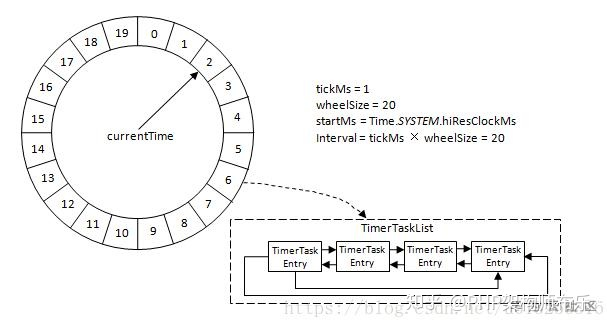
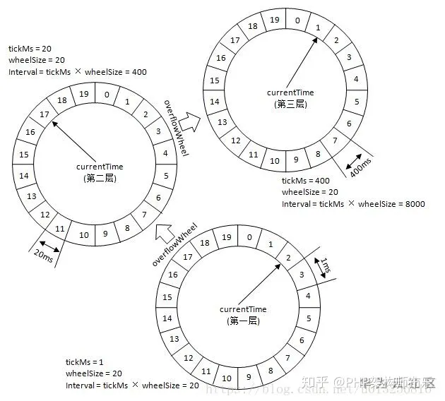
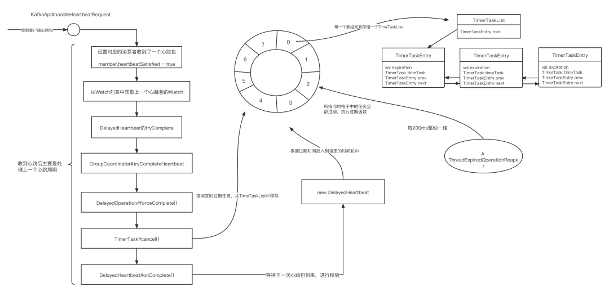

## 延时手段
```
		Java中提供了 Timer、DelayQueue 和 ScheduledThreadPool等若干种方式来实现延时任务。为什么还要有时间轮呢？
		总的来说 Timer 、ScheduledThreadPool 和 DelayQueue 都是通过优先队列来获取最早需要执行的任务，优先队列的数据结构又是用堆来实现的，因此插入和删除任务的时间复杂度都为O(logn)，并且 Timer 、ScheduledThreadPool 的周期性任务是通过重置任务的下一次执行时间来完成的。
		问题就出在时间复杂度上，插入删除时间复杂度是O(logn)，那么假设频繁插入删除次数为 m，总的时间复杂度就是O(mlogn)，这种时间复杂度满足不了 Kafka 这类中间件对性能的要求，而时间轮算法的插入删除时间复杂度是O(1)。
```

## 时间轮
#### 设计思想
```
		Kafka时间轮是Kafka实现高效的延时任务的基础，它模拟了现实生活中的钟表对时间的表示方式，同时，时间轮的方式并不仅限于Kafka，它是一种通用的时间表示方式，这里主要介绍Kafka中的时间轮原理。
		时间轮用环形数组实现，数组的每个元素可以称为槽bucket，和 HashMap一样称呼。槽的内部用双向链表存着待执行的任务，添加和删除的链表操作时间复杂度都是 O(1)，槽位本身也指代时间精度，比如1秒扫1个槽，那么这个时间轮的最高精度就是1秒。
		也就是说延迟 1.2 秒的任务和 1.5 秒的任务会被加入到同一个槽中，然后在 1 秒的时候遍历这个槽中的链表执行任务。
```

```
		如上图所示，一轮是20ms，那假设现在要加入一个50ms后执行的任务怎么办？这槽好像不够啊？难道要加槽嘛？和HashMap一样扩容？
		不是的，常见有两种方式，一种是通过增加轮次的概念。50 % 20 = 10，即应该放在槽位是10的位置。然后 50/20 = 2，另外维护一个轮数记为2。也就是说当循环2轮之后扫到槽位10会触发这个任务。Netty 中的 HashedWheelTimer 使用的就是这种方式。
		还有一种是通过多层次的时间轮，这个和我们的手表就更像了，像我们秒针走一圈，分针走一格，分针走一圈，时针走一格。多层次时间轮就是这样实现的。假设上图就是第一层，那么第一层走了一圈，第二层就走一格。可以得知第二层的一格就是20ms，假设第二层也是20个槽，那么第二层走一圈，第三层走一格，可以得知第三层一格就是400ms。
		而多层次时间轮还会有降级的操作，假设一个任务延迟 500 ms执行，那么刚开始加进来肯定是放在第三层的，当时间过了100ms后，此时还需要400ms就会触发任务的执行，而此时相对而言它就是个延迟400ms的任务，因此它会被降低放在第二层中，第一层还放不下它。再过个380ms，相对而言它就是个延迟20ms后执行的任务，因此它会再被降级放在第一层中，等待执行。降级是为了保证时间精度一致性。Kafka内部用的就是多层次的时间轮算法
```


#### 空推进
```
		如果下一个执行的任务距离现在还有1小时，那中间的时间段一直在一个一个的推进检查就白白浪费了资源，这种情况就叫“空推进”。
		因此，为了减少这种“空推进”，Kafka引入了DelayQueue，在插入一个任务时，若该bucket是首次插入，需要将该bucket加入DelayQueue中。每当有bucket到期，即queue.poll能拿到结果时，才进行时间的“推进”。简单点说就是又引入了一个延时队列，这个延时队列是装bucket的，等最近的bucket到期就处理掉。
```

## 在kafka中的应用

```
		Kafka中存在一些定时任务(DelayedOperation)，如DelayedFetch、DelayedProduce、DelayedHeartbeat等，在Kafka中，定时任务的添加、轮转、执行、消亡等是通过时间轮来实现的。下图是心跳检测的流程。
```


## 参考资料
[面试官：知道时间轮算法吗？在Netty和Kafka中如何应用的？](https://blog.51cto.com/u_15659694/5717987)
[Kafka的心跳处理机制竟然用到了时间轮算法？](https://mp.weixin.qq.com/s?__biz=MzI2MzEwNTY3OQ==&mid=2648983546&idx=1&sn=bef09078bdd8e5bd8749b4d770446776&chksm=f2501a1ac527930c68327d9528cccb4788a2aa85da66aa9891ec81b833e7d861196637ba4749&scene=27)
[Kafka时间轮原理](https://zhuanlan.zhihu.com/p/299390511)
