# Mysql Log 体系		

## log类型
- errorlog（错误日志）：记录着 mysqld 启动和停止，以及服务器在运行过程中发生的错误及警告相关信息
- slow query log（慢查询日志）：用来记录执行时间超过 long_query_time 这个变量定义的时长的查询语句
- general log（通用查询日志）：是 MySQL 中记录最详细的日志，会记录所有的查询语句。默认情况下是关掉的。在很难定位到sql问题时，可以短暂开启查看查询的sql内容，之后再关掉
- redo log（重做日志）：确保事务的持久性，防止在发生故障的时间点，尚有脏页未写入磁盘     
    - 脏页：当内存数据页和磁盘数据页上的内容不一致时,我们称这个内存页为脏页  
- undo log（回滚日志）：保存了事务发生之前的数据的一个版本，可以用于回滚，确保了事务的原子性
    - undolog也在数据页中，被当成数据落盘到 undo表空间
- binlog（归档日志）：记录了数据库所有执行的DDL和DML语句（除了数据查询语句select、show等，而general log会记录所有的），以事件形式记录并保存在二进制文件中。常用于数据恢复和主从复制
- relay log（中继日志）：中继日志用于主从复制架构中的从服务器上，从服务器的 slave 进程从主服务器处获取二进制日志的内容并写入中继日志，然后由 IO 进程读取并执行中继日志中的语句

***

## 知识铺垫
	Mysql 架构
	1.binlog属于Server这层    
	2.redo log属于存储引擎层，并且是InnoDB存储引擎独有的。MyIsam没有安全恢复能力  
 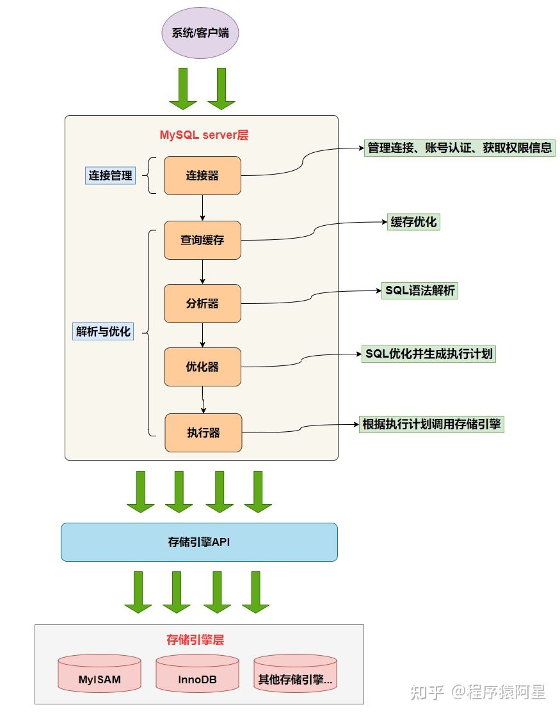


	存储引擎职责
	1.数据是从内存查还是从硬盘查    
	2.数据是更新在内存，还是硬盘    
	3.内存的数据什么时候同步到硬盘        
 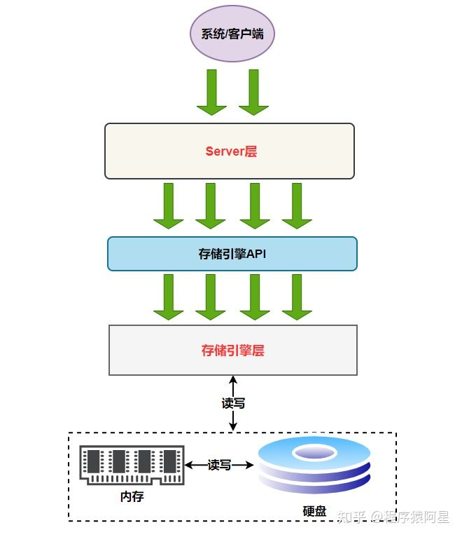

	存储引擎数据层
	1.MySQL表数据是以页为单位，查询一条记录会从硬盘中把一页的数据加载出来，加载出来的数据叫数据页，会放入到 Buffer Pool 中，每个数据页16KB    
	2.缓冲池（Buffer Pool）里面会缓存很多的数据，比如数据页、索引页、锁信息等等。    
	3.后续的查询先从 Buffer Pool 中找，没有命中再去硬盘加载，减少硬盘 IO 开销，提升性能  
	
	缓冲池的刷盘时机：脏页的数量达到了 Buffer Pool 中页数量的 10%，就会触发将 Flush 链表中的脏页刷入磁盘
 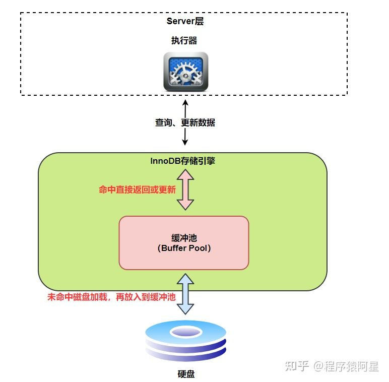

	Mysql数据页  
	
	为了避免一条一条读取磁盘数据，InnoDB采取页的方式，作为磁盘和内存之间交互的基本单位，一个页的大小一般是16KB。  
	
	InnoDB为了不同的目的而设计了多种不同类型的页。
	比如：存放表空间头部信息的页、存放undo日志信息的页等等。我们把存放表中数据记录的页，称为索引页or数据页  

 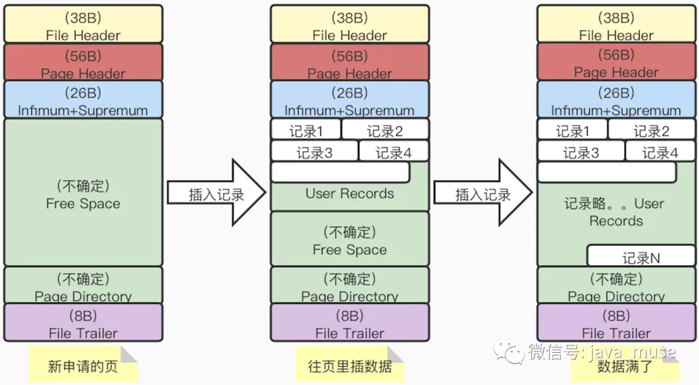

***

## 重点讲述 binlog、redo log、undo log、relay log

### 1. redo log
	确保事务的持久性，防止在发生故障的时间点，尚有脏页未写入磁盘，用于宕机恢复  

> redo log解决什么问题？      
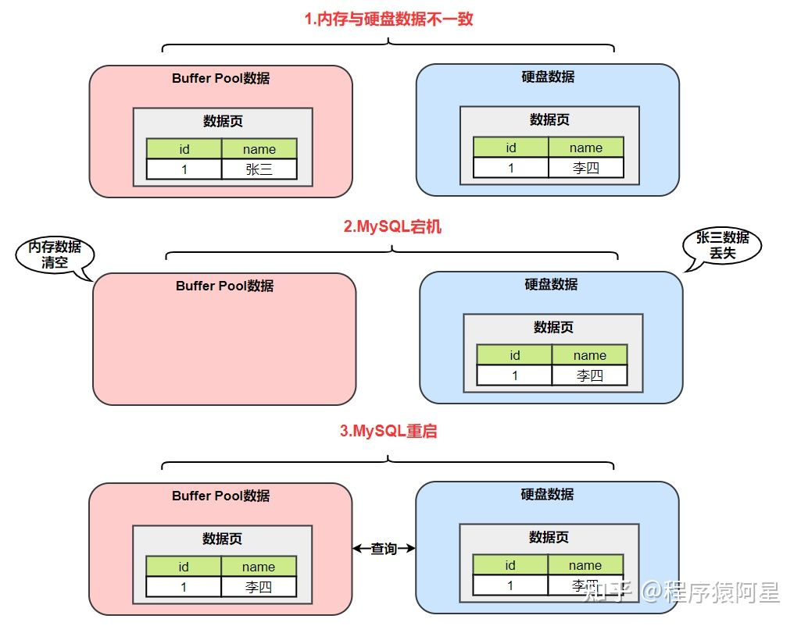

> 用redo log解决问题      
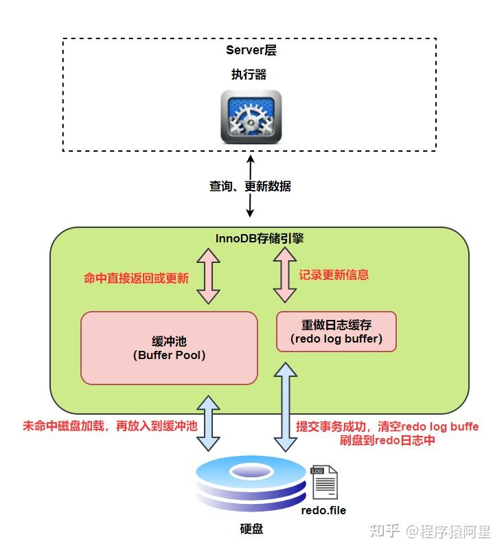
 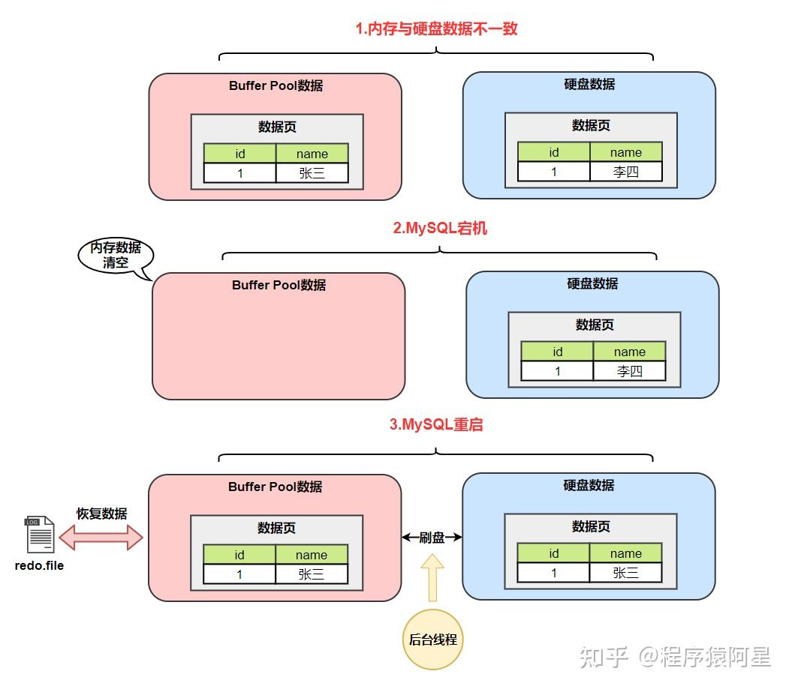

> redo log的刷盘时机
> redo log也是先放缓存，后续再刷盘，InnoDB存储引擎为redo log的刷盘策略提供了innodb_flush_log_at_trx_commit参数，它支持三种策略（另外，在redo log buffer空间不足、脏页刷盘时、做checkpoint时也会触发redo log刷盘）
>
> - 设置为0的时候，表示每次事务提交时不进行刷盘操作  
>    - 当mysql崩溃或者宕机会丢失1秒钟数据（为什么是1秒，接着往下看）
> - 设置为1的时候，表示每次事务提交时都将进行刷盘操作（默认值）  
>    - 当mysql崩溃或者宕机不会丢失数据
> - 设置为2的时候，表示每次事务提交时都只把redo log buffer内容写入page cache（这玩意是操作系统接管的，不属于mysql控制的范围，只要系统不宕机就没事）   
> 	- 仅在服务器宕机时会丢失1秒钟数据，因为数据已经刷新到了系统文件缓存  
```
什么是页缓存（Page Cache，对应内存区域）
		我们知道文件一般存放在硬盘（机械硬盘或固态硬盘）中，CPU 并不能直接访问硬盘中的数据，而是需要先将硬盘中的数据读入到内存中，然后才能被 CPU 访问。
		由于读写硬盘的速度比读写内存要慢很多（DDR4 内存读写速度是机械硬盘500倍，是固态硬盘的200倍），所以为了避免每次读写文件时，都需要对硬盘进行读写操作，Linux 内核使用页缓存（Page Cache）机制来对文件中的数据进行缓存。
		为了提升对文件的读写效率，Linux 内核会以页大小（4KB）为单位，将文件划分为多数据块。当用户对文件中的某个数据块进行读写操作时，内核首先会申请一个内存页（称为页缓存）与文件中的数据块进行绑定。如下图所示：
```
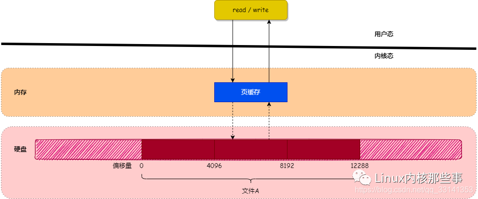

```
另外InnoDB存储引擎有一个后台线程，每隔1秒，就会把redo log buffer中的内容写到文件系统缓存（page cache），然后调用fsync刷盘。  
```

 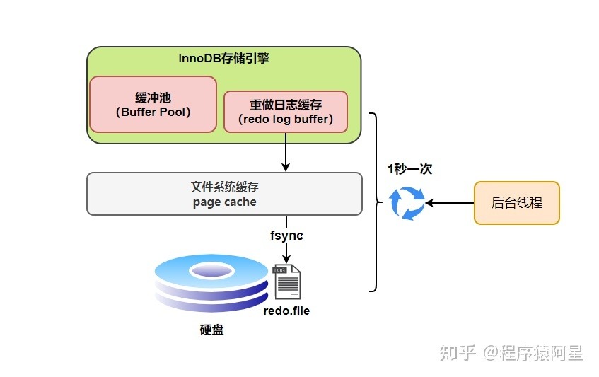

>三种配置的刷盘时机       

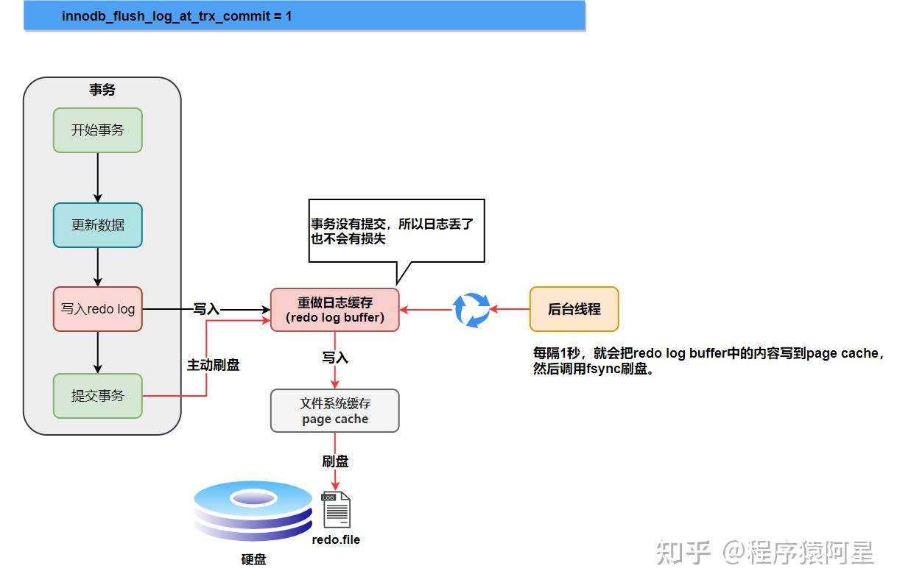
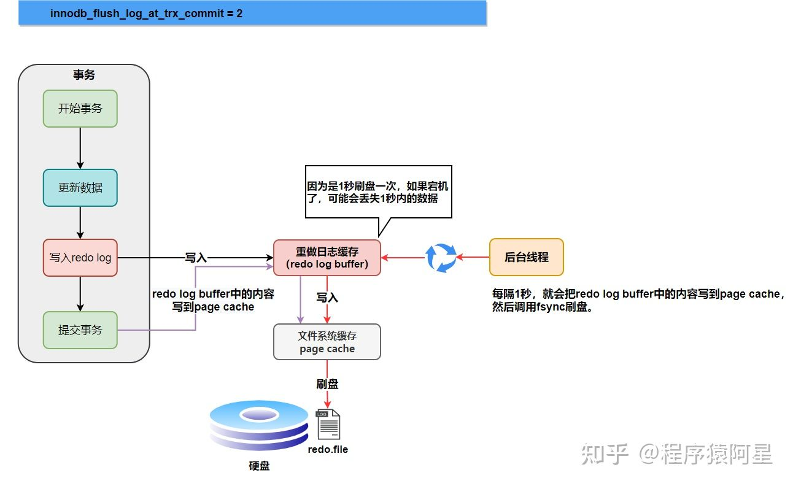

**※延伸思考，当能够简单的解决问题时就不要增加不必要的东西，一个东西的加入可能带来几个补丁的加入，系统复杂度会直线飙升。l例如这里为了解决磁盘性能，引入了缓冲池，为了解决数据不一致又引入了redolog，当然这里的redo log是值得的。后续会发现磁盘几乎是所有存储组件的瓶颈，mysql、es最终都是为解决磁盘问题提出了一系列的方案。**  


### 2. undo log
	保存了事务发生之前的数据版本，可以用于回滚，undolog也在数据页中，被当成数据落盘到undo表空间，另外undolog也有对应的redolog

>行记录隐藏列
>- DB_ROW_ID：如果没有为表显式的定义主键，并且表中也没有定义唯一索引，那么InnoDB会自动为表添加一个row_id的隐藏列作为主键	
>- DB_TRX_ID：事务中对某条记录做增删改时，就会将这个事务的事务ID写入trx_id中
>- DB_ROLL_PTR：回滚指针，本质上就是指向 undo log 的指针     
	

	undo log类型		
- TRX_UNDO_INSERT_REC（insert undo）：需要记录INSERT这行数据的主键ID信息，或者唯一列信息      

```mysql
INSERT INTO account(id,card,balance) VALUES (1, 'AA', 0),(2, 'BB', 0);
```
>  

- TRX_UNDO_DEL_MARK_REC（delete undo）    
>1. 首先是用户线程执行删除时，会先将记录头信息中的 delete_mask 标记为 1，而不是直接从页中删除，因为可能其它并发的事务还需要读取这条数据  
>2. 提交事务后，后台有一个 purge 线程会将数据真正删除          

```mysql
INSERT INTO account(id,card,balance) VALUES (1, 'AA', 0),(2, 'BB', 0);
DELETE FROM account WHERE id = 2;
```
>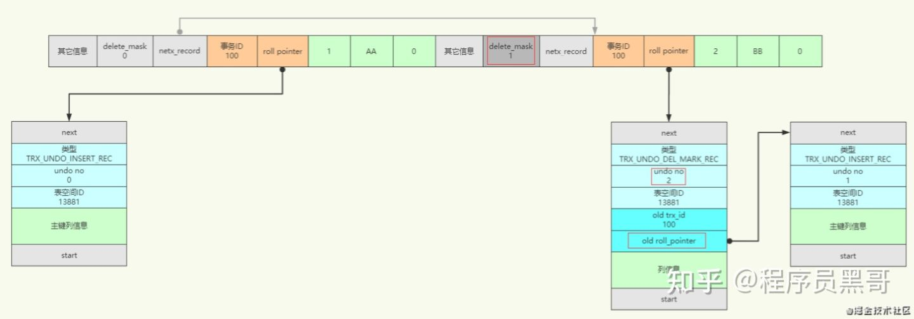  

- TRX_UNDO_UPD_EXIST_REC（update undo）：根据是否更新主键分为了两种情况，不更新主键和更新主键  

> 不更新主键时:  
>- 存储空间未发生变化  
>	- 更新记录时，对于被更新的每个列来说，如果更新后的列和更新前的列占用的字节数都一样大，那么就可以进行就地更新，也就是直接在原记录的基础上修改对应列的值
>- 存储空间发生变化  
>	- 如果有任何一个被更新的列更新前和更新后占用的字节数大小不一致，那么就会先把这条旧的记录从聚簇索引页面中删除掉（直接进入垃圾链，不是操作delete mark），然后再根据更新后列的值创建一条新的记录插入到页面中  

```mysql
INSERT INTO account(id,card,balance) VALUES (1, 'AA', 0),(2, 'BB', 0);
DELETE FROM account WHERE id = 2;
UPDATE account SET card = 'CC' WHERE id = 1;
-- 下图演示的是就地更新
```
>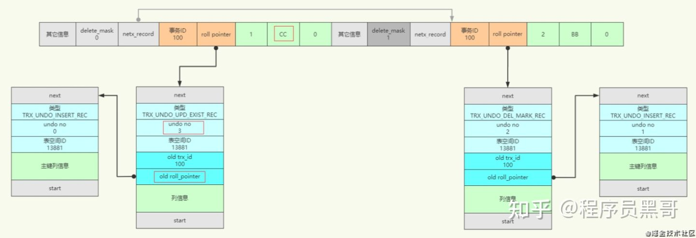  

***

>更新主键时:  
>- 数据记录是按主键大小连成一个单向链表的，如果更新了某条记录的主键值，这条记录的位置也将发生改变，也许就被更新到其它页中了
>	- 首先将原记录做标记删除，就是将 delete_mask 改为 1，还没有真正删除
>	- 然后再根据更新后各列的值创建一条新记录，并将其插入到聚簇索引中  

```mysql
INSERT INTO account(id,card,balance) VALUES (1, 'AA', 0),(2, 'BB', 0);
DELETE FROM account WHERE id = 2;
UPDATE account SET card = 'CC' WHERE id = 1;
UPDATE account SET id = 3 WHERE id = 1;
````
>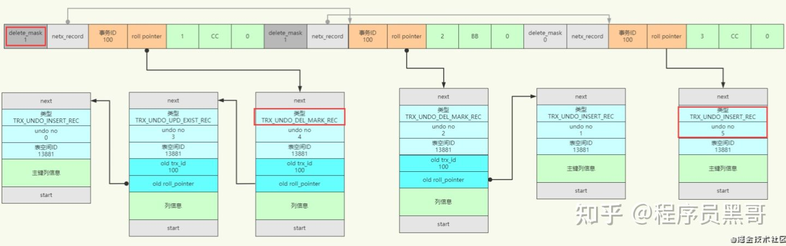

    undo log 回滚  
>前面在一个事务中增删改产生的一系列 undo log，都有 undo no 编号的。在回滚的时候，就可以应用这个事务中的 undo log，根据 undo no 从大到小开始进行撤销操作。每个事务都对应一个或多个undo链表，详细内容查看undolog详解。

>例如上面的例子如果最后回滚了：

>就会先执行第 5 号 undo log，删除 id=3 这条数据  
接着第4号 undo log，取消标记删除，将 id=1 这条数据的 delete_mask 改为 0  
接着第3号 undo log，将更新的列card='CC'还原为原来的card='AA'  
接着第2号 undo log，取消标记删除，将 id=2 这条数据的 delete_mask 改为 0  
接着第1号 undo log，删除 id=2 这条数据  
接着第0号 undo log，删除 id=1 这条数据  


### 3.binlog

	在实际应用中，binlog 的主要使用场景有两个，分别是主从复制和数据恢复（只能从过去时间点的数据往后续时间点恢复，比如一个月之前备份了一次数据，通过binlog把最近一个月的变化追加上来）

#### 刷盘时机

>	对于InnoDB 存储引擎而言，只有在事务提交时才会记录biglog，此时记录还在内存中，那么biglog是什么时候刷到磁盘中的呢？mysql通过sync_binlog参数控制biglog的刷盘时机，取值范围是0-N：  

>- 0：不去强制要求，由系统自行判断何时写入磁盘  
>- 1：每次commit的时候都要将binlog写入磁盘(默认设置)  
>- N：每 N 个事务，才会将binlog写入磁盘  

#### 日志格式  

>- STATMENT：基于SQL语句的复制 (statement-based replication, SBR)，每一条会修改数据的 sql 语句会记录到binlog中。  
	-- 优点：不需要记录每一行的变化，减少了binlog日志量，节约了IO, 从而提高了性能  
	-- 缺点：在某些情况下会导致主从数据不一致，比如执行sysdate()、slepp()等

>- ROW（默认设置）：基于行的复制 (row-based replication, RBR)，不记录每条 sql 语句的上下文信息，仅需记录哪条数据被修改了  
	-- 优点：不会出现某些特定情况下的存储过程、或 function、或 trigger 的调用和触发无法被正确复制的问题 
	-- 缺点：会产生大量的日志，尤其是alter table的时候会让日志暴涨  

>- MIXED：基于STATMENT和ROW两种模式的混合复制 (mixed-based replication, MBR)，一般的复制使用STATEMENT模式保存binlog，对于STATEMENT模式无法复制的操作使用ROW模式保存binlog

### 4.relay log  

	中继日志用于主从复制架构中的从服务器上，从服务器的 slave 进程从主服务器处获取二进制日志的内容并写入中继日志，然后由 IO 进程读取并执行中继日志中的语句

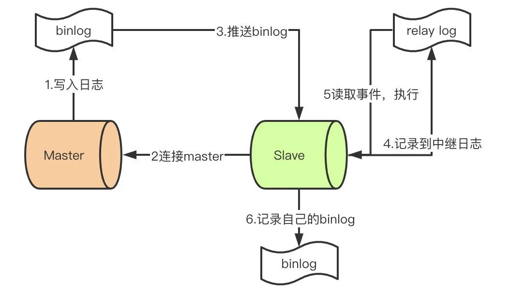

1. Master收到客户端请求语句，在语句结束之前向二进制日志写入一条记录，可能包含多个事件  
2. 此时，一个Slave连接到Master，Master的dump线程从binlog读取日志并发送到Slave的IO线程  
3. IO线程从master.info读取到上一次写入的最后的位置  
4. IO线程写入日志到relay-log中继日志，如果超过指定的relay-log大小，写入轮换事件，创建一个新的relay-log  
5. 更新master.info的最后位置  
6. SQL线程从relay-log.info读取进上一次读取的位置  
7. SQL线程读取日志事件  
8. 在数据库中执行sql  
9. 更新relay-log.info的最后位置  
10. Slave记录自己的binlog日志


## QA
- buffer pool的脏数据有没有可能刷到磁盘
	- 很正常，此时相应的redolog也会被落盘，通过redolog把undolog恢复出来，再通过undolog把数据恢复。http://catkang.github.io/2019/01/16/crash-recovery.html，https://www.zhihu.com/question/280581623/answer/929816984
- redo log的存储是数据页的形式还是只是数据页的某个点?  
    - 每条redo记录由“表空间号+数据页号+偏移量+修改数据长度+具体修改的数据”组成
- undo log的redolog刷盘是怎样的  
	- undo log也是在数据页中，数据页的更改都会记录相应的redolog
	- 一个事务里产生的若干undo log，每条undo log页修改对应的redo log是何时刷盘，如果也是等待事务提交时刷盘，那么被更新的脏页（表数据）如果在事务还没提交之前落盘了，这时突然停电redolog还没落盘，那硬盘里的错误数据应该怎么恢复呢？
    - 不存在这种情况，当脏页刷盘时会把这个脏页对应的redolog也会刷盘
  

***

## 参考文档
[浅谈 MySQL InnoDB 的内存组件](https://zhuanlan.zhihu.com/p/402583191)    
[聊聊redo log是什么？](https://zhuanlan.zhihu.com/p/408175328)  
[MySQL事务原子性之UndoLog，图文结合带你直击核心](https://zhuanlan.zhihu.com/p/383824552)  
[MySQL——数据页](https://mp.weixin.qq.com/s?src=11&timestamp=1639549691&ver=3497&signature=cDds8aYy7Q2fWZTq2179QFmXu7guXZ7f8dWKWJgPuQ7u2WKAbYk-XZ5o973X6Q5XTSTX*1XwlLUJB909QzoH5yty56f6X8kfHGHFWKYJP2Gkq*nLEaPl*CdU1UjHiyUt&new=1)  
[【MySQL】binlog、redo log和undo log](https://mp.weixin.qq.com/s?src=11&timestamp=1639382911&ver=3493&signature=mZKwQ9so4a*QPuVdFMZ9xyQdHAapIWS8AD0uXtSripBcNwy06zR0sgqnKfaQUsDfdR1IOBRveSb0mxvXR7wT5Q*cvnCBacLKZH3yRNhkZG*pbA1vkr6aOkSM1p59OWoz&new=1)  
[带你解析MySQL binlog](https://mp.weixin.qq.com/s?__biz=MzI2NTA3OTY2Nw==&mid=2647634733&idx=1&sn=c4cdd6b5af410026d60bffa8c7c4da3b&chksm=f299cd31c5ee442747b8ce128b3062e3678460b829311c7ed39c7a99f880d143d0b8a4725844&scene=21#wechat_redirect)  
[Mysql的binlog和relay-log到底长啥样？](https://mp.weixin.qq.com/s?src=11&timestamp=1639390014&ver=3494&signature=N-UqDpI3n5buUQRL4u6FG6xi0GVlbkprwgvE-TBUlk*TY2aPIxgF5bjzANsHV2G4yQ9*m3byNiATALD3wpLPMRc7x1A6a5sgNMizOviug7WDd8wda7qG96cDY*U70JoW&new=1)
[Buffer Pool 为了让 MySQL 变快都做了什么？！！](https://mp.weixin.qq.com/s?src=11&timestamp=1639659160&ver=3500&signature=afYuHUGUpnVbbPUJpTgCC13m0XPKesbI6CwrVDIiEDs45KqXwr9hcTI0oFC4qeunpy8rycz*rGYccCCsvS4h8rokQXRuR05jSwVQpwHl9d*ZSLO0PuGcDoJcTwETM62c&new=1)
[redo log的刷盘策略](https://blog.csdn.net/weixin_42148897/article/details/125657325)
