## 概述
```
		undolog是mysql中比较重要的事务日志之一，顾名思义，undo log是一种用于撤销回退的日志，在事务没提交之前，MySQL会先记录更新前的数据到 undolog日志文件里面，当事务回滚时或者数据库崩溃时，可以利用 undolog来进行回退，保证了事务的原子性。在mysql log体系里已经介绍了undolog的大体流程，本篇只做深入的介绍。再次之前先介绍下事务id的生成和PAGE_FREE垃圾链表。
```

## 事务id的生成
```
		每行数据有三个隐式列，行id、回滚指针、事务id。其中回滚指针是用来串联本行数据的undolog。这里拓展说下事务id的生成。
		如果某个事务执行过程中对某个表执行了增、删、改操作，那么 InnoDB 存储引擎就会给它分配一个独一无二的事务id。注意，查询操作是不分配事务id的，要等到事务内第一个增删改查操作才分配。
```

#### 分配方式

​		这个事务id本质上就是一个数字，它的分配策略和我们前边提到的对隐藏列 row_id （当用户没有为表创建主键和 UNIQUE 键时 InnoDB 自动创建的列）的分配策略大抵相同，这样就可以保证整个系统中分配的事务id值是一个递增的数字。先被分配 id 的事务得到的是较小的事务id ，后被分配 id 的事务得到的是较大的事务id 。

​		服务器会在内存中维护一个全局变量，每当需要为某个事务分配一个 事务id 时，就会把该变量的值当作 事务id 分配给该事务，并且把该变量自增1。

​		每当这个变量的值为 256 的倍数时，就会将该变量的值刷新到系统表空间的页号为 5 的页面中一个称之为Max Trx ID 的属性处，这个属性占用 8 个字节的存储空间。当系统下一次重新启动时，会将上边提到的 Max Trx ID 属性加载到内存中，将该值加上256之后赋值给我们前边提到的全局变量（因为在上次关机时该全局变量的值可能大于 Max Trx ID 属性值）。


## PAGE_FREE
```
		插入到页面中的记录会根据记录头信息中的 next_record 属性组成一个单向链表，我们把这个链表称之为正常记录链表，而被删除的记录也会记录在头信息中的next_record属性组成一个链表，这个链表所占的空间可以重复利用，所以称为垃圾链表。在Page Header部分有一个称之为PAGE_FREE的属性，他指向被删除记录的垃圾链表中的节点，可以想象成下面的结构。垃圾链表在后边会用到。
```
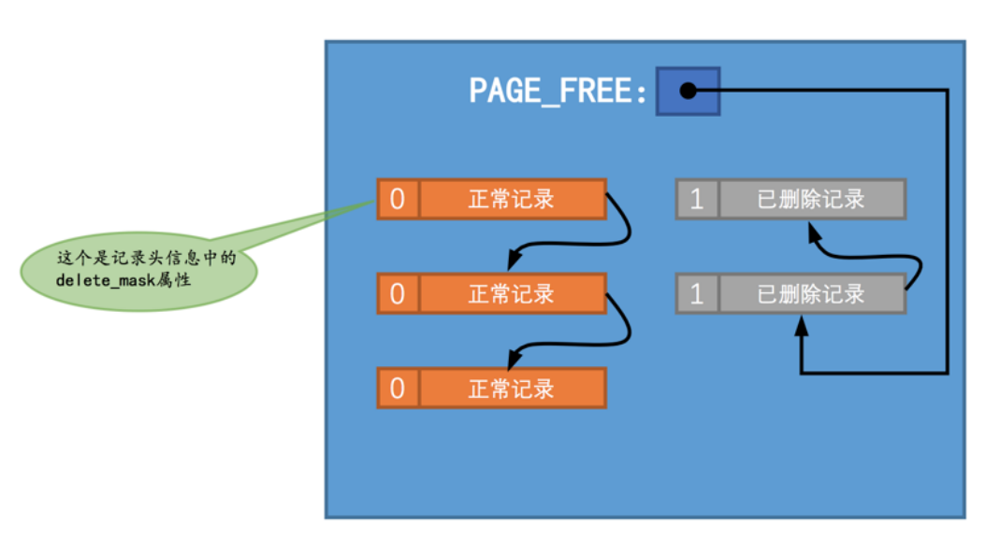


## undolog格式

#### INSERT语句

```
		插入一条记录时，记录被放到了一个数据页中。如果希望回滚这个插入操作，那么把这条记录删除就好了，也就是说在写对应的 undo 日志时，主要是把这条记录的主键信息记上即可。所以设计 InnoDB 的大叔设计了一个类型为TRX_UNDO_INSERT_REC 的 undo日志。
		undo no 在一个事务中是从 0 开始递增的，也就是说只要事务没提交，每生成一条 undo日志 ，那么该条日志的 undo no 就增1。
		如果记录中的主键只包含一个列，那么在类型为 TRX_UNDO_INSERT_REC的 undo日志 中只需要把该列占用的存储空间大小和真实值记录下来，如果记录中的主键包含多个列，那么每个列占用的存储空间大小和对应的真实值都需要记录下来（图中的len就代表列占用的存储空间大小，value 就代表列的真实值）。
		当我们向某个表中插入一条记录时，实际上需要向聚簇索引和所有的二级索引都插入一条记录。不过记录undo日志时，我们只需要考虑向聚簇索引插入记录时的情况就好了，因为其实聚簇索引记录和二级索引记录是一一对应的，我们在回滚插入操作时，只需要知道这条记录的主键信息，然后根据主键信息做对应的删除操作，做删除操作时就会顺带着把所有二级索引中相应的记录也删除掉。后边说到的DELETE操作和UPDATE操作对应的undo日志也都是针对聚簇索引记录而言的。
```

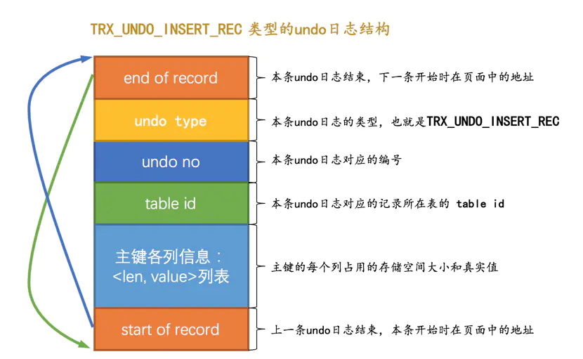


#### DELETE语句

```
		在行记录信息的记录头中有个叫做 delete_mask 的标志位，表示着该记录是否被删除，0为正常记录，1为被删除记录。但是，1的所谓的被删除记录只是用户找不到这个数据了，并非完全被删除了。

实际上的删除是要经历两个阶段的：
>阶段一（delete mark）：将 delete_mask 置为1（同时还会修改trx_id，roll_pointer……），但是没有移动到垃圾链表中。
>阶段二（purge）：会有后台线程将 delete_mask=1的记录从正常记录的链表移动到垃圾链表中，并调节一些页面其他信息。

		页面的Page Header部分有一个PAGE_GARBAGE属性，该属性记录着当前页面中可重用存储空间占用的总字节数。每当有已删除记录被加入到垃圾链表后，都会把这个PAGE_GARBAGE属性的值加上该已删除记录占用的存储空间大小。当有新插入的记录，会根据此属性看是否可以容纳；如果不可以容纳直接申请新的空间来存储这条记录；如果可以容纳，那么直接重用垃圾链表开始的可重用空间，可是如果插入的这条记录不大于这个可用空间的头结点，会出现碎片空间即这一点用不到的地方；也许你会想这点空间永远用不到了吗，当然不是PAGE_GARBAGE属性会记录下来，这些碎片空间在整个页面快使用完前并不会被重新利用，不过当页面快满时，如果再插入一条记录，此时页面中并不能分配一条完整记录的空间，这时候会首先看一看PAGE_GARBAGE的空间和剩余可利用的空间加起来是不是可以容纳下这条记录，如果可以的话，InnoDB会尝试重新组织页内的记录，重新组织的过程就是先开辟一个临时页面，把页面内的记录依次插入一遍，因为依次插入时并不会产生碎片，之后再把临时页面的内容复制到本页面，这样就可以把那些碎片空间都解放出来（很显然重新组织页面内的记录比较耗费性能）
```
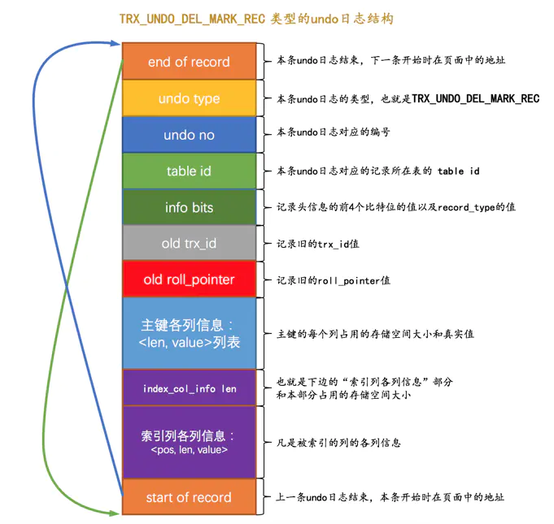

#### UPDATE语句

###### 不更新主键的情况

- 被更新的列占用的存储空间不发生变化时:就地更新，直接在原记录的基础上修改对应列的值。这个要求比较严格，只要任何列的大小有变化就不符合原地更新，哪怕空间变小也不能就地更新。
- 被更新的列占用的存储空间发生变化时:先删除，这里是直接放到垃圾链表（不是更改deletemark），然后如果新纪录占用空间不大于旧记录空间，直接重用就记录的空间，否则在页面中申请新空间使用。相当于先删除再插入。
这两种情况都会产生对应TRX_UNDO_UPD_EXIST_REC类型的undolog，如下图所示。       

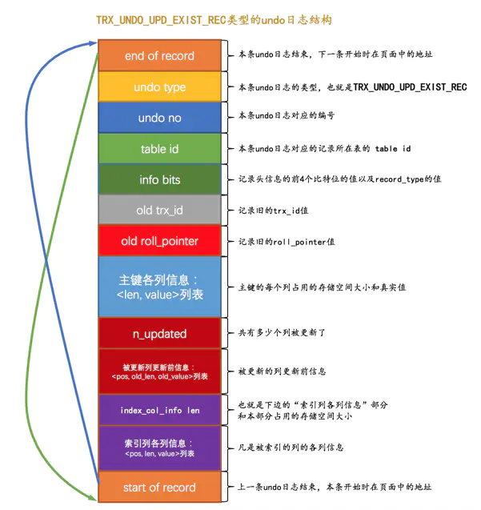

###### 更新主键的情况

```
		对于更新主键的情况需要分步骤，在聚簇索引中，记录是按照主键值的大小连成了一个单向链表的，如果我们更新了某条记录的主键值，意味着这条记录在聚簇索引中的位置将会发生改变，比如你将记录的主键值从1更新为10000，如果还有非常多的记录的主键值分布在 1 ~ 10000 之间的话，那么这两条记录在聚簇索引中就有可能离得非常远，甚至中间隔了好多个页面。
1.将旧记录进行 delete mark 操作
2.根据更新后各列的值创建一条新记录，并将其插入到聚簇索引中（需重新定位插入的位置）
		由于更新后的记录主键值发生了改变，所以需要重新从聚簇索引中定位这条记录所在的位置，然后把它插进去。针对UPDATE语句更新记录主键值的这种情况，在对该记录进行delete mark操作前，会记录一条类型为TRX_UNDO_DEL_MARK_REC 的 undo日志 ；之后插入新记录时，会记录一条类型为TRX_UNDO_INSERT_REC 的 undo日志 ，也就是说每对一条记录的主键值做改动时，会记录2条 undo日志。
		※注意，更新主键的情况并没有产生update类型的undolog，而且一条记录的更新导致产生了两条其他类型的undolog。
```

> 另外，二级索引没有undolog。二级索引页的数据并没有trxid，roll_pointer属性，但是有deletemark。page header中有个PAGE_MAX_TRX_ID属性帮助后边的MVCC操作。如果PAGE_MAX_TRX_ID小于最小活跃事务编号，那么整页数据可见，否则页内数据要回表查询后才能确定可见版本。

## undolog的组织形式

```
		还记得每条记录前面那三个隐藏列吗，这个占用7个字节的字段其实一点都不神秘，本质上就是一个指向记录对应的 undolog的一个指针。undolog被存放到了类型为 FIL_PAGE_UNDO_LOG的页面中。效果如下图所示。
		现在问题来了，一个事务在回滚的时候怎么快速的找到事务对应的undolog呢？因为一个事务可能会修改若干记录，只通过如下的结构是找不到对应undolog的。下边开始讲的才是重头戏，理清楚了整个数据组织形式，才能从宏观上说通。
```
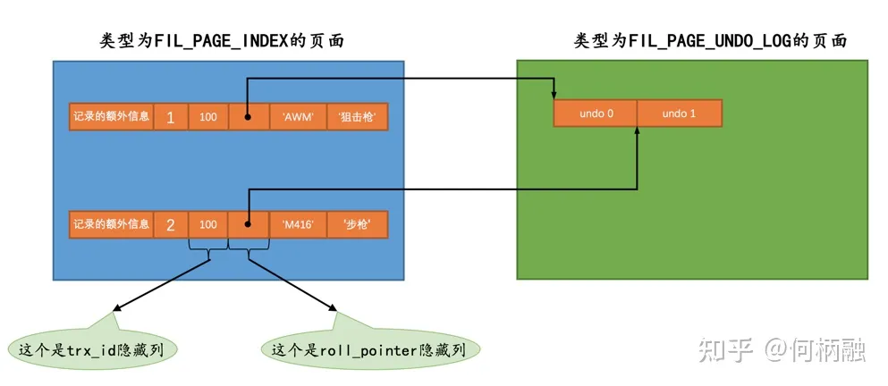

#### undo页

```
		表空间是由很多个页面组成的，页面默认为16kb，而每个页面的类型大多都不相同，比如类型为FIL_PAGE_INDEX的页面用于存储聚簇索引以及二级索引，类型为FIL_PAGE_TYPE_FSP_HDR的页面用于存储表空间头部信息的，还有其他各种类型的页面，其中有一种称之为FIL_PAGE_UNDO_LOG类型的页面是专门用来存储 undolog 的，这种类型的页面的通用结构如下图所示。undo页面可以从系统表空间中分配，也可以从一种专门存放undolog的表空间中分配，这就是所谓的·undo表空间·。
```

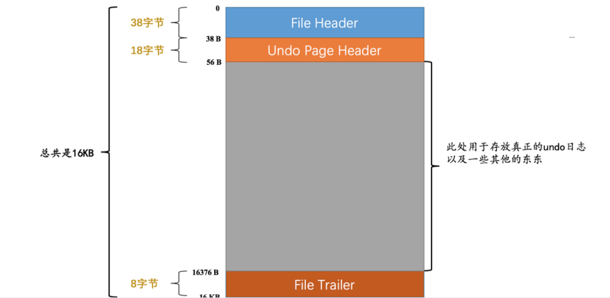

```
undo页面的Undo Page Header结构示意图如下。
```
- TRX_UNDO_PAGE_TYPE：本页面准备存储什么种类的undo日志。在这里对undolog的类型分为了两大类，每种类型的页面只能存储固定类型的undolog。之所以把undo日志分成两个大类，是因为类型为insert的undolog在事务提交后可以直接删除掉，而其他类型的undo日志还需要为所谓的MVCC服务，不能直接删除掉，对它们的处理需要区别对待。
①TRX_UNDO_INSERT类型对应insert的undolog；
②TRX_UNDO_UPDATE类型对应其他类型；
- TRX_UNDO_PAGE_START：表示在当前页面中是从什么位置开始存储 undo日志 的，或者说表示第一条 undo日志 在本页面中的起始偏移量。
- TRX_UNDO_PAGE_FREE ：与上边的 TRX_UNDO_PAGE_START 对应，表示当前页面中存储的最后一条 undo 日志结束时的偏移量，或者说从这个位置开始，可以继续写入新的 undo日志 
- TRX_UNDO_PAGE_NODE（重要，后边会用到） ：代表一个链表节点结构，可以让同一类型的页面之间组成双向链表。

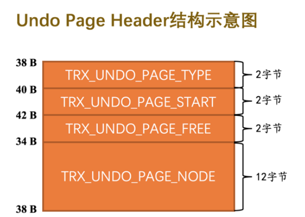


#### undo页链表

```
		上述讲到了undolog是存在undo页面中的，那么undolog是怎么跟事务联系起来呢？
		实际上每个事务都会分配各自的undolog页，存放本事务的undolog，也就是说每个事务的undolog是分开存储的，存储到不同的undo页中。如果一个事务产生的undolog太多了，导致一个undo页存不下，那么就会再分配一个新的undo页，每个事务的undo页会组成双向链表，刚刚讲到的TRX_UNDO_PAGE_NODE重要属性就是这个用处。
		※注意，这里组成的链表不要跟undolog记录上的roll_pointer属性搞混了，roll_pointer是undolog记录内的属性，让行记录上的undolog组成链表，这个链表可能会跨多个事务。TRX_UNDO_PAGE_NODE是页头内的属性，undo页链表是让同一事务的undo页面组成链表，并不是undolog之间的链表。
```
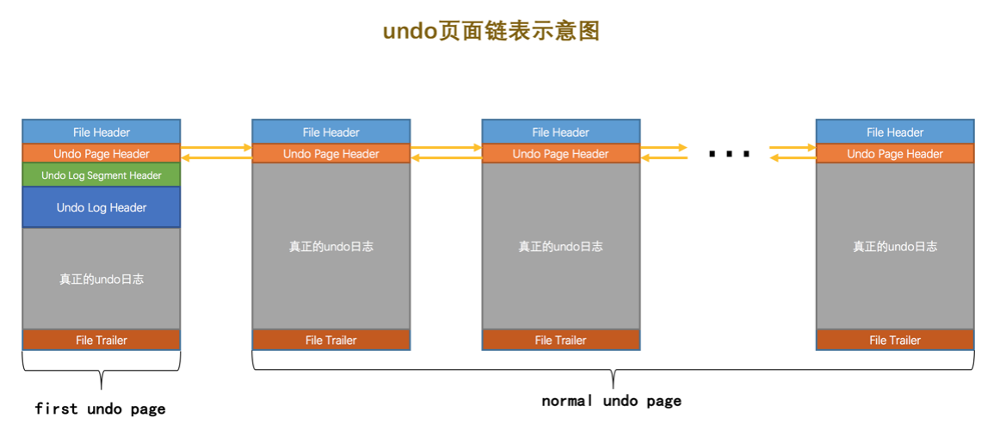
		

​		undo页链表的第一个页是比较特殊的，增加Undo Log Segment Header和Undo Log Header记录了一些此链表的额外信息。Undo Log Segment Header的具体结构如下：

- TRX_UNDO_STATE 该undo页面俩表处于什么状态，**这个属性非常重要，起到标记事务状态的作用。**
  - TRX_UNDO_ACTIVE 活跃状态，表示活跃事务正在写入undo日志
  - TRX_UNDO_CACHED 缓存状态，表示该undo页面正在等待被其他事务重用。
  - TRX_UNDO_TO_FREE 对于insert undo链表来说，如果在事务被提交时，此链表不能重用就会处于这个状态。
  - TRX_UNDO_TO_PURGE 对于update undo链表来说，事务提交时，页面不能重用就会进入这个状态。
  - TRX_UNDO_PREPARED 包含处于PREPARE阶段的事务产生的日志。分布式事务会出现该状态。
- TRX_UNDO_LAST_LOG 本Undo页面链表的最后一个Undo Log Header的位置。这个涉及到页面重用。
- TRX_UNDO_FSEG_HEADER 本Undo页面链表对应的段的Segment Header信息，一个undo链表也是被一个段维护起来了。
- TRX_UNDO_PAGE_LIST Undo页面链表的基节点

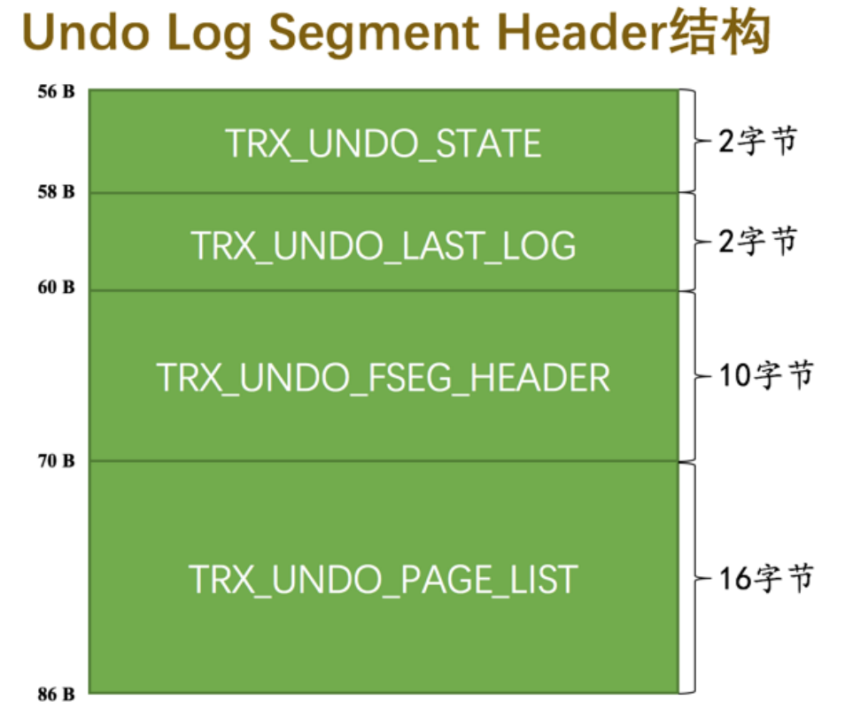

**Undo Log Header也只存在于第一个undo页，注意下第二个属性，这个是事务提交编号，在后续清理undolog时会用到**
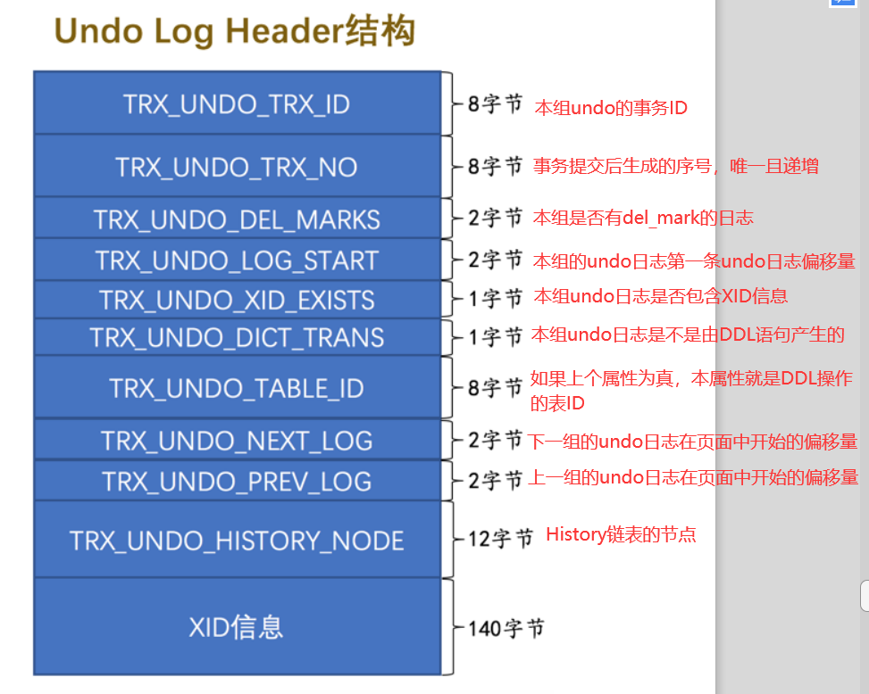

```
每个事务产生的undolog会根据普通表、临时表，是否insert undolog，分成四类。也就是说一个事务最多会存在四个undo页链表。如下图所示。
```

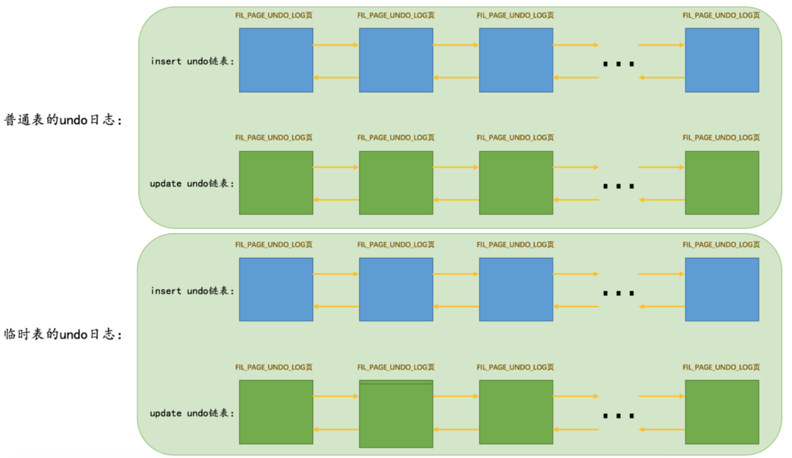

```
不同事务的undo页链表如下所示
```

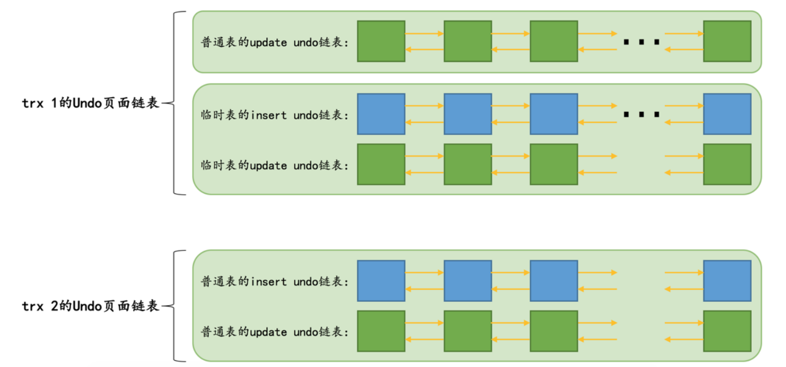


#### undo页链表重用

```
如上所述，每个事务都对应自己的undo页，那么大多数操作可能就更新一条记录，产生一条undolog，每个事务分配一个页链表也太浪费了。考虑到这种情况，会出现重用undo页链表的情况。满足以下两个条件会重用。
①该链表中只包含一个Undo页面。
②该Undo页面已经使用的空间小于整个页面空间的3/4。
针对不同类型的undo页，重用操作也不同。
```

> insert undo链表的重用，对于这个链表当满足上述两个条件时，会直接覆盖重用undo页面。因为插入旧的undo日志在事务提交后旧没有用了。

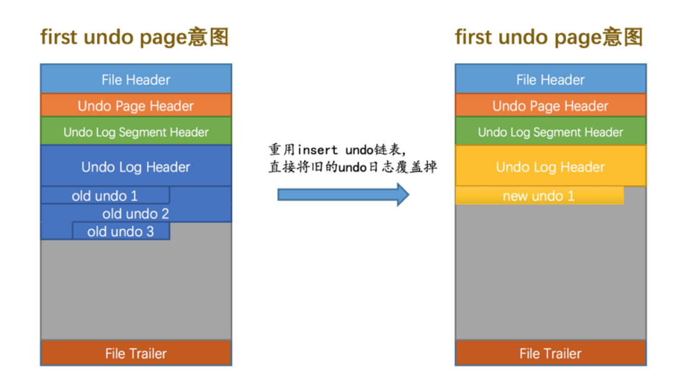
> update undo链表的重用，对于这个链表满足上述两个条件时，会在旧的undo页面中的free处继续写。因为MVCC需要用到旧的undo日志的，是不能覆盖的。

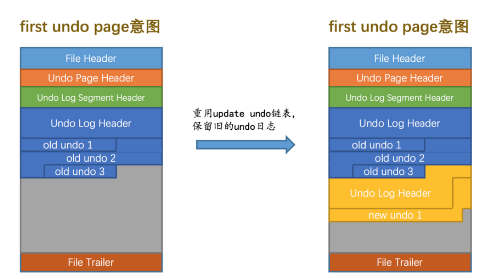

前边讲完这一堆，是不是回滚时就能通过事务快速找到对应的undolog了。

那么宕机恢复时，由于redolog的作用可能会把还没提交事务的记录也恢复出来，这个时候其实需要undolog把这些事务未提交的记录回滚掉。这个时候应该怎么快速找到undolog呢？这就用到回滚段了。


## 回滚段

```
回滚段只有一个页面，这个页面保存了所有undo链表的头结点。一共有128个回滚段。通过回滚段就可以找到每个事务的undo页链表了。
```

- TRX_RSEG_MAX_SIZE : 这个回滚段维护第一页链表中的undo页面的最大值。
- TRX_RSEG_HISTORY_SIZE : history链表的占用的页面数量
- TRX_RSEG_HISTORY ： history链表的基节点
- TRX_RSEG_FSEG_HEADER : 回滚段对应的段的位置INODE Entry
- TRX_RSEG_UNDO_SLOTS : 各个first undo page 的位置的集合，也叫undo slot集合。

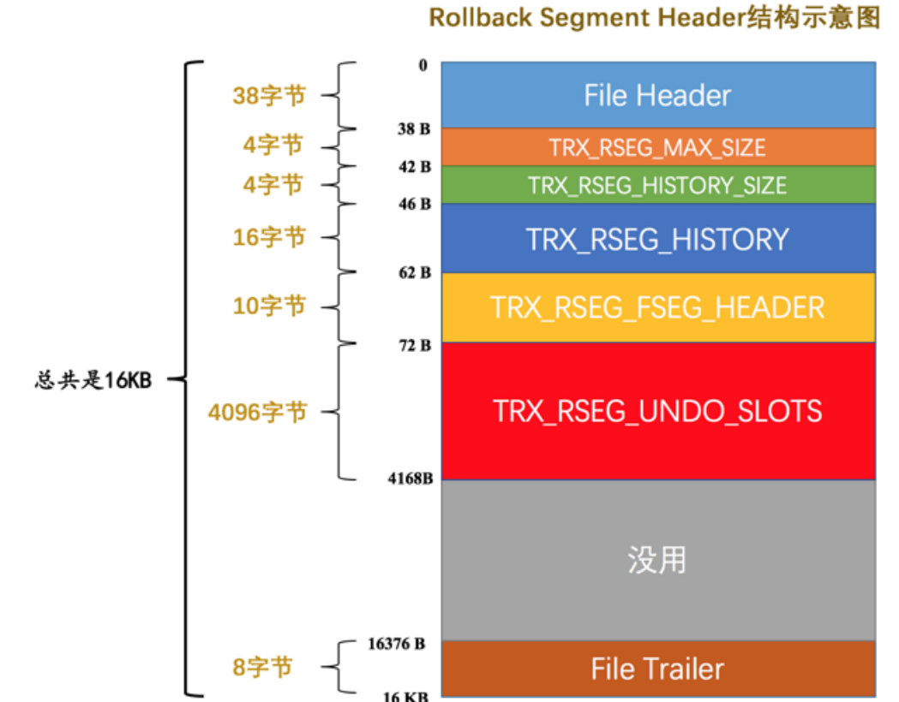


**从回滚段中申请一个undo slot**

当事务需要创建一个undo链表，就会向回滚段申请一个undo slot。 回滚段就会顺序往下找，找到值为FIL_NULL（默认值）的4字节地址，然后undo链表申请了第一个页面的地址放入到undo slot 中，就是将其地址改变为申请的页面的地址。

**事务提交时的操作**

当事务提交时，我们需要判断这个slot是不是能被重用：

- 如果能重用根据其种类加入到insert undo cache或者update undo cache链表中。
- 如果不能重用
  - 如果是种类insert种类的就会将其TRX_UNDO_STATE 设置为FREE的状态，这个页面就被释放掉了，该页面能作为其他的undo日志用。
  - 如果种类是update的就会将其TRX_UNDO_STATE 设置为purge状态，然后这个undo链表头会被放到History链表中。不能删除因为MVCC要用。

#### 数据整体关系

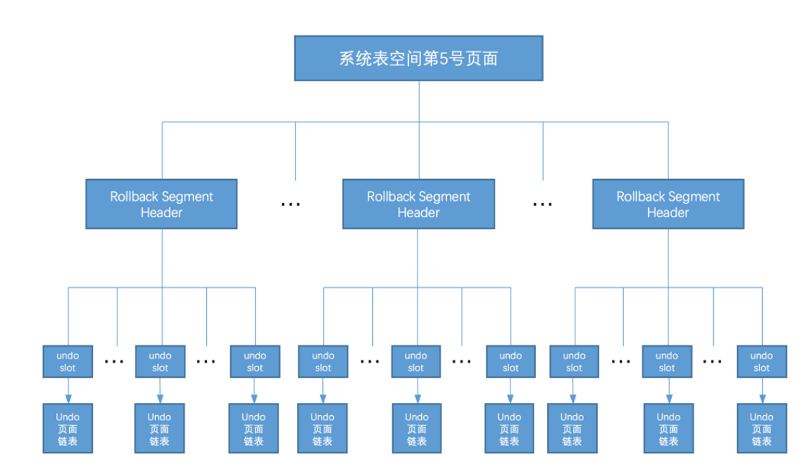


## undolog清理

```
		在事务提交时，如果是insert类型的undo页，则可以直接清理。如果是update类型的undo页则不能清理，而是放到了History链表中，因为mvcc还会用到。那什么时候才能清理呢？
		mvcc的readview中还有一个属性是事务no，代表生成readview时最新的事务提交编号。undo页链表的第一个undo页中Undo Log Header也记录了本事务的提交编号。结合readview链表中最早创建的那个readview中的事务提交no，与Undo Log Header里的事务提交编号来比较，如果readview中的比较大，代表事务产生的数据已经对所有readview可见。那么就可以把这个undo页链表进行清理了。
```


## 参考文档
[MySQL是怎样运行的：从根儿上理解MySQL | undo日志（上）](https://blog.csdn.net/weixin_49258262/article/details/123673771)
[MySQL是怎样运行的：从根儿上理解MySQL | undo日志（下）](https://blog.csdn.net/weixin_49258262/article/details/123709157)
[undo日志](https://blog.csdn.net/wangguohui0726/article/details/118150149)
[MySQL的undo日志---MVCC前置知识](https://www.cnblogs.com/duizhangz/p/16333565.html)