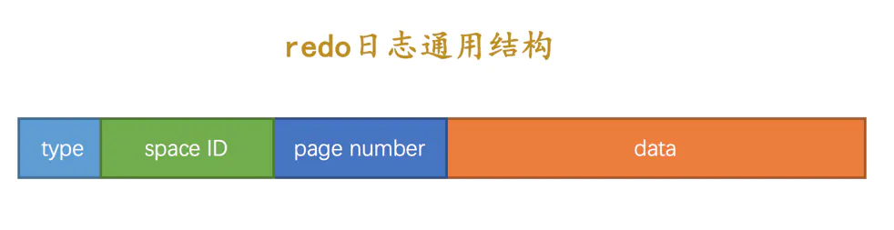
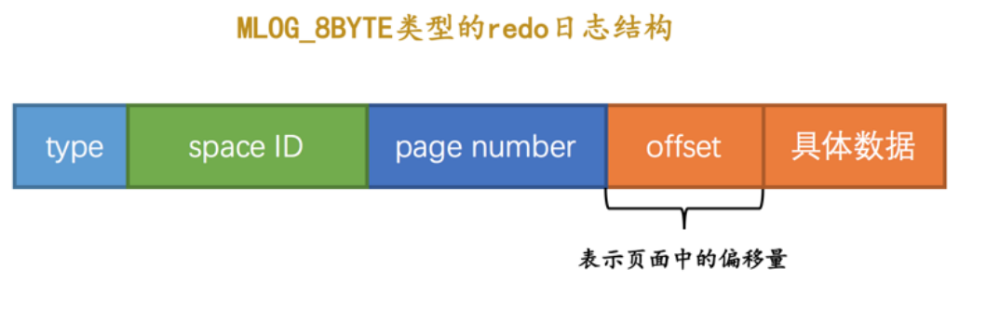
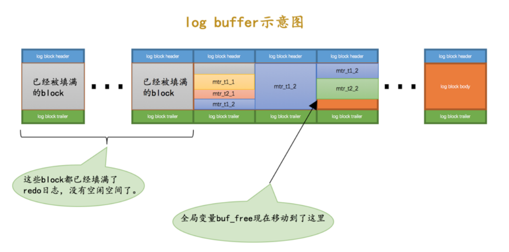
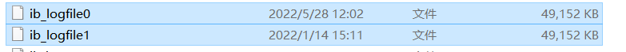
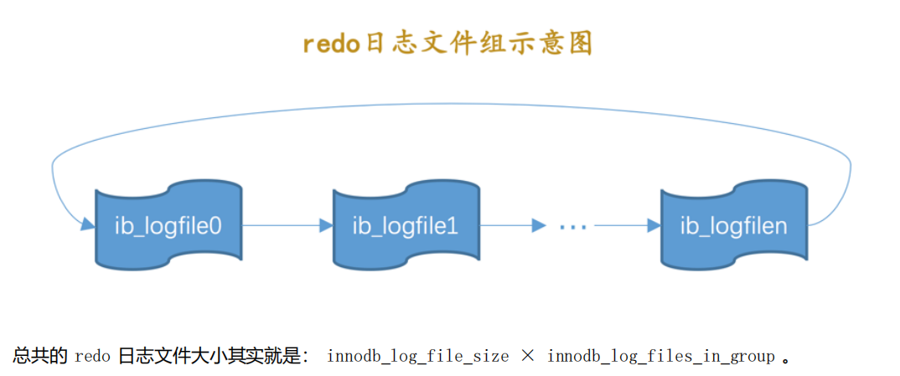
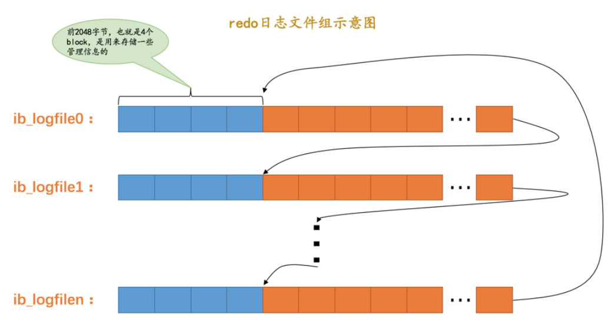
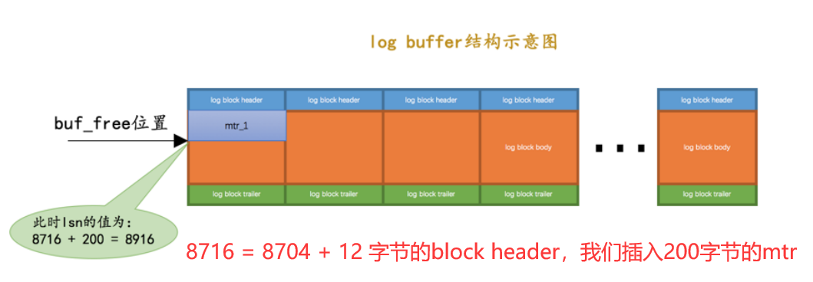
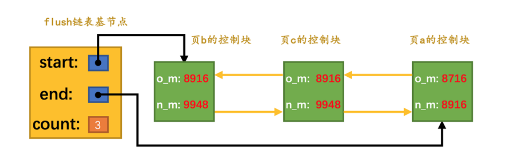

## 概述
```
		如果我们对页面进行修改的话，我们会先将修改的页面保存在buffer pool中，但是如果出现断电的情况，我们做的修改就会全部丢失。为了保证事务的持久性，最简单粗暴的办法就是事务提交后直接将记录刷到磁盘中。但是刷新到磁盘是十分慢的，而且如果我们只对页面进行一些很微小的修改，我们都需要以页为单位和磁盘进行交互，是一个十分不值当的行为。页面在磁盘上可能零零散散，我们需要不断进行随机IO，效率也是十分低下的。
		那么我们可以把对页面的改动，写到log里，每次事务提交对log进行刷盘即可，这有什么区别呢？区别就是把随机IO转换成了顺序IO，而且记录的只是改动内容，占用空间比页小多了。这种log就是redolog，redolog就是为了保证事务持久性的一种解决方案。有了redolog，即使系统崩溃，我们重启后也能将修改恢复到事务提交后的样子。
```

## redolog长啥样

#### 通用结构

​		redo日志 就是记录了下事务对数据库的修改，但是 redo日志 并不是固定一个结构的，数据库针对不同场景定义了多种类型的 redo日志 ，但是绝大部分 redo日志 都有如下结构：type + SpaceID + page numner + data。

- **type**：该条redo日志的类型。在MySQL 5.7.21这个版本中，设计InnoDB的大叔一共为redo日志设计了53种不同的类型，稍后会详细介绍不同类型的redo日志。

- **space ID**：表空间ID。
- **page number**：页号。
- **data**：该条redo日志的具体内容（所有的类型都在此处做扩展）。



#### 简单类型

​		如果我们没有为某个表显式的定义主键，并且表中也没有定义Unique键，那么InnoDB会自动的为表添加一个称之为row_id的隐藏列作为主键。为这个row_id隐藏列赋值的方式如下：

> 1. 服务器会在内存中维护一个全局变量，每当向某个包含隐藏的row_id列的表中插入一条记录时，就会把该变量的值当作新记录的row_id列的值，并且把该变量自增1。
> 2. 每当这个变量的值为256的倍数时，就会将该变量的值刷新到系统表空间的页号为7的页面中一个称之为Max Row ID的属性处。
> 3. 当系统启动时，会将上边提到的Max Row ID属性加载到内存中，将该值加上256之后赋值给我们前边提到的全局变量。

​		在事务向某个表插入一条数据的时候，实际上是在 Buffer Pool 中完成的，我们需要为 Buffer Pool 中的这个页面的修改记录一条 redo日志 ，以便在系统崩溃后能将已经提交的该事务对该页面所做的修改恢复出来。
​		这种情况下对页面的修改是极其简单的， redo日志中只需要记录一下在某个页面的某个偏移量处修改了几个字节的值，具体被修改的内容是啥就足够了。这种及其简单的 redo日志被称为物理日志 ，并且根据页面写入数据的大小划分了几种不同的 redo日志 类型：

- MLOG_1BYTE（type字段对应的十进制数字为1）：表示在页面的某个偏移量处写入1个字节的redo日志类型。
- MLOG_2BYTE（type字段对应的十进制数字为2）：表示在页面的某个偏移量处写入2个字节的redo日志类型。
- MLOG_4BYTE（type字段对应的十进制数字为4）：表示在页面的某个偏移量处写入4个字节的redo日志类型。
- MLOG_8BYTE（type字段对应的十进制数字为8）：表示在页面的某个偏移量处写入8个字节的redo日志类型。
- MLOG_WRITE_STRING（type字段对应的十进制数字为30）：表示在页面的某个偏移量处写入一串数据。

**为什么简单类型的日志要举这么一个例子，举例一条update语句不行吗？确实不行，之所以举这种例子是因为简单类型的redolog其实相当少见**




#### 复杂类型

​		即便是最简单的一条原地更新的update语句，也会引起页面内好几个位置的更新，比如页头的若干属性，像页内最大事务编号等。其他的语句更新的位置就更多了，甚至牵扯到其他页面的改动。所以复杂类型才是我们最常见的redolog类型。如果每一个地方都保存一个 redo日志 ，可能 redo日志 占用的空间过大。如果整个页中从第一个被修改的位置到最后一个被修改的位置中间的数据都加入到日志中去，里面包含很多没有修改过的数据，也很浪费空间。

所以此时复杂的类型的redo日志就该出场了。比如：

- MLOG_REC_INSERT（对应的十进制数字为9）：表示插入一条使用非紧凑行格式的记录时的redo日志类型。
- MLOG_COMP_REC_INSERT（对应的十进制数字为38）：表示插入一条使用紧凑行格式的记录时的redo日志类型。
- MLOG_COMP_PAGE_CREATE（type字段对应的十进制数字为58）：表示创建一个存储紧凑行格式记录的页面的redo日志类型。
- MLOG_COMP_REC_DELETE（type字段对应的十进制数字为42）：表示删除一条使用紧凑行格式记录的redo日志类型。
- MLOG_COMP_LIST_START_DELETE（type字段对应的十进制数字为44）：表示从某条给定记录开始删除页面中的一系列使用紧凑行格式记录的redo日志类型。
- MLOG_COMP_LIST_END_DELETE（type字段对应的十进制数字为43）：与MLOG_COMP_LIST_START_DELETE类型的redo日志呼应，表示删除一系列记录直到MLOG_COMP_LIST_END_DELETE类型的redo日志对应的记录为止。
- MLOG_ZIP_PAGE_COMPRESS（type字段对应的十进制数字为51）：表示压缩一个数据页的redo日志类型。
- 还有若干种……
  而这些复杂的日志结构，在记录数据修改的时候，并没有直接记录相关其他结构同步修改后的结果，而是一一记录下来这些需要修改的东西，在系统崩溃重启时，根据将这些需要修改的东西当做参数执行所谓插入数据的参数，然后将对应的数据进行修改。复杂类型的redolog同时兼备了物理日志和逻辑日志的功能。

## redolog内存结构组织形式
#### MTR（Mini-Transaction）

​		插入或修改一条数据时候，会对索引树进行修改，理想情况可能直接页空间够用就直接插入页中了，但是有的时候可能会造成页分裂的现象出现，页分裂的时候，就会有很多个redo日志，比如页增加的、对应页目录修改的……，这些强关联的redo日志就被划分成一个组，这个组里的日志，在存储时是整体存储，在恢复的时候要么都做，要么都不做。不可以做一半不做了。
​		对底层页面中的一次原子访问的过程称之为一个 **Mini-Transaction** ，简称 **mtr** ，一个 **mtr** 可以包含一组 **redo日志** ，在进行崩溃恢复时这一组 **redo日志** 作为一个不可分割的整体。
​		**如何确定这一堆 redo日志 从哪里到哪里是一个组？**
​		在每一组 redo日志 的后面有一个特殊类型的 redo日志 ，类型名称叫做 MLOG_MULTI_REC_END ，type对应十进制数字31，只有一个type字段，在遍历 redo日志 的时候，每碰到一个这样的东西，就代表着一组的结束。

> 如下图所示，一个语句为什么会对应多个mtr呢？update t1 set xx=1 where id<10;可能会影响多条记录，对每条记录的操作算作一个mtr，一个mtr是针对一条记录操作产生的若干redolog集合。


#### redolog block

MySQL设计了一个redo log block的数据结构来存储mtr，大小为**512字节**。

- header 头部呢就存储一些基本信息
  - HDR_NO 唯一标号，省略前面的英文单词
  - HDR_DATA_LEN 已使用的数据长，初始为12，写满就是512.
  - FIRST_REC_GROUP 该block中第一个mtr中第一条redo日志的偏移量
  - CHECKPOINT_NO 就是checkpoint的序号
- body 就是存储mtr的地方
- trailer 就是尾部放检查和。验证完整性的。


#### redolog buffer

​		为了解决磁盘速度过慢的问题而引入了 Buffer Pool 。同理，写入 redo日志 时也不能直接直接写到磁盘上，实际上在服务器启动时就向操作系统申请了一大片称之为 redo log buffer(redo日志缓冲区) 的连续内存空间，这片内存空间被划分成若干个连续的 redo log block 。
​		可以通过启动参数innodb_log_buffer_size来指定log buffer的大小，在MySQL 5.7.21这个版本中，该启动参数的默认值为**16MB**。向log buffer中写入redo日志的过程是顺序的，也就是先往前边的block中写，当该block的空闲空间用完之后再往下一个block中写。
​		那么，当我们想往 log buffer 中写入 redo日志 时，应该写在哪个 block 的哪个偏移量处？所以引入了一个称之为**buf_free**的全局变量，该变量指明后续写入的 redo日志 应该写入到 log buffer 中的哪个位置。而且！前边说过一个 mtr 执行过程中可能产生若干条 redo日志 ，这些 redo日志 是一个不可分割的组，所以其实并不是每生成一条 redo日志 ，就将其插入到 log buffer 中，而是每个 mtr 运行过程中产生的日志先暂时存到一个地方，当该mtr结束的时候，将过程中产生的一组 redo日志 再全部复制到 log buffer 中。另外，如下图所示，多个事务的不同mtr可能会交叉写入，以mtr为最小单位写入而不是以事务为最小单位。




## redolog的刷盘

​		redo日志从redo log buffer中存储进入磁盘中是讲究时机的，同时呢由于存储到磁盘是很慢的，所以需要缓冲区的存在，让线程阻塞在那里等跟磁盘IO的资源那也是不理智的对不对。以下是redolog刷盘的时机：

- log buffer空间不足时：使用超过50%就刷盘
- 事务提交时（要保证事务的持久性就得把redo刷到磁盘中）
- 后台线程不断刷盘，大概每秒刷一次。
- 正常关闭服务器
- 做checkpoint时
- 其他情况。。。


#### redolog文件组

​		可以从根目录下的data文件夹中查看到两个文件，默认是两个，默认每个是48M。文件数量和大小可以通过配置指定。


		

​		这些文件组成了一个环形文件组，写到最后再从头开始覆盖写。


​		redo日志写入磁盘中，本质上就是把block从内存中复制了一份到磁盘的ib_logfile文件中。ib_logfile是由512字节的block组成的，ib_logfile的前2048字节即4个block用来存储一些基本的管理信息。后面剩余的就是用来存储从内存中读取来的block，每个block同样也是512字节。



## LSN(Log Sequeue Number)

```
LSN (log sequence number)是日志的逻辑序列号，在InnoDB存储引擎中，LSN的值会随着日志的写入而逐渐增大。新的日志LSN等于旧的LSN加上新增日志的大小。LSN的初始值默认为8704。
```

​		在buffer pool中维护着一个lsn值，当系统初始化没有mtr插入时，就是8716 即8704 + 12 的block header。随着mtr插入到block中，会不断增大。每个mtr都有一个对应的lsn值，lsn值越小代表redo日志产生得越早。它其实就和buf_free 差不多，只不过它是代表着一个序列号。假如我们写入一个200字节的mtr，如下图所示。



#### flushed_to_disk_lsn
​		redo日志是首先写到log buffer中，之后才会被刷新到磁盘上的redo日志文件。lsn是写入到 log buffer 的redo日志的量的标志，记录的是所有写入的redo日志（刷盘的+未刷盘的）。**flushed_to_disk_lsn** 是代表redo日志已刷入磁盘的lsn大小。
​		

#### flush链表中的LSN

> 这个东西在后续会用到，先介绍下

​		一个mtr代表一次对底层页面的原子访问，在访问过程中可能会产生一组不可分割的redo日志，在mtr结束时，会把这一组redo日志写入到log buffer中。除此之外，在mtr结束时会把在mtr执行过程中可能修改过的页面加入到Buffer Pool的flush链表。
​		当第一次修改某个缓存在Buffer Pool中的页面时，就会把这个页面对应的控制块插入到flush链表的头部，之后再修改该页面时由于它已经在flush链表中了，就不再次插入了。flush链表中的脏页是按照页面的第一次修改时间从大到小进行排序的。在这个过程中会在缓存页对应的控制块中记录两个关于页面何时修改的属性：

- oldest_modification：如果某个页面被加载到Buffer Pool后进行第一次修改，那么就将修改该页面的mtr开始时对应的lsn值写入这个属性。
- newest_modification：每修改一次页面，都会将修改该页面的mtr结束时对应的lsn值写入这个属性。也就是说该属性表示页面最近一次修改后对应的系统lsn值。




#### checkpoint_lsn

​		之前说过 redo日志文件组的容量是有限的，并且是循环使用的，有可能出现循环覆盖的现象。所以，如果Buffer pool中对应的脏页已经刷新到磁盘中了，那么，对应的redo日志也就没有用了，其所占的空间就可以被覆盖重用了。
​		此处就提出了 checkpoint_lsn 概念，用来描述可被覆盖的 redo日志位置是多少，初始值也是8704。在某个页被刷新到磁盘之后，redo日志文件就可以被覆盖了，同时还会进行一个 checkpoint_lsn 值的增加操作，这个 checkpoint_lsn 值增加的操作叫做 checkpoint 。

**checkpoint步骤**

- 计算当前可被覆盖的redo日志的lsn值：计算出最早脏页的oldest_modification值并赋值给checkpoint_lsn。（因为lsn小于最早被修改的脏页的oldest_modification的都是可以被覆盖的）
- 将checkpoint_lsn和对应的redo日志文件组偏移量以及此次checkpint的编号写到日志文件的管理信息中（就是checkpoint1或者checkpoint2，这块没有详细展开，有兴趣可以查redolog文件前几个block的管理信息）。

**checkpoint时机**
redo log checkpoint发生分为fuzzy_checkpoint和sharp_checkpoint。

- fuzzy_checkpoint是在实例运行时，以一定的比例进行刷脏。
  - Master thread checkpoint
  - Flush_lru_list（innodb_lru_scan_depth）
  - Async/sync checkpoint（redo日志文件大小不够用）
  - 脏页太多，超过innodb_max_dirty_pages_pct

- sharp_checkpoint则发生在实例关闭的时候

## 宕机恢复

#### 确定恢复起点
​		redo日志文件组 中有两个block存储了checkpoint_lsn 的信息，在两个中找到更大的值，哪个大就表示哪个是最近一次的checkpoint信息。根据 checkpoint_lsn 的值就可以确定最终的偏移量，也就确定了起始位置。

#### 确定恢复终点
​		block中 log block header 中 LOG_BLOCK_HDR_DATA_LEN 属性标记着当前block中使用了多少字节，如果block被完全使用应该是512，如果不是512，说明这个就是最后一个block。

#### 恢复过程
**使用哈希表：**
		将Space ID 和 Page Number 相同的 redo日志放到哈希表中同一个槽中，同一个槽中根据生成的先后顺序连接。之后遍历哈希表，因为同一个页面修改的redo日志都在一个槽中，可以一次恢复避免多次IO操作。
		
**跳过已经刷盘的页面：**
		在checkpoint操作之后，可能会有后台线程不断的从LRU链表和flush链表中将一些脏页刷出Buffer Pool。这些在checkpoint_lsn之后的redo日志，如果它们对应的**脏页修改**在崩溃发生时已经刷新到磁盘，那在恢复时也就没有必要根据redo日志的内容修改该页面了。

​		在每个页面的File Header中有一个FIL_PAGE_LSN的属性，该属性记录了最近一次刷新页面的newest_modification 值。如果redolog的LSN小于这个FIL_PAGE_LSN的值，代表对应此lsn的redolog所做的修改已经刷过盘了，不需要更新了，直接跳过。这里需要注意，并不是跳过本页修改的所有redolog，而是只跳过lsn小于newest_modification的本页redolog。


QA：
是怎么保证每个事务commit时即刻刷盘的，岂不是block不完整，其他事物的mtr组也被带入了
1.block没被写满是正常情况，下次接着写即可
2.没提交的事务对应的redolog也会被执行恢复，但是会用undolog来撤销


## 参考文档
[MySQL是怎样运行的](https://item.jd.com/10023638908471.html)
[redo日志](https://blog.csdn.net/wangguohui0726/article/details/118149630?spm=1001.2014.3001.5502)
[MySQL之事务和redo日志](https://www.cnblogs.com/duizhangz/p/16324299.html)