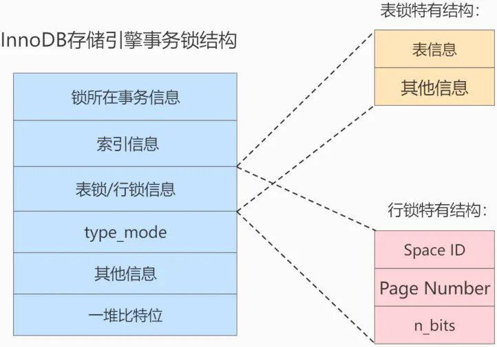
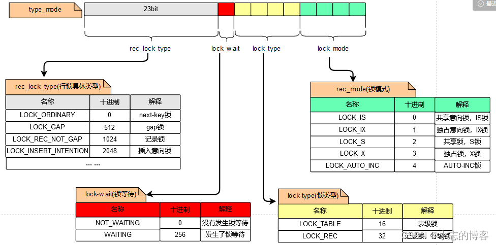
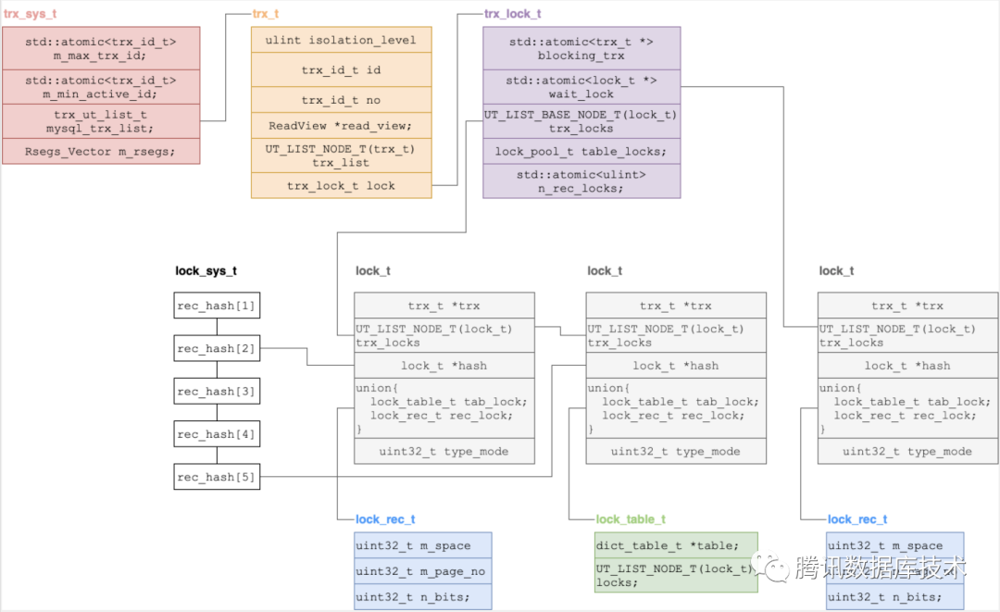
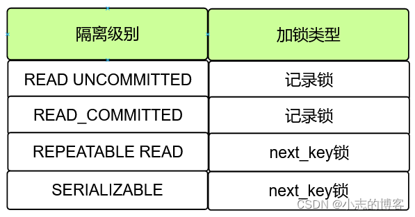
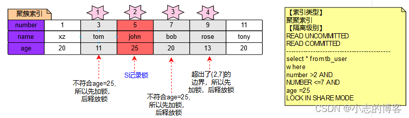
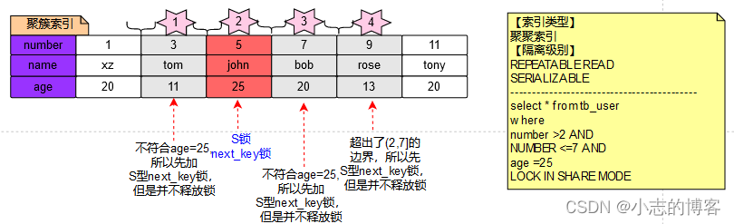
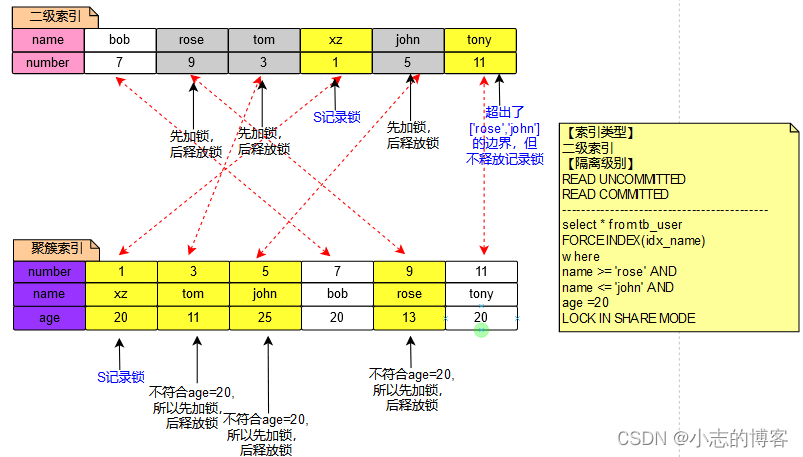

		本次深入讲解锁相关知识，在事务的讲解中已经对锁各种维度的分类做了描述，此处不再重复。另外提一句，MyISAM、MEMORY、MERGE存储引擎只支持表级锁。以下讲解的都是InnoDB的锁内容。

## 不常见的锁
#### InnoDB表锁
```
		什么，表锁竟然不常见？是的，InnoDB在实现过程中几乎没用表锁，只在系统恢复时用到了表锁。那update没命中索引的时候需要全表扫描，是加的什么锁？答案是加的行锁，大面积的行锁，只是一个页面中的行锁可能会在一个锁结构里就记录好了，所以锁的数量会大幅减少，并不会每行产生一个锁。
```
#### MDL(元数据锁)
```
		当有DDL操作时，会先等待当前执行的事务提交。并且会阻塞后来的其他读写操作。这是Server层用元数据锁实现的，并非在InnoDB层。
		元数据锁是server层的锁，表级锁（区别于InnoDB层的表锁，不是同一层的东西），每执行一条DML、DDL语句时都会申请metadata锁，DML操作需要metadata读锁，DDL操作需要metadata写锁，metadata加锁过程是系统自动控制，无法直接干预，读锁和写锁的阻塞关系如下：
读锁和写锁之间相互阻塞，即同一个表上的DML和DDL之间互相阻塞。
写锁和写锁之间互相阻塞，即两个session不能对表同时做表定义变更，需要串行操作。
```
#### 表级别的AUTO-INC锁
```
		如果表的某列指定是自增的（每个表最多支持一个自增列），在执行插入语句时会有两种加锁的方式。
1.AUTO-INC锁，插入时获取锁，插入语句结束就释放，不等事务结束就释放了，这一点跟其他锁不一样。
2.轻量级锁，在获取自增值的时候加锁，获取到自增值就释放锁，不需要等待插入语句的执行。
innodb_autoinc_lock_mode可以配置采用的模式
>0：代表AUTO-INC表锁（传统模式）
>1：两者混着来（连续模式）：当能确定一个insert插入的数据数量时，直接用轻量级锁获取一个固定数量，否则加AUTO-INC表锁
>2：轻量级锁（交叉模式）
		5.1.22版本及之前，默认为传统模式。在 MySQL 8.0 之前，默认为连续模式，值为1，而在 MySQL 8.0 之后，默认模式变成了交叉模式，值为2。因为Mysql8.0之前，备份（binlog）默认是基于语句（statement模式）的复制。而Mysql8.0开始，binlog默认是基于行（row模式）的复制。交叉模式配合binlog的statement模式会导致主从数据不一致。
```
#### 插入意向锁
```
		当insert一条数据时，会找到插入的位置，看后边一条数据AA是否持有gap锁，如果有gap锁那么需要等待，这时会生成一个插入意向锁加在AA上。如果其他事务也有同样的insert，并且后一条数据也是AA，那也生成一个插入意向锁加在AA上。插入意向锁仅仅代表要在AA数据之前的gap有插入数据的需求，彼此之间不互斥。基本没啥用
```
#### 隐式锁
```
		当insert一条数据BB时，会找到插入的位置，看后边一条数据AA是否持有gap锁，如果没有则可以插入数据。这时如果有事务想对这条数据修改，则会出现问题。除非插入BB后在BB上加一把锁，但其实并没这么做，在聚簇索引中每行记录都有一个trx_id，其他事务在更新时可以查看这条记录的trx_id是否在活跃事务列表中，如果活跃则替BB加上X锁。就是说，隐式锁就是不加锁，通过trx_id来传达锁信息。让修改它的的事务延迟帮它加锁，大部分的插入不会出现并发改的情况，所以就省去了生成锁结构的操作。
```


## 锁结构

> 对一条记录加锁的本质就是在内存中创建一个`锁结构`与之关联，那么是不是一个事务对多条记录加锁，就要创建多个`锁结构`？理论上创建多个`锁结构`没问题，但是如果一个事务要获取1万条记录的锁，生成1万个锁结构也太崩溃了，所以决定在对不同记录加锁时，如果符合下边这些条件的记录会放到一个`锁结构`中（下图的一堆比特位就是来记录对多行记录加锁的）
>  1、在同一个事务中进行加锁操作
>  2、被加锁的记录在同一个页面中
>  3、加锁的类型是一样的
>  4、等待状态是一样的
>
> 锁的存储结构如下图所示，具体信息在下方展开介绍。



#### 1、锁所在的事务信息

> 不论是 `表锁` 还是 `行锁` ，都是在事务执行过程中生成的，哪个事务生成了这个 `锁结构` ，这里就记录这个事务的信息。
>  此 `锁所在的事务信息` 在内存结构中只是一个`指针`，通过`指针`可以找到内存中关于该事务的更多信息，比方说事务id等

#### 2、索引信息

> 对于 `行锁` 来说，需要记录一下加锁的记录是属于哪个索引的。这里也是一个`指针`。

#### 3、 表锁／行锁信息

> `表锁结构` 和 `行锁结构` 在这个位置的内容是不同的，如上图所示

##### 		3.1、表锁
> 记载着是对哪个表加的锁，还有其他的一些信息

##### 		3.2、行锁
- `Space ID` ：记录所在表空间
- `Page Number` ：记录所在页号
- `n_bits` ：对于`行锁`来说，一条记录就对应着一个比特位，一个页面中包含很多记录，用不同的比特位来区分到底是哪一条记录加了锁。为此在`行锁结构`的末尾放置了一堆比特位，这个`n_bits` 属性代表使用了多少比特位。
- `n_bits`的值一般都比页面中记录条数多一些。主要是为了之后在页面中插入了新记录后也不至于重新分配锁结构

#### 4、 type_mode
> 这是一个32位的数，被分成了 `lock_mode 、 lock_type 、lock_wait和 rec_lock_type` 四个部分，如下图所示



#### 5、其他信息

> 为了更好的管理系统运行过程中生成的各种`锁结构`而设计了各种`哈希表`和`链表`。这里很重要，涉及到锁是怎么管理的，锁到底存在什么地方。需要先额外介绍一下相关概念的数据结构，介绍完就串起来了。
>
> 全局锁管理器（lock_sys_t），有个成员变量rec_hash是一个hash table，用来管理全局活跃事务创建的锁对象。哈希的key是由记录的space id和page no来生成的，value为lock_t。
>
> 全局事务管理器（trx_sys_t），管理全局正在执行的事务。
>
> 事务（trx_t），保存一个事务执行期间的上下文。有一个成员变量trx_lock_t lock。
>
> 事务锁管理器（trx_lock_t），用来管理该事务持有的锁、等待的锁等跟锁相关的信息。
>
> 以上概念的关联关系如下所示。



#### 6、一堆比特位

> 如果是 `行锁结构` 的话，在该结构末尾还放置了一堆比特位，比特位的数量是由上边提到的 `n_bits` 属性表示的。InnoDB数据页中的每条记录在 `记录头信息` 中都包含一个 `heap_no` 属性，伪记录 `Infimum` 的 `heap_no` 值为 `0` ， `Supremum` 的 `heap_no` 值为 `1` ，之后每插入一条记录， `heap_no` 值就增1。 `锁结构` 最后的一堆比特位就对应着一个页面中的记录，一个比特位映射一个 `heap_no` ，即一个比特位映射到页内的一条记录。


## 加锁流程

#### 匹配模式
```
在介绍加锁流程之前，先了解下不同的匹配模式，不同的匹配模式会影响到加锁的类型。
区间匹配：扫描区间是一个区间的，查询条件不是=
精确匹配：扫描区间是一个点的，查询条件是=
唯一匹配：命中唯一索引，并且是精确匹配的语句，确定搜索条件最多只会命中一条记录，例如，如果是联合唯一索引，那么查询条件要匹配到每一个联合索引列。
```

#### 普通SELECT语句
```
在RR隔离级别及以下，普通的select语句，直接用mvcc即可实现事务隔离，不需要加锁。
SERIALIZABLE隔离级别下，当autocommit=0，select语句会被转成select … LOCK IN SHARED MODE，即：给记录加S锁。 当autocommit=1，select语句不会加锁，只是利用MVCC生成一个Read View来服务记录。
```
#### 锁定读语句
```
针对锁定读的语句，其实可以归类为以下四种语句：
语句1：SELECT … LOCK IN SHARE MODE;
语句2：SELECT … FOR UPDATE;
语句3：UPDATE …
语句4：DELETE …
语句3和语句4在操作update和delete之前，都要隐式的去查找相应的数据，所以也可以认为是一种锁定读。
```

##### 区间匹配加锁步骤

- 步骤1：快速在B+树中定位到该扫描区间（即select的查询区间）中的第一条记录，把该记录作为当前记录。
- 步骤2：根据不同的隔离级别，为当前记录加不同类型的锁，先加锁再判断

- 步骤3：判断索引条件下推（ICP：Index Condition Pushdown）的条件是否成立。如果符合索引条件下推，则执行步骤4，否则，则获取记录所在的单向链表的下一条记录，并做为新的记录，跳到步骤2继续执行。另外，本步骤还会判断当前记录是否符合扫描区间的边界条件，如果超出了扫描边界，则跳过步骤4和步骤5，直接向server层返回查询完毕。注意，步骤3不会释放锁。
  - ICP：只适用于二级索引，且只适用于select语句。它是用来把查询中与被使用索引有关的搜索条件下推到存储引擎中去判断，而不是返回到server层再去判断。ICP只是为了减少回表次数，也就是减少读取完整的聚簇索引记录的次数，从而减少I/O操作。

- 步骤4：执行回表操作，获取到对应的聚簇索引记录，并加锁。
- 步骤5：判断边界条件是否成立，如果还在边界内，则执行步骤6，否则，如果隔离级别为READ UNCOMMITTED或READ COMMITTED，则要释放掉加在该记录上面的锁，如果隔离级别为REPEATABLE READ或SERIALIZABLE，则不去释放记录上面的锁。
- 步骤6：server层判断其余搜索条件是否成立。如果不满足搜索条件，也要像步骤5中描述的那样，根据不同的隔离级别来确定对当前记录是否加锁or释放锁。

- 步骤7：获取当前记录所在单向链表的下一条记录，并跳到步骤2。


**示例**

>在tb_user表中，有三个字段，分别为学号（number），学生姓名（name）和学生年龄（age）这三个字段。那么其中number字段为聚簇索引字段，name字段为二级索引字段。

**【示例一】**
针对聚簇索引number作为搜索条件，执行select * from tb_user where number >2 AND number <=7 AND age=25 LOCK IN SHARE MODE;

**隔离级别为READ UNCOMMITTED或READ COMMITTED**

步骤1：首先扫描区间为(2,7]中的第一条记录，即：number=3。
步骤2：为number=3的记录加S行的记录锁。
步骤3：由于查询条件为聚簇索引，所以不符合ICP。
步骤4：由于查询条件为聚簇索引，所以不需要回表。
步骤5：扫描区间为(2,7]，当前区间为number=3，符合扫描区间。
步骤6：server层判断number=3记录上面的其他条件，它的age=11，不满足查询条件，所以释放掉该记录上的锁。
步骤7：获取number=3记录所在单向链表的下一条记录，即：number=5，继续执行步骤2的操作，下面针对其他number的操作就不在赘述了。最终加锁结果如下图所示：



**隔离级别为REPEATABLE READ或SERIALIZABLE**

​		区别只在于隔离级别上。那么从上面我们介绍步骤原理的时候，也说过，如果是READ COMMITTED或SERIALIZABLE的隔离级别的话，如果不满足条件是不会解锁的。所以，我们具体步骤就不再赘述了，可以参照实例一中的具体步骤，我们就来看一下加锁情况变成了怎样？


>从以上例子可以看出，因为是区间匹配模式，记录是先加锁再做条件判断，相当于会多锁一条记录，RR以下不符合条件会释放锁，RR及以上不会释放锁

**【示例二】**
针对二级索引name作为搜索条件，执行select * from tb_user FORCE INDEX(idx_name) where name >= ‘rose’ AND name <= ‘john’ AND age =20 LOCK IN SHARE MODE;
**隔离级别为READ UNCOMMITTED或READ COMMITTED**

步骤1：首先扫描区间为[‘rose’,‘john’]中的第一条记录，即：name=‘rose’。

步骤2：为name='rose’的二级索引记录加S型的记录锁。

步骤3：由于查询条件为二级索引，所以符合ICP。

步骤4：执行回表操作，找到相应的聚簇索引记录，也就是number=9，然后为该聚簇索引记录加一个S型的记录锁。

步骤5：扫描区间为[‘rose’,‘john’]，当前区间为name=‘rose’，符合扫描区间

步骤6：server层判断number=9记录上面的其他条件，它的age=11，不满足查询条件，所以释放掉该记录在二级索引和聚簇索引上的锁。

步骤7：获取name='rose’记录所在单向链表的下一条记录，即：name=‘john’，继续执行步骤2的操作，下面针对其他name的操作就不在赘述了。最终加锁结果如下图所示：

>  select * from tb_user FORCE INDEX(idx_name) where name >= ‘rose’ AND name <= ‘john’ AND age =20 LOCK IN SHARE MODE;



**隔离级别为REPEATABLE READ或SERIALIZABLE**
```
如果是REPEATABLE READ或SERIALIZABLE的隔离级别的话，如果不满足条件是不会解锁的。
所以，与上图有两点区别，释放锁的地方一律不释放，并且锁都是加的next-key锁
```

> 从这个例子可以看出，innodb是不负责释放锁的，不管什么隔离级别，只要记录不需要返回server判断，则锁就不释放，锁是由server决定是否释放，例如上图的记录11

- 需要注意的特殊点

> 对于update和delete语句，方式与SELECT ... LOCK IN SHARE MODE一致，只不过加的是X锁。另外如果改动了二级索引的值，则需要在改动前对二级索引记录加X型记录锁，注意，这里不管什么隔离级别只加记录锁不需要next-key。实际上，这里的实现用的是隐式锁，类似insert语句的插入，用trxid来传达锁信息。

##### 精准匹配加锁步骤

​		加锁步骤与区间匹配模式相似，但有如下区别：

​		当隔离级别为READ UNCOMMITTED和READ COMMITTED的情况，如果匹配的模式为精准匹配，那么将不会为扫描区间后面的下一条记录加锁。

​		当隔离级别为REPEATABLE READ或SERIALIZABLE的情况，如果匹配的模式为精准匹配，那么会为扫描区间后面的下一条记录加**gap锁**。

```
到底是为下一条记录加gap锁还是next-key，这个怎么把握呢，如果没有索引下推条件，直接能判定是否符合则加gap锁就够了，如果需要用到索引下推的判断，则需要加next-key。索引值的区间判断也是需要判断索引下推的，所以区间判断就是加的next-key，精准匹配就是只加gap。
```

| 隔离级别           | 读锁定匹配模式（select\update） | 下一个区间加锁类型 |
| ------------------ | ------------------------------- | ------------------ |
| 读未提交\|读已提交 | 区间匹配                        | record             |
|                    | 精确匹配                        | 不加锁             |
|                    | 唯一匹配                        | 不加锁             |
| 可重复读\|串行化   | 区间匹配                        | next-key           |
|                    | 精确匹配                        | gap                |
|                    | 唯一匹配                        | record             |


##### 二级索引找不到记录的情况
```
找不到记录会为后边的一条记录加锁，具体规则与以上各个例子中的情况相同
```

##### 半一致性读
```
		在READ UNCOMMITTED或READ COMMITTED级别下，锁没用的话就会被释放。那么当update一条记录时，如果这条记录被其他事务锁住了，那么理论上应该阻塞等待锁定，但是这条记录其实不一定符合筛选条件，所以可以直接找到可读版本记录，判定符合条件再来等待加锁，如果判断不符合条件则直接跳过本条记录。如果用等待锁的方式，那就是等到锁之后再判断不符合条件，再释放锁，结果是一样的，但白白等了半天。
```

#### INSERT语句

##### 非唯一键
​		insert语句在一般情况下不需要在内存中生成锁结构，只是单纯依靠隐式锁保护插入的记录。不过在当前事务插入一条记录之前，需要先定位该记录在B+树中的位置。如果该位置的下一条记录已经被加了gap锁或next-key锁，那么当前事务就会为该记录加上插入意向锁，并且事务进入等待状态。

##### 重复键
​		当插入记录的主键与已存在的主键列值重复的时候，会引发插入报错。但是在报错之前，会对该主键值加S锁操作，具体如下所示：
（1）当隔离级别为READ UNCOMMITTED或READ COMMITTED时，加S型记录锁；
（2）当隔离级别为REPEATABLE READ或SERIALIZABLE时，加S型next-key锁；

如果与**唯一二级索引**重复，那么无论是什么隔离级别，都会对已经存在的B+树中的那条唯一二级索引记录加next-key锁。

```
p代表主键，u代表唯一二级索引。事务A插入p1,u1，事务B插入p2,u1。如果加record锁的话，在AB都还没提交的情况下，读未提交的事务C来查询数据即可查到两个u1，违反了唯一约束。只有加next-key才能解决问题。
```

| 隔离级别           | 主键     | 唯一二级索引 |
| ------------------ | -------- | ------------ |
| 读未提交\|读已提交 | record   | next-key     |
| 可重复读\|串行化   | next-key | next-key     |

上述锁是加到了唯一索引记录上，实际上后一条记录也会加？//TODO这里得确认


另外，在使用INSERT…ON DUPLICATE KEY…这样的语法来插入记录时，如果遇到主键或者唯一二级索引列的值重复，会对B+树中已存在的相同键值的记录加X锁，而不是S锁。


QA
innodb中的表锁几乎没啥用。那为什么说不命中索引的时候会加表锁，表锁跟意向锁的判断中的表锁从哪里来？

## 参考文档
[MySQL是怎样运行的](https://item.jd.com/10023638908471.html)
[MySQL 元数据锁(MDL)](https://blog.csdn.net/Leon_Jinhai_Sun/article/details/125831693)
[75-MySQL-锁的内存结构](https://www.jianshu.com/p/10774b36247b)
[MySQL——锁](https://blog.csdn.net/li1325169021/article/details/121984573)
[InnoDB事务锁系统及其实现](https://mp.weixin.qq.com/s/W07ZIW0GRtsrS5nuiy2z_A)