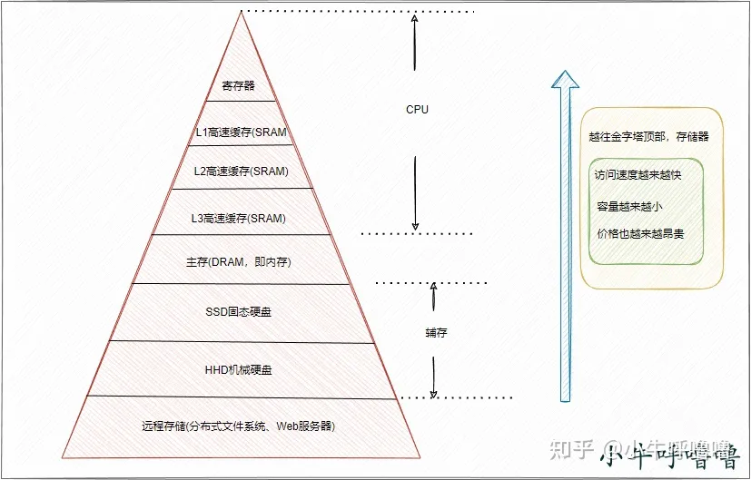
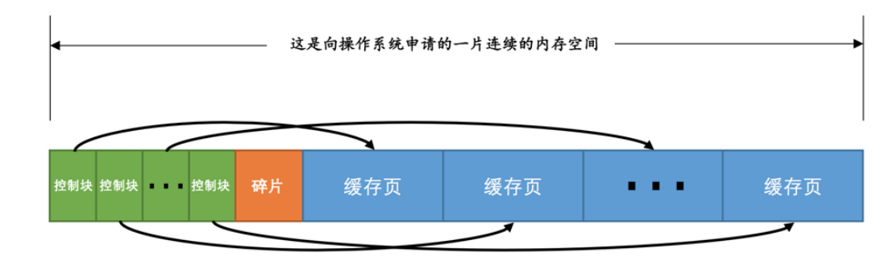
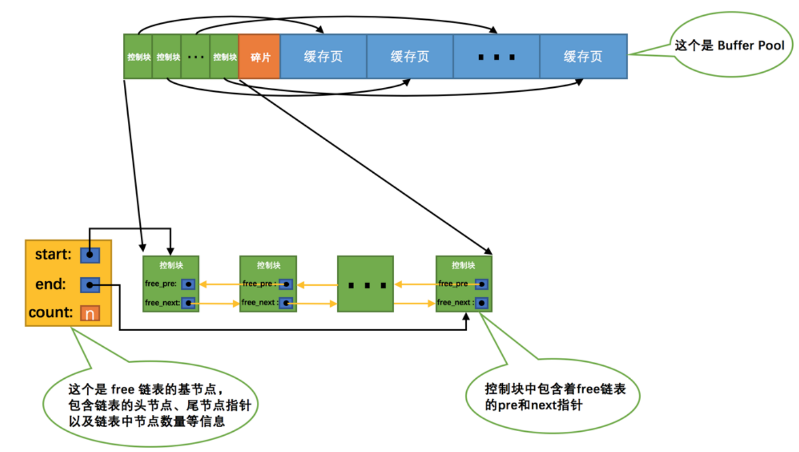
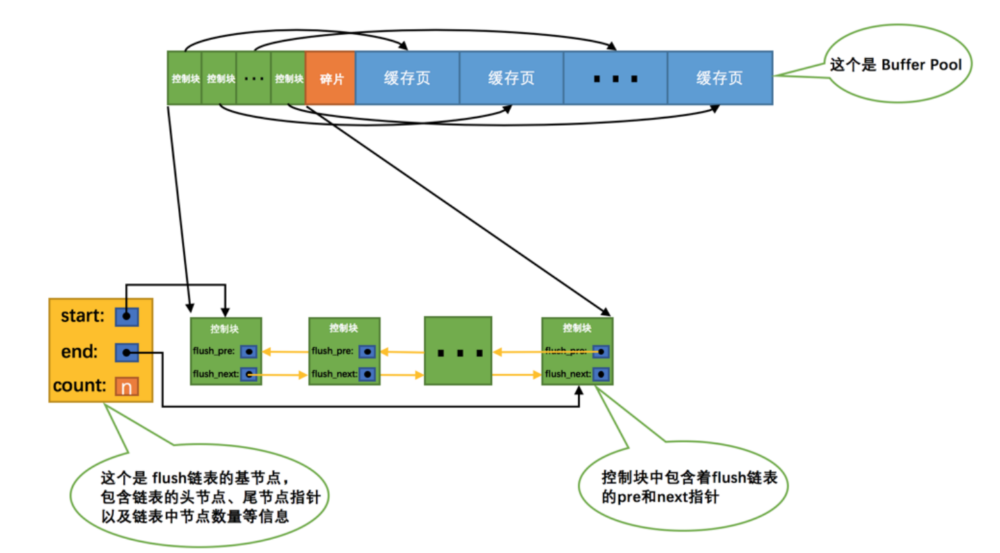
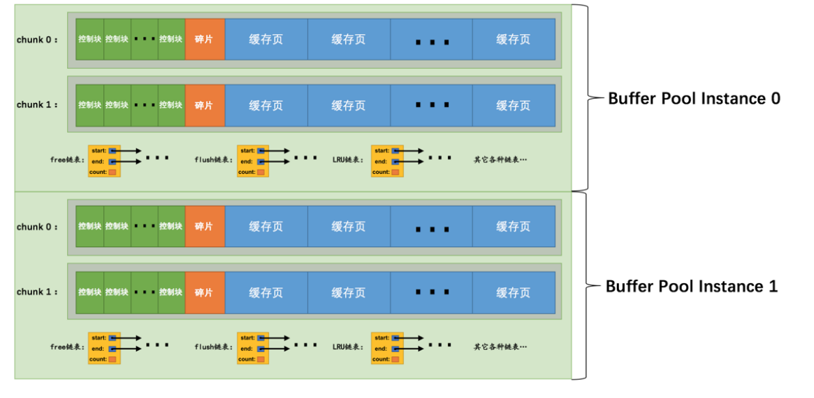

## 概述

```
		我们在对数据库执行增删改操作的时候，不可能直接更新磁盘上的数据的，因为如果对磁盘进行随机读写操作，那速度是相当的慢。为此，Innodb 存储引擎设计了一个缓冲池（Buffer Pool），来提高数据库的读写性能。注意，这是InnoDB存储引擎层面的东西。Buffer Pool 是在 MySQL 启动的时候，向操作系统申请的一片连续的内存空间，默认配置下 Buffer Pool 只有 128MB。Buffer Pool最小是5MB，即使你配置的小于5MB，InnoDB也会分配5MB的内存。
```

#### 各级存储的IO耗时

​		拿主频是 2.6G的CPU举例，也就是说每秒可以执行 2.6*10^9 个指令，每个指令只需要 0.38ns。
​		一级缓存读取时间为 0.5ns，二级缓存读取时间大约在 7ns，一次内存读取在100ns左右，一次 CPU 上下文切换（系统调用）需要大约 1.5us，SSD的IO大概在150us，一次机械硬盘IO大概在10ms左右。
​		由上可以看出，内存操作是固态硬盘的1000倍，是机械硬盘的10w倍。所以常用的组件涉及到磁盘IO的要不就是采用磁盘顺序IO，要不就是先与内存交互。

| 部件        | CPU访问所需时间   | 备注                                                         |
| ----------- | ----------------- | ------------------------------------------------------------ |
| L1 高速缓存 | 2~4 个时钟周期    | 每个 CPU 核心都有一块属于自己的 L1 高速缓存，L1 高速缓存通常分成指令缓存和数据缓存。（32K，大概这个数量级，供参考） |
| L2 高速缓存 | 10~20 个时钟周期  | L2 高速缓存同样是每个 CPU 核心都有的。（512K，大概这个数量级，供参考） |
| L3 高速缓存 | 20~60个时钟周期   | L3 高速缓存是多个 CPU 核心共用的。（16M，大概这个数量级，供参考） |
| 内存        | 200~300个时钟周期 | cpu每次读取都读取一个缓存行，一个缓存行默认64字节            |




## 内存结构

```
		磁盘文件中就是存放了很多数据页，每个数据页里存放了很多行记录。默认情况下，数据页的大小是16kb。
对应的，在 Buffer Pool 中，也是以数据页为数据单位，存放着很多数据。但是我们通常叫做缓存页，因为 Buffer Pool 毕竟是一个缓冲池，并且里面的数据都是从磁盘文件中缓存到内存中。
所以，默认情况下缓存页的大小也是 16kb，因为它和磁盘文件中数据页是一一对应的。缓冲池和磁盘之间的数据交换的单位是数据页，Buffer Pool中存放的是一个一个的数据页。
```

#### 哈希表
​		MySQL在buffer pool中怎么快速存取一个页，以及查看对应页有没有被缓存到buffer pool中呢？这就是用到哈希表，类似Java中的hashmap，通过表空间+页号做处理形成一个hash的key值，然后value值就是缓存页在buffer pool中的地址。

#### 控制块
​		在分配数据页时，buffer pool中还会分配一个包含此页面的描述信息，即控制块。控制块主要记录了缓冲页所属的表空间ID、页号、缓冲页在Buffer Pool中的地址、**链表节点信息**等等。每个控制块对应管理每一个页面 (我们使用地址引用每一个页面) ，控制块用来存储页面的一些信息，控制块的占用大小不包括在innodb_buffer_pool_size中。由MySQL在启动时自己额外申请空间。大概相当于缓存页大小的5%左右，也就是每个控制块大概是800个字节左右的大小。



### free链表
​		free链表顾名思义，就是管理空闲的缓存页的链表，如果缓存页没有被使用，其控制块就会连接到free链表上。通过一个**基节点**连接控制块形成一个free链表，并存储空闲页的数量等基本信息。
​		当我们从磁盘读取一个页到buffer pool中，就会取一个空闲的控制块填上对应缓存页的基本信息。

**链表基节点只占用40字节的空间，不包含在buffer pool中，其他链表也是一样的。这里仅仅指链表基节点，并不是说控制块节点，因为控制块里已经包含各种链表的指针，所以直接串起来即可，用原有的控制块即可，并不需要再开辟空间**



#### flush链表
​		我们使用SQL语句对某条记录进行修改的时候，就会修改某个页面或者多个页面，我们对于页面的修改呢，并不会直接对磁盘进行对应的修改，因为对于磁盘IO实在是太慢了，我们首先会将修改的页面（简称脏页）链起来，就和free链表差不多，就是一个基节点将对应脏页的控制块连接在一起。

​		这个flush链表就代表我们即将还没有将页面更新到磁盘的**脏页链表**。



#### LRU链表

​		因为buffer pool的大小是有限的，所以我们对于缓存页的大小是有限的，所以我们需要将不用的页面进行一个淘汰。MySQL采用的就是LRU的方式进行淘汰。
​		LRU就是最近最少使用的淘汰策略，我们使用一个链表将缓存页面链起来，最近访问的出现在最前面，最久未访问的在链表末尾，当LRU满了新页面都进来机会淘汰链表尾部页面。
​		如果直接使用LRU会存在很多问题，当MySQL进行预读或者全表扫描出现大量低频页面被读进LRU链表，会导致高频的页面直接被淘汰掉了，取而代之的是一些**不经常用的页面**。所以出现了改进基于分区的LRU链表，将链表分为两部分。
> 使用频率非常高的young区域
> 使用频率不是很高的old区域
> 正常来说old区占比是37％(后3/8），所以young区就占63％(前5/8)，我们可以通过innodb_old_blocks_pct来修改，默认就是37。


​		当数据页第一次被加载到缓冲池中的时候，先将其放到冷数据区域的链表头部，如果1s（由 innodb_old_blocks_time 参数控制） 后该缓存页被访问了再将其移至热数据区域的链表头部。

​		为什么要等 1s 后才将其移至热数据区域呢？如果数据页刚被加载到冷数据区就被访问了，之后再也不访问它了呢？这不就造成热数据区的浪费了吗？要是 1s 后不访问了，说明之后可能也不会去频繁访问它，也就没有移至热缓冲区的必要了。当缓存页不够的时候，从冷数据区淘汰它们就行了。 

​		另一种情况，当我的数据页已经在热缓冲区了，是不是缓存页只要被访问了就将其插到链表头部呢？不用我说你肯定也觉得不合理。热数据区域里的缓存页是会被经常访问的，如果每访问一个缓存页就插入一次链表头，那整个热缓冲区里就异常骚动了，你想想那个画面。

​		那咋整呢？Mysql 中优化为热数据区的后 3/4 部分（75%）被访问后才将其移动到链表头部去，对于前 1/4 部分的缓存页被访问了不会进行移动。

## 预读机制

```
预读就是MySQL优化器认为当前请求可能会读取的页面，预先将其加载到内存的buffer pool中。可以分为两种：
```

- 线性预读
  当读取一个区的页面超过系统变量innodb_read_ahead_threshold的值默认为56，也就是说当我们读取一个区的页面超过56页（一个区是64个页面），MySQL就会异步的读取下一个区的所有页面到内存中。

- 随机预读
  如果buffer pool已经缓存了某个区的13个页面，不管是不是顺序的，只要有13页缓存了，就触发MySQL异步读取本区的所有页面。我们可以控制关闭随机预读，也就是系统变量innodb_random_read_ahead。默认是OFF。

## 刷新脏页

1. REDO日志快用满的时候。由于MySQL更新是先写REDO日志，后面再将数据Flush到磁盘，如果REDO日志对应脏数据还没有刷新到磁盘就被覆盖的话，万一发生Crash，数据就无法恢复了。此时会从Flush 链表里面选取脏页，进行Flush。
2. 为了保证MySQL中的空闲页面的数量，Page Cleaner线程会从LRU 链表尾部淘汰一部分页面作为空闲页。如果对应的页面是脏页的话，就需要先将页面Flush到磁盘。
3. MySQL中脏页太多的时候。innodb_max_dirty_pages_pct 表示的是Buffer Pool最大的脏页比例，默认值是75%，当脏页比例大于这个值时会强制进行刷脏页，保证系统有足够可用的Free Page。innodb_max_dirty_pages_pct_lwm参数控制的是脏页比例的低水位，当达到该参数设定的时候，会进行preflush，避免比例达到innodb_max_dirty_pages_pct 来强制Flush，对MySQL实例产生影响。
4. MySQL实例正常关闭的时候，也会触发MySQL把内存里面的脏页全部刷新到磁盘。

## buffer pool实例
​		现在我们知道，Buffer Pool在物理上虽然是一块连续的内存空间，但是逻辑上它由多条链表组成。在维护这些链表时，都需要加锁来保证同步，在高并发场景下，这会带来一些性能上的影响。为了解决这个问题，InnoDB支持多个Buffer Pool实例，每个实例都是独立的，会维护自己的各种链表，多线程并发访问时不会有影响，从而提高并发处理能力。在MySQL5.7.5之前，InnoDB是不支持运行时动态调整Buffer Pool大小的，主要是因为每次调整大小，都需要向操作系统重新申请一个Buffer Pool，然后将数据拷贝一次，这个开销太大了。在之后的版本中，InnoDB引入了chunk的概念来支持运行时修改Buffer Pool大小。一个Buffer Pool实例由若干个chunk组成，里面包含了若干个控制块和缓冲页。在调整Buffer Pool大小时，InnoDB以chunk为单位来申请内存空间和数据的拷贝。
​		chunk的大小由系统变量innodb_buffer_pool_chunk_size控制，默认是128MB，chunk本身的大小不支持运行时修改。


## 参考文档

[MySQL是怎样运行的](https://item.jd.com/10023638908471.html)
[MySQL中读页缓冲区buffer pool](https://www.cnblogs.com/duizhangz/p/16320359.html)
[让 CPU 告诉你硬盘和网络到底有多慢](https://www.51cto.com/article/573394.html)
[Mysql buffer pool详解](https://www.cnblogs.com/better-farther-world2099/articles/14768929.html)