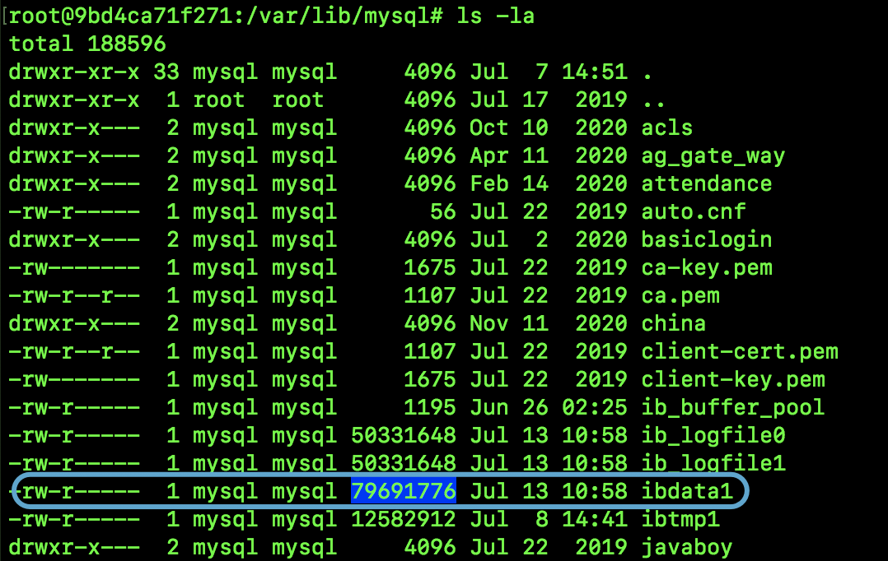
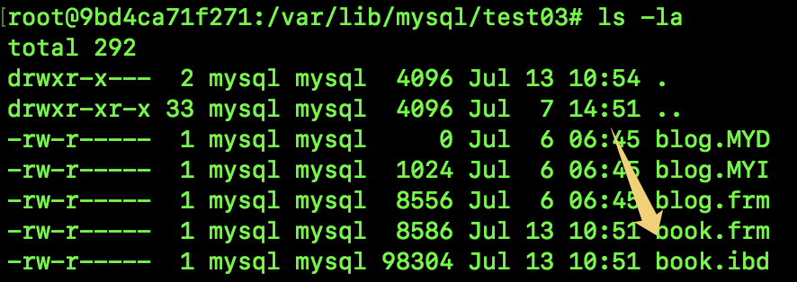
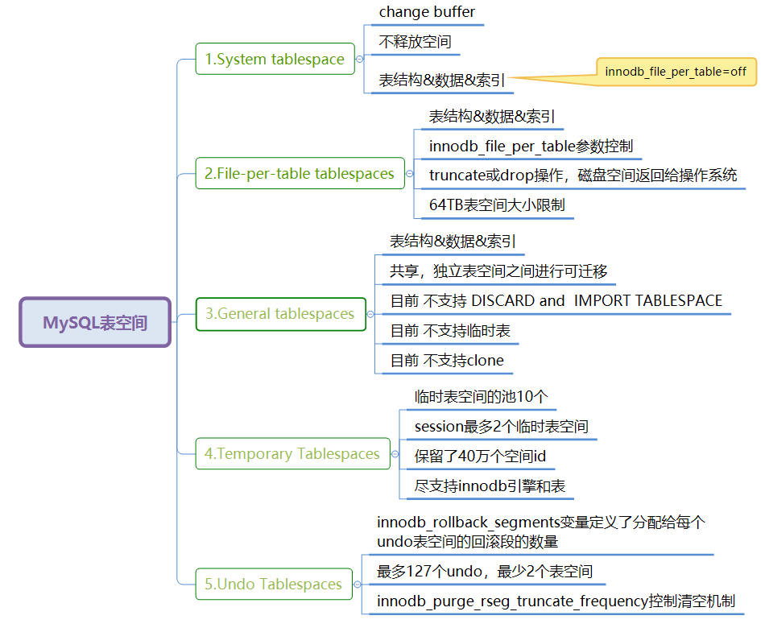
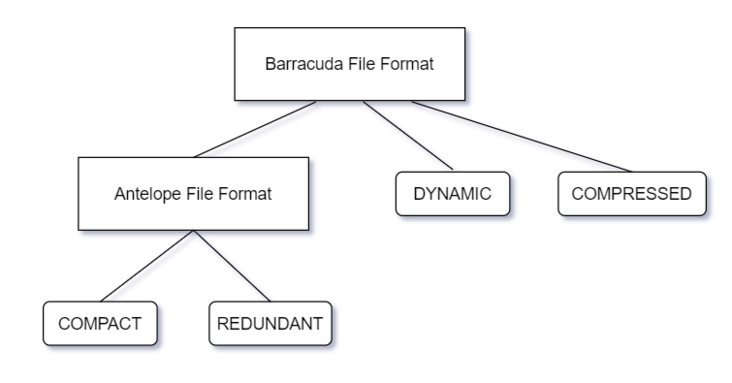
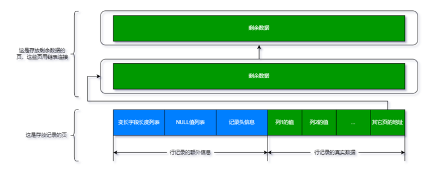
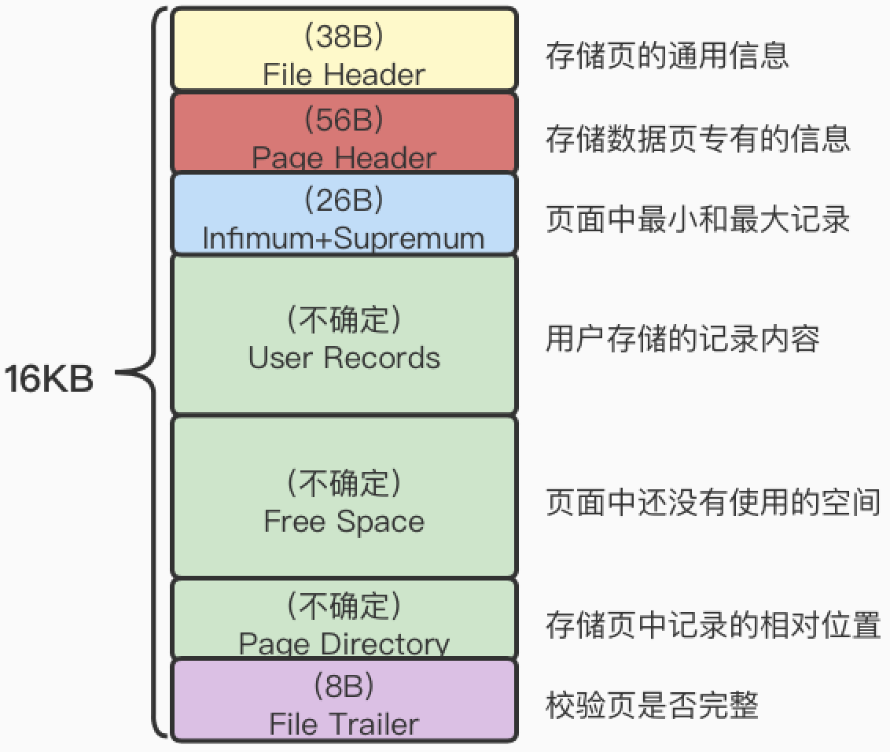
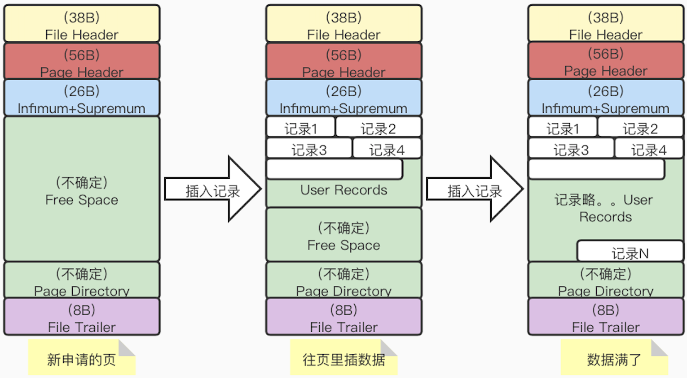
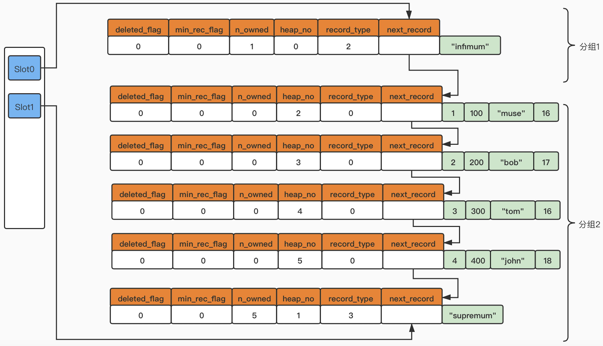
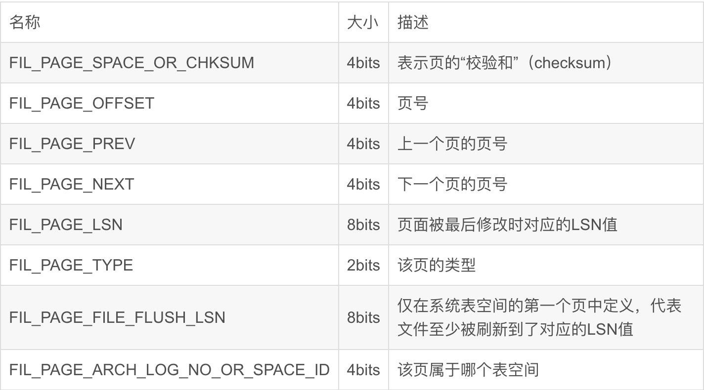
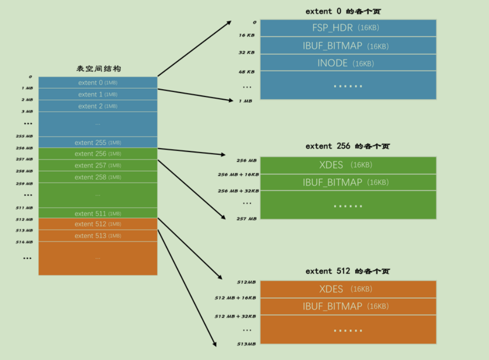

# 存储结构

## 表空间
```
InnoDB库表的存储最终要落到磁盘文件上，每行记录存放在页结构中，64个页又组成一个区，512个区又组成一个组。这种对数据组织存储的形式就是表空间。MySQL 5.6版本之前只有共享表空间，5.6开始增加了独立表空间并做为默认选择。注意表空间是抽象概念，是一种数据组织形式。对应在磁盘上可能是一系列文件。
```
#### 共享表空间
```
一个数据库中所有表的数据以及索引都存储到一个文件中，当然文件可以分割成多个小文件。但是表数据是混合交叉存储的，一个文件存储了多个表的数据，一个表的数据同样可能分散存储到多个文件中。

优势：
1.可以将表空间分成多个文件存放到各个磁盘上（表空间文件大小不受表大小的限制，如一个表可以分布在不同的文件上）

劣势：
1.所有的数据和索引存放到一个文件中，这将意味着有一个很大的文件存在（虽然可以把一个大文件分成多个小文件），但是多个表及索引在表空间中混合存储，这样当一个表做了大量删除操作后表空间中将会有大量的空隙，特别是对于统计分析、日志系统这类应用而言，最不适合用共享表空间（例如，当系统空间不够用的时候，我们希望通过删除一些无效数据来腾出来一些表空间，这个时候我们会发现，如果使用了共享表空间，即使无效数据删除了，表空间还是还是不会缩小）

2.共享表空间管理会出现表空间分配后不能回缩的问题，当临时建立索引或者临时表导致表空间扩大后，就是删除相关的表也没办法回缩那部分空间了。对于这个问题，一般使用 mysqldump 导出数据，然后删除共享表空间数据文件后，再重新导入

3.由于一个文件中保存了多个表数据，所以并发操作时可能会产生 IO 瓶颈，所以需要频繁写入的场景并不适合共享表空间
```
在共享表空间的设置下我们创建一个表，如下图可以发现文件存储在ibdata1的文件中，没有为book2单独创建文件存储。

```sql
create table book2(id int,name varchar(255));
```



#### 独立表空间

```
存放于独立表空间的表都将会以独立文件的方式来进行存储，每一个表都有一个 .frm 表描述文件（这个和 MyISAM 引擎一致），还有一个 .ibd 文件，这个文件包括了单独一个表的数据内容以及索引内容，默认情况下它的存储位置也是在表的位置之中。推荐使用独立表空间，使用MySQL的默认设置即可。

优势：
1.每张表都有自己独立的表空间。每张表的数据和索引都会存储在自己的表空间中。
2.可以实现单表在不同的数据库中移动（因为每张表都有独立的数据表文件）。
3.空间可以回收（通过 optimize table 命令实现）。
4.无论怎么删除，表空间的碎片不会太严重影响系统性能。

劣势：
1.单表过大会受限于一个文件的存储限制
```
在共享表空间的设置下我们创建一个表，如下图可以发现文件存储在book.ibd的文件中，为book表单独创建文件存储。
```sql
create table book(id int,name varchar(255));
```



#### 表空间分类

```
实际上表空间分为多种类型，以上讨论的独立表空间只是相对于共享表空间的。具体分类如下图所示，File-per-table tablespaces就是独立表空间，用户创建的业务表都在这里。其他类型不做介绍。
```



## 行、页、区、组、段
#### 行记录
```
我们插入的每行记录在存储上也同样对应一行记录，这就叫做行记录。行记录格式多种，包括COMPACT，REDUNDANT，DYNAMIC（MySQL8.0默认格式），COMPRESSED
　　InnoDB1.0.x版本的文件格式定义为Barracuda，之前的版本定义为Antelope。Barracuda文件格式包含了Antelope文件格式，并引入了DYNAMIC，COMPRESSED两种行格式。如下图所示
```
 

​		以COMPACT格式为例，其他格式大同小异。前半部分是额外信息，后半部分是真是记录。行记录指针恰好指向的中间位置。

 

```
行记录的额外信息
1.变长字段长度列表：对于varchar等长度不确定的字段要记录实际存储长度，采用实际列顺序的倒序。至于怎么知道哪些列是变长的呢？在数据访问时都会先查看表结构。这里有个点需要注意，如果varchar(n)通过n和编码算出的字节数<=255，则长度占用1个字节。如果大于255也不一定要用2个字节，而是看下列内容的实际长度，如果长度大于127则用两个字节，否则用一个字节。那怎么知道是用了1个字节还是2个字节呢，先看对应该列长度列表记录值的第一个bit位，如果是0就代表是一个字节，如果是1就代表要继续读取下一个字节，用两个字节来表示长度，这也就是为什么要大于127，因为左边第一个bit位已经被用来做判断了。
2.NULL值列表：对于可空的列，如果为空要在这里标记，后边的列信息中就忽略此列。
3.记录头信息如下表
```
| 名称         | 大小（位） | 描述                                                         |
| ------------ | ---------- | ------------------------------------------------------------ |
| 预留位1      | 1          | 没有使用                                                     |
| 预留位       | 21         | 没有使用                                                     |
| deleted_flag | 1          | 标识该条记录是否被删除                                       |
| min_rec_flag | 1          | B+树中每层非叶子节点的最小的目录项都会添加该标记             |
| n_owned      | 4          | 1页记录会被分为若干组，每组中有一条记录的该值代表该组中所有记录的条数。其余记录的该值为0 |
| heap_no      | 13         | 当前记录在页面堆中的相对位置                                 |
| record_type  | 3          | 0：普通记录，1：B+树非叶子节点的目录条数，2：Infimum记录（下边界，记录比该页中任何主键值都要小的值），3：Supremum记录（上边界，记录比该页中任何主键值都要大的值，构成了页中记录的边界） |
| next_record  | 16         | 从当前记录的真实数据到下⼀条记录的真实数据的地址偏移量。这样向左读取就是记录头信息，向右读取就是真实数据。 |

```
行记录的真实数据中存在隐藏列，如下表所示
另外，当一列数据太大时，可能会超过每页16K的限制，这是就要用额外的已出列来存储列内容，如下图所示
```

| 列名        | 是否必须 | 大小（字节） | 描述                                                         |
| ----------- | -------- | ------------ | ------------------------------------------------------------ |
| DB_ROW_ID   | 否       | 6            | 行id。如果⽤户没有定义主键，则取⼀个Unique键作为主键，如果表中无Unique键，InnoDB会默认添加⼀个DB_ROW_ID隐藏列作为主键 |
| DB_TRX_ID   | 是       | 6            | 事务idDB_ROLL_PTR是7回滚指针                                 |
| DB_ROLL_PTR | 是       | 7            | 回滚指针                                                     |

 
#### 页
```
		为了避免一条一条读取磁盘数据，InnoDB采取页的方式，作为磁盘和内存之间交互的基本单位。一个页的大小默认是16KB。
		InnoDB为了不同的目的而设计了多种不同类型的页。比如：存放表空间头部信息的页、存放undo日志信息的页等等。我们把存放表中数据记录或者索引的页，称为数据页也可以叫索引页。
		以数据页为例，其他类型的页不讨论。数据页的结构如下：User Records代表我们插入的记录，Free Space代表可用空间，最终也要被插入数据占据。
```
 
```
插入数据的过程如下所示，数据顺序插入，但是会按照索引的顺序组成单项链表（行记录的记录头信息里有next record的指针），物理上相邻的两条记录并不代表逻辑上相邻，逻辑相邻要看链表的指针。
```

```
记录在页中是按照主键值从小到大的顺序串联成为一个单向链表。那么如果我们要查询id=4的数据，我们用笨方法就是从记录的链表头开始，一直往下查找。但是，如果数据量比较大，那么性能就无法保证了。针对这个问题，InnoDB采取了图书目录的解决方案，即：Page Directory。
把链表分成若干组，第一个组是Infimum记录，Infimum记录单独这一个组，这是固定的。对于Supremum记录所在的分组只能在1～8条记录之间。剩下的记录所在的分组只能在4～8条记录之间。目录页中就是记录了每个组中最大的那条记录的偏移量，叫做槽，每个槽用两个字节表示。如下图所示。
查找数据过程如下：
第一步：通过二分法确定该记录所在分组对应的Slot，然后找到该Slot所在分组中主键值最小的那条记录。每个槽对应的都是组内主键值最大的记录，那么怎么定位一个组中主键值最小的记录呢？		答：由于每个槽都是挨着的，所以，我们可以通过找到前一个槽中的最大主键值记录，这个记录的下一条记录（next_record），就是本槽的最小主键值记录。
第二步：通过记录的next_record属性遍历该槽所在组中的各个记录。
```


**Page Header参考**
```
PAGE_DIRECTION和PAGE_N_DIRECTION是辅助优化索引分裂的，索引分裂按照如下情况执行：
1.插入是随机时，Page_direction=page_no_direction(0x05), 则取页的中间记录为分裂点记录
2.同一个方向的插入记录为 5 时，page_n_direction =5, page_last_insert 之后还有三条记录，则分裂点为 page_last_insert 之后的第三条记录
3.分裂点的记录为待插入的记录
```


**File Header参考**
 

```
B+树中同一层节点（一个节点就是一个数据页），就是通过FIL_PAGE_PREV、FIL_PAGE_NEXT组成双向链表的，这两个属性就在File Header中
```
 

#### 区、组
```
		表空间中的页实在是太多了，为了更好的管理这些页面，设计 InnoDB 的大叔们提出了区（extent）的概念。对于16KB的页来说，连续的64个页就是一个区，也就是说一个区默认占用1MB空间大小。不论是系统表空间还是独立表空间，都可以看成是由若干个区组成的，每256个区被划分成一组。
		B+ 树的每一层中的页都会形成一个双向链表，如果是以页为单位来分配存储空间的话，双向链表相邻的两个页之间的物理位置可能离得非常远。我们介绍 B+ 树索引的适用场景的时候特别提到范围查询只需要定位到最左边的记录和最右边的记录，然后沿着双向链表一直扫描就可以了，而如果链表中相邻的两个页物理位置离得非常远，就是所谓的随机I/O 。所以我们应该尽量让链表中相邻的页的物理位置也相邻，这样进行范围查询的时候才可以使用所谓的顺序I/O 。
		所以才引入了 区 （ extent ）的概念，一个区就是在物理位置上连续的64个页。在表中数据量大的时候，为某个索引分配空间的时候就不再按照页为单位分配了，而是按照 区 为单位分配，甚至在表中的数据 十分非常特别多的时候，可以一次性分配多个连续的区。虽然可能造成一点点空间的浪费（数据不足填充满整个区），但是从性能角度看，可以消除很多的随机 I/O。
		从理论上讲，引入不引入区对于我们的Innodb存储引擎的查询过程没有任何影响。
		页是磁盘与内存交互的最小单位，区是磁盘空间分配的最小单位。
```


#### 段
```
		引入了区的概念以后，我们再分配空间的时候就会按照区来分配。但是问题又来了，在b+树中，我们根据是否是叶子节点将页分成了不同的类型（如数据页、目录页），如果我们在分配空间的时候不区分叶子节点与非叶子节点，那么当我们去范围查询数据的时候，构成链表的数据页在内存的分配上可能穿插目录页，导致数据页在内存分配上又不是连续的，则其遍历的效果又打了折扣。
		所以设计者们把叶子节点和非叶子节点在区的分配上做了区分，非叶子节点和叶子节点都有自己各自的区。存放叶子节点的区的集合是一个段，存放非叶子节点的区的集合是另一个段。也就是说一个索引会生成2个段，一个叶子节点段，一个非叶子节点段。靠INODE ENTRY结构来维护一个段。
```
**碎片区**
```
		默认情况下一个使用 InnoDB 存储引擎的表只有一个聚簇索引，一个索引会生成2个段，而段是以区为单位申请存储空间的，一个区默认占用1M存储空间，所以默认情况下一个只存了几条记录的小表也需要2M（两个段，每个段都只有一个区，分别存储数据页和目录页）的存储空间么？以后每次添加一个索引都要多申请2M的存储空间么？这对于存储记录比较少的表简直是天大的浪费。这种问题的出现主要在于区中的所有页面都是为了存储同一个段的数据而存在的，即使段的数据填不满区中所有的页面，那余下的页面也不能挪作他用。
		所以引入了碎片区的概念。在一个碎片区中，并不是所有的页都是为了存储同一个段的数据而存在的，而是碎片区中的页可以用于不同的目的，比如有些页用于段A，有些页用于段B，有些页甚至哪个段都不属于。碎片区直属于表空间，并不属于任何一个段。所以此后为某个段分配存储空间的策略是这样的:
		在刚开始向表中插入数据的时候，段是从某个碎片区以单个页面为单位来分配存储空间的。
		当某个段已经占用了32个碎片区页面之后，就会以完整的区为单位来分配存储空间。
```

## 数据的完整查找过程
```
首先，在存储元数据的系统表空间中存储了独立表空间中每个索引的根页面信息，可以根据这个快到定位到根节点。有了根节点一切都好办了。
第一种情况，当全表扫描时，沿着根节点的最左子节点走到叶子节点，通过单向链表遍历行记录，遍历完毕后。因为叶子节点是通过双向链表连接的，继续找到下一个节点，遍历其中的行记录，依次循环。
第二种情况，走索引时，走聚簇索引和二级索引对查找过程没有本质区别，区别在于二级索引走完之后可能用同样的查找过程再走一遍局促索引回表查询。这里直接以聚簇索引为例。从根节点开始，定位到数据所在的叶子节点，读取叶子节点，通过二分查找的方式查找page directory，定位到行记录，沿着行记录遍历过滤即可。
```

## 参考文档
[MySQL是怎样运行的](https://item.jd.com/10023638908471.html)
[MySQL 中的共享表空间与独立表空间，用哪个好呢？](https://mp.weixin.qq.com/s?src=11&timestamp=1675045782&ver=4319&signature=jDATrT-F7CVtNh6BH8f-D2bGxYkzdIVJDK2D2PoPmWpXx*kYF97nM3EK7TXRkGIevusPlGnfj-YV65sW*TJ*0yp1trWXTZe6Nu*2lIE5piCEpsnfIJg41V0oZxfn84XD&new=1)
[MySQL 8.0 表空间机制](https://mp.weixin.qq.com/s?src=11&timestamp=1675045782&ver=4319&signature=JRbLc7xyYO1vwqwb3ftv9HZmQeBirQdaD-dE5pqgJXlaEGOti1ea*8Jb3NQahlSWL6vWWEg*3L082BSFUFodEfVwGvJT9-FJgoeSx*2rQb--7BTTjH68vb-pVw*nV3QZ&new=1)
[InnoDB-记录行](https://segmentfault.com/a/1190000042033619)
[MySQL——数据页](https://blog.csdn.net/qq_26470817/article/details/124910901)

