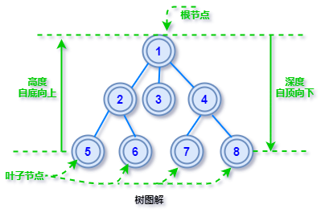
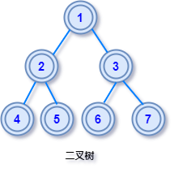
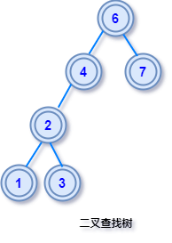
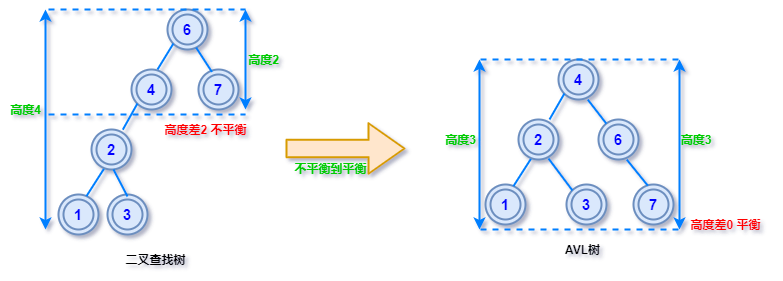
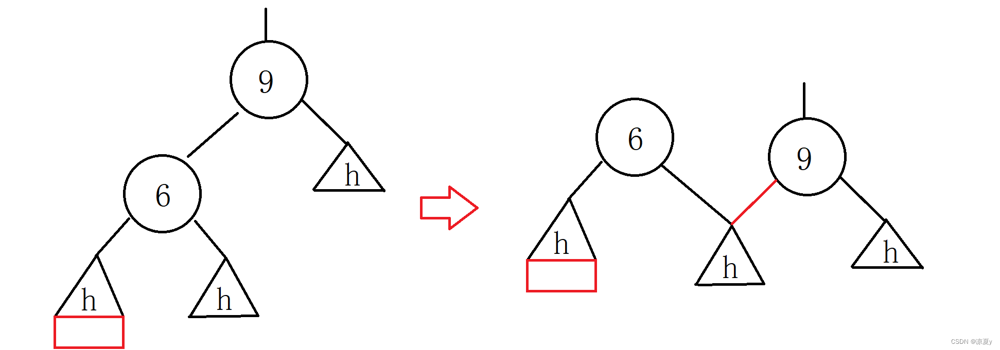
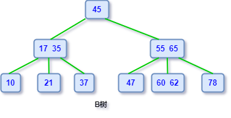
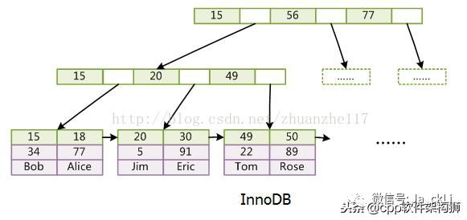

# Mysql 索引

## 索引&数据结构
```
索引是数据库为了加快查询效率引入的一种存储结构。Innodb使用B+树来实现索引，后续我们逐步介绍B+树。在此之前先了解数据结构的大致分类，数据结构分为线性结构和非线性结构
线性结构包括：有数组、队列、链表和栈
非线性结构包括：二维数组、多维数组、广义表、树结构、图结构
```

## 树
```
树形数据结构，具有以下的结构特点：
	🌲每个节点都只有有限个子节点或无子节点；
	🌲没有父节点的节点称为根节点；
	🌲每一个非根节点有且只有一个父节点；
	🌲子树不能相交；
	🌲树里面没有环路，意思就是从一个节点出发，除非往返，否则不能回到起点。

度：度是针对于每个节点的，数一下节点有几个分叉就说这个节点的度是多少（可以理解为叉）
阶：所有节点的可能最大度数
叶子结点：就是没有分叉的节点，严格的定义是度为 0 的节点叫叶子节点。图中的3也是叶子结点
```
 

## 二叉树
```
二叉树中每个节点的度不大于 2 ，即它的每个节点最多只有两个分支，通常称二叉树节点的左右两个分支为左右子树
```

三种遍历方式

- 前序遍历：根节点->左子树->右子树
	- 遍历的得到的序列是：`1 2 4 5 3 6 7`
- 中序遍历：左子树->根节点->右子树
  - 遍历的得到的序列是：`4 2 5 1 6 3 7`

- 后序遍历：左子树->右子树->根节点
  - 遍历的得到的序列是：`4 5 2 6 7 3 1`

## 二叉查找树
```
由于最基础的二叉树节点是无序的，想象一下如果在二叉树中查找一个数据，最坏情况可能要要遍历整个二叉树，这样的查找效率是非常低下的。

由于基础二叉树不利于数据的查找和插入，因此我们有必要对二叉树中的数据进行排序，所以就有了「二叉查找树」，可以说这种树是为了查找而生的二叉树，有时也称它为「二叉排序树」，都是同一种结构，只是换了个叫法。

查找二叉树理解了也不难，简单来说就是二叉树上所有节点的左子树上的节点都小于根节点，右子树上所有节点的值都大于根节点。
```
 
## 平衡二叉树（AVL树）
```
二叉查找树的查询复杂度取决于目标节点的深度，因此当节点的深度比较大时，最坏的查询效率是O(n)，其中n是树中的节点个数

为了解决这一问题，需要尽可能的减少深度，由此引入了平衡二叉树。在二叉查找树中，任一节点对应的两棵子树的最大高度差为 1（平衡因子），这样的二叉查找树称为平衡二叉树（AVL树）

平衡因子：在二叉查找树中，任一节点对应的两棵子树的最大高度差

AVL 这个名字的由来，是它的两个发明者G. M. Adelson-Velsky 和 Evgenii Landis 的缩写，AVL最初是他们两人在1962 年的论文「An algorithm for the organization of information」中提出来一种数据结构
```


```
左旋与右旋
左旋：假设旋转树（把需要旋转的子树拎出来单独看）的根节点是R，将根节点的右子树指向其原右子树的左子树，再将其原右子树的左子树指向R
右旋：假设旋转树的根节点是R，将根节点的左子树指向其原左子树的右子树，再将其原左子树的右子树指向R
🌲下图以右旋举例
```



```
插入操作：
当插入节点导致不平衡，则从不平衡子树的根节点开始向插入节点的父节点（被插入节点）路由
🌲如果是左子树左子树(LL)到达，则对不平衡子树进行右旋(R)
🌲如果是右子树右子树(RR)到达，则对不平衡子树进行左旋(L)
🌲如果是左子树右子树(LR)到达，则对不平衡子树根节点的左子树进行左旋，然后再对不平衡子树进行右旋(LR)
🌲如果是右子树左子树(RL)到达，则对不平衡子树根节点的右子树进行右旋，然后再对不平衡子树进行左旋(RL)
```
```
删除操作：
🌲如果删除的是叶子结点则直接删除
🌲被删除节点只有左子树或者右子树，删除节点后用其子树顶上
🌲被删除节点同时存在左右子树，删除节点后使用左子树的最大值或者右子树的最小值顶替被删除节点
如果删除后出现不平衡，则同样使用插入操作中的旋转来解决。
```
## B树（B-树）
```
一个 m 阶的B树有以下属性：
1.每一个节点最多有 m 个子节点
2.每一个非叶子节点（除根节点）最少有 ⌈m/2⌉ 个子节点，⌈m/2⌉表示向上取整。
3.如果根节点不是叶子节点，那么它至少有两个子节点
4.有 k 个键的非叶子节点拥有 k+1 个叉
5.所有的叶子节点都在同一层

特点：
B树是所有节点的平衡因子均等于0的多路查找树（AVL树是平衡因子不大于 1 的二路查找树）。
B树节点可以保存多个数据，使得 B 树可以不用像 AVL 树那样为了保持平衡频繁的旋转节点。
B树的多路的特性，降低了树的高度，所以B树相比于平衡二叉树显得矮胖很多。
B树非常适合保存在磁盘中的数据读取，因为每次读取都会有一次磁盘IO，高度降低减少了磁盘IO的次数
```
 

```
B树的插入操作：假设插入关键字为k
1.如果根节点还没有子节点
	-尚未满员时，直接插入k到根节点
	-已经满员时，将k插入根节点，并把节点拆分成三个节点，中间关键词作为新的根节点，原左侧数据作为其左子结点，原右侧数据作为其右子结点
2.如果根节点已经有子节点，把k路由到归属子节点
	-尚未满员时，直接插入k到此子节点
	-已经满员时，将k插入此节点，并把节点拆分成三个节点，中间关键词作为新的节点插入上级子节点，原左侧数据作为其左子结点，原右侧数据作为其右子结点
	--在插入上级子节点的过程，重复相同的逻辑

```

```
B树的删除操作：假设删除关键字k
1.如果k在叶子结点
	-删除后节点仍然满足最小数量，结束
	-删除后节点小于最小数量，需要向父节点借关键字p，父节点再向被删除节点的兄弟节点借
		-如果左兄弟有冗余数量，左兄弟的最后一个关键字k1提升到父节点（①此时完整实现应该是一个右旋操作，p的左子树指向k1的右子树，k1提升到父节点。为了兼容后续的递归）
		-如果右兄弟有冗余数量，右兄弟的第一个关键字k2提升到父节点（②此时完整实现应该是一个左旋操作，p的右子树指向k2的左子树，k2提升到父节点。为了兼容后续的递归）
		-如果左右兄弟均无冗余数量，合并兄弟节点，如果父节点p被掏空，则相当于删除了p，递归情形1
2.如果k在非叶子结点
	-找到左子树的最右侧关键字k1（整个子树的最大值），看所在节点是否存在冗余，如果存在冗余则直接k1替换被删除位置
	-找到右子树的最左侧关键字k2（整个子树的最小值），看所在节点是否存在冗余，如果存在冗余则直接k2替换被删除位置
	-如果上述两种都不冗余，则直接用k1或者k2替换，替换后回归到情形1，相当于删除了叶子结点
	
```

## B+树
```
B+树在B树的基础上做了改进
1.键值全部下沉到叶子结点做冗余
2.叶子结点之间使用指针首尾相连

优势：
1.由于B+树在节点上不包含数据信息，因此在内存页中能够存放更多的key。 数据存放的更加紧密，具有更好的空间局部性。因此访问叶子节点上关联的数据也具有更好的缓存命中率
2.B+树的叶子结点都是相链的，因此对整棵树的便利只需要一次线性遍历叶子结点即可。而且由于数据顺序排列并且相连，所以便于区间查找和搜索。而B树则需要进行每一层的递归遍历。相邻的元素可能在内存中不相邻，所以缓存命中性没有B+树好
```
 

## 参考文档
[Mysql索引：图文并茂，深入探究索引的原理和使用](https://zhuanlan.zhihu.com/p/335734145)
[数据库的最简单实现](https://www.ruanyifeng.com/blog/2014/07/database_implementation.html)
[图解：数据结构中的6种树，你心中有数吗？](https://mp.weixin.qq.com/s?src=11&timestamp=1663056734&ver=4041&signature=P61AsgUWZqtkZF36FK4pzyafRhbcAEOqYgkk8o0ZQeask*pKDwPlfNgMZ*ZeRc5RlFED0Nf4ZNRkccUD4X5FRIPgaxjiGf6UDBbJpHzqnECadFYVh48Czufdep*N3-Kq&new=1)
[图解：什么是B树（心中有 B树，做人要谦虚）？](https://mp.weixin.qq.com/s/Q29CgcnnudePQ0l2UyshUw)
[数据结构可视化网站](https://www.cs.usfca.edu/~galles/visualization/Algorithms.html)
[你心里是没点B树吗？](https://mp.weixin.qq.com/s?src=11&timestamp=1663313242&ver=4047&signature=5AOr8SfAgvQA5X5ITR4gKvtbg2-dfsXfkX4jyXkfF*z2MFzCYZ7zC11hNf*uaAmFCoFnMY1Cz8*TPUYAL*He9vqYSSzq4R6FIjpkvzuwAQ1yrSUb2l8xWGvcRbfK03MG&new=1)
[AVL树的插入](https://blog.csdn.net/LiangXiay/article/details/125024480)
