## 一、Netty简介

## 1.1 简介
​	Netty是由JBOSS提供的一个java开源框架。Netty提供异步的、事件驱动的**网络应用程序**框架和工具，用以快速开发高性能、高可靠性的**网络服务器和客户端**程序。也就是说，Netty 是一个基于NIO的客户端，服务器端编程框架，使用Netty 可以确保你快速和简单的开发出一个**网络应用**，例如实现了某种协议的客户，服务端应用。Netty简化和流线化了网络应用的编程开发过程，例如，TCP和UDP的socket服务开发。

## 1.2 为什么要制造 Netty
既然 Java 提供了 NIO，为什么还要制造一个 Netty，主要原因是 Java NIO 有以下几个缺点：

1）Java NIO 的类库和 API 庞大繁杂，使用起来很麻烦，开发工作量大。

2）使用 Java NIO，程序员需要具备高超的 Java 多线程编码技能，以及非常熟悉网络编程，比如要处理断连重连、网络闪断、半包读写、失败缓存、网络拥塞和异常流处理等一系列棘手的工作。

3）Java NIO 存在 Bug，例如 Epoll Bug 会导致 Selector 空轮训，极大耗费 CPU 资源。

Netty 对于 JDK 自带的 NIO 的 API 进行了封装，解决了上述问题，提高了 IO 程序的开发效率和可靠性

1）设计优雅，提供阻塞和非阻塞的 Socket；提供灵活可拓展的事件模型；提供高度可定制的线程模型。

2）具备更高的性能和更大的吞吐量，使用零拷贝技术最小化不必要的内存复制，减少资源的消耗。

3）提供安全传输特性。

4）支持多种主流协议；预置多种编解码功能，支持用户开发私有协议。

> **注：支持 TCP、UDP、HTTP、WebSocket 等协议 

## 1.3 功能特性
1、在传输服务方面：它支持TCP UDP传输，支持HTTP 隧道等

2、在协议支持方面： 它支持多种协议如HTTP WebSocket。 并且它提供了一些开箱即用的协议，例如可以用其提供的SSL方便的进行认证与数据加密解密，利用其提供的zlib/gzip 可以方便的进行数据的压缩和解压缩，并且支持了google的protobuf序列化方式。并且支持大文件传输，实时的流传输

3、它的核心功能包括三方面：

​	3.1 利用其提供的可拓展事件模型，我们可以方便的添加自己的业务逻辑

​	3.2 利用其提供的通用通信API，我们可以告别java NIO 的繁琐复杂的代码

​	3.3 支持零拷贝，零拷贝可以减少数据在内存中的拷贝，可以大幅提高IO性能

## 1.4 Netty应用场景
1、首先Netty可以用于分布式应用开发中，Netty 作为异步高并发的网络组件，常用于构建高性能 RPC 框架，以提升分布式服务群之间的服务调用或数据传输的并发度和速度。例如阿里 Dubbo 就可以使用 Netty 作为其网络层

2、Netyy还可以用于大数据基础设施的构建：比如 Hadoop在处理海量数据的时候，数据在多个计算节点之中传输，为了提高传输性能，也采用 Netty 构建性能高的网络 IO 层

3、用Netty还可以实现应用层基于公有协议或私有协议的服务器

## 二、Netty原理
### 2.1 零拷贝技术
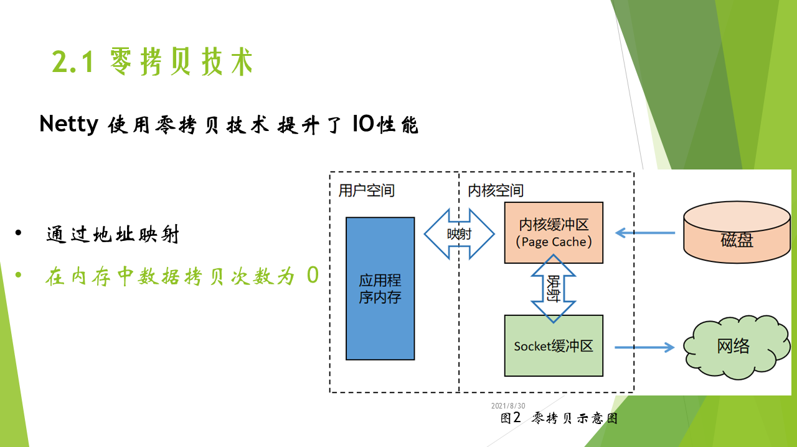

 1） Netty 利用了零拷贝技术 提升了IO 性能

 2）零拷贝指的是数据在内存中的拷贝次数为0次

 3）上图代表了 磁盘中的一个数据 发给网络的过程，如果不利用零拷贝磁盘的数据要先拷贝到内核缓冲区，再拷贝到应用程序内存，再拷贝到Socket缓冲区，最后再发向网络。不利用零拷贝，数据在内存中拷贝了两次，一次是内核缓冲区到用户程序内存，另一次是应用程序内存到Socket缓冲区。

而零拷贝技术，将内核缓冲区 与 应用程序内存 和Socket缓冲区建立了地址映射，这样数据在内存中的拷贝次数就是0次，减少了拷贝次数，可以大幅提升IO性能。

### 2.2 NIO-同步非阻塞多路复用IO
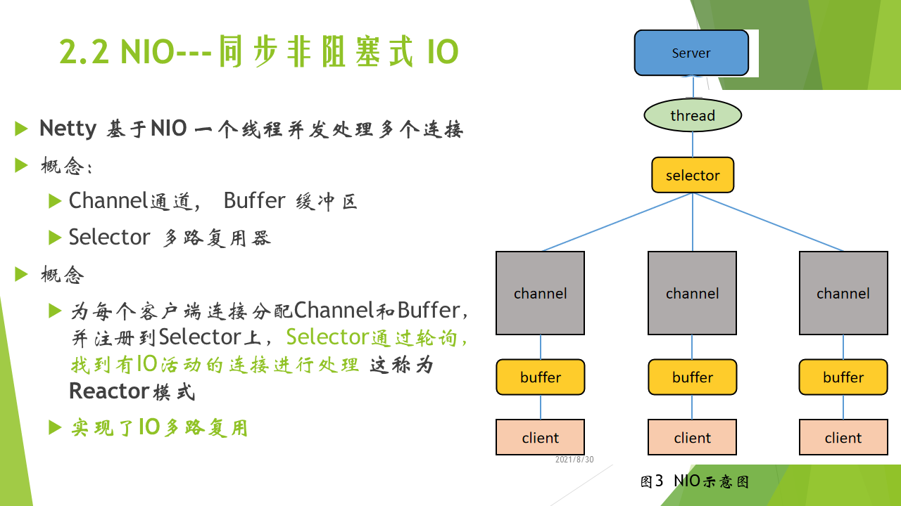
1） Netty 是基于NIO的，NIO的特点是可以利用一个线程，并发处理多个连接也称为IO多路复用
2） 图3是 NIO 的示意图，服务器中一个线程可以非阻塞地处理多个客户端的IO请求。具体过程为服务器为每个客户端 分配Channel和Buffer，数据是通过通道 Channel 传输的，往Channel中读写数据需要先经过缓冲区Buffer。接着将每个客户端对应的Channel的IO事件注册到多路复用器 Selector上，Selector通过轮询，就可以找到有IO活动的channel并进行处理，这就是NIO的具体流程。以这种IO处理模式也称为Reactor模式。
3） 这种模式非阻塞的原因是：若某通道无可用数据，线程不会阻塞在这个通道上等数据准备好，而是可以处理其他通道的读写。而传统的阻塞式IO，采用一个线程对应一个客户端的方式，若客户端数据未准备好，则线程一直阻塞。传统的阻塞式IO，线程利用率不高，且高并发是需要建立大量的线程。而NIO降低了线程数量，提高了线程的利用率 实现了IO 多路复用。Netty 正是利用这种非阻塞式的IO，实现了单个线程就可以并发处理多个连接。

### 2.3 核心组件
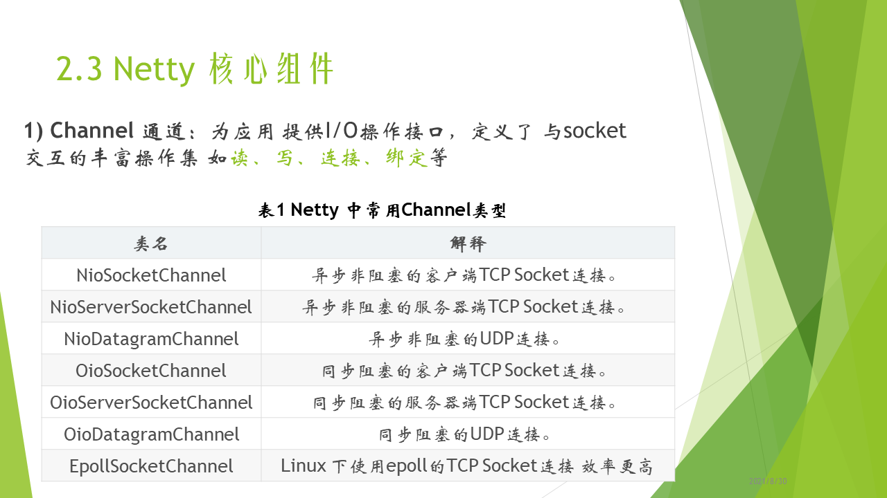

#### Channel 通道：
1）数据是通过通道传输的，它为应用提供I/O操作接口，定义了与socket交互的操作集 比如读、写、连接、绑定等。
2）上图是一些常用的 Channel 类型，不同协议、不同的阻塞类型的连接都有不同的 Channel 类型与之对应，TCP连接中客户端和服务器用不同的Channel，linux下可以使用EpollSocketChannel建立非阻塞的TCP连接，它是用linux的epoll命令实现的 效率更高。
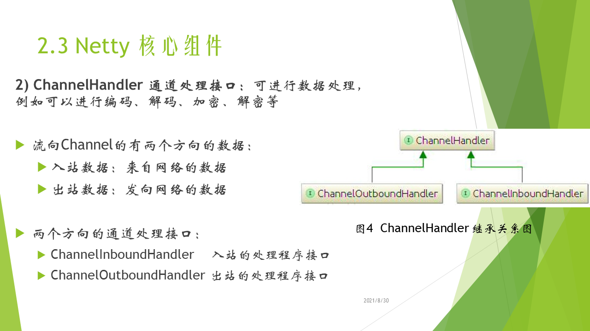

#### ChannelHandler 通道处理接口
1）ChannelHandler 通道处理接口：传递到通道的数据或者通道传来的数据要利用ChannelHandler进行处理，例如可以进行编码、解码、加密、解密等
2） Netty 中流向Chnannel的有两个方向的数据，入站数据指的是从网络发至客户端或者服务器的数据；出站数据指的是 客户端或服务器 发到网络中的数据。
3） 因此也有两个方向的通道处理接口，ChannelInboundHanlder 继承自ChanelHandler 专门用于处理入站数据
4） ChanneloutboundHandler 处理出站数据
5） 编码器都继承了ChanneloutboundHandler 因为发向网络的数据一般要先经过编码，比如说要将对象转化成字节序列，再在网络中传输。解码器都继承了ChannelintboundHandler，因为需要将字节序列转化成对象。同理，加密继承于ChanneloutboundHandler，解密继承于ChannelintboundHandler

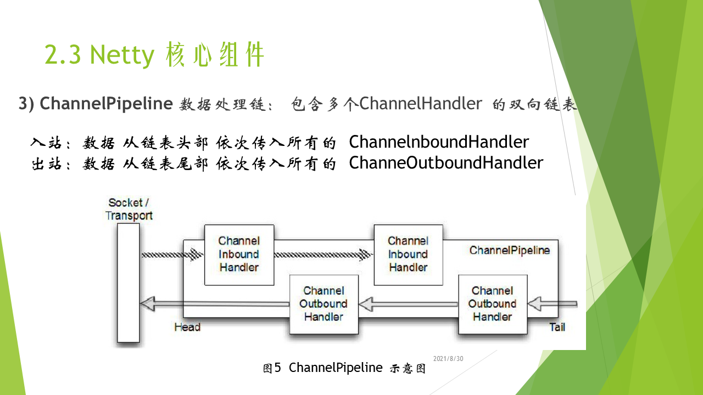

#### ChannelPipline 数据处理链
1) 数据处理链是包含多个ChannelHandler的双向链表。上图是ChannelPipline的示意图，从网络中接收的数据从左边的Socket中传入ChannelPipline，**入站的时候从链表头部，依次传入所有的ChannelInboundHandler中进行处理。出站的从链表尾部依次传入所有的ChanneloutboundHandler进行处理。**
2) ChannelPipeline其实就是一种高级形式的拦截过滤器。我们可以方便的增加删除ChannelPipline中的ChannelHanlder，也可以自己实现ChannelHandler，这样就能完全控制数据从入站到出战的处理方式，以及各个ChannelHandler 之间的相互交互方式。

#### 事件循环
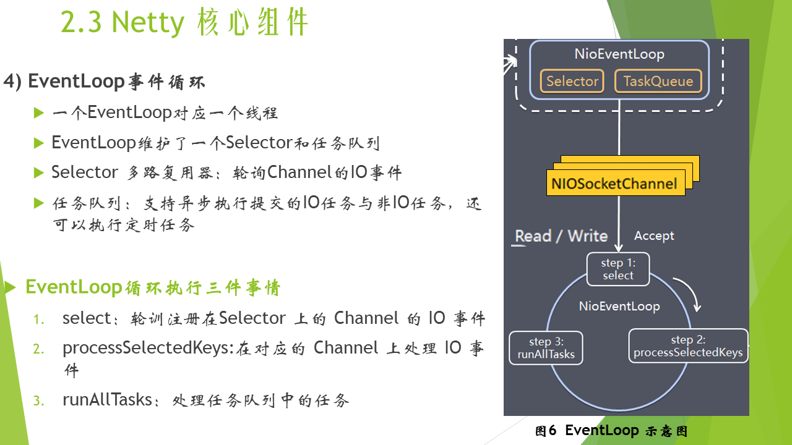
1） 一个事件循环对应一个线程，如上图所示，一个事件循环内维护了一个多路复用器，selector和一个任务队列taskQueue。
2） 服务器给每个客户端分配一个通道Channel，并将该通道的IO事件注册到Selector上，Selector 用于轮询各个Channel的IO事件
3） 任务队列可以异步执行提交的IO任务与非IO任务任务，还可以执行定时任务，比如说我们可以利用任务队列，向给建立连接的客户端定时发消息。

#### 其他组件
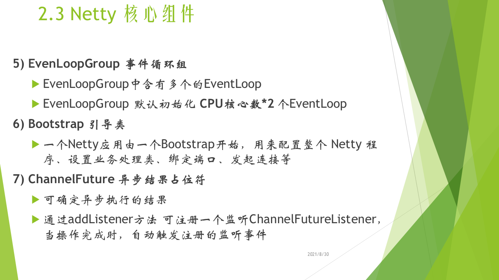 

**EvenLoopGroup 事件循环组**

EvenLoopGroup中含有多个的EventLoop

可以简单理解为一个线程池，内部维护了一组线程，

EvenLoopGroup 默认初始化 CPU核心数*2 个EventLoop

**ChannelFuture 异步结果占位符**

Netty的I/O操作是异步的，操作可能无法立即返回

ChannelFuture对象作为 异步操作结果的占位符 可确定异步执行的结果

通过addListener方法 可注册了一个监听ChannelFutureListener，当操作完成时，自动触发注册的监听事件

### Netty工作架构
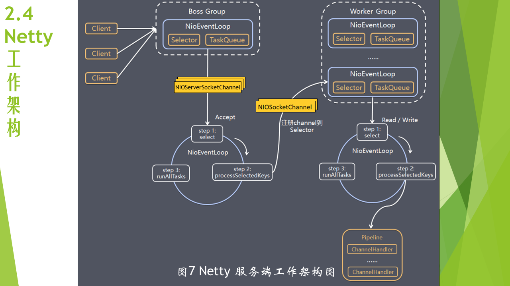
上图是Netty 服务端的工作架构图： 该图中有两个事件循环组：BossGroup 和 WorkerGroup，BossGroup 中的事件循环专门和客户端建立连接，WorkerGroup 中的EventLoop专门负责处理连接上的读写。

在这里，我通过模拟一个客户端给服务器发消息来解释：

1、首先初始化ServerSocketChannel 并将建立连接的事件Accept，注册到BoosGroup的一个事件循环的Selector上
2、接着事件循环就会轮询Channel上的建立连接事件
3、一个客户端发来建立连接请求后，Seletor通过轮询可以发现此请求，并通过processSeleterKeys 处理处理连接请求
4、怎么处理连接请求呢？首先是为这个连接分配一个SocketChannel，并将这个Channel的读写事件注册到一个WorkerGroup的事件循环的selector上，这时连接就建立好了，并且WorkerGroup会轮询SocketChannel的读写事件
5、当这个客户端再发送消息时，事件循环会轮询到写事件，并通过processSeleterKeys处理消息
6、processSeleterKeys通过刚刚讲的数据处理链过ChannelPipline来进行处理，可能包含先解码、再进行业务处理，再编码，再发送到SocketChannel中。

以上是服务端的具体流程，客户端也会建立一个Channel ，也有一个Seletor轮询IO事件，当消息到达时，也可以通过客户端的ChannelPipline进行处理。

到现在，我们已经大概了解了Netty的工作原理，BoosGroup 用于专门创建连接，其中有多个事件循环线程，每个事件循环都监听对应通道的建立连接请求并进行处理。WorkGroup 中也有多个事件循环线程，负责对应通道的IO事件。一个线程可以负责多个通道的IO，实现了IO多路复用。

建立连接、IO处理都由多个线程去做，提高了并发能力，也提高了系统的可靠性 （在之前的单线程处理IO的情况下若意外终止则服务不可用）。

## 三、ByteBuf与引用计数
#### ByteBuf
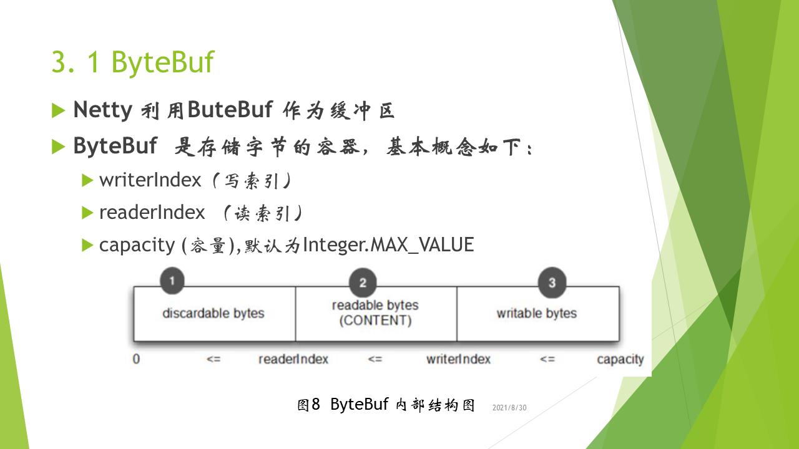
Netty 利用ByteBuf作为缓冲区，利用Channel进行读写都要经过缓冲区，因此需要了解ByteBuf 的基本概念和操作才能更好的利用Netty编程。ByteBuf  是存储字节的容器，类似于NIO中的 ByteBuffer。

1、写索引： writerIndex  （当数据写入ByteBuf时writerIndex增加）
2、读索引： readerIndex  （当从ByteBuf读数据时readerIndex增加）

当writerIndex==readerIndex时 ：代表无数据可以读
capacity (ByteBuf的容量)：默认为Integer.MAX_VALUE
因此可将ByteBuf 分为 三个部分
1. 可以被丢弃字节
2. 可读字节
3. 可写字节

##### ByteBuf使用模式
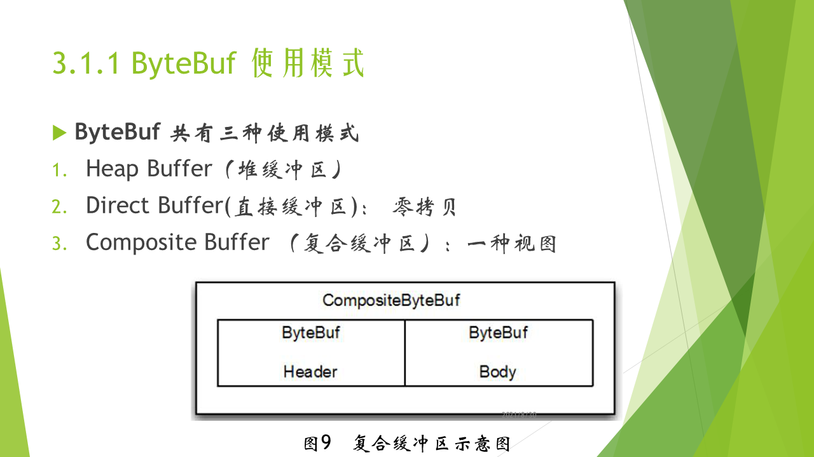
ByteBuf 共有三种使用模式
模式1：Heap Buffer（堆缓冲区）
它是将数据存储在JVM的堆空间（通过将数据存储在数组中实现），堆缓冲区可以通过JVM快速分配与释放
模式2 ：Direct Buffer 直接缓冲区
不在JVM的堆中分配内存，而是在JVM外通过本地方法调用分配虚拟机外内存
优点：免去中间交换的内存拷贝，提升IO处理速度：若在堆，则需要将数据先复制到直接缓冲区，再复制到堆，这种模式体现了Netty的零拷贝特性
模式3：Composite Buffer 复合缓冲区
是一种视图，不实际存数据，它可以由多个堆缓冲区和直接缓冲区 复合组成
优点：可将消息拆分为多个部分，若某部分不变，则不用每次都分配新的缓冲区存不变的部分（向多个客户端发 相同的消息body不变 header变 可以复用body）

##### ByteBuf分配器
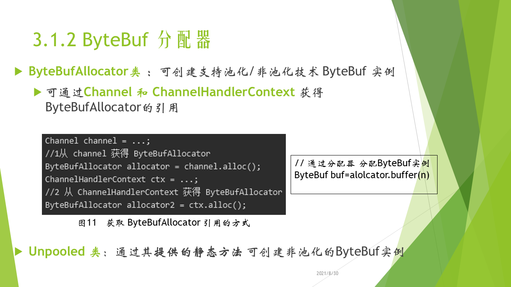
有两种ByteBuf 分配方式，
1.一种是通过ByteBufAllcator类，它可以分配池化或者池化的ByteBuf实例，利用池化技术可以改进性能 降低内存使用率。可以通过channel 和channelhandlercontext 获得该实例，代码如图11所示。
2.第二种分配方式是利用Unpooled类提供的静态方法，可以创建非池化的ByteBuf实例

#### 引用计数
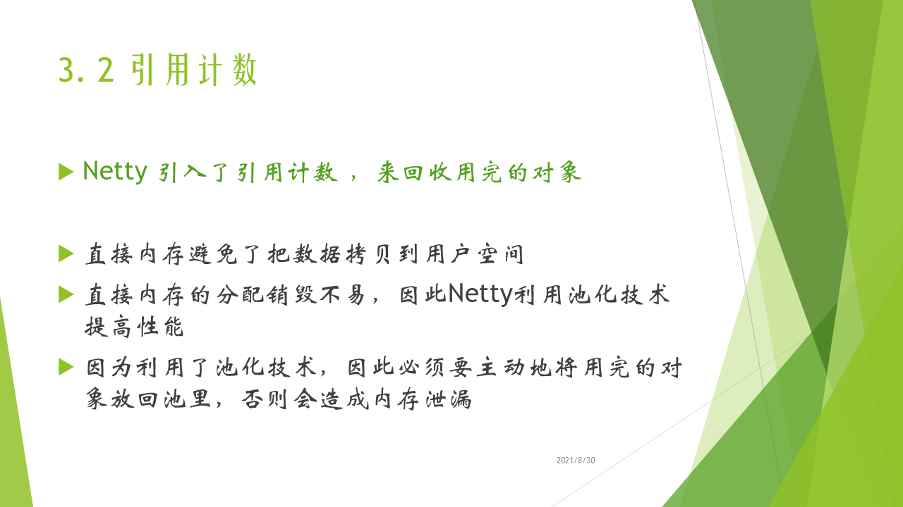
上面我们讲到，ByteBuf可以利用直接内存避免拷贝数据到用户空间，并且Netty还使用池化技术降低内存使用率。因为用到了池化技术，Netty需要将用完的对象放回池中，java的垃圾回收器无法完成此功能，因此引入了引用计数，将用完的对象放回池中。

##### 引用计数的常规操作
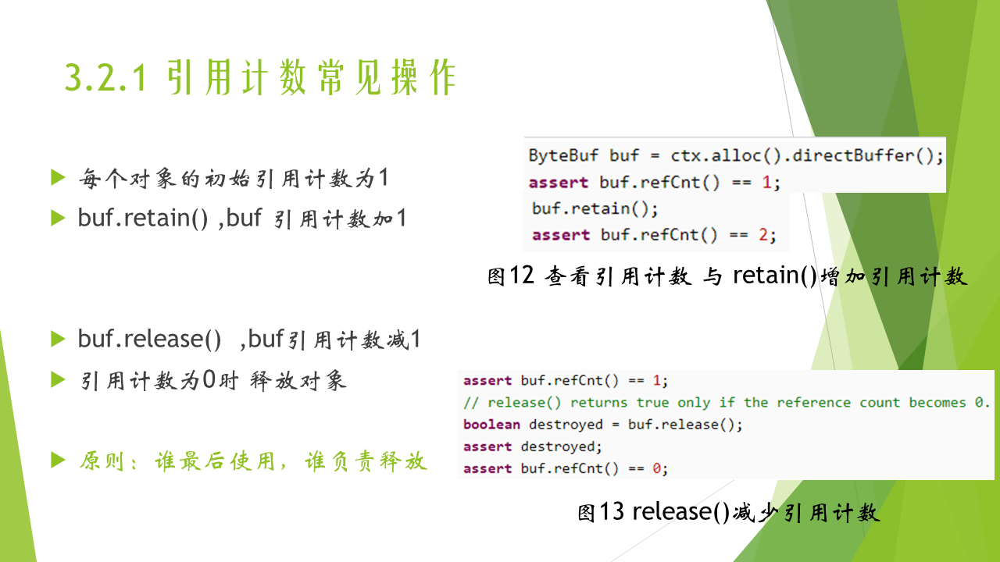
如图所示 每个对象的初始引用计数为1
buf.retain() ,buf 引用计数加1
buf.release() ,buf引用计数减1
当引用计数为0时 释放对象，并返回对象池。
ByteBuf引用计数的原则是：谁最后使用，谁负责释放


## 四、几种 Reactor 线程模式
​		传统的 BIO 服务端编程采用“每线程每连接”的处理模型，弊端很明显，就是面对大量的客户端并发连接时，服务端的资源压力很大；并且线程的利用率很低，如果当前线程没有数据可读，它会阻塞在 read 操作上。这个模型的基本形态如下图所示。

 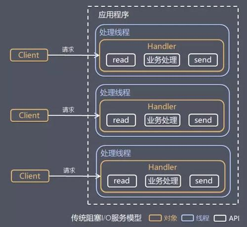

BIO 服务端编程采用的是 Reactor 模式（也叫做 Dispatcher 模式，分派模式），Reactor 模式有两个要义：

1）基于 IO 多路复用技术，多个连接共用一个多路复用器，应用程序的线程无需阻塞等待所有连接，只需阻塞等待多路复用器即可。当某个连接上有新数据可以处理时，应用程序的线程从阻塞状态返回，开始处理这个连接上的业务。
2）基于线程池技术复用线程资源，不必为每个连接创建专用的线程，应用程序将连接上的业务处理任务分配给线程池中的线程进行处理，一个线程可以处理多个连接的业务。

下图反应了 Reactor 模式的基本形态：

 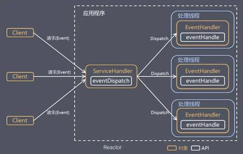

Reactor 模式有两个核心组成部分：

1）Reactor（图中的 ServiceHandler）：Reactor 在一个单独的线程中运行，负责监听和分发事件，分发给适当的处理线程来对 IO 事件做出反应。
2）Handlers（图中的 EventHandler）：处理线程执行处理方法来响应 I/O 事件，处理线程执行的是非阻塞操作。

Reactor 模式就是实现网络 IO 程序高并发特性的关键。它又可以分为单 Reactor 单线程模式、单 Reactor 多线程模式、主从 Reactor 多线程模式。

#### 单 Reactor 单线程模式

```
注意，后续图中的Handler仅仅是一个处理逻辑的执行，并不代表一个线程。X线程模式就代表IO和工作线程一共是X个线程。不要错误理解
```


 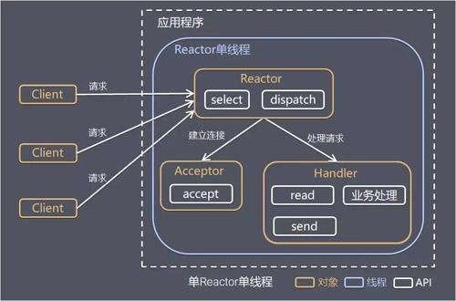

这种模式的基本工作流程为：
1）Reactor 通过 select 监听客户端请求事件，收到事件之后通过 dispatch 进行分发
2）如果事件是建立连接的请求事件，则由 Acceptor 通过 accept 处理连接请求，然后创建一个 Handler 对象处理连接建立后的后续业务处理。
3）如果事件不是建立连接的请求事件，则由 Reactor 对象分发给连接对应的 Handler 处理。
4）Handler 会完成 read-->业务处理-->send 的完整处理流程。

这种模式的优点是：模型简单，没有多线程、进程通信、竞争的问题，一个线程完成所有的事件响应和业务处理。

当然缺点也很明显：
1）存在性能问题，只有一个线程，无法完全发挥多核 CPU 的性能。Handler 在处理某个连接上的业务时，整个进程无法处理其他连接事件，很容易导致性能瓶颈。
2）存在可靠性问题，若线程意外终止，或者进入死循环，会导致整个系统通信模块不可用，不能接收和处理外部消息，造成节点故障。

单 Reactor 单线程模式使用场景为：客户端的数量有限，业务处理非常快速，比如 Redis 在业务处理的时间复杂度为 O(1)的情况。

### 单 Reactor 多线程模式
 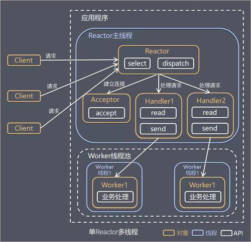

这种模式的基本工作流程为：

1）Reactor 对象通过 select 监听客户端请求事件，收到事件后通过 dispatch 进行分发。
2）如果事件是建立连接的请求事件，则由 Acceptor 通过 accept 处理连接请求，然后创建一个 Handler 对象处理连接建立后的后续业务处理。
3）如果事件不是建立连接的请求事件，则由 Reactor 对象分发给连接对应的 Handler 处理。Handler 只负责响应事件，不做具体的业务处理，Handler 通过 read 读取到请求数据后，会分发给后面的 Worker 线程池来处理业务请求。
4）Worker 线程池会分配独立线程来完成真正的业务处理，并将处理结果返回给 Handler。Handler 通过 send 向客户端发送响应数据。
这种模式的优点是可以充分的利用多核 cpu 的处理能力，缺点是多线程数据共享和控制比较复杂，Reactor 处理所有的事件的监听和响应，在单线程中运行，面对高并发场景还是容易出现性能瓶颈。


### 主从 Reactor 多线程模式

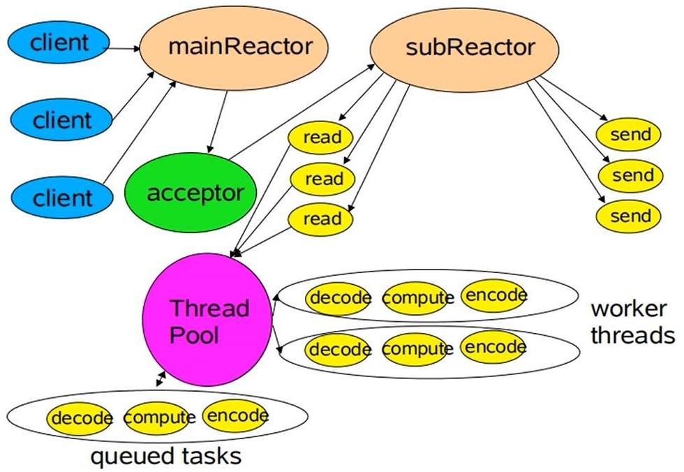

​		针对单 Reactor 多线程模型中，Reactor 在单个线程中运行，面对高并发的场景易成为性能瓶颈的缺陷，主从 Reactor 多线程模式让 Reactor 在多个线程中运行（分成 MainReactor 线程与 SubReactor 线程）。这种模式的基本工作流程为：
1）Reactor 主线程 MainReactor 对象通过 select 监听客户端连接事件，收到事件后，通过 Acceptor 处理客户端连接事件。
2）当 Acceptor 处理完客户端连接事件之后（与客户端建立好 Socket 连接），MainReactor 将连接分配给 SubReactor。（即：MainReactor 只负责监听客户端连接请求，和客户端建立连接之后将连接交由 SubReactor 监听后面的 IO 事件。）
3）SubReactor 将连接加入到自己的连接队列进行监听，并创建 Handler 对各种事件进行处理。
4）当连接上有新事件发生的时候，SubReactor 就会调用对应的 Handler 处理。
5）Handler 通过 read 从连接上读取请求数据，将请求数据分发给 Worker 线程池进行业务处理。
6）Worker 线程池会分配独立线程来完成真正的业务处理，并将处理结果返回给 Handler。Handler 通过 send 向客户端发送响应数据。
7）一个 MainReactor 可以对应多个 SubReactor，即一个 MainReactor 线程可以对应多个 SubReactor 线程。

这种模式的优点是：
1）MainReactor 线程与 SubReactor 线程的数据交互简单职责明确，MainReactor 线程只需要接收新连接，SubReactor 线程完成后续的业务处理。
2）MainReactor 线程与 SubReactor 线程的数据交互简单， MainReactor 线程只需要把新连接传给 SubReactor 线程，SubReactor 线程无需返回数据。
3）多个 SubReactor 线程能够应对更高的并发请求。

这种模式的缺点是：编程复杂度较高。但是由于其优点明显，在许多项目中被广泛使用，包括 Nginx、Memcached、Netty 等。

这种模式也被叫做服务器的 1+M+N 线程模式，即使用该模式开发的服务器包含一个（或多个，1 只是表示相对较少）连接建立线程+M个 IO 线程+N 个业务处理线程。这是业界成熟的服务器程序设计模式。


## 参考资料：
[Netty](https://netty.io/)[官网](https://netty.io/)
[Netty的架构与原理初探](https://gitee.com/SFAC_hds/easy-cs/blob/main/Java/Netty架构与原理初探.md)
[理解高性能](https://www.jianshu.com/p/2965fca6bb8f)
[网络模型](https://www.jianshu.com/p/2965fca6bb8f)
[Netty实战精髓篇](https://www.w3cschool.cn/essential_netty_in_action/)
[Netty之有效规避内存泄漏](https://www.cnblogs.com/549294286/p/5168454.html)
