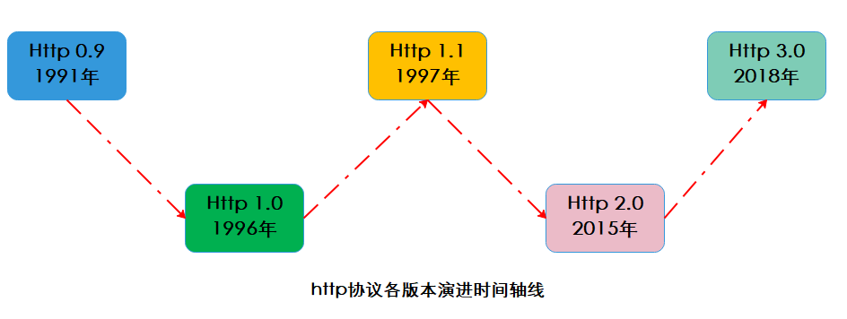
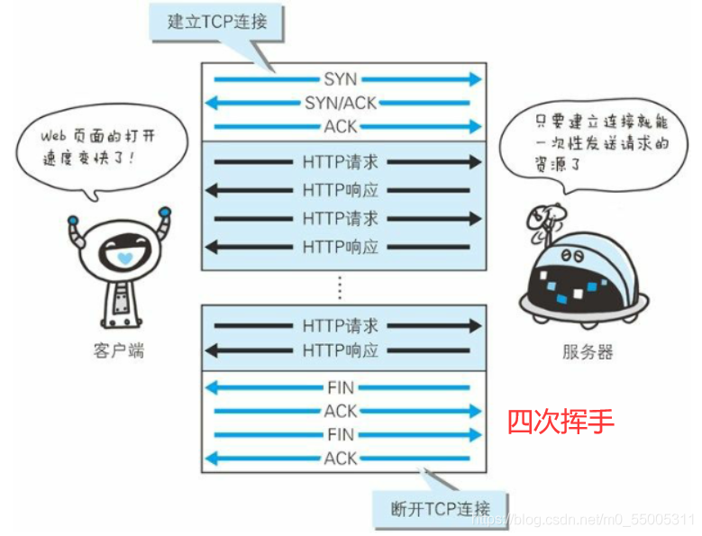
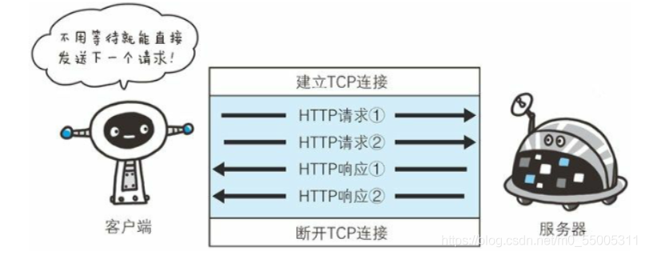
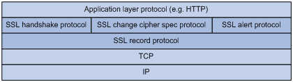
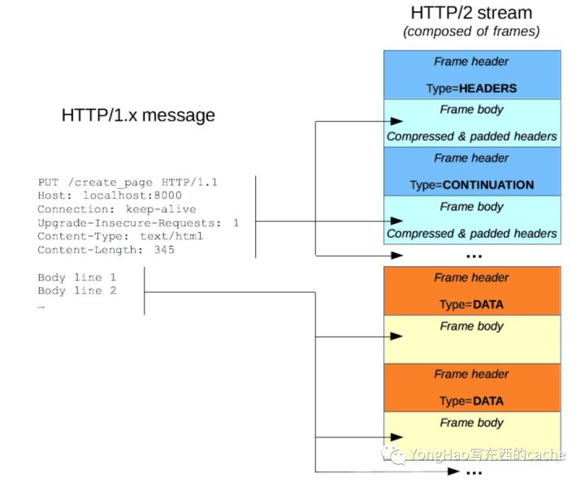
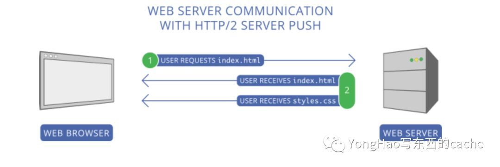
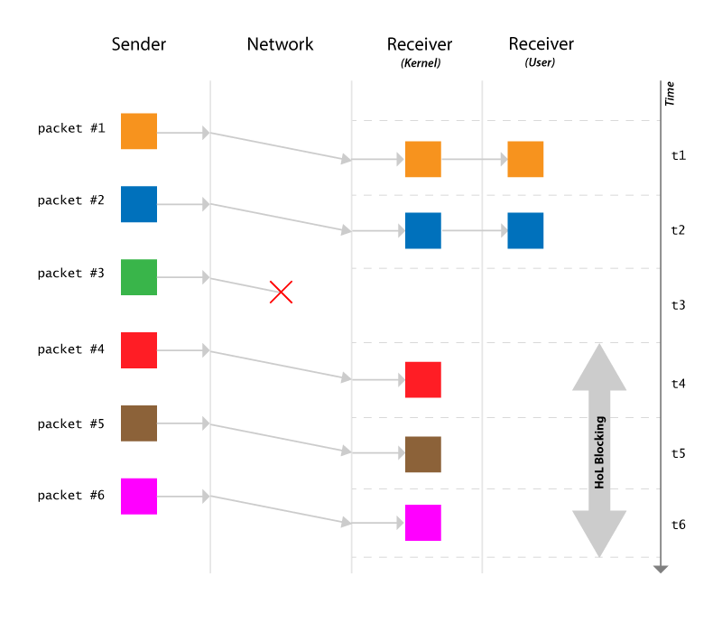
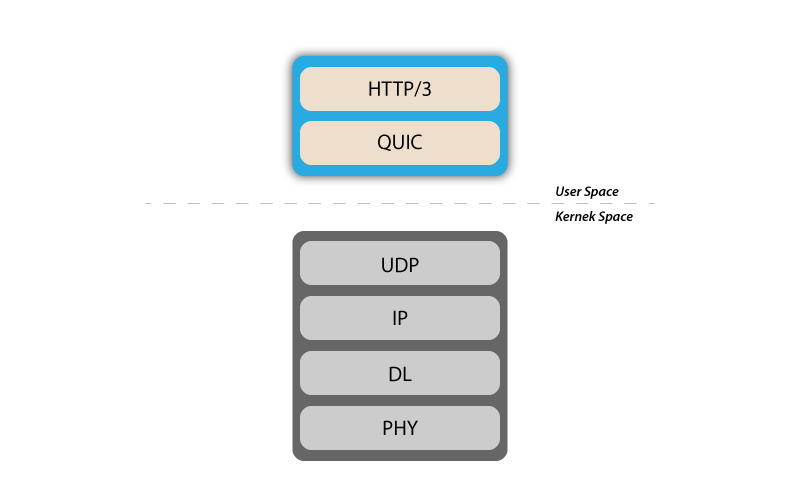
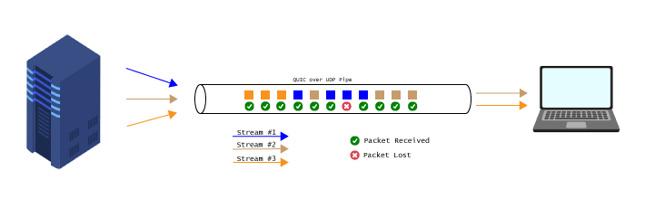

# HTTP
```
HTTP：超文本传输协议(HyperText Transfer Protocol)
HTML：超文本标记语言（HyperText Markup Language）
HyperText：超文本，可以理解为带超链接的文本。用 <a> 标签将各种不同空间的文字信息组织在一起的网状文本，可以将任一位置的多个信息集合到一起
设计HTTP最初的目的是为了提供一种传输HTML页面的方法
```

## HTTP发展历程


## HTTP/0.9

HTTP 最早的规范可以追溯到 1991 年，那时候的版本是 HTTP/0.9，该版本极其简单，只有一个叫做`GET`的请求方式。如果客户端要访问服务端上的一个页面，只需要如下非常简单的请求:
```http
GET /index.html
```
服务端对应的返回类似如下：
```http
(response body)
(connection closed)
```
- 只支持GET请求方式
- 不支持请求头header
- 服务端必须返回 HTML，并且立即关闭TCP连接

## HTTP/1.0
一个简单的 HTTP/1.0 请求大概是这样的：
```http
GET /index.html HTTP/1.0
User-Agent: Mozilla/5.0 (Macintosh; Intel Mac OS X 10_10_5)
Accept: */*
```
一个对上述请求的响应例子如下所示：
```http
HTTP/1.0 200 OK
Content-Type: text/plain
Content-Length: 137582
Expires: Thu, 05 Dec 1997 16:00:00 GMT
Last-Modified: Wed, 5 August 1996 15:55:28 GMT
Server: Apache 0.84
(response body)
(connection closed)
```
- 丰富请求方法
	- 请求方式新增了 POST 和 HEAD方法，提高了客户端向服务端发送信息的量级
- 增加请求头和响应头
	- 增添了请求头和响应头的概念，可以在通信中指定了HTTP协议版本号，以及其他header信息
- 丰富数据传输内容
	- 扩充了传输内容格式包括：图片、音视频资源、二进制等都可以进行传输，相比0.9的只能传输html内容让http的应用场景更多

#### HTTP/1.0 尚存问题
- 无连接	
	- HTTP/1.0 的一个主要缺点就是它不能在一个连接内拥有多个请求。这意味着，当客户端需要从服务器获取东西时，必须建立一个新的 TCP 连接，并且处理完单个请求后连接即被关闭。需要下一个东西时，你必须重新建立一个新的连接。这样的坏处在哪呢？假设你要访问一个有 10 张图片，5 个样式表stylesheet和 5 个 JavaScript 的总计 20 个文件才能完整展示的一个页面。由于一个连接在处理完成一次请求后即被关闭，所以将有 20 个单独的连接，每一个文件都将通过各自对应的连接单独处理。当连接数量变得庞大的时候就会面临严重的性能问题，因为 TCP 启动需要经过三次握手，才能缓慢开始。
	- 然而，某些 HTTP/1.0 的实现试图通过新引入一个称为 `Connection: keep-alive` 的头信息来克服这一问题，这个头信息意味着告诉服务器“嘿，服务器，请不要关闭此连接，我还要用它”。但是，这并没有得到广泛的支持，问题依然存在。
- 无状态
	- HTTP 还是一个无状态的协议，即服务器不维护有关客户端的信息。因此每个请求必须给服务器必要的信息才能完成请求，每个请求都与之前的旧的请求无关。所以，这增加了推波助澜的作用，客户端除了需要新建大量连接之外，在每次连接中还需要发送许多重复的数据，这导致了带宽的大量浪费。

## HTTP/1.1
#### 新增特性
- **增加了许多 HTTP 请求方法**，新增OPTIONS、PUT、PATCH、DELETE、TRACE 和 CONNECT 方法
- **主机标识符** `Host`请求头在 `HTTP/1.0` 并不是必须的，而在 `HTTP/1.1` 是必须的
- **持久连接**。在 `HTTP/1.0` 中每个连接只有一个请求并在该请求结束后被立即关闭，这导致了性能问题和增加了延迟。 `HTTP/1.1` 引入了持久连接，即连接在默认情况下是不关闭并保持开放的，这允许多个连续的请求使用这个连接。要关闭该连接只需要在头信息加入 `Connection: close`，客户通常在最后一个请求里发送这个头信息就能安全地关闭连接
- 新版本还引入了 `管线化(pipelining)` 的支持（与keeplive的区别在后续图示中会清晰展示），客户端可以不用等待服务器返回响应，就能在同一个连接内发送多个请求给服务器，而服务器必须以接收到的请求相同的顺序发送响应。但是你可能会问了，客户端如何知道哪里是第一个响应下载完成而下一个响应内容开始的地方呢？要解决这个问题，头信息必须有`Content-Length`，客户可以使用它来确定哪些响应结束之后可以开始等待下一个响应
	- 值得注意的是，为了从持久连接或管线化中受益， 头部信息必须包含 `Content-Length`，因为这会使客户端知道什么时候完成了传输，然后它可以发送下一个请求（持久连接中，以正常的依次顺序发送请求）或开始等待下一个响应（启用管线化时）
	- 但是，使用这种方法仍然有一个问题。那就是，如果数据是动态的，服务器无法提前知道内容长度呢？那么在这种情况下，你就不能使用这种方法中获益了吗？为了解决这个问题，`HTTP/1.1` 引进了分块编码。在这种情况下，服务器可能会忽略 `Content-Length` 来支持分块编码（更常见一些）。但是，如果它们都不可用，那么连接必须在请求结束时关闭
	- 在动态内容的情况下**分块传输**，当服务器在传输开始但无法得到 `Content-Length` 时，它可能会开始按块发送内容（一块接一块），并在传输时为每一个小块添加 `Content-Length`。当发送完所有的数据块后，即整个传输已经完成后，它发送一个空的小块，比如设置 `Content-Length` 为 0 ，以便客户端知道传输已完成。为了通知客户端**块传输**的信息，服务器在头信息中包含了 `Transfer-Encoding: chunked`
- 不像 HTTP/1.0 中只有 Basic 身份验证方式，`HTTP/1.1` 包括摘要验证方式digest authentication和代理验证方式proxy authentication
- 缓存
- 范围请求Byte Ranges
- 字符集
- 内容协商Content Negotiation
- 客户端 cookies
- 支持压缩
- 新的状态码

#### 持久连接
```
持久连接的细节如下
1.连接是持久性的，不主动声明关掉就开着
2.每个请求的生命周期不能重叠，请求1响应结束才能开始请求2
3.每个域名只能有一个存活连接
```
 

#### 管线化
```
持久连接在阻塞等待上个请求响应的过程比较浪费时间，管线化是为了解决请求的生命周期不能重叠的问题
1.允许上个请求的响应尚未返回的情况下，即可发送后续请求
2.响应顺序要按照请求顺序依次返回
3.每个域名仍然只能有一个存活连接
```
 

#### HTTP/1.1尚存问题
```
虽然管线化技术可以多个请求同时发送，但仍然存在问题
※一旦管线遇到了缓慢的响应，后面的响应便被阻塞住，它们必须等待上一个响应完成，等HTTP2.0来解决这个问题，在介绍HTTP2.0之前，先介绍下HTTPS
```

## HTTPS
```
		1996年，Netscape和Paul Kocher共同设计发布SSL 3.0协议，获得互联网广泛认可和支持。因特网工程任务组（IETF）接手负责该协议，并将其重命名为传输层安全（TLS）协议。
		SSL(Secure Sockets Layer ，安全套接层)介于应用层和TCP层之间，应用层数据不再直接传递给传输层而是传递给SSL层，SSL层对从应用层收到的数据进行加密，利用数据加密、身份验证和消息完整性验证机制，为网络上数据的传输提供安全性保证。
```
 

 #### HTTPS交互流程
```
除了建立TCP连接的三次握手，还有四次握手（实际情况可能会适当合并某些握手）。下图是从tcp建立连接之后开始画的，每一个方向的结束算一次握手，截止到下图的第9步结束，算是SSL握手过程完成。这四次握手简单概括为：
1.客户端向服务端请求证书
2.服务端返回证书
3.客户端用证书公钥加密一个随机数（这个随机数是后续对称加密key的组成部分）
4.服务端用私钥解密随机数，握手完成

后续客户端和服务端均使用同一个对称秘钥来对后续的报文进行加解密，这个对称秘钥是由3个随机数通过一定算法算出来的，这三个随机数分别存在第1、2、3次握手的报文中。
```
 


## HTTP/2
#### 新增特性
```
HTTP/2 是专门为了低延迟传输而设计的。主要特点如下
```
- 使用二进制替代明文
- 多路传输 - 多个异步 HTTP 请求可以使用单一连接
- 报头使用 HPACK 压缩
- 服务器推送 - 单个请求多个响应
- 请求优先级
- 安全性

#### 帧和流

​		HTTP/2 的数据包是由一个或多个帧组成的。`HEADERS` 帧承载了元数据meta data，`DATA` 帧则承载了内容。还有其他类型的帧（`HEADERS`、`DATA`、`RST_STREAM`、`SETTINGS`、`PRIORITY` 等等）。

​		每个 `HTTP/2` 请求和响应都被赋予一个唯一的流 ID，并切分成帧。帧就是一小片二进制数据。帧的集合称为流，每个帧都有个标识了其所属流的流 ID，所以在同一个流下的每个帧具有共同的报头。值得注意的是，除了流 ID 是唯一的之外，由客户端发起的请求使用了`奇数`作为流 ID，从来自服务器的响应使用了`偶数`作为流 ID。

​		除了 `HEADERS` 帧和 `DATA` 帧，另一个值得一提的帧是 `RST_STREAM`。这是一个特殊的帧类型，用来中止流，即客户可以发送此帧让服务器知道，我不再需要这个流了。在 `HTTP/1.1` 中让服务器停止给客户端发送响应的唯一方法是关闭连接，这样造成了延迟增加，因为之后要发送请求时，就要必须打开一个新的请求。而在 `HTTP/2`，客户端可以使用 `RST_STREAM` 来停止接收特定的数据流，而连接仍然打开着，可以被其他请求使用。
```
请求交互方式的变化如下：下图很清晰的表达了，http2是通过给请求和响应添加流id来区分不同的请求，可以做到非顺序响应。并把流切分成帧可以做到及时的分散传输。
```
 

```
当 data 过大的时候，http2 的 rfc 没有规定 data frame 应该拆分与否，然而去用一些工具如nghttp去看详细过程，可看到 data frame 拆成了多个帧
```
 

#### 二进制协议
```
		二进制协议减少了数据包的大小，怎么理解这个点呢？是相比HTTP1.1的数据包更小了吗，不是的。如果相同的内容，不考虑HPACK压缩的情况下，HTTP2的二进制包也比HTTP1.1更大。之所以说二进制协议减少了数据包的大小，是相对于HTTP2如果使用自描述文本会小一点，因为HTTP2的报文可能是好几个帧，如果采用二进制协议，那么帧类型、flag等可以减少占用空间（下表是帧的二级制协议格式），具体到Frame Payload上只是存储的自描述文本的二进制编码而已。我们可以认为采用二进制协议并不是针对HTTP1.1的改进，而是引入帧的被动优化。这一块论述可以进一步找相关资料或者抓包来验证。
```
+-----------------------------------------------------+
| Length (24) | Type (8)    |   Flags (8)   |
+------------------+---------------+-----------------+
|R|          Stream Identifier (31)              |
+=+============================+
|                   Frame Payload (0...)            | 
+------------------------------------------------------+
 

#### HPACK 请求头部压缩
```
		它的本质是当我们在同一客户端上不断地访问服务器时，许多冗余数据在头部中被反复发送，有时候仅仅是 cookies 就能增加头信息的大小，这会占用许多宽带和增加传输延迟。为了解决这个问题，`HTTP/2` 引入了头信息压缩。
		不像请求和响应那样，头信息中的信息不会以 gzip 或者 compress 等格式压缩。而是采用一种不同的机制来压缩头信息，客户端和服务器同时维护一张头信息表，储存了使用了哈夫曼编码进行编码后的头信息的值，并且后续请求中若出现同样的字段则忽略重复值（例如用户代理user agent等），只发送存在两边信息表中它的引用即可。
```
 

#### 服务器推送
```
		服务器推送是 HTTP/2 的另一个巨大的特点。对于服务器来说，当它知道客户端需要一定的资源后，它可以把数据推送到客户端，即使客户端没有请求它。例如，假设一个浏览器在加载一个网页时，它解析了整个页面，发现有一些内容必须要从服务端获取，然后发送相应的请求到服务器以获取这些内容。
		服务器推送减少了传输这些数据需要来回请求的次数。它是如何做到的呢？服务器通过发送一个名字为 PUSH_PROMISE 特殊的帧通知到客户端“嘿，我准备要发送这个资源给你了，不要再问我要了。”这个 PUSH_PROMISE 帧与要产生推送的流联系在一起，并包含了要推送的流 ID，也就是说这个流将会被服务器推送到客户端上。
```
 

#### 请求优先级
```
		当流被打开的时候，客户端可以在 HEADERS 帧中包含优先级信息来为流指定优先级。在任何时候，客户端都可以发送 PRIORITY 帧来改变流的优先级。
		如果没有任何优先级信息，服务器将异步地无序地处理这些请求。如果流分配了优先级，服务器将基于这个优先级来决定需要分配多少资源来处理这个请求。
```

#### 安全性
```
		在是否强制使用 TLS 来增加安全性的问题上产生了大范围的讨论，讨论的结果是不强制使用。然而大多数厂商只有在使用 TLS 时才能使用 HTTP/2。所以 HTTP/2 虽然规范上不要求加密，但是加密已经约定俗成了。这样，在 TLS 之上实现 HTTP/2 就有了一些强制要求，比如，TLS 的最低版本为 1.2，必须达到某种级别的最低限度的密钥大小，需要布署 ephemeral 密钥等等。
```

#### HTTP/2尚存问题
```
		从应用层面看，HTTP/2已接近完美。但是因为底层基于TCP协议，那自然TCP协议本身存在的问题就成了HTTP/2存在的问题。
1.包丢失，等待重传
		在TCP层面，如果一个序列号较低的数据包还没有接收到，即使其他序列号较高的包已经接收到，TCP的接收机滑动窗口也不会继续处理。这将导致TCP流瞬间挂起，在更糟糕的情况下，即使所有的包中有一个没有收到，也会导致关闭连接。这个问题被称为TCP流的行头阻塞（HoL）
```
 

## HTTP3
```
		从语法和语义上看，HTTP/3与HTTP/2相似。HTTP/3遵循相同的请求和响应消息交换顺序，其数据格式包含方法、标题、状态码和body。然而，HTTP/3的显著的偏差在于协议层在UDP之上的堆叠顺序
		QUIC，发音同quick，是"Quick UDP Internet Connections"的简称，是一种通用的传输层网络协议。QUIC与TCP相同，是一种有连接的传输协议。但是与TCP不同的是QUIC是建立在UDP传输层协议之上的，实现了在两个端点之间的多路复用。
```
  

```
流复用和流控。QUIC引入了连接上的多路流复用的概念。QUIC通过设计实现了单独的、针对每个流的流控，解决了整个连接的行头阻塞问题。
如下图所示，一个流中的某个帧丢失不影响其他流的内容组装。
```
 

## 参考文档
[漫游 HTTP/2](https://linux.cn/article-7811-1.html)
[Http1.1管线化技术（pipeLining）](https://www.jianshu.com/p/506d05e3a100)
[图解|什么是HTTP简史](https://mp.weixin.qq.com/s?src=11&timestamp=1664331981&ver=4071&signature=EyZpz37avvkHSqYAUsmPpztoVrAumsEPX8Uxl1j88p4kZqAZc7gJFjn8Q*2OVZX-E1757LBkcL8cIhioHex3lFy9HV-HJ60T6zATv-WZHHYfAHayCBR2NR5FSiZrPWmq&new=1)
[http2&http1性能对比](http://www.http2demo.io/)
[HTTP2 协议长文详解 ](https://www.cnblogs.com/jiujuan/p/16939688.html)
[RFC 9113](https://httpwg.org/specs/rfc9113.html#HEADERS)