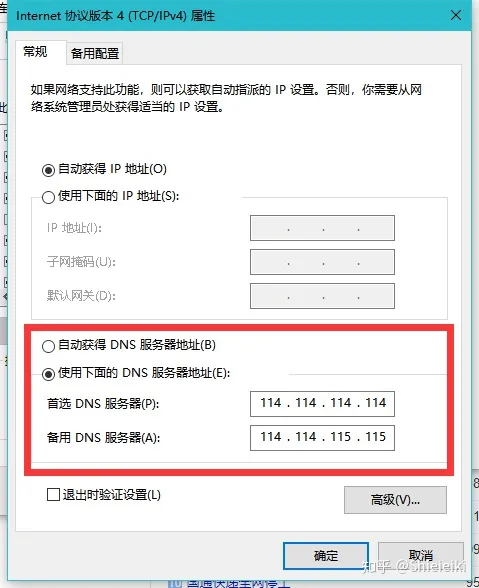
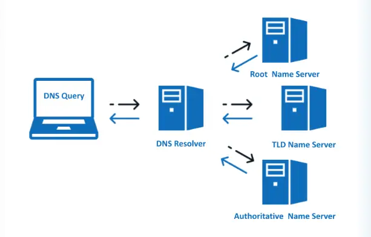
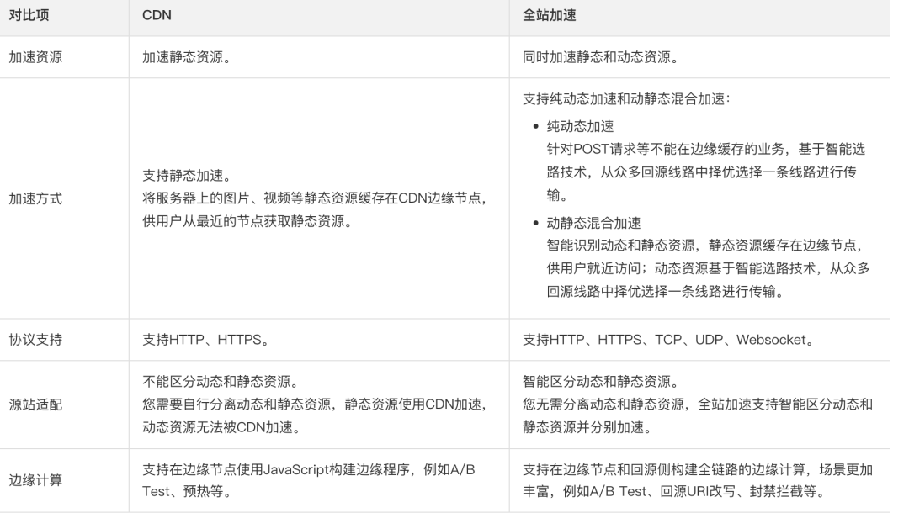
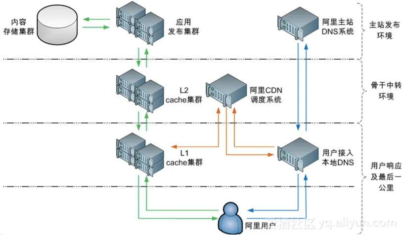
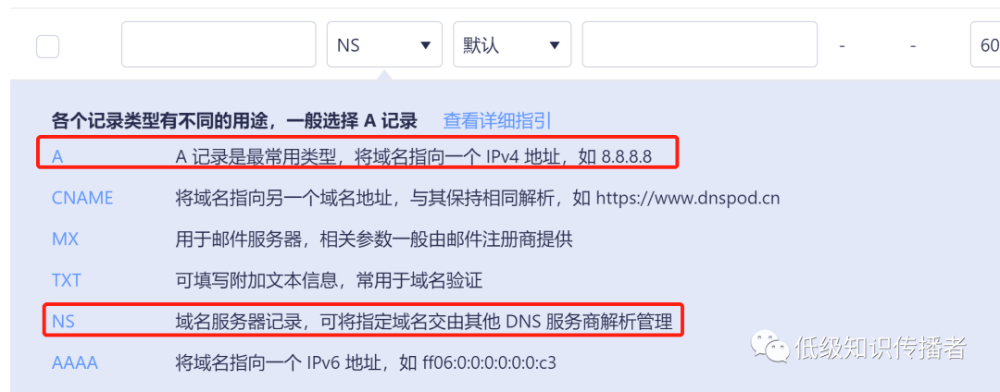
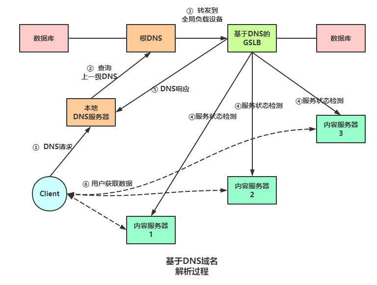
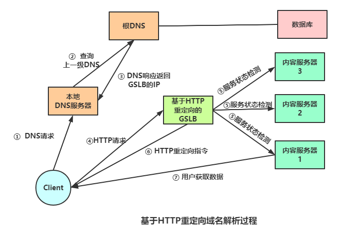
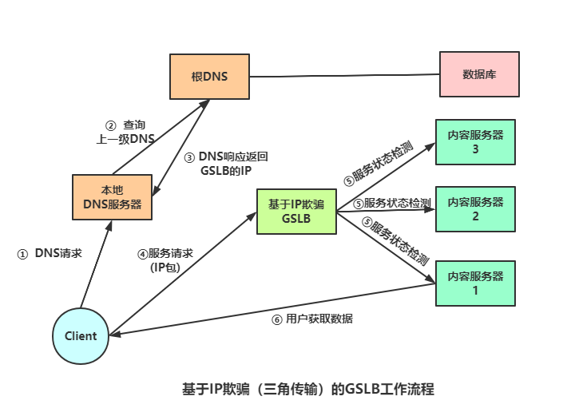

# DNS&CDN
## DNS
```
		DNS （Domain Name System 的缩写）的作用非常简单，就是根据域名查出IP地址。你可以把它想象成一本巨大的电话本。举例来说，如果你要访问域名math.stackexchange.com，首先要通过DNS查出它的IP地址是151.101.129.69
		DNS的服务器地址存在于操作系统的设置中，如下所示
```
 

### DNS交互流程 
 

### DNS服务节点
```
DNS服务器分为多级，最顶层的域名是根域名（root），然后是顶级域名（top-level domain，简写 TLD），再是一级域名、二级域名、三级域名
```
**1）根域名**

所有域名的起点都是根域名，它写作一个点`.`，放在域名的结尾。因为这部分对于所有域名都是相同的，所以就省略不写了，比如`example.com`等同于`example.com.`（结尾多一个点）。

**（2）顶级域名**

根域名的下一级是顶级域名。它分成两种：通用顶级域名（gTLD，比如 .com 和 .net）和国别顶级域名（ccTLD，比如 .cn 和 .us）。

顶级域名由国际域名管理机构 ICANN 控制，它委托商业公司管理 gTLD，委托各国管理自己的国别域名。

**（3）一级域名**

一级域名就是你在某个顶级域名下面，自己注册的域名。比如，`ruanyifeng.com`就是我在顶级域名`.com`下面注册的。

**（4）二级域名**

二级域名是一级域名的子域名，是域名拥有者自行设置的，不用得到许可。比如，`es6` 就是 `ruanyifeng.com` 的二级域名。

 

### 域名逐级查询

这种树状结构的意义在于，**只有上级域名，才知道下一级域名的 IP 地址，需要逐级查询。**

每一级域名都有自己的 DNS 服务器，存放下级域名的 IP 地址。

所以，如果想要查询二级域名 `es6.ruanyifeng.com` 的 IP 地址，需要三个步骤。

> 第一步，查询根域名服务器，获得顶级域名服务器`.com`（又称 TLD 服务器）的 IP 地址。
>
> 第二步，查询顶级域名服务器 `.com`，获得一级域名服务器 `ruanyifeng.com` 的 IP 地址。
>
> 第三步，查询一级域名服务器 `ruanyifeng.com`，获得二级域名 `es6` 的 IP 地址。

##### 递归 DNS 服务器
```
		我们平常说的 DNS 服务器，一般都是指递归 DNS 服务器。它把 DNS 查询自动化了，只要向它查询就可以了。它内部有缓存，可以保存以前查询的结果，下次再有人查询，就直接返回缓存里面的结果。所以它能加快查询，减轻源头 DNS 服务器的负担。
```
  

### DNS 负载均衡
```
		DNS负载均衡技术的实现原理是在DNS服务器中为同一个主机名配置多个IP地址，在应答DNS查询时，DNS服务器对每个查询将以DNS文件中主机记录的IP地址按请求顺序依次返回，将客户端的访问引导到不同的机器上去，使得不同的客户端访问不同的服务器，从而达到负载均衡的目的。
```
### DNS 缓存
```
有dns的地方，就有缓存。浏览器、操作系统、进程（JVM）、Local DNS、根域名服务器，都会对DNS结果做一定程度的缓存

>浏览器 DNS缓存
chrome dns工具： chrome://net-internals/#dns
浏览器访问域名拿到实际IP地址后，会缓存，有效期1分钟。DNS缓存时间跟DNS服务器返回的TTL值无关。

>Java DNS缓存
其实是由JVM 缓存策略控制。当第一次使用某个域名创建InetAddress对象后，JVM会将域名和映射的IP地址保存在DNS缓存里。下一次直接从缓存取就可以。
JDK1.5之前，这个JVM缓存是永久保存的，即：除非重启，否则域名后端IP改变了后，不能响应到。
之后的JDK，如果设置了security manager，永久保存，如果没有设置，保存30s。
参数：
      networkaddress.cache.negative.ttl=10
      networkaddress.cache.ttl=-1

>操作系统 DNS缓存（hosts文件）
缓存时间会参考本地DNS服务器（ISP-电信运营商服务器）返回的TTL值，但不完全等于。
IOS每24h刷新一次DNS缓存，MAC清缓存：lookupd-flushcache。
Linux缓存：/etc/init.d/nscd restart
```

## CDN
```
		CDN 全称是 Content Delivery Network/Content Distribution Network，意思是“内容分发网络”。简单来说，就是将静态资源分发到多个不同的地方以实现就近访问，进而加快静态资源的访问速度，减轻服务器以及带宽的负担。
目前市面上出现了一些全站加速的产品，包含静态资源和非静态资源（asp/.net/jsp/php等动态文件），实际上非静态资源和静态资源的加速在原理上差别很大，此处不讨论。
```
 

### 基础架构
 ```
 1.调度系统负责选取合适的节点给用户，这是CDN的核心，也就是GSLB（全局负载均衡）
 2.CDN节点分为L1、L2两级缓存，L1如果没有资源问L2要，L2没有再回源。回源之后，L2、L1缓存内容
 3.同链条的L1和L2可能不在同一地区，L1在上海，对应的L2可能在杭州负责整个长三角
 ```




### GSLB

```
		全局负载均衡（Global Server Load Balance, GSLB）,全局负载均衡是指对分别放置在不同的地理位置的CDN服务器集群间作负载均衡。服务器负载均衡是指对本地的服务器集群做负载均衡。主要用于在多个区域拥有自己服务器的站点，为了使全球用户只以一个域名就能访问到离自己最近的服务器，从而获得最快的访问速度。GSLB服务由CDN服务商提供。
		对于全局负载均衡而言，其核心就是服务器集群的选择。对于某个特定的客户，应该将其定向到哪一个服务群？应该使用什么标准来进行这种选择？一般情况下，主要考虑两个因素：临近程度和负载大小。
		临近机制主要考察服务器集群与用户之间的物理距离。选择地理位置最接近用户的服务器集群，可以减少服务响应到达用户所经过的中转次数，从而降低中转节点对服务质量的影响。常见的有两种方式，一种是静态配置，例如根据静态的IP地址配置表进行IP地址到服务器群的映射。另一种方式是动态的检测，例如实时地探测到目标IP的距离（可以采用到达目标IP经过的跳数作为度量单位），然后比较探测结果进行选择。
		负载机制比较各个服务器集群的负载，确定由哪一个服务器集群来响应请求。在全局负载均衡中，考察的是服务器集群的负载，而不是单个服务器的负载，因此，需要更多地考虑普遍的问题，比如，需要考虑站点的最大连接数、站点的平均响应时间、服务质量等。
```

### GSLB调度方式
```
		常见的GSLB实现方式有三种：DNS调度、302调度、IP欺骗（又称三角传输）。这三种实现方式都是在用户通过域名来访问目标服务器时，由GSLB设备进行智能决策，将用户引导到一个最佳的节点IP。
```

#### 1. DNS调度
```
		向本地DNS服务器请求解析域名，此处的‘本地DNS服务器’代表本地区的DNS服务器，当地运营商提供的，本地DNS递归向根服务器、顶级域名服务器。。。查到域名的NS记录，NS记录代表域名需要交给指定的DNS服务器解析，NS记录的值就是这个指定的DNS服务器地址。NS记录是在配置域名DNS信息的时候配置的GSLB地址。此时本地DNS服务器就把请求转到了GSLB来解析，GSLB选择合适的CDN节点IP返回。理解起来有点费劲，结合下面的图示理解清楚NS的作用和整个流程。
		以上是通用流程，但是如果CDN供应商有自己的权威DNS服务器（大厂都有），那就可以把请求域名配置一个CNAME记录，这个CNAME记录可以由权威服务器接手解析，随后转交给GSLB服务器获取ip即可（重点）。这是目前大厂比较常用的做法。
		
优点是：实现简单、实施容易、成本低。
缺点是：当GSLB设备采用“用户就近访问”的原则作为选择最优服务器的策略时，会存在判断不准的现象。原因是在这种策略下，GSLB设备是根据用户IP地址和内容服务器IP地址比较来判断其就近性的，但由于请求是通过本地DNS服务器中转的，GSLB设备实际上只能得到用户的本地DNS服务器地址，若用户指定的DNS服务器IP不能正确代表用户的实际位置，就会出现判断不准的现象。

※CNAME的好处在于，多个域名对应同一个别名时，服务ip出现变化，只需要变更别名对应的ip即可。而不需要更改多个域名对ip的映射关系。
```
 
 

#### 2. 302调度
```
		为了解决基于DNS实现方式判断不准的问题，又出现了基于HTTP重定向的GSLB。这种方案中GSLB使用HTTP重定向技术，将用户访问重定向到最合适的服务器上。用户域名的A记录要配置成GSLB设备的IP地址。
		
优点：由于直接向用户发送HTTP重定向指令，可以得到用户的真实IP，从而解决了判断不准确的问题。
缺点：是只能为HTTP访问重定向。
```
 

####  3. IP欺骗调度
```
		302调度解决了判断不准确的问题，但只能针对HTTP协议应用使用。对于HTTP协议以外的访问，就需要使用基于IP欺骗（又称三角传输）的GSLB
		基于IP欺骗的方案同样需要首先将GSLB设备的IP地址在DNS中登记为域名的A记录，这样用户对该域名的请求包都会先发送到GSLB设备。如上图所示，GSLB设备首次收到服务请求包后，会选择一个最合适的服务器，并将服务请求包发送到该服务器。服务器在向用户发送响应包时，将其源IP地址字段改为GSLB设备的IP，发送给用户。
		这样，整个过程对用户来说，感觉到的只是GSLB设备在为其提供服务，并不知道其中经历这样一个三角传输的过程。而且这种方案可以对所有类型的访问如HTTP、FTP等进行重定向，但其速度和效率相对比前两种方案要差一点，因为用户所有的访问请求都通过三个点才能响应，经历了更多的路径和处理，所以其主要作为HTTP重定向方案的补充方案在同一GSLB设备中实现
```



## 参考文档

[DNS是什么东西，他有什么用，DNS劫持说的又是啥](https://zhuanlan.zhihu.com/p/60725155)
[DNS 原理入门](https://www.ruanyifeng.com/blog/2016/06/dns.html)
[DNS 查询原理详解](https://www.ruanyifeng.com/blog/2022/08/dns-query.html)
[用动画告诉你 CDN是如何工作的 | CDN是什么 | CDN原理](https://www.zhihu.com/zvideo/1338850254489939968)
[CDN普通节点、CDN动态节点、PCDN的对比](https://zhuanlan.zhihu.com/p/526448963)
[gslb（global server load balance）技术的一点理解](https://mp.weixin.qq.com/s/I7pNMiyXi9mPjS95DCe9AA)
[全局负载均衡（GSLB）和内容分发网络（CDN）原理及实战](https://mp.weixin.qq.com/s/U5g4wwo3n-c8z3M8x5qD5w)
