# SLB

```
		SLB(Server Loader Balancer):负载均衡，是将访问流量根据转发策略分发到多台服务器上，来实现多台服务器提供相同的业务服务。负载均衡扩展了应用的服务能力，增强了应用的可用性。
```

## 服务架构演化

### 单点模式
```
单点模式保证不了服务的可用性，一台机器宕机就停止服务了，并且能够承担的流量有限。
```
 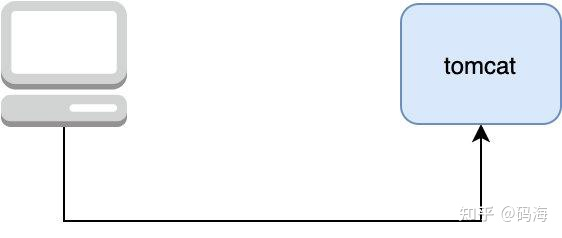

### 多点模式
```
		在架构设计中有个经典的共识：没有什么是加一层解决不了的，如果有那就再加一层，所以我们在 server 端再加一层，将其命名为 LB（Load Balance，负载均衡），由 LB 统一接收 client 的请求，然后再由它来决定具体与哪一个 server 通信，一般业界普遍使用 Nginx 作为 LB
```
 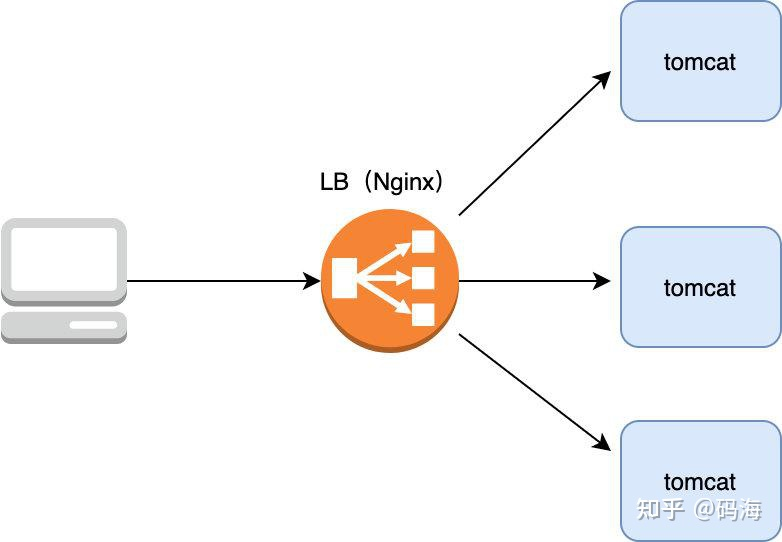

### 网关模式
```
		所有的流量都能打到 server 上，会存在安全问题，那能不能在流量打到 server 前再做一层鉴权操作呢，鉴权通过了我们才让它打到 server 上，我们把这一层叫做网关（为了避免单点故障，网关也要以集群的形式存在）
		除了鉴权外，网关还起到风控（防止羊毛党），协议转换（比如将 HTTP 转换成 Dubbo），流量控制等功能，以最大程度地保证转发给 server 的流量是安全的，可控的。
```
 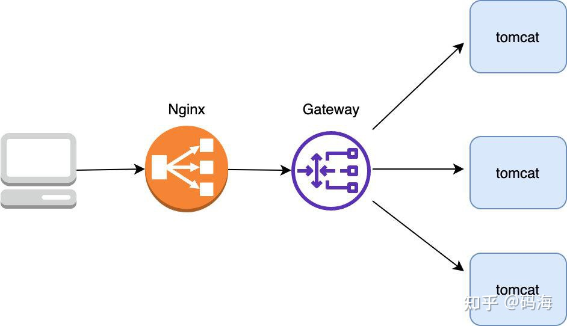

### 动静分离
```
		不管是动态请求，还是静态资源（如 js，css文件）请求都打到 tomcat 了，这样在流量大时会造成 tomcat 承受极大的压力，其实对于静态资源的处理 tomcat 不如 Nginx，tomcat 每次都要从磁盘加载文件比较影响性能，而 Nginx 有 proxy  cache 等功能可以极大提升对静态资源的处理能力
```
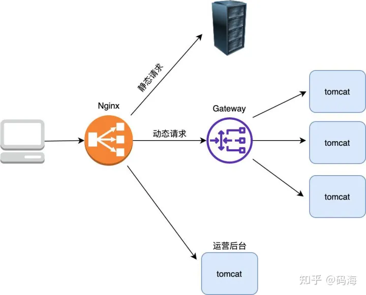

### 主备负载均衡
```
		当然为了避免单点故障 Nginx 也需要部署至少两台机器，于是我们的架构变成了下面这样，Nginx 部署两台，以主备的形式存在，备 Nginx 会通过 keepalived 机制（发送心跳包） 来及时感知到主 Nginx 的存活，发现宕机自己就顶上充当主 Nginx 的角色
```
 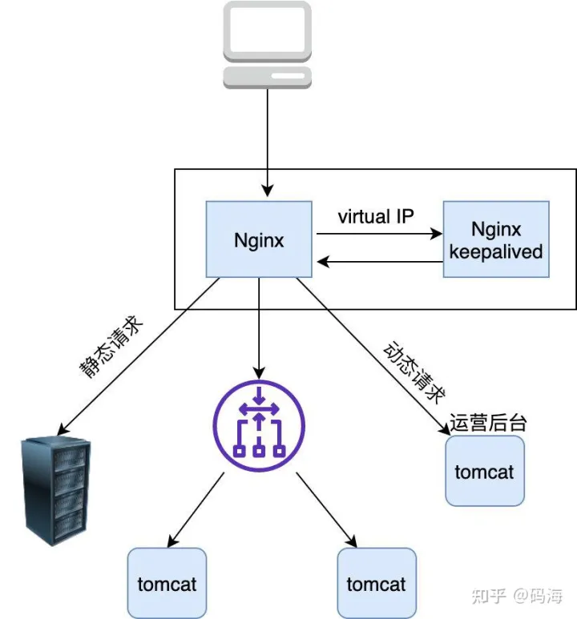

**IP漂移**
```
		虚拟IP不是分配给真实主机的IP，但它可以根据需要，随时关联到某台服务器，也就是说对外提供服务器的主机除了有一个真实IP外还有一个虚IP，使用这两个IP中的任意一个都可以连接到这台主机。
		虚拟IP一般用作达到HA(High Availability)的目的，比如让所有项目中数据库链接一项配置的都是这个虚IP，当主服务器发生故障无法对外提供服务时，动态将这个虚IP切换到备用服务器。
		上面的VIP自动切换的过程就称之为IP漂移。通常用keepalived组件实现
```

### 双层负载均衡

```
		Nginx 是七层（即应用层）负载均衡器 ，这意味着如果它要转发流量首先得和 client 建立一个 TCP 连接，并且转发的时候也要与转发到的上游 server 建立一个 TCP 连接，而我们知道建立 TCP 连接其实是需要耗费内存（TCP Socket，接收/发送缓存区等需要占用内存）的，客户端和上游服务器要发送数据都需要先发送暂存到到 Nginx 再经由另一端的 TCP 连接传给对方。一台Nginx的主服务器容量有限，当达到瓶颈时也需要集群化。
		经过分析可知 Nginx 的负载能力较差主要是因为它是七层负载均衡器必须要在上下游分别建立两个 TCP 所致，那么是否能设计一个类似路由器那样的只负载转发包但不需要建立连接的负载均衡器呢，这样由于不需要建立连接，只负责转发包，不需要维护额外的 TCP 连接(但仍然是三角传输，参见下边第二个图片)，它的负载能力必然大大提升，于是四层负载均衡器 LVS 就诞生了，简单对比下两者的区别。
```
 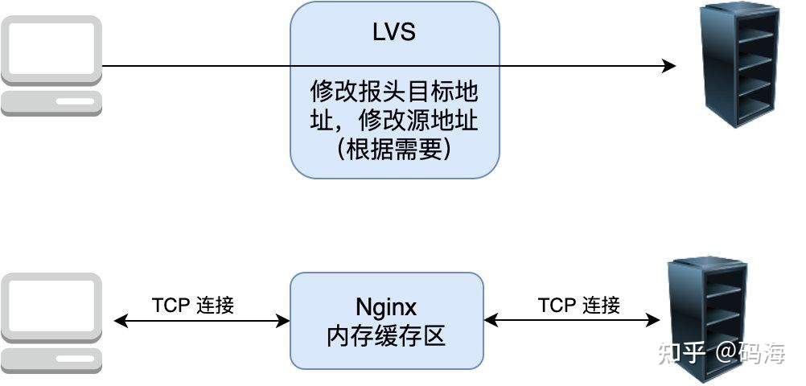
 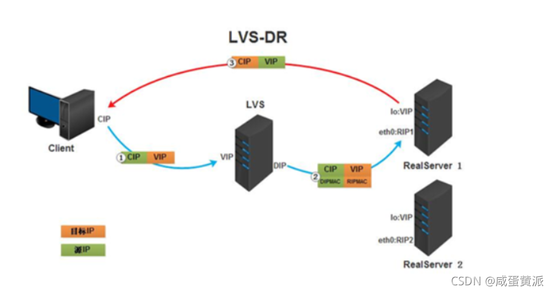

```
		综上所述，我们在 Nginx 上再加了一层 LVS，以让它来承接我们的所有流量，当然为了保证 LVS 的可用性，我们也采用主备的方式部署 LVS，另外采用这种架构如果 Nginx 容量不够我们可以很方便地进行水平扩容，于是我们的架构改进如下：
```
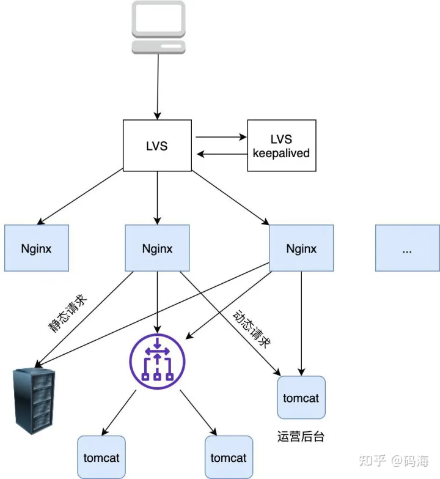

### 双层负载均衡集群化
```
		当然只有一台 LVS 的话在流量很大很大巨大的情况下也是扛不住的，怎么办，多加几台啊，使用 DNS 负载均衡在解析域名的时候随机打到其中一台不就行了
```
 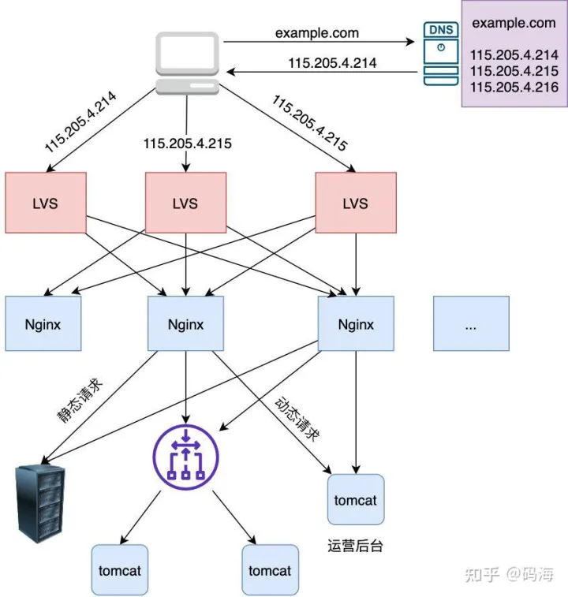

```
既然可以用DNS负载均衡，那么直接把LVS层省略，只保留Nginx反向代理层岂不是就可以了？如下图所示。
也可以，这种方式总比Nginx单点模式好，但是因为LVS的承载能力远大于Nginx，如果都是对外暴露3台主机，LVS可能一直达不到上限，当下层Nginx达到瓶颈后直接添加Nginx服务器即可。如果Nginx在第一层，那么3台机器更容易达到瓶颈，需要加机器申请IP，并修改DNS负载均衡，相对不太方便。
```
 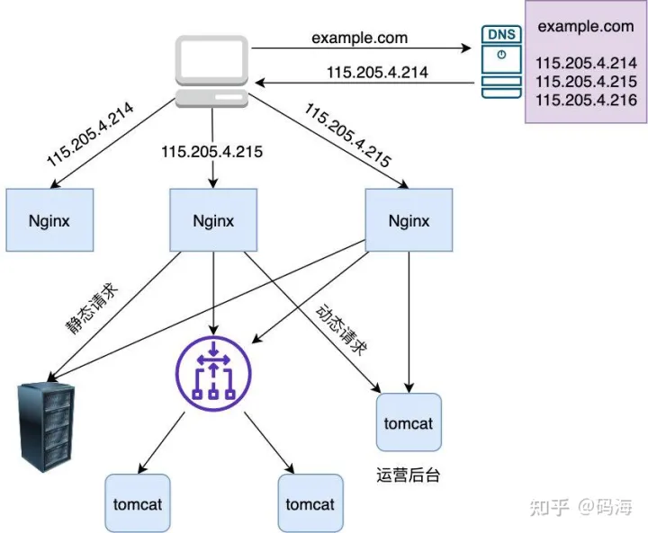

### 增加CDN节点
 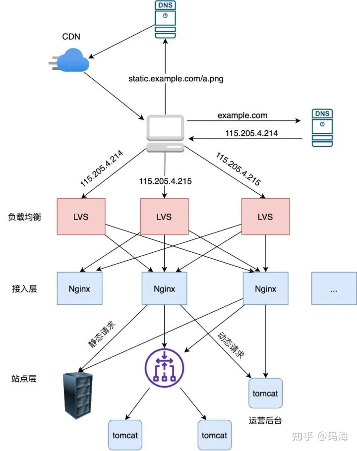


## 公司网络拓扑图
```
waf：防火墙，使用的阿里云服务
SLB：负载均衡，使用的阿里云服务
haproxy是我们自己部署的
```


## 参考资料

[负载均衡原理](https://www.zhihu.com/question/61783920/answer/2023377962)
