## Redis数据结构简介
首先对redis来说，所有的key（键）都是字符串。我们在谈基础数据结构时，讨论的是存储值的数据类型，主要包括常见的5种数据类型，分别是：String、List、Set、Zset、Hash。

| 结构类型 | 存储的值| 读写能力 |
| ---- | ---- | ---- |
| String字符串 | 可以是字符串、整数或浮点数 | 对整个字符串或字符串的一部分进行操作；对整数或浮点数进行自增或自减操作 |
| List列表 | 一个链表，链表上的每个节点都包含一个字符串 | 对链表的两端进行push和pop操作，读取单个或多个元素；根据值查找或删除元素 |
| Set集合 | 包含字符串的无序集合 | 字符串的集合，包含基础的方法有看是否存在添加、获取、删除；还包含计算交集、并集、差集等 |
| Hash散列 | 包含键值对的无序散列表 | 包含方法有添加、获取、删除单个元素 |
| Zset有序集合 | 和散列一样，用于存储键值对 | 字符串成员与浮点数分数之间的有序映射；元素的排列顺序由分数的大小决定；包含方法有添加、获取、删除单个元素以及根据分值范围或成员来获取元素 |

### String
String类型是二进制安全的，意思是 redis 的 string 可以包含任何数据。如数字，字符串，jpg图片或者序列化的对象。

#### 常用命令(部分)
| 命令 | 描述 | 使用 |
| ---- | ---- | ---- |
| GET | 获取存储在给定键中的值 | GET name | 
| SET | 设置存储在给定键中的值 | SET name value| 
| DEL | 删除存储在给定键中的值 | DEL name |
| INCR | 将键存储的值加1 | INCR key |
| DECR | 将键存储的值减1 | DECR key |
| INCRBY | 将键存储的值加上整数	 | INCRBY key amount |
| DECRBY | 将键存储的值减去整数	 | DECRBY key amount |

### List

Redis中的List其实就是链表（Redis用双端链表实现List）

#### 常用命令(部分)
| 命令 | 描述 | 使用 |
| ---- | ---- | ---- |
| RPUSH | 将给定值推入到列表右端 | RPUSH key value |
| LPUSH | 将给定值推入到列表左端 | LPUSH key value |
| RPOP | 从列表的右端弹出一个值，并返回被弹出的值 | RPOP key |
| LPOP | 从列表的左端弹出一个值，并返回被弹出的值 | LPOP key |
| LRANGE | 获取列表在给定范围上的所有值 | LRANGE key 0 -1 |
| LINDEX | 通过索引获取列表中的元素。你也可以使用负数下标，以 -1 表示列表的最后一个元素， -2 表示列表的倒数第二个元素，以此类推 | LINDEX key index|

### SET
Redis 的 Set 是 String 类型的无序集合。集合成员是唯一的，这就意味着集合中不能出现重复的数据。

#### 常用命令(部分)
| 命令 | 描述 | 使用 |
| ---- | ---- | ---- |
| SADD | 向集合添加一个或多个成员 | SADD key member1 [member2] |
| SREM | 向集合移除一个或多个成员 | SREM key member1 [member2] |
| SCARD | 获取集合的成员数 | SCARD key |
| SMEMBERS | 返回集合中的所有成员 | SMEMBERS key |
| SISMEMBER | 判断 member 元素是否是集合 key 的成员 | SISMEMBER key member|

### Hash
Redis hash 是一个 string 类型的 field（字段） 和 value（值） 的映射表。

#### 常用命令
| 命令 | 描述 | 使用 |
| ---- | ---- | ---- |
| HSET | 添加键值对 | HSET hash-key sub-key1 value1 |
| HGET | 获取指定散列键的值 | HGET hash-key key1 |
| HGETALL | 获取散列中包含的所有键值对 | HGETALL hash-key |
| HDEL | 如果给定键存在于散列中，那么就移除这个键 | HDEL hash-key sub-key1 |

### Zset
Redis 有序集合和集合一样也是 string 类型元素的集合,且不允许重复的成员。不同的是每个元素都会关联一个 double 类型的分数。redis 正是通过分数来为集合中的成员进行从小到大的排序。

#### 常用命令
| 命令 | 描述 | 使用 |
| ---- | ---- | ---- |
| ZADD | 将一个带有给定分值的成员添加到有序集合里面	 | ZADD zset-key 178 member1 |
| ZRANGE | 根据元素在有序集合中所处的位置，从有序集合中获取多个元素 | ZRANGE zset-key 0-1 [withccores] |
| ZREM | 如果给定元素成员存在于有序集合中，那么就移除这个元素	 | ZREM zset-key member1 |


## 底层数据结构
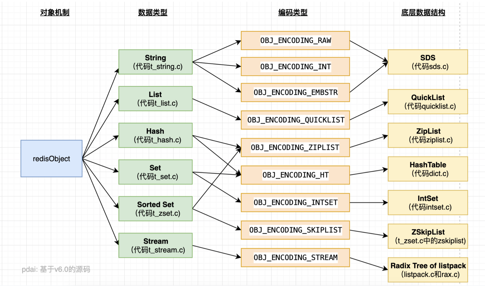
 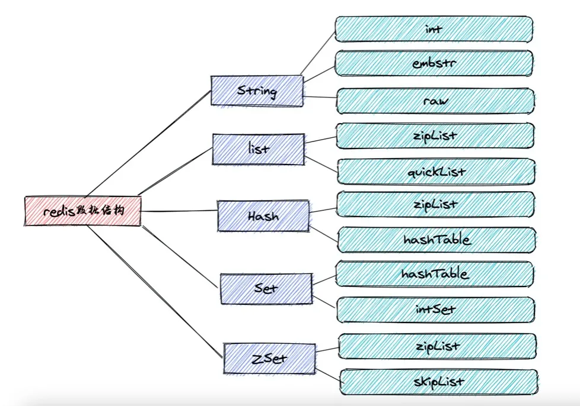

## 对象机制详解
Redis的每种对象其实都由对象结构(redisObject) 与 对应编码的数据结构组合而成，而每种对象类型对应若干编码方式，不同的编码方式所对应的底层数据结构是不同的

Redis 必须让每个键都带有类型信息, 使得程序可以检查键的类型, 并为它选择合适的处理方式。

比如说， 集合类型就可以由字典和整数集合两种不同的数据结构实现， 但是， 当用户执行 ZADD 命令时， 他/她应该不必关心集合使用的是什么编码， 只要 Redis 能按照 ZADD 命令的指示， 将新元素添加到集合就可以了。 

这说明, 操作数据类型的命令除了要对键的类型进行检查之外, 还需要根据数据类型的不同编码进行多态处理. 为了解决以上问题, Redis 构建了自己的类型系统, 这个系统的主要功能包括: 
* redisObject 对象. 
* 基于 redisObject 对象的类型检查.
* 基于 redisObject 对象的显式多态函数. 
* 对 redisObject 进行分配、共享和销毁的机制.

### redisObject数据结构
redisObject 是 Redis 类型系统的核心, 数据库中的每个键、值, 以及 Redis 本身处理的参数, 都表示为这种数据类型.
```
    /*
     * Redis 对象
     */
    typedef struct redisObject {
    
        // 类型
        unsigned type:4;
    
        // 编码方式
        unsigned encoding:4;
    
        // LRU - 24位, 记录最末一次访问时间（相对于lru_clock）; 或者 LFU（最少使用的数据：8位频率，16位访问时间）
        unsigned lru:LRU_BITS; // LRU_BITS: 24
    
        // 引用计数
        int refcount;
    
        // 对象指针用于指向具体的内容
        void *ptr;
    
    } robj;
```
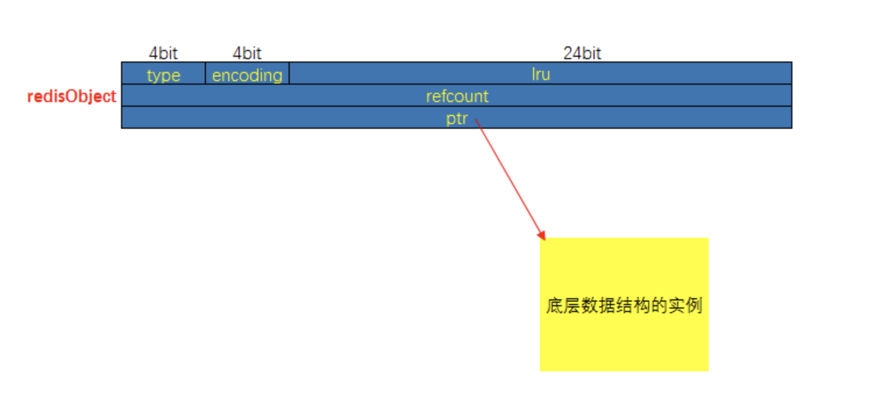

#### type
type记录了对象所保存的值的类型，它的值可能是以下常量中的一个：
```
/*
* 对象类型
*/
#define OBJ_STRING 0 // 字符串
#define OBJ_LIST 1 // 列表
#define OBJ_SET 2 // 集合
#define OBJ_ZSET 3 // 有序集
#define OBJ_HASH 4 // 哈希表
```

#### encoding
encoding记录了对象所保存的值的编码，它的值可能是以下常量中的一个：
```
/*
* 对象编码
*/
#define OBJ_ENCODING_RAW 0     /* Raw representation */
#define OBJ_ENCODING_INT 1     /* Encoded as integer */
#define OBJ_ENCODING_HT 2      /* Encoded as hash table */
#define OBJ_ENCODING_ZIPMAP 3  /* 注意：版本2.6后不再使用. */
#define OBJ_ENCODING_LINKEDLIST 4 /* 注意：不再使用了，旧版本2.x中String的底层之一. */
#define OBJ_ENCODING_ZIPLIST 5 /* Encoded as ziplist */
#define OBJ_ENCODING_INTSET 6  /* Encoded as intset */
#define OBJ_ENCODING_SKIPLIST 7  /* Encoded as skiplist */
#define OBJ_ENCODING_EMBSTR 8  /* Embedded sds string encoding */
#define OBJ_ENCODING_QUICKLIST 9 /* Encoded as linked list of ziplists */
#define OBJ_ENCODING_STREAM 10 /* Encoded as a radix tree of listpacks */

```

#### ptr
ptr是一个指针，指向实际保存值的数据结构，这个数据结构由type和encoding属性决定。举个例子， 如果一个redisObject 的type 属性为OBJ_LIST ， encoding 属性为OBJ_ENCODING_QUICKLIST ，那么这个对象就是一个Redis 列表（List)，它的值保存在一个QuickList的数据结构内，而ptr 指针就指向quicklist的对象

#### lru
记录了对象最后一次被命令程序访问的时间

空转时长：当前时间减去键的值对象的lru时间，就是该键的空转时长。Object idletime命令可以打印出给定键的空转时长 如果服务器打开了maxmemory选项，并且服务器用于回收内存的算法为volatile-lru或者allkeys-lru，那么当服务器占用的内存数超过了maxmemory选项所设置的上限值时，空转时长较高的那部分键会优先被服务器释放，从而回收内存。 ¶

#### refcount
refcount属性，是对象的引用计数，计数0就是可以回收。

* 每个redisObject结构都带有一个refcount属性，指示这个对象被引用了多少次； 
* 当新创建一个对象时，它的refcount属性被设置为1； 
* 当对一个对象进行共享时，redis将这个对象的refcount加1； 
* 当使用完一个对象后，或者消除对一个对象的引用之后，程序将对象的refcount减1； 
* 当对象的refcount降至0 时，这个RedisObject结构，以及它引用的数据结构的内存都会被释放。
```
引用计数还带有对象共享的作用，让多个键共享同一个值对象需要执行两个步骤：
1、将数据库键的值指向一个现有的值对象
2、将被共享的值对象的引用计数+1
共享对象机制对于节约内存非常有帮助，数据库中保存的相同的值对象越多，对象共享机制就能节约越多的内存。
Redis会在初始化服务器时，创建一万个字符串对象，包含了0~9999的所有整数值。当服务器有用到这些整数字符串对象，就利用的是共享对象，而非新创建对象
```
### 命令的类型检查和多态
当执行一个处理数据类型命令的时候，redis执行以下步骤 
* 根据给定的key，在数据库字典中查找和他相对应的redisObject，如果没找到，就返回NULL； 
* 检查redisObject的type属性和执行命令所需的类型是否相符，如果不相符，返回类型错误； 
* 根据redisObject的encoding属性所指定的编码，选择合适的操作函数来处理底层的数据结构；
* 返回数据结构的操作结果作为命令的返回值。

### 对象共享
redis一般会把一些常见的值放到一个共享对象中，这样可使程序避免了重复分配的麻烦，也节约了一些CPU时间。

redis预分配的值对象
* 各种命令的返回值，比如成功时返回的OK，错误时返回的ERROR，命令入队事务时返回的QUEUE等 
* 包括0 在内，小于REDIS_SHARED_INTEGERS的所有整数（REDIS_SHARED_INTEGERS的默认值是10000）
* 只共享字符串对象，其他对象太复杂了，并不划算
* 共享对象只能被字典和双向链表这类能带有指针的数据结构使用。

## 底层数据结构
### 简单动态字符串 SDS

#### SDS是什么

Redis 是用 C 语言写的，但是对于Redis的字符串，却不是 C 语言中的字符串（即以空字符’\0’结尾的字符数组），它是自己构建了一种名为 简单动态字符串（simple dynamic string,SDS）的抽象类型，并将 SDS 作为 Redis的默认字符串表示。

这是一种用于存储二进制数据的一种结构, 具有动态扩容的特点. 其实现位于src/sds.h与src/sds.c中。


其中sdshdr是头部, buf是真实存储用户数据的地方。这个数据结构除了能存储二进制数据, 显然是用于设计作为字符串使用的, 所以在buf中, 用户数据后总跟着一个\0. 即图中 "数据" + "\0"是所谓的buf。

#### sdshdr
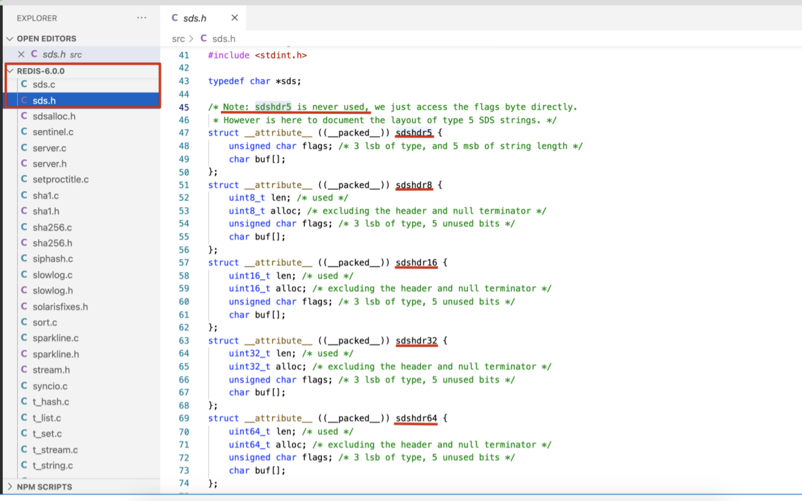

SDS有5种不同的头部，但sdshdr5并未使用到
* len 保存了SDS保存字符串的长度，表示存储字符串的实际长度，代表已使用len
* buf[] 数组用来保存字符串的每个元素 
* alloc分别以uint8, uint16, uint32, uint64表示整个SDS, 除过头部与末尾的\0, 剩余的字节数。用alloc - len就可以表示剩余可用的长度
* flags 始终为一字节, 以低三位标示着头部的类型, 高5位未使用

使用SDS的好处
* 常数复杂度获取字符串长度
  * 由于 len 属性的存在，我们获取 SDS 字符串的长度只需要读取 len 属性，时间复杂度为 O(1)。而对于 C 语言，获取字符串的长度通常是经过遍历计数来实现的，时间复杂度为 O(n)。通过 strlen key 命令可以获取 key 的字符串长度。
* 杜绝缓冲区溢出
  * 我们知道在 C 语言中使用 strcat  函数来进行两个字符串的拼接，一旦没有分配足够长度的内存空间，就会造成缓冲区溢出。而对于 SDS 数据类型，在进行字符修改的时候，会首先根据记录的 len 属性检查内存空间是否满足需求，如果不满足，会进行相应的空间扩展，然后在进行修改操作，所以不会出现缓冲区溢出。
* 减少修改字符串的内存重新分配次数
  * C语言由于不记录字符串的长度，所以如果要修改字符串，必须要重新分配内存（先释放再申请），因为如果没有重新分配，字符串长度增大时会造成内存缓冲区溢出，字符串长度减小时会造成内存泄露。
  * 而对于SDS，由于len属性和alloc属性的存在，对于修改字符串SDS实现了空间预分配和惰性空间释放两种策略：
    * 1、空间预分配：对字符串进行空间扩展的时候，扩展的内存比实际需要的多，这样可以减少连续执行字符串增长操作所需的内存重分配次数。
    * 2、惰性空间释放：对字符串进行缩短操作时，程序不立即使用内存重新分配来回收缩短后多余的字节，而是使用 alloc 属性将这些字节的数量记录下来，等待后续使用。（当然SDS也提供了相应的API，当我们有需要时，也可以手动释放这些未使用的空间。）
* 二进制安全
  * 因为C字符串以空字符作为字符串结束的标识，而对于一些二进制文件（如图片等），内容可能包括空字符串，因此C字符串无法正确存取；而所有 SDS 的API 都是以处理二进制的方式来处理 buf 里面的元素，并且 SDS 不是以空字符串来判断是否结束，而是以 len 属性表示的长度来判断字符串是否结束。
* 兼容部分 C 字符串函数
  * 虽然 SDS 是二进制安全的，但是一样遵从每个字符串都是以空字符串结尾的惯例，这样可以重用 C 语言库<string.h> 中的一部分函数。
    

### 压缩列表 ZipList
```
Redis3.2之前List的底层实现方式：压缩列表ziplist 或者 双向循环链表linkedlist
当list存储的数据量比较少且同时满足下面两个条件时，list就使用ziplist存储数据：
1.list中保存的每个元素的长度小于 64 字节；
2.列表中数据个数少于512个
Redis3.2及之后List的底层实现方式是quicklist
```


ZipList 源码

```
 * ZIPLIST OVERALL LAYOUT:

 * The general layout of the ziplist is as follows:

   <!-- 内存结构>
 * <zlbytes><zltail><zllen><entry><entry><zlend>

```

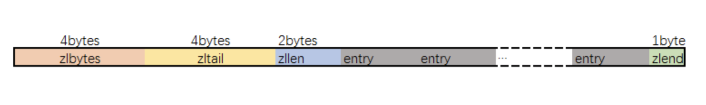

* zlbytes字段的类型是uint32_t, 这个字段中存储的是整个ziplist所占用的内存的字节数
* zltail字段的类型是uint32_t, 它指的是ziplist中最后一个entry的偏移量. 用于快速定位最后一个entry, 以快速完成pop等操作
* zllen字段的类型是uint16_t, 它指的是整个ziplit中entry的数量. 这个值只占2bytes（16位）: 如果ziplist中entry的数目小于65535(2的16次方), 那么该字段中存储的就是实际entry的值. 若等于或超过65535, 那么该字段的值固定为65535, 但实际数量需要一个个entry的去遍历所有entry才能得到
* ziplist最后1个字节，值固定等于255，其是一个结束标记

#### zlentry（ZipList中的entry结构）
先看源码
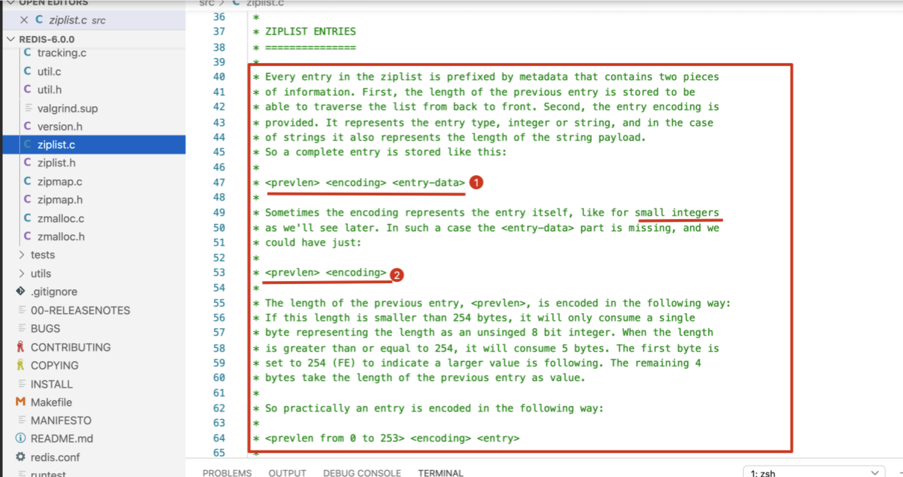

第一种情况：一般结构 <prevlen> <encoding> <entry-data>
* prevlen：前一个entry的大小，编码方式见下文
* encoding：不同的情况下值不同，用于表示当前entry的类型和长度
* entry-data：真是用于存储entry表示的数据

第二种情况：<prevlen> <encoding>

在entry中存储的是int类型时，encoding和entry-data会合并在encoding中表示，此时没有entry-data字段

* redis中，在存储数据时，会先尝试将string转换成int存储，节省空间。

prevlen编码
* 前一个元素长度小于254（255用于zlend）的时候，prevlen长度为1个字节，值即为前一个entry的长度
* 长度大于等于254的时候，prevlen用5个字节表示，第一字节设置为254，后面4个字节存储一个小端的无符号整型，表示前一个entry的长度

encoding编码
* encoding的长度和值根据保存的是int还是string，要根据数据的长度而定
* 前两位用来表示类型，当为“11”时，表示entry存储的是int类型，其它表示存储的是string

存储string
* |00pppppp| ：此时encoding长度为1个字节，该字节的后六位表示entry中存储的string长度，因为是6位，所以entry中存储的string长度不能超过63
* |01pppppp|qqqqqqqq| 此时encoding长度为两个字节；此时encoding的后14位用来存储string长度，长度不能超过16383
* |10000000|qqqqqqqq|rrrrrrrr|ssssssss|ttttttt| 此时encoding长度为5个字节，后面的4个字节用来表示encoding中存储的字符串长度，长度不能超过2^32 - 1

存储int
* |11000000| encoding为3个字节，后2个字节表示一个int16
* |11010000| encoding为5个字节，后4个字节表示一个int32
* |11100000| encoding 为9个字节，后8字节表示一个int64
* |11110000| encoding为4个字节，后3个字节表示一个有符号整型
* |11111110| encoding为2字节，后1个字节表示一个有符号整型
* |1111xxxx| encoding长度就只有1个字节，xxxx表示一个0 - 12的整数值
* |11111111| zlend，代表ziplist结束标识

zlentry源码
```
typedef struct zlentry {
    unsigned int prevrawlensize; /* Bytes used to encode the previous entry len*/
    unsigned int prevrawlen;     /* Previous entry len. */
    unsigned int lensize;        /* Bytes used to encode this entry type/len.
                                    For example strings have a 1, 2 or 5 bytes
                                    header. Integers always use a single byte.*/
    unsigned int len;            /* Bytes used to represent the actual entry.
                                    For strings this is just the string length
                                    while for integers it is 1, 2, 3, 4, 8 or
                                    0 (for 4 bit immediate) depending on the
                                    number range. */
    unsigned int headersize;     /* prevrawlensize + lensize. */
    unsigned char encoding;      /* Set to ZIP_STR_* or ZIP_INT_* depending on
                                    the entry encoding. However for 4 bits
                                    immediate integers this can assume a range
                                    of values and must be range-checked. */
    unsigned char *p;            /* Pointer to the very start of the entry, that
                                    is, this points to prev-entry-len field. */
} zlentry;


```
* prevrawlensize表示 previous_entry_length字段的长度 
* prevrawlen表示 previous_entry_length字段存储的内容 
* lensize表示 encoding字段的长度 
* len表示数据内容长度 
* headersize 表示当前元素的首部长度，即previous_entry_length字段长度与encoding字段长度之和 
* encoding表示数据类型 
* p表示当前元素首地址

#### 节省内存
* ziplist节省内存是相对于普通的list来说的，如果是普通的数组，那么它每个元素占用的内存是一样的且取决于最大的那个元素（很明显它是需要预留空间的）
* 所以ziplist在设计时就很容易想到要尽量让每个元素按照实际的内容大小存储，所以增加encoding字段，针对不同的encoding来细化存储大小
* 这时候还需要解决的一个问题是遍历元素时如何定位下一个元素呢？在普通数组中每个元素定长，所以不需要考虑这个问题；但是ziplist中每个data占据的内存不一样，所以为了解决遍历，需要增加记录上一个元素的length，所以增加了prelen字段。

缺点
* ziplist也**不预留**内存空间，并且在移除结点后, 也是立即缩容，这代表每次写操作都会进行内存分配操作
* 结点如果扩容, 导致结点占用的内存增长，并且超过254字节的话，可能会导致链式反应： 其后一个结点的entry.prevlen需要从一字节扩容至五字节。 最坏情况下，第一个结点的扩容，会导致整个ziplist表中的后续所有结点的entry.prevlen字段扩容


### 快表 QuickList

quicklist这个结构是Redis在3.2版本后新加的，之前的版本是linkedlist， 用于String数据类型中。linkedlist的附加空间相对太高，prev和next指针就要占去16个字节，而且每一个结点都是单独分配，会加剧内存的碎片化，影响内存管理效率

它是一种以ziplist为结点的双端链表结构。 宏观上，quicklist是一个链表, 微观上, 链表中的每个结点都是一个ziplist。结合了双向链表和ziplist的优点。

#### quicklist源码
```

/* Node, quicklist, and Iterator are the only data structures used currently. */

/* quicklistNode is a 32 byte struct describing a ziplist for a quicklist.
 * We use bit fields keep the quicklistNode at 32 bytes.
 * count: 16 bits, max 65536 (max zl bytes is 65k, so max count actually < 32k).
 * encoding: 2 bits, RAW=1, LZF=2.
 * container: 2 bits, NONE=1, ZIPLIST=2.
 * recompress: 1 bit, bool, true if node is temporarry decompressed for usage.
 * attempted_compress: 1 bit, boolean, used for verifying during testing.
 * extra: 10 bits, free for future use; pads out the remainder of 32 bits */
typedef struct quicklistNode {
    struct quicklistNode *prev;
    struct quicklistNode *next;
    unsigned char *zl;
    unsigned int sz;             /* ziplist size in bytes */
    unsigned int count : 16;     /* count of items in ziplist */
    unsigned int encoding : 2;   /* RAW==1 or LZF==2 */
    unsigned int container : 2;  /* NONE==1 or ZIPLIST==2 */
    unsigned int recompress : 1; /* was this node previous compressed? */
    unsigned int attempted_compress : 1; /* node can't compress; too small */
    unsigned int extra : 10; /* more bits to steal for future usage */
} quicklistNode;

/* quicklistLZF is a 4+N byte struct holding 'sz' followed by 'compressed'.
 * 'sz' is byte length of 'compressed' field.
 * 'compressed' is LZF data with total (compressed) length 'sz'
 * NOTE: uncompressed length is stored in quicklistNode->sz.
 * When quicklistNode->zl is compressed, node->zl points to a quicklistLZF */
typedef struct quicklistLZF {
    unsigned int sz; /* LZF size in bytes*/
    char compressed[];
} quicklistLZF;

/* Bookmarks are padded with realloc at the end of of the quicklist struct.
 * They should only be used for very big lists if thousands of nodes were the
 * excess memory usage is negligible, and there's a real need to iterate on them
 * in portions.
 * When not used, they don't add any memory overhead, but when used and then
 * deleted, some overhead remains (to avoid resonance).
 * The number of bookmarks used should be kept to minimum since it also adds
 * overhead on node deletion (searching for a bookmark to update). */
typedef struct quicklistBookmark {
    quicklistNode *node;
    char *name;
} quicklistBookmark;


/* quicklist is a 40 byte struct (on 64-bit systems) describing a quicklist.
 * 'count' is the number of total entries.
 * 'len' is the number of quicklist nodes.
 * 'compress' is: -1 if compression disabled, otherwise it's the number
 *                of quicklistNodes to leave uncompressed at ends of quicklist.
 * 'fill' is the user-requested (or default) fill factor.
 * 'bookmakrs are an optional feature that is used by realloc this struct,
 *      so that they don't consume memory when not used. */
typedef struct quicklist {
    quicklistNode *head;
    quicklistNode *tail;
    unsigned long count;        /* total count of all entries in all ziplists */
    unsigned long len;          /* number of quicklistNodes */
    int fill : QL_FILL_BITS;              /* fill factor for individual nodes */
    unsigned int compress : QL_COMP_BITS; /* depth of end nodes not to compress;0=off */
    unsigned int bookmark_count: QL_BM_BITS;
    quicklistBookmark bookmarks[];
} quicklist;

typedef struct quicklistIter {
    const quicklist *quicklist;
    quicklistNode *current;
    unsigned char *zi;
    long offset; /* offset in current ziplist */
    int direction;
} quicklistIter;

typedef struct quicklistEntry {
    const quicklist *quicklist;
    quicklistNode *node;
    unsigned char *zi;
    unsigned char *value;
    long long longval;
    unsigned int sz;
    int offset;
} quicklistEntry;


```
* quicklistNode
  * 宏观上, quicklist是一个链表，这个结构描述的就是链表中的结点。它通过zl字段持有底层的ziplist。简单来讲，它描述了一个ziplist实例
* quicklistLZF
  * ziplist是一段连续的内存，用LZ4算法压缩后， 就可以包装成一个quicklistLZF结构。是否压缩quicklist中的每个ziplist实例是一个可配置项。若这个配置项是开启的，那么quicklistNode.zl字段指向的就不是一个ziplist实例，而是一个压缩后的quicklistLZF实例
* quicklistBookmark
  * 在quicklist尾部增加的一个书签，它只有在大量节点的多余内存使用量可以忽略不计的情况且确实需要分批迭代它们，才会被使用。当不使用它们时，它们不会增加任何内存开销
* quicklist
  * 这是一个双链表的定义。head，tail分别指向头尾指针。len代表链表中的结点。count指的是整个quicklist中的所有ziplist中的entry的数目。fill字段影响着每个链表结点中ziplist的最大占用空间，compress影响着是否要对每个ziplist以LZ4算法进行进一步压缩以更节省内存空间
* quicklistIter
  * 是一个迭代器
* quicklistEntry
  * 是对ziplist中的entry概念的封装. quicklist作为一个封装良好的数据结构, 不希望使用者感知到其内部的实现, 所以需要把ziplist.entry的概念重新包装一下
    

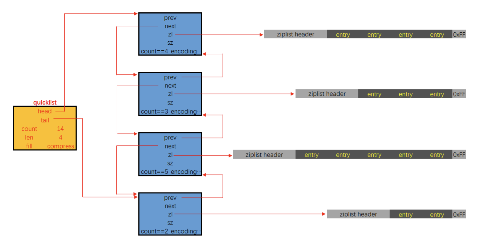

* quicklist.fill
  * 影响着每个链表结点中ziplist的长度. 
  * 当数值为负数时，代表以字节数限制单个ziplist的最大长度，具体为
    * -1 不超过4kb 
    * -2 不超过 8kb 
    * -3 不超过 16kb 
    * -4 不超过 32kb 
    * -5 不超过 64kb 
    * 当数值为正数时，代表以entry数目限制单个ziplist的长度。值即为数目，由于该字段仅占16位， 所以以entry数目限制ziplist的容量时，最大值为2^15个
* quicklist.compress
  * 影响着quicklistNode.zl字段指向的是原生的ziplist, 还是经过压缩包装后的quicklistLZF
  * 0 表示不压缩, zl字段直接指向ziplist 
  * 1 表示quicklist的链表头尾结点不压缩, 其余结点的zl字段指向的是经过压缩后的quicklistLZF 
  * 2 表示quicklist的链表头两个, 与末两个结点不压缩, 其余结点的zl字段指向的是经过压缩后的quicklistLZF
* quicklistNode.encoding
  * 指示本链表结点所持有的ziplist是否经过了压缩。1代表未压缩，持有的是原生的ziplist，2代表压缩过
* quicklistNode.container
  * 字段指示的是每个链表结点所持有的数据类型是什么。默认的实现是ziplist，对应的该字段的值是2，目前Redis没有提供其它实现。所以实际上，该字段的值恒为2
* quicklistNode.recompress
  * 字段指示的是当前结点所持有的ziplist是否经过了解压。如果该字段为1即代表之前被解压过，且需要在下一次操作时重新压缩

#### quicklist工作原理
```
【1】判断head节点ziplist是否已满，_quicklistNodeAllowInsert函数中根据quicklist.fill属性判断节点是否已满。
【2】head节点未满，直接调用ziplistPush函数，插入元素到ziplist中。
【3】更新quicklistNode.sz属性。
【4】head节点已满，创建一个新节点，将元素插入新节点的ziplist中，再将该节点头插入quicklist中。
```

### 字典/哈希表 Dict
本质上就是哈希表

源码
```
typedef struct dictht{
    //哈希表数组
    dictEntry **table;
    //哈希表大小
    unsigned long size;
    //哈希表大小掩码，用于计算索引值
    //总是等于 size-1
    unsigned long sizemask;
    //该哈希表已有节点的数量
    unsigned long used;
 
}dictht

```

哈希表是由数组 table 组成，table 中每个元素都是指向 dict.h/dictEntry 结构，dictEntry 结构定义如下：

```
typedef struct dictEntry{
     //键
     void *key;
     //值
     union{
          void *val;
          uint64_tu64;
          int64_ts64;
     }v;
 
     //指向下一个哈希表节点，形成链表
     struct dictEntry *next;
}dictEntry

```

key 用来保存键，val 属性用来保存值，值可以是一个指针，也可以是uint64_t整数，也可以是int64_t整数。 

这里还有一个指向下一个哈希表节点的指针，我们知道哈希表最大的问题是存在哈希冲突，如何解决哈希冲突，有开放地址法和链地址法。这里采用的便是链地址法，通过next这个指针可以将多个哈希值相同的键值对连接在一起，用来解决哈希冲突。

#### 渐进式rehash
```
		Redis 为了保证应用的高性能运行，提供了一个重要的机制--渐进式 rehash。 渐进式 rehash 是用来保证字典缩放效率的，也就是说在字典进行扩容或者缩容时会采取渐进式 rehash 的机制。
		这样做的原因在于，如果哈希表里保存的键值对数量很大时， 如：四百万、四千万甚至四亿个键值对， 那么一次性将这些键值对全部 rehash 到 ht[1] 的话，庞大的计算量(需要重新计算链表在桶中的位置)可能会导致服务器在一段时间内停止服务(redis是单线程的，如果全部移动会引起客户端长时间阻塞不可用)。
		渐进式 rehash 的好处在于它采取分而治之的方式， 将 rehash 键值对所需的计算工作均滩到对字典的每个添加、删除、查找和更新操作上， 从而避免了集中式 rehash 而带来的庞大计算量。
```


* 扩容
当元素数量等于数组长度时就会进行扩容操作，源码在 dict.c 文件中，核心代码如下：
```
int dictExpand(dict *d, unsigned long size)
{
    /* 需要的容量小于当前容量，则不需要扩容 */
    if (dictIsRehashing(d) || d->ht[0].used > size)
        return DICT_ERR;
    dictht n; 
    unsigned long realsize = _dictNextPower(size); // 重新计算扩容后的值
    /* 计算新的扩容大小等于当前容量，不需要扩容 */
    if (realsize == d->ht[0].size) return DICT_ERR;
    /* 分配一个新的哈希表，并将所有指针初始化为NULL */
    n.size = realsize;
    n.sizemask = realsize-1;
    n.table = zcalloc(realsize*sizeof(dictEntry*));
    n.used = 0;
    if (d->ht[0].table == NULL) {
        // 第一次初始化
        d->ht[0] = n;
        return DICT_OK;
    }
    d->ht[1] = n; // 把增量输入放入新 ht[1] 中
    d->rehashidx = 0; // 非默认值 -1，表示需要进行 rehash
    return DICT_OK;
}

```

从以上源码可以看出，如果需要扩容则会申请一个新的内存地址赋值给 ht[1]，并把字典的 rehashindex 设置为 0，表示之后需要进行 rehash 操作。

* 缩容 
  当字典的使用容量不足总空间的 10% 时就会触发缩容，Redis 在进行缩容时也会把 rehashindex 设置为 0，表示之后需要进行 rehash 操作。
  
* 渐进式rehash流程
  * 在进行渐进式 rehash 时，会同时保留两个 hash 结构，新键值对加入时会直接插入到新的 hash 结构中，并会把旧 hash 结构中的元素一点一点的移动到新的 hash 结构中，当移除完最后一个元素时，清空旧 hash 结构，主要的执行流程如下：
  * 扩容或者缩容时把字典中的字段 rehashidx 标识为 0；
  * 在执行定时任务或者执行客户端的 hset、hdel 等操作指令时，判断是否需要触发 rehash 操作（通过 rehashidx 标识判断），如果需要触发 rehash 操作，也就是调用 dictRehash 函数，dictRehash 函数会把 ht[0] 中当前槽上链表的元素依次添加到新的 Hash 表 ht[1] 中；
  * 依次等待所有槽上的链表被触发rehash后，操作完成
  * rehash 操作完成之后，清空 Hash 表 ht[0]，然后对调 ht[1] 和 ht[0] 的值，把新的数据表 ht[1] 更改为 ht[0]，然后把字典中的 rehashidx 标识为 -1，表示不需要执行 rehash 操作。

### 整数集 IntSet

整数集合 intset 是集合类型的底层实现之一，当一个集合只包含整数值元素，并且这个集合的元素数量不多时，Redis 就会使用整数集合作为集合键的底层实现。

源码
```
typedef struct intset {
    uint32_t encoding;
    uint32_t length;
    int8_t contents[];
} intset;

```

* encoding 表示编码方式，的取值有三个：INTSET_ENC_INT16, INTSET_ENC_INT32, INTSET_ENC_INT64 
* length 代表其中存储的整数的个数 contents 指向实际存储数值的连续内存区域, 就是一个数组；整数集合的每个元素都是 
* contents 数组的一个数组项（item），各个项在数组中按值得大小从小到大有序排序，且数组中不包含任何重复项。（虽然 intset 结构将 contents 属性声明为 int8_t 类型的数组，但实际上 contents 数组并不保存任何 int8_t 类型的值，contents 数组的真正类型取决于 encoding 属性的值)

#### 整数集合的升级
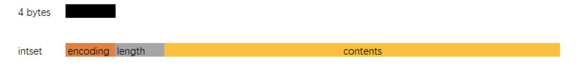

content数组里面每个元素的数据类型是由encoding来决定的，那么如果原来的数据类型是int16, 当我们再插入一个int32类型的数据时怎么办呢？这就是下面要说的intset的升级。

当在一个int16类型的整数集合中插入一个int32类型的值，整个集合的所有元素都会转换成32类型。 整个过程有三步：
* 根据新元素的类型（比如int32），扩展整数集合底层数组的空间大小，并为新元素分配空间。
* 将底层数组现有的所有元素都转换成与新元素相同的类型， 并将类型转换后的元素放置到正确的位上， 而且在放置元素的过程中， 需要继续维持底层数组的有序性质不变。
* 最后改变encoding的值，length+1。

那么如果我们删除掉刚加入的int32类型时，会不会做一个降级操作呢？

不会。主要还是减少开销的权衡。

### 跳表 SkipList

跳跃表结构在 Redis 中的运用场景只有一个，那就是作为有序列表 (Zset) 的使用。跳跃表的性能可以保证在查找，删除，添加等操作的时候在对数期望时间内完成，这个性能是可以和平衡树来相比较的，而且在实现方面比平衡树要优雅，这就是跳跃表的长处。跳跃表的缺点就是需要的存储空间比较大，属于利用空间来换取时间的数据结构。 

对于于一个单链表来讲，即便链表中存储的数据是有序的，如果我们要想在其中查找某个数据，也只能从头到尾遍历链表。这样查找效率就会很低，时间复杂度会很高，是 O(n)。比如查找12，需要7次查找
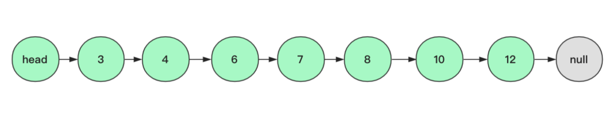

如果我们增加如下两级索引，那么它搜索次数就变成了3次
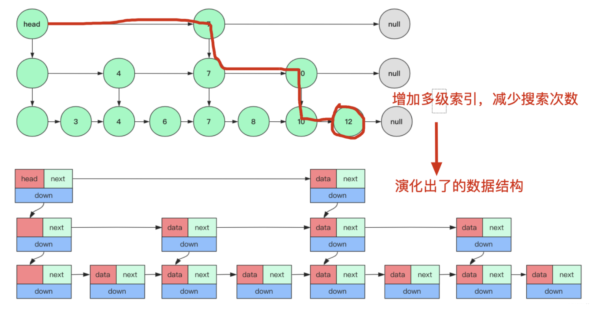

源码
```
/* ZSETs use a specialized version of Skiplists */
typedef struct zskiplistNode {
    sds ele;
    double score;
    struct zskiplistNode *backward;
    struct zskiplistLevel {
        struct zskiplistNode *forward;
        unsigned int span;
    } level[];
} zskiplistNode;

typedef struct zskiplist {
    struct zskiplistNode *header, *tail;
    unsigned long length;
    int level;
} zskiplist;

```

插入过程及数据结构内存布局图
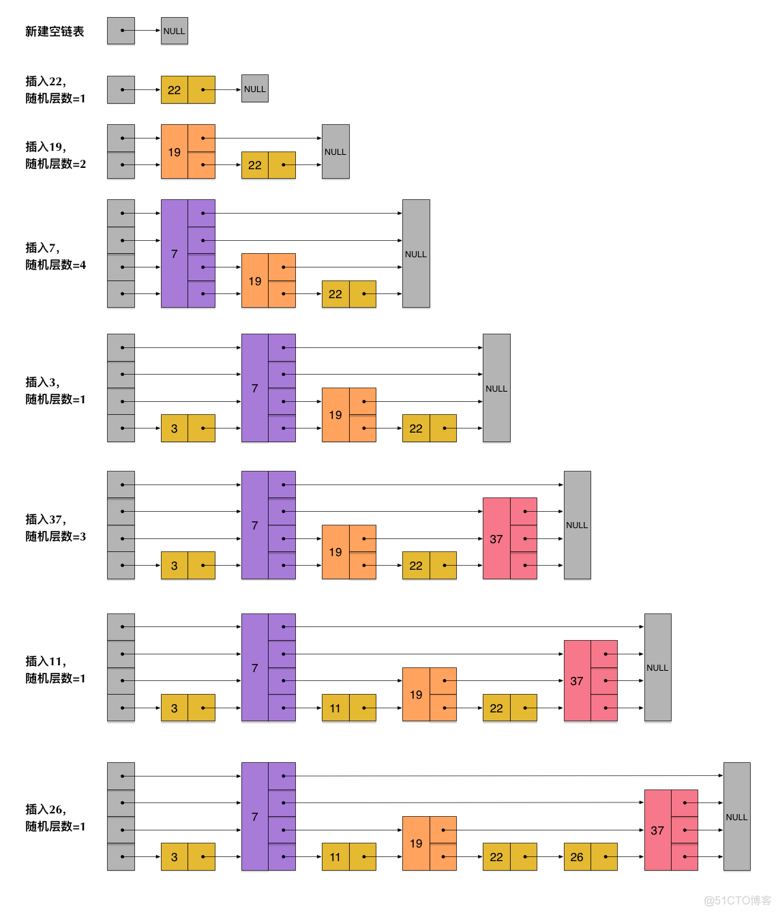

核心设计点
* 头节点不持有任何数据, 且其level[]的长度为32 
* 每个结点 
  * ele字段，持有数据，是sds类型。
  * score字段，其标示着结点的得分，结点之间凭借得分来判断先后顺序，跳跃表中的结点按结点的得分升序排列。
  * backward指针，这是原版跳跃表中所没有的. 该指针指向结点的前一个紧邻结点。
  * level字段，用以记录所有结点(除过头节点外)；每个结点中最多持有32个zskiplistLevel结构。实际数量在结点创建时，按幂次定律**随机生成**(不超过32)。每个zskiplistLevel中有两个字段
    * forward字段指向比自己得分高的某个结点(不一定是紧邻的)，并且若当前zskiplistLevel实例在level[]中的索引为X，则其forward字段指向的结点，其level[]字段的容量至少是X+1。这也是上图中，为什么forward指针总是画的水平的原因。
    * span字段代表forward字段指向的结点，距离当前结点的距离。紧邻的两个结点之间的距离定义为1。

## RedisObject和底层数据结构对应关系

### String 

字符串是Redis最基本的数据类型，不仅所有key都是字符串类型，其它几种数据类型构成的元素也是字符串。注意字符串的长度不能超过512M。

#### 编码
字符串对象的编码可以是int，raw或者embstr。 
* int 编码：保存的是可以用 long 类型表示的整数值。 
  * 用来保存整数值。
* embstr 编码：保存长度小于44字节的字符串（redis3.2版本之前是39字节，之后是44字节）。 
  * 用来保存短字符串
* raw 编码：保存长度大于44字节的字符串（redis3.2版本之前是39字节，之后是44字节）。
  * 用来保存长字符串

#### 内存布局
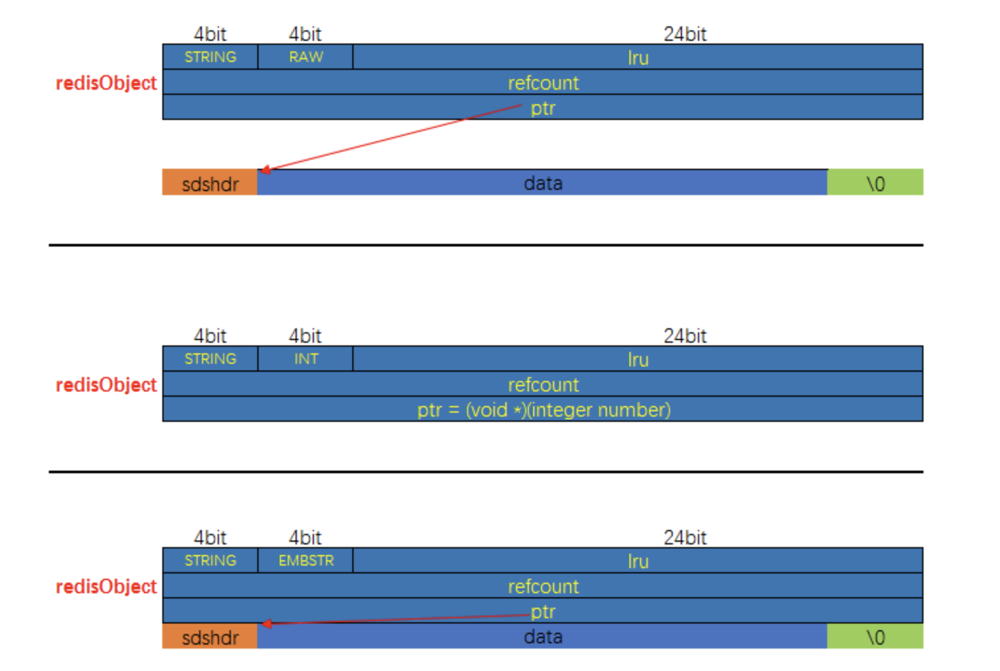

raw 和 embstr 的区别 
* embstr的使用只分配一次内存空间（因此redisObject和sds是连续的）
* raw需要分配两次内存空间（分别为redisObject和sds分配空间）。
* 因此与raw相比，embstr的好处在于创建时少分配一次空间，删除时少释放一次空间，以及对象的所有数据连在一起，寻找方便。
* 而embstr的坏处也很明显，如果字符串的长度增加需要重新分配内存时，整个redisObject和sds都需要重新分配空间，因此redis中的embstr实现为只读。 
  

Redis中对于浮点数类型也是作为字符串保存的，在需要的时候再将其转换成浮点数类型。 

#### 编码转换 
* 当 int 编码保存的值不再是整数，或大小超过了long的范围时，自动转化为raw。 
* 对于 embstr 编码，由于 Redis 没有对其编写任何的修改程序（embstr 是只读的），在对embstr对象进行修改时，都会先转化为raw再进行修改，因此，只要是修改embstr对象，修改后的对象一定是raw的，无论是否达到了44个字节。

### List

list 列表，它是简单的字符串列表，按照插入顺序排序，你可以添加一个元素到列表的头部（左边）或者尾部（右边），它的底层实际上是个链表结构。

#### 编码
列表对象的编码是quicklist

#### 内存布局
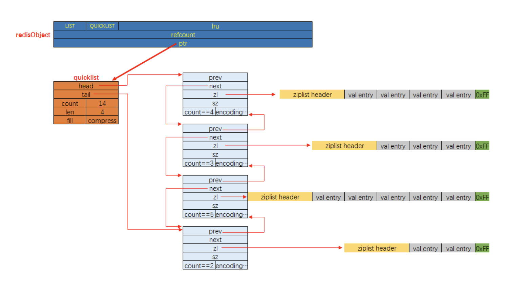

### Set
集合对象 set 是 string 类型（整数也会转换成string类型进行存储）的无序集合。注意集合和列表的区别：集合中的元素是无序的，因此不能通过索引来操作元素；集合中的元素不能有重复。

#### 编码

Set的编码可以是 intset 或者 hashtable; 
底层实现有两种, 分别是intset和dict。 
显然当使用intset作为底层实现的数据结构时, 集合中存储的只能是数值数据, 且必须是整数; 
而当使用dict作为集合对象的底层实现时, 是将数据全部存储于dict的键中, 值字段闲置不用。

#### 内存布局
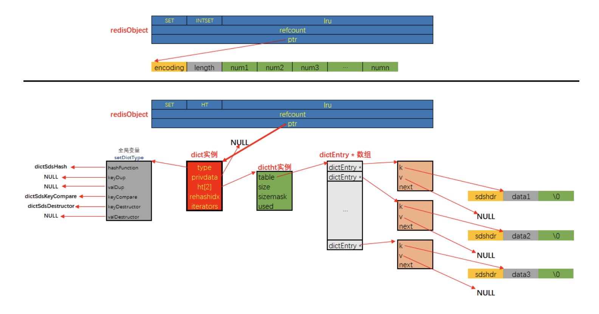

#### 编码转换 

当集合同时满足以下两个条件时，使用 intset 编码： 
1、集合对象中所有元素都是整数 
2、集合对象所有元素数量不超过512 

不能满足这两个条件的就使用 hashtable 编码。第二个条件可以通过配置文件的 set-max-intset-entries 进行配置。

### Hash

哈希对象的键是一个字符串类型，值是一个键值对集合。

#### 编码

哈希对象的编码可以是 ziplist 或者 hashtable；
对应的底层实现有两种, 一种是ziplist, 一种是dict。

#### 内存布局
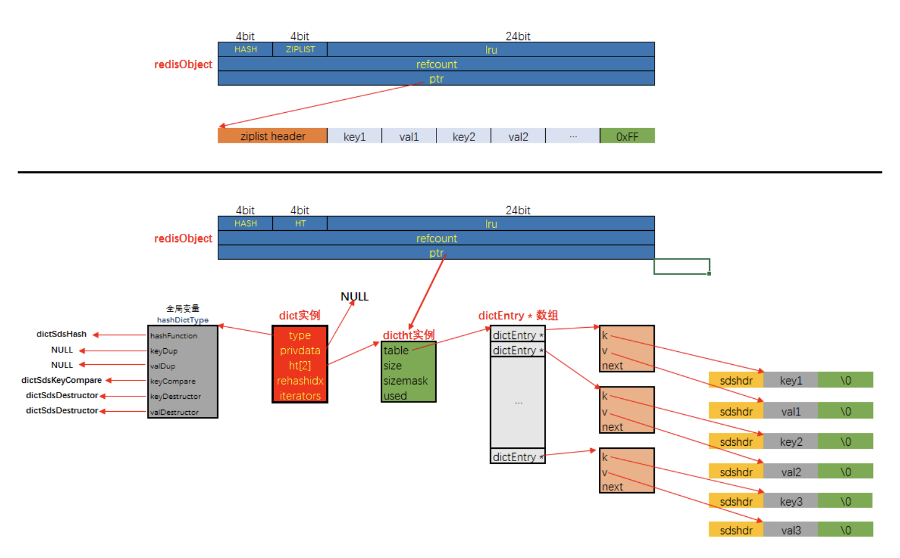

当使用ziplist，也就是压缩列表作为底层实现时，新增的键值对是保存到压缩列表的表尾。

hashtable 编码的哈希表对象底层使用字典数据结构，哈希对象中的每个键值对都使用一个字典键值对。 

在前面介绍压缩列表时，我们介绍过压缩列表是Redis为了节省内存而开发的，是由一系列特殊编码的连续内存块组成的顺序型数据结构，相对于字典数据结构，压缩列表用于元素个数少、元素长度小的场景。其优势在于集中存储，节省空间。

#### 编码转换

当同时满足下面两个条件时，使用ziplist（压缩列表）编码： 
1、列表保存元素个数小于512个 
2、每个元素长度小于64字节 

不能满足这两个条件的时候使用 hashtable 编码。

以上两个条件也可以通过Redis配置文件zset-max-ziplist-entries 选项和 zset-max-ziplist-value 进行修改。

### Zset

和上面的集合对象相比，有序集合对象是有序的。与列表使用索引下标作为排序依据不同，有序集合为每个元素设置一个分数（score）作为排序依据。

#### 编码

有序集合的底层实现依然有两种
 * 编码值为ziplist，ziplist作为底层实现, 
 * 另外一种比较特殊, 编码值为skiplist, 底层使用了两种数据结构: dict与skiplist

使用ziplist来实现在序集合很容易理解, 只需要在ziplist这个数据结构的基础上做好排序与去重就可以了。

有序集合单独使用字典或跳跃表其中一种数据结构都可以实现，但是使用两种数据结构组合起来，原因是假如我们单独使用 字典，虽然能以 O(1) 的时间复杂度查找成员的分值，但是因为字典是以无序的方式来保存集合元素，所以每次进行范围操作的时候都要进行排序；假如我们单独使用跳跃表来实现，虽然能执行范围操作，但是查找操作有 O(1)的复杂度变为了O(logN)。因此Redis使用了两种数据结构来共同实现有序集合。

#### 内存布局

ziplist作为底层实现的内存分布
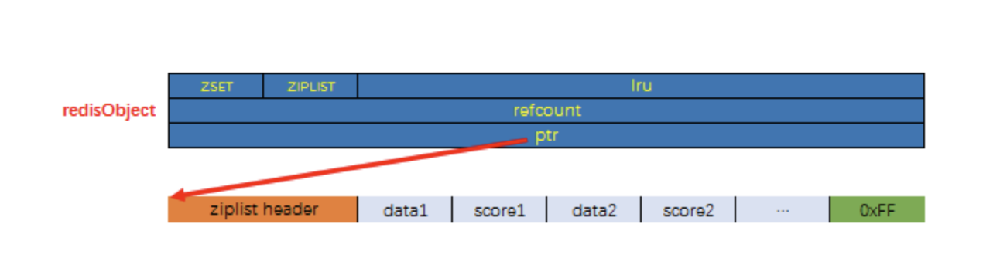

skiplist和dict作为底层实现的内存分布
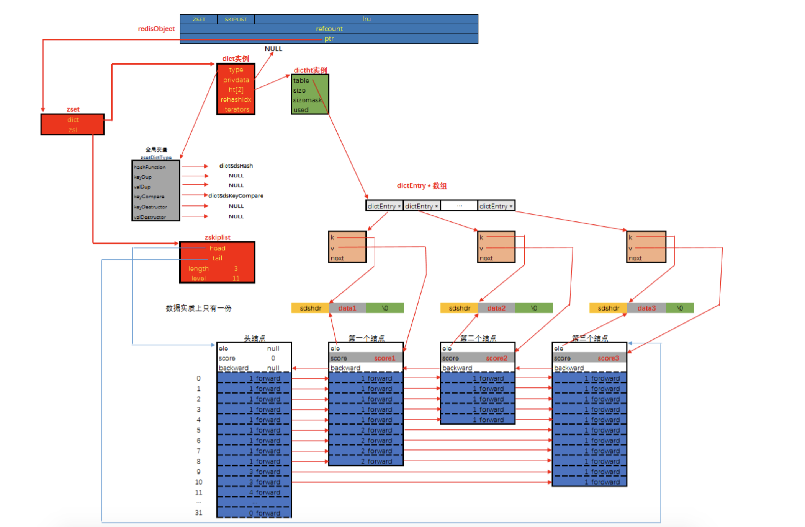

#### 编码转换

当有序集合对象同时满足以下两个条件时，对象使用 ziplist 编码： 
1、保存的元素数量小于128
2、保存的所有元素长度都小于64字节。

不能满足上面两个条件的使用 skiplist 编码。

以上两个条件也可以通过Redis配置文件zset-max-ziplist-entries 选项和 zset-max-ziplist-value 进行修改。


## 参考文档
[Redis知识体系详解](https://pdai.tech/md/db/nosql-redis/db-redis-overview.html#%E7%9F%A5%E8%AF%86%E4%BD%93%E7%B3%BB)
[探索Redis设计与实现6：Redis内部数据结构详解——skiplist](https://blog.51cto.com/u_14006572/3153688)
[Redis的渐进式rehash原理](https://zhuanlan.zhihu.com/p/358366217)
[一文搞懂 Redis](https://zhuanlan.zhihu.com/p/490268710)