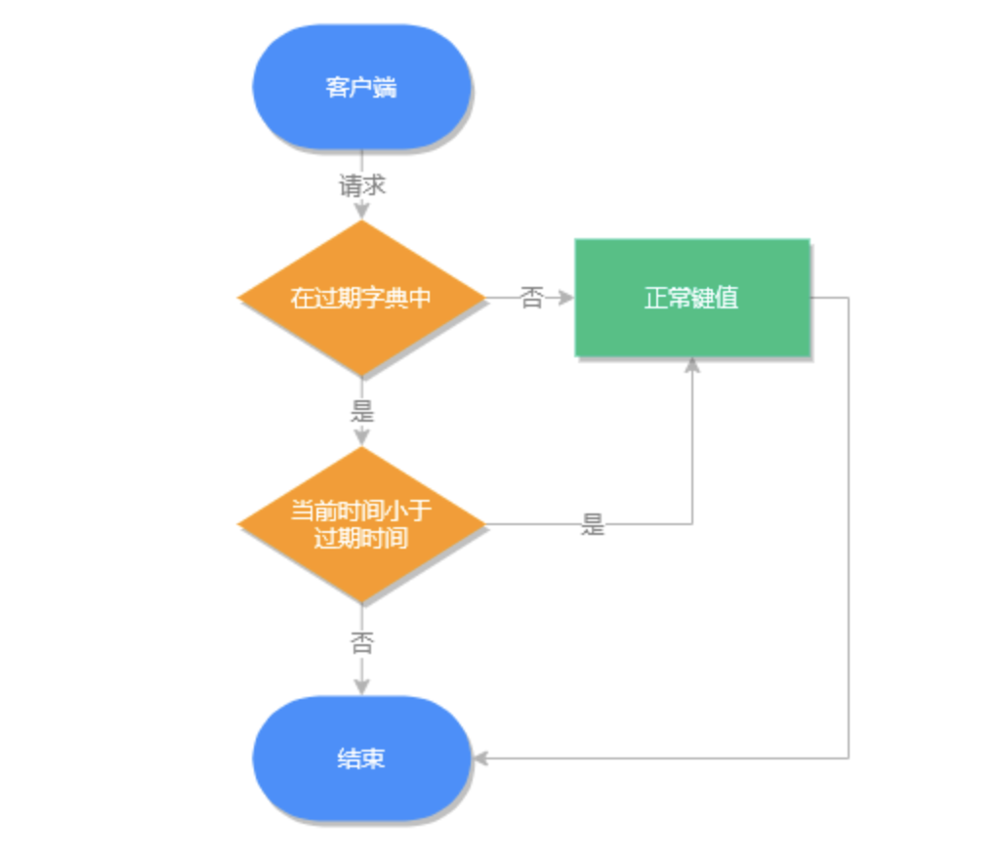

# Redis键过期详解

## 过期设置

Redis 中设置过期时间主要通过以下四种方式

* N 秒后过期
  * expire key seconds
  * 设置 key 在 n 秒后过期  
* N 毫秒后过期
  * pexpire key milliseconds
  * 设置 key 在 n 毫秒后过期  
* 过期时间戳精确到秒
  * expireat key timestamp
  * 设置 key 在某个时间戳（精确到秒）之后过期
* 过期时间戳精确到毫秒
  * pexpireat key millisecondsTimestamp
  * 设置 key 在某个时间戳（精确到毫秒）之后过期  
* 返回键的剩余生存时间
  * ttl key 以秒的单位返回键 key 的剩余生存时间
  * pttl key 以毫秒的单位返回键 key 的剩余生存时间  

### 移除过期时间
persist key 可以移除键值的过期时间

## 持久化中的过期键

### RDB 中的过期键

RDB 文件分为两个阶段，RDB 文件生成阶段和加载阶段。

1. RDB 文件生成
从内存状态持久化成 RDB（文件）的时候，会对 key 进行过期检查，过期的键不会被保存到新的 RDB 文件中，因此 Redis 中的过期键不会对生成新 RDB 文件产生任何影响

2. RDB 文件加载

RDB 加载分为以下两种情况：

* 如果 Redis 是主服务器运行模式的话，在载入 RDB 文件时，程序会对文件中保存的键进行检查，过期键不会被载入到数据库中。所以过期键不会对载入 RDB 文件的主服务器造成影响；
* 如果 Redis 是从服务器运行模式的话，在载入 RDB 文件时，不论键是否过期都会被载入到数据库中。但由于主从服务器在进行数据同步时，从服务器的数据会被清空。所以一般来说，过期键对载入 RDB 文件的从服务器也不会造成影响。

### AOF 中的过期键
1. AOF 文件写入
   当 Redis 以 AOF 模式持久化时，如果数据库某个过期键还没被删除，那么 AOF 文件会保留此过期键，当此过期键被删除后，Redis 会向 AOF 文件追加一条 DEL 命令来显式地删除该键值。
   
2. AOF 重写
   执行 AOF 重写时，会对 Redis 中的键值对进行检查已过期的键不会被保存到重写后的 AOF 文件中，因此不会对 AOF 重写造成任何影响。
   
### 主从库的过期键

当 Redis 运行在主从模式下时，从库不会进行过期扫描，从库对过期的处理是被动的。也就是即使从库中的 key 过期了，如果有客户端访问从库时，依然可以得到 key 对应的值，像未过期的键值对一样返回。

从库的过期键处理依靠主服务器控制，主库在 key 到期时，会在 AOF 文件里增加一条 del 指令，同步到所有的从库，从库通过执行这条 del 指令来删除过期的 key。

## 过期策略

### 过期键执行流程
Redis 之所以能知道那些键值过期，是因为在 Redis 中维护了一个字典，存储了所有设置了过期时间的键值，我们称之为过期字典。

过期键判断流程如下图所示：

过期键数据结构如下图所示

### 过期策略
Redis 会删除已过期的键值，以此来减少 Redis 的空间占用，但因为 Redis 本身是单线的，如果因为删除操作而影响主业务的执行就得不偿失了，为此 Redis 需要制定多个（过期）删除策略来保证糟糕的事情不会发生。

常见的过期策略有以下三种：
* 定时删除
* 惰性删除
* 定期删除

### 定时删除
在设置键值过期时间时，创建一个定时事件，当过期时间到达时，由事件处理器自动执行键的删除操作。

* 优点
  * 保证内存可以被尽快地释放
* 缺点
  * 在 Redis 高负载的情况下或有大量过期键需要同时处理时，会造成 Redis 服务器卡顿，影响主业务执行
    
### 惰性删除
不主动删除过期键，每次从数据库获取键值时判断是否过期，如果过期则删除键值，并返回 null。

* 优点
  * 因为每次访问时，才会判断过期键，所以此策略只会使用很少的系统资源
* 缺点
  * 系统占用空间删除不及时，导致空间利用率降低，造成了一定的空间浪费
    
### 定期删除

每隔一段时间检查一次数据库，随机删除一些过期键。

Redis 默认每秒进行 10 次过期扫描，此配置可通过 Redis 的配置文件 redis.conf 进行配置，配置键为 hz 它的默认值是 hz 10。

Redis 每次扫描并不是遍历过期字典中的所有键，而是采用随机抽取判断并删除过期键的形式执行的。

执行流程
1. 从过期字典中随机取出 20 个键
2. 删除这 20 个键中过期的键
3. 如果过期 key 的比例超过 25%，重复步骤 1

同时为了保证过期扫描不会出现循环过度，导致线程卡死现象，算法还增加了扫描时间的上限，默认不会超过 25ms。

* 优点
  * 通过限制删除操作的时长和频率，来减少删除操作对 Redis 主业务的影响，同时也能删除一部分过期的数据减少了过期键对空间的无效占用。
* 缺点
  * 内存清理方面没有定时删除效果好，同时没有惰性删除使用的系统资源少

Redis 使用的是惰性删除加定期删除的过期策略。

## 参考
[Redis键值过期操作](https://learn.lianglianglee.com/%E4%B8%93%E6%A0%8F/Redis%20%E6%A0%B8%E5%BF%83%E5%8E%9F%E7%90%86%E4%B8%8E%E5%AE%9E%E6%88%98/17%20Redis%20%E9%94%AE%E5%80%BC%E8%BF%87%E6%9C%9F%E6%93%8D%E4%BD%9C.md)
[Redis过期策略](https://learn.lianglianglee.com/%E4%B8%93%E6%A0%8F/Redis%20%E6%A0%B8%E5%BF%83%E5%8E%9F%E7%90%86%E4%B8%8E%E5%AE%9E%E6%88%98/18%20Redis%20%E8%BF%87%E6%9C%9F%E7%AD%96%E7%95%A5%E4%B8%8E%E6%BA%90%E7%A0%81%E5%88%86%E6%9E%90.md)