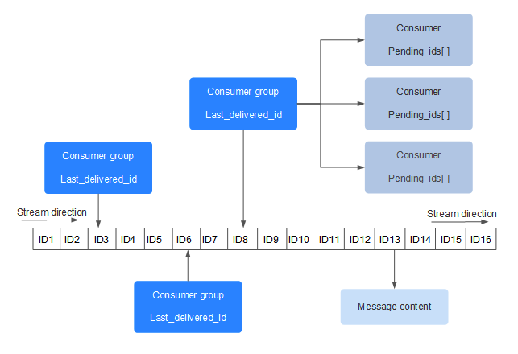
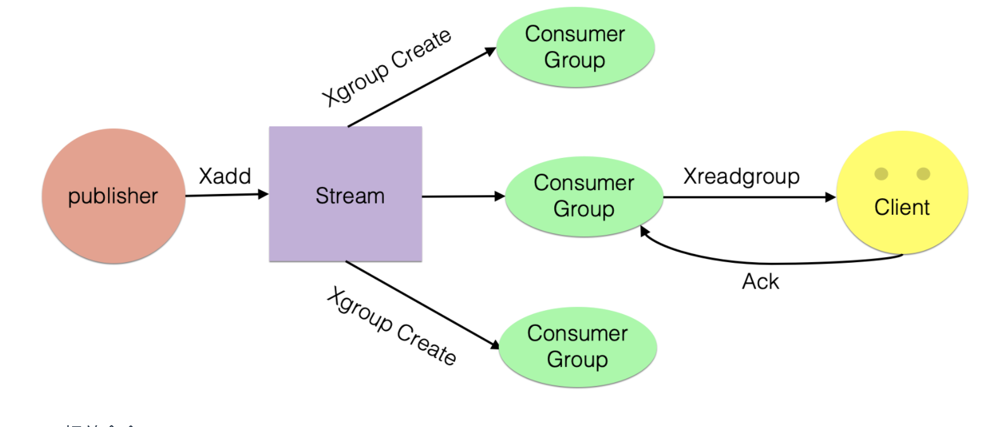
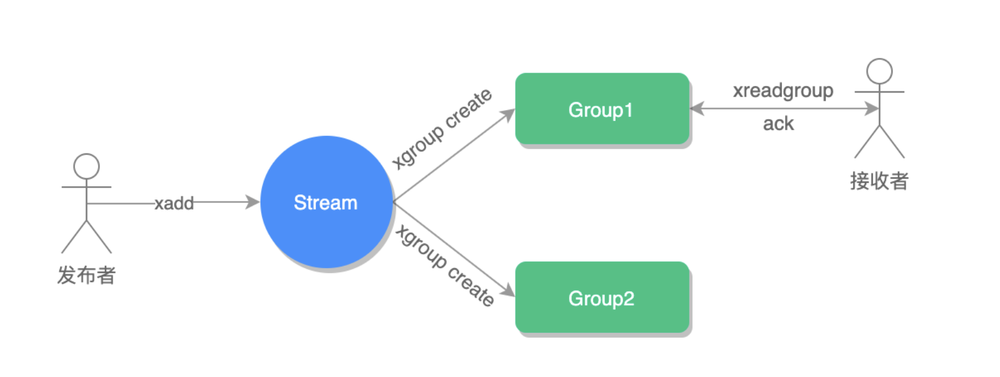

# Redis消息队列详解

## 发布订阅模式

在 Redis 中提供了专门的类型：Publisher（发布者）和 Subscriber（订阅者）来实现消息队列。

除了发布者和订阅者，在消息队列中还有一个重要的概念：channel 意为频道或通道，可以理解为某个消息队列的名称。

首先消费者先要订阅某个 channel，然后当生产者把消息发送到这个 channel 中时，消费者就可以正常接收到消息了，如下图所示：


### 普通订阅与发布

消息队列有两个重要的角色，一个是发送者，另一个就是订阅者。

#### 发布消息

语法 publish channel message

```
# 对没有订阅者的频道发送信息
redis> publish bad_channel "can any body hear me?"
(integer) 0

# 向有一个订阅者的频道发送信息
redis> publish msg "good morning"
(integer) 1

# 向有多个订阅者的频道发送信息
redis> publish chat_room "hello~ everyone"
(integer) 3

```

#### 订阅消息

语法 subscribe channel [channel ...]

此命令支持订阅一个或多个频道的命令，也就是说一个订阅者可以订阅多个频道


### 主题订阅

上面介绍了普通的订阅与发布模式，但如果我要订阅某一个类型的消息就不适用了，例如要订阅日志类的消息队列，它们的命名都是 logXXX，这个时候就需要使用 Redis 提供的另一个功能 Pattern Subscribe 主题订阅，这种方式可以使用 * 来匹配多个频道，如下图所示：


语法 psubscribe pattern [pattern ...]

```
psubscribe log_*
```

## 缺点
1. 无法持久化保存消息，如果 Redis 服务器宕机或重启，那么所有的消息将会丢失（Redis 5.0已解决）；
2. 发布订阅模式是“发后既忘”的工作模式，如果有订阅者离线重连之后不能消费之前的历史消息（Redis 5.0已解决）。

除了以上缺点外，发布订阅模式还有另一个需要注意问题：当消费端有一定的消息积压时，也就是生产者发送的消息，消费者消费不过来时，如果超过 32M 或者是 60s 内持续保持在 8M 以上，消费端会被强行断开，这个参数是在配置文件中设置的，默认值是 client-output-buffer-limit pubsub 32mb 8mb 60。

## Stream

Redis 5.0 便推出了 Stream 类型也是此版本最重要的功能，用于完美地实现消息队列，它借鉴了 Kafka 的设计思路，它支持消息的持久化和消息轨迹的消费，支持 ack 确认消息的模式，让消息队列更加的稳定和可靠。

### Stream的结构


* Consumer group
  * 消费组，使用 XGROUP CREATE 命令创建，一个消费组有多个消费者(Consumer), 这些消费者之间是竞争关系
* last_delivered_id
  * 游标，每个消费组会有个游标 last_delivered_id，任意一个消费者读取了消息都会使游标 last_delivered_id 往前移动
* pending_ids
  * 消费者(Consumer)的状态变量，作用是维护消费者的未确认的 id。 pending_ids 记录了当前已经被客户端读取的消息，但是还没有 ack (Acknowledge character：确认字符）。如果客户端没有ack，这个变量里面的消息ID会越来越多，一旦某个消息被ack，它就开始减少。
  * 这个pending_ids变量在Redis官方被称之为PEL，也就是Pending Entries List，这是一个很核心的数据结构，它用来确保客户端至少消费一次，而不会在网络传输的中途丢失了没处理。
* 消息ID
  * 消息ID的形式是timestampInMillis-sequence，例如1527846880572-5，它表示当前的消息在毫米时间戳1527846880572时产生，并且是该毫秒内产生的第5条消息。消息ID可以由服务器自动生成，也可以由客户端自己指定，但是形式必须是整数-整数，而且必须是后面加入的消息的ID要大于前面的消息ID
* 消息内容
  * 消息内容就是键值对，形如hash结构的键值对，这没什么特别之处
  
### 常用命令

* xadd 
  * 添加消息
  * xadd key ID field string [field string ...]
* xlen 
  * 查询消息长度
  * xlen key
* xdel 
  * 根据消息ID删除消息
  * xdel key ID [ID ...]
* del 
  * 删除整个stream
  * del key [key ...]
* xrange 
  * 读取区间消息
  * xrange key start end [count]
  * xrange key - +
    * - 表示第一条消息，+ 表示最后一条消息
* xread 
  * 读取某个消息之后的消息
  * xread [COUNT count] [BLOCK milliseconds] STREAMS key [key ...] ID [ID ...]
    * 此命令提供了阻塞读的参数 block，我们可以使用它读取从当前数据以后新增数据
    * xread count 1 block 0 streams mq $
    * block 0 表示一直阻塞，$ 表示从最后开始读取
  
### 独立消费

我们可以在不定义消费组的情况下进行Stream消息的独立消费，当Stream没有新消息时，甚至可以阻塞等待。Redis设计了一个单独的消费指令xread，可以将Stream当成普通的消息队列(list)来使用。使用xread时，我们可以完全忽略消费组(Consumer Group)的存在，就好比Stream就是一个普通的列表(list)。

```

# 从stream头部读取两条消息
xread count 2 streams key_1 0-0

# 从尾部阻塞等待新消息到来，下面的指令会堵住，直到新消息到来
xread count 1 block 0 streams key_1 $

```

客户端如果想要使用xread进行顺序消费，一定要记住当前消费到哪里了，也就是返回的消息ID。下次继续调用xread时，将上次返回的最后一个消息ID作为参数传递进去，就可以继续消费后续的消息。

### 消费组消费

消费组消费示意图


#### 相关命令

* 创建消费者群组
  * xgroup create stream-key group-key ID
  * xgroup create mq group1 0-0
  * 0-0 表示从第一条消息开始读取
  * 如果要从当前最后一条消息向后读取，使用 $ 即可
* 读取消息
  * xreadgroup group group-key consumer-key streams stream-key
  * xreadgroup group group1 c1 count 1 streams key_1 >
  * '>' 表示读取下一条消息
  * xreadgroup 命令和 xread 使用类似，也可以设置阻塞读取  
  * xreadgroup group group1 c1 count 1 block 0 streams mq >
* 消息消费确认
  * xack key group-key ID [ID ...]
  * 接收到消息之后，我们要手动确认一下（ack）
  * 消费确认增加了消息的可靠性，一般在业务处理完成之后，需要执行 ack 确认消息已经被消费完成，整个流程的执行如下图所示：
  
* 查询未确认的消费队列
  * xpending stream-key group-key
* 删除消费者
  * xgroup delconsumer stream-key group-key consumer-key
* 删除消费组
  * xgroup destroy stream-key group-key

#### 信息监控 

Stream提供了XINFO来实现对服务器信息的监控。

* 查看队列信息
  * xinfo stream stream-key
```
127.0.0.1:6379> xinfo stream mq
 1) "length"
 2) (integer) 2 #队列中有两个消息
 3) "radix-tree-keys"
 4) (integer) 1
 5) "radix-tree-nodes"
 6) (integer) 2
 7) "groups"
 8) (integer) 1 #一个消费分组
 9) "last-generated-id"
10) "1580959606181-0"
11) "first-entry"
12) 1) "1580959593553-0"
    2) 1) "name"
       2) "redis"
       3) "age"
       4) "10"
13) "last-entry"
14) 1) "1580959606181-0"
    2) 1) "name"
       2) "java"
       3) "age"
       4) "20"
```

* 查看消费组信息
  * xinfo groups stream-key
```
127.0.0.1:6379> xinfo groups mq
1) 1) "name"
   2) "group1" #消息分组名称
   3) "consumers"
   4) (integer) 1 #一个消费者客户端
   5) "pending"
   6) (integer) 1 #一个未确认消息
   7) "last-delivered-id"
   8) "1580959593553-0" #读取的最后一条消息 ID
```

* 查看消费者组成员信息
  * xinfo consumers stream group-key
```
127.0.0.1:6379> xinfo consumers mq group1
1) 1) "name"
   2) "c1" #消费者名称
   3) "pending"
   4) (integer) 0 #未确认消息
   5) "idle"
   6) (integer) 481855
```

### MQ中常见问题
#### 时间回拨

什么是时间回拨
雪花算法通过时间来即将作为id的区分标准之一,对于同一台id生成机器,它通过时间和序号保证id不重复,当机器出现问题,时间可能回到之前。

xadd 生成的1553439850328-0，就是Redis生成的消息ID。
由两部分组成:时间戳-序号。时间戳是毫秒级单位，是生成消息的Redis服务器时间，它是个64位整型（int64）。序号是在这个毫秒时间点内的消息序号，它也是个64位整型。

为了保证消息是有序的，因此Redis生成的ID是单调递增有序的。由于ID中包含时间戳部分，为了避免服务器时间错误而带来的问题（例如服务器时间延后了），Redis的每个Stream类型数据都维护一个latest_generated_id属性，用于记录最后一个消息的ID。若发现当前时间戳退后（小于latest_generated_id所记录的），则采用时间戳不变而序号递增的方案来作为新消息ID（这也是序号为什么使用int64的原因，保证有足够多的的序号），从而保证ID的单调递增性质。

#### 消费者崩溃

为了解决组内消息读取但处理期间消费者崩溃带来的消息丢失问题，STREAM 设计了 Pending 列表，用于记录读取但并未处理完毕的消息。命令XPENDIING 用来获消费组或消费内消费者的未处理完毕的消息。

有了这样一个Pending机制，就意味着在某个消费者读取消息但未处理后，消息是不会丢失的。等待消费者再次上线后，可以读取该Pending列表，就可以继续处理该消息了，保证消息的有序和不丢失。

#### 消息转移

若某个消费者宕机之后，没有办法再上线了，那么就需要将该消费者Pending的消息，转义给其他的消费者处理，就是消息转移。

消息转移的操作时将某个消息转移到自己的Pending列表中。使用语法XCLAIM来实现，需要设置组、转移的目标消费者和消息ID，同时需要提供IDLE（已被读取时长），只有超过这个时长，才能被转移。演示如下：

```
# 当前属于消费者A的消息1553585533795-1，已经15907787ms未处理了
127.0.0.1:6379> XPENDING mq mqGroup - + 10
1) 1) "1553585533795-1"
   2) "consumerA"
   3) (integer) 15907787
   4) (integer) 4

# 转移超过3600s的消息1553585533795-1到消费者B的Pending列表
127.0.0.1:6379> XCLAIM mq mqGroup consumerB 3600000 1553585533795-1
1) 1) "1553585533795-1"
   2) 1) "msg"
      2) "2"

# 消息1553585533795-1已经转移到消费者B的Pending中。
127.0.0.1:6379> XPENDING mq mqGroup - + 10
1) 1) "1553585533795-1"
   2) "consumerB"
   3) (integer) 84404 # 注意IDLE，被重置了
   4) (integer) 5 # 注意，读取次数也累加了1次

```

### 坏消息问题
如果某个消息，不能被消费者处理，也就是不能被XACK，这是要长时间处于Pending列表中，即使被反复的转移给各个消费者也是如此。此时该消息的delivery counter就会累加（上一节的例子可以看到），当累加到某个我们预设的临界值时，我们就认为是坏消息（也叫死信，DeadLetter，无法投递的消息），由于有了判定条件，我们将坏消息处理掉即可，删除即可。删除一个消息，使用XDEL语法，演示如下：
```
# 删除队列中的消息
127.0.0.1:6379> XDEL mq 1553585533795-1
(integer) 1
# 查看队列中再无此消息
127.0.0.1:6379> XRANGE mq - +
1) 1) "1553585533795-0"
   2) 1) "msg"
      2) "1"
2) 1) "1553585533795-2"
   2) 1) "msg"
      2) "3"
```

### 与kafka对比
**Stream 的高可用**
Stream 的高可用是建立主从复制基础上的，它和其它数据结构的复制机制没有区别，也就是说在 Sentinel 和 Cluster 集群环境下 Stream 是可以支持高可用的。不过鉴于 Redis 的 指令复制是异步的，在 failover 发生时，Redis 可能会丢失极小部分数据，这点 Redis 的其 它数据结构也是一样的。

**分区 Partition**
Redis 的服务器没有原生支持分区能力，如果想要使用分区，那就需要分配多个 Stream，然后在客户端使用一定的策略来生产消息到不同的 Stream。

```
如果需要专业的消息队列用kafka。如果是快消类的消息，允许丢失，可以用redis。具体性能比较可以在技术选型时进行对比。
```

## 参考

[Redis Stream详解](https://pdai.tech/md/db/nosql-redis/db-redis-data-type-stream.html)
[消息队列终极解决方案——Stream](https://learn.lianglianglee.com/%E4%B8%93%E6%A0%8F/Redis%20%E6%A0%B8%E5%BF%83%E5%8E%9F%E7%90%86%E4%B8%8E%E5%AE%9E%E6%88%98/26%20%E6%B6%88%E6%81%AF%E9%98%9F%E5%88%97%E7%BB%88%E6%9E%81%E8%A7%A3%E5%86%B3%E6%96%B9%E6%A1%88%E2%80%94%E2%80%94Stream%EF%BC%88%E4%B8%8A%EF%BC%89.md)
