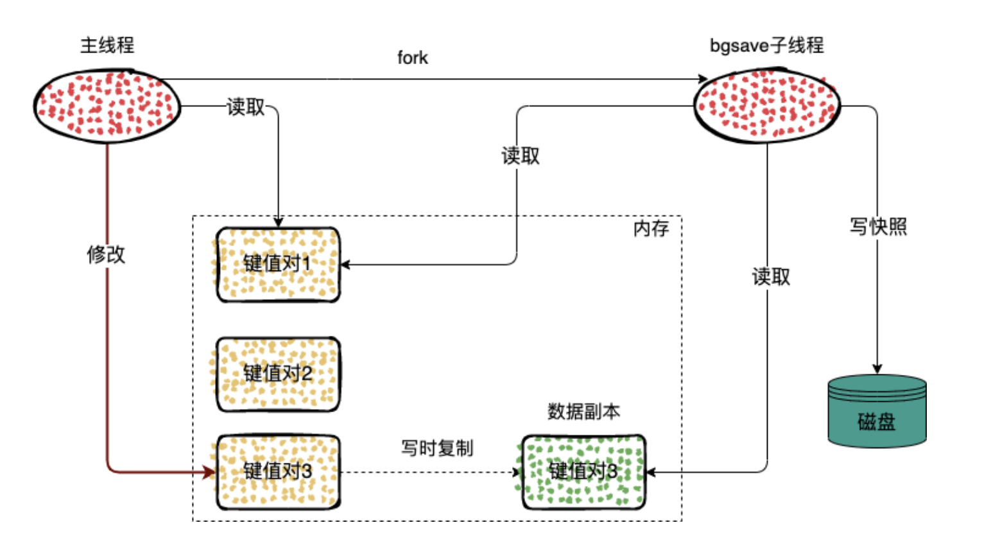
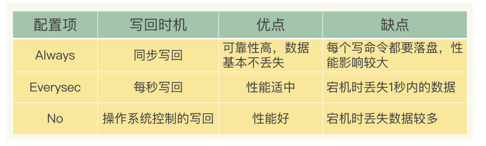
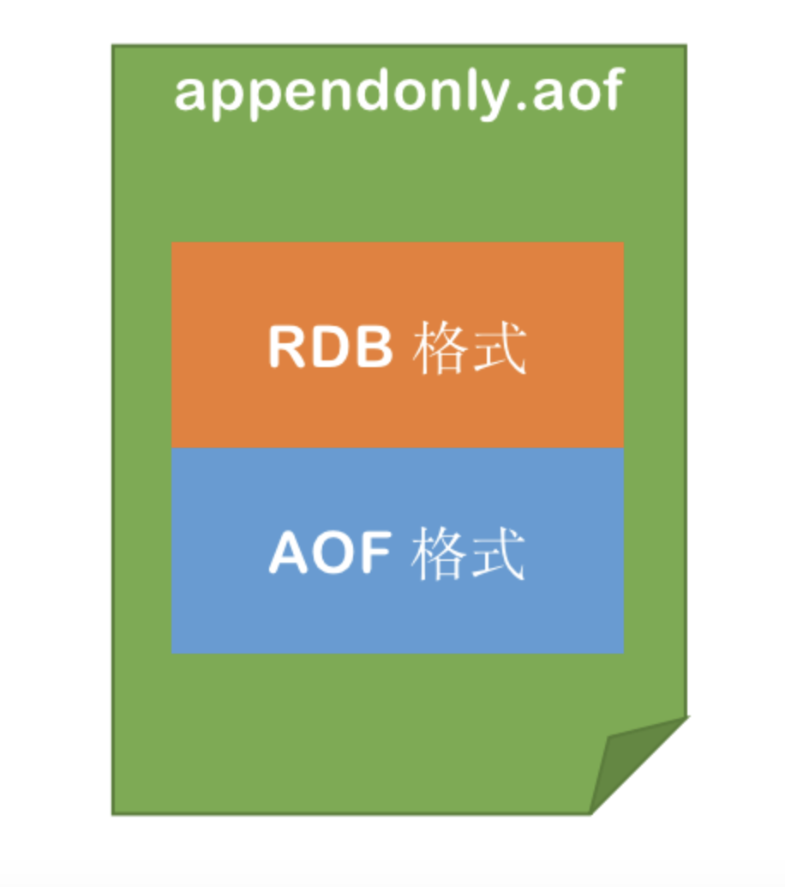
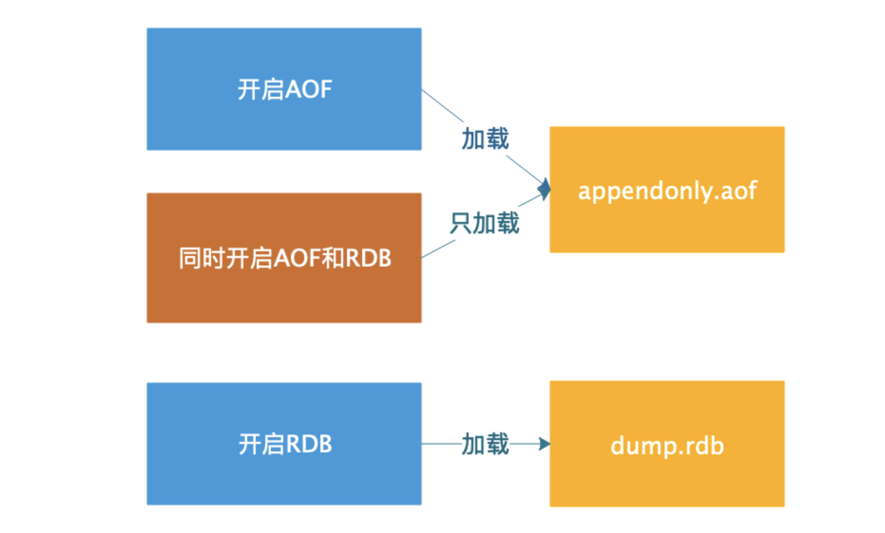
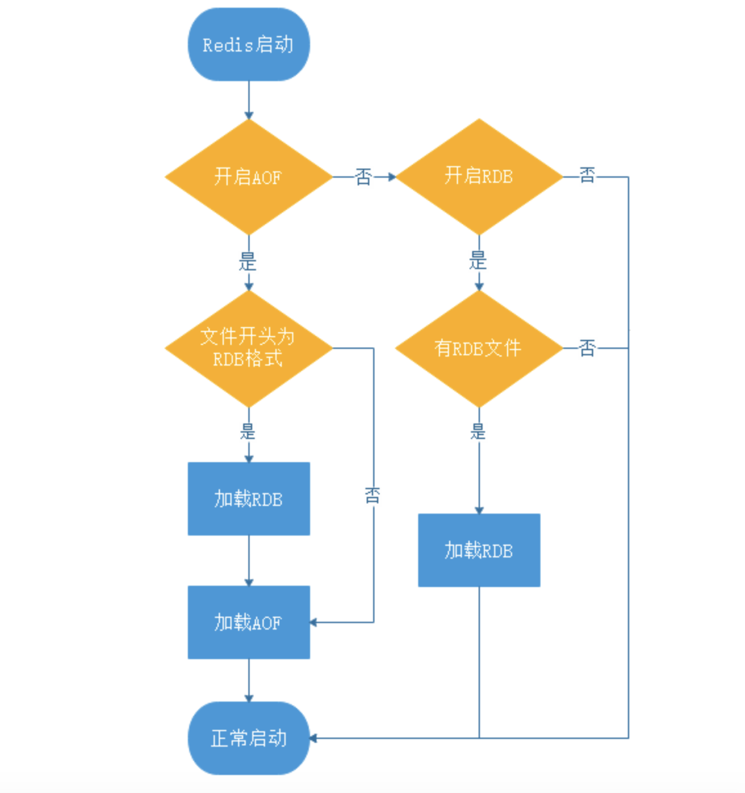

# Redis持久化详解

## Redis持久化简介

Redis是个基于内存的数据库。服务一旦宕机，内存中的数据将全部丢失。通常的解决方案是从后端数据库恢复这些数据，但后端数据库有性能瓶颈，如果是大数据量的恢复，会对数据库带来巨大的压力。

所以对Redis来说，实现数据的持久化，避免从后端数据库中恢复数据，是至关重要的。

为了防止数据丢失以及服务重启时能够恢复数据，Redis支持数据的持久化，主要分为两种方式，分别是RDB和AOF。

实际场景下还会使用这两种的混合模式。

## RDB

RDB 就是 Redis DataBase 的缩写，中文名为快照/内存快照，RDB持久化是把当前进程数据生成快照保存到磁盘上的过程，由于是某一时刻的快照，那么快照中的值要早于或者等于内存中的值。

### 触发方式

#### 手动触发

手动触发分别对应save和bgsave命令

* save 阻塞当前Redis服务器，直到RDB过程完成为止，对于内存 比较大的实例会造成长时间阻塞，线上环境不建议使用
* bgsave Redis进程执行fork操作创建子进程，RDB持久化过程由子 进程负责，完成后自动结束。阻塞只发生在fork阶段，一般时间很短

bgsave流程图


#### 自动触发
在以下4种情况时会自动触发

* redis.conf中配置save m n，即在m秒内有n次修改时，自动触发bgsave生成rdb文件； 
* 主从复制时，从节点要从主节点进行全量复制时也会触发bgsave操作，生成当时的快照发送到从节点； 
* 执行debug reload命令重新加载redis时也会触发bgsave操作； 
* 默认情况下执行shutdown命令时，如果没有开启aof持久化，那么也会触发bgsave操作；

#### redis.conf中配置RDB
周期性执行条件格式 save <seconds> <changes>

save 900 1
  * 如果900秒内有1条Key信息发生变化，则进行快照
save 300 10
  * 如果300秒内有10条Key信息发生变化，则进行快照
save 60 10000
  * 如果60秒内有10000条Key信息发生变化，则进行快照  

### 快照时发生数据修改

由于生产环境中我们为Redis开辟的内存区域都比较大（例如6GB），那么将内存中的数据同步到硬盘的过程可能就会持续比较长的时间，而实际情况是这段时间Redis服务一般都会收到数据写操作请求。那么如何保证数据一致性呢

RDB中的核心思路是Copy-on-Write，在执行快照的同时，正常处理写操作。

bgsave 子进程是由主线程 fork 生成的，所以是可以共享主线程的内存的，bgsave子进程运行后会读取主线程中的内存数据，并且写入到 RDB 文件中。

写复制技术就是，如果主线程在内存快照期间修改了一块内存，那么这块内存会被复制一份，生成该数据的副本，然后 bgsave 子进程在把这段内存写入到 RDB 文件中。这样就可以在快照期间进行数据的修改了。



### 优缺点
* 优点 
  * RDB文件是某个时间节点的快照，默认使用LZF算法进行压缩，压缩后的文件体积远远小于内存大小，适用于备份、全量复制等场景； 
  * Redis加载RDB文件恢复数据要远远快于AOF方式； 
  
* 缺点 
  * RDB方式实时性不够，无法做到秒级的持久化； 
  * 每次调用bgsave都需要fork子进程，fork子进程属于重量级操作，频繁执行成本较高； 
  * RDB文件是二进制的，没有可读性，AOF文件在了解其结构的情况下可以手动修改或者补全； 
  * 版本兼容RDB文件问题；
    

针对RDB不适合实时持久化的问题，Redis提供了AOF持久化方式来解决。

## AOF

AOF(Append Only File):通过保存数据库执行的命令来记录数据库的状态。

Redis是“写后”日志，Redis先执行命令，把数据写入内存，然后才记录日志。日志里记录的是Redis收到的每一条命令，这些命令是以文本形式保存。

Redis要求高性能，采用后写日志有两方面好处
* 避免额外的检查开销：Redis 在向 AOF 里面记录日志的时候，并不会先去对这些命令进行语法检查。所以，如果先记日志再执行命令的话，日志中就有可能记录了错误的命令，Redis 在使用日志恢复数据时，就可能会出错。 
* 不会阻塞当前的写操作 
  

但这种方式存在潜在风险
* 如果命令执行完成，写日志之前宕机了，会丢失数据。 
* 主线程写磁盘压力大，导致写盘慢，阻塞后续操作。

### AOF实现原理

AOF日志记录Redis的每个写命令，步骤分为：命令追加（append）、文件写入（write）和文件同步（sync）。

命令追加
* 当AOF持久化功能打开了，服务器在执行完一个写命令之后，会以协议格式将被执行的写命令追加到服务器的 aof_buf 缓冲区。

文件写入和同步（redis命令写内存和aof是一个同步操作）
* 关于何时将 aof_buf 缓冲区的内容写入AOF文件中，Redis提供了三种写回策略：


### redis.conf中配置AOF
默认情况下，Redis是没有开启AOF的，可以通过配置redis.conf文件来开启AOF持久化，关于AOF的配置如下

```
# appendonly参数开启AOF持久化
appendonly no

# AOF持久化的文件名，默认是appendonly.aof
appendfilename "appendonly.aof"

# AOF文件的保存位置和RDB文件的位置相同，都是通过dir参数设置的
dir ./

# 同步策略
# appendfsync always
appendfsync everysec
# appendfsync no

# aof重写期间是否同步
no-appendfsync-on-rewrite no

# 重写触发配置
auto-aof-rewrite-percentage 100
auto-aof-rewrite-min-size 64mb

# 加载aof出错如何处理
aof-load-truncated yes

# 文件重写策略
aof-rewrite-incremental-fsync yes

```

* appendonly：默认情况下AOF功能是关闭的，将该选项改为yes以便打开Redis的AOF功能。 
* appendfilename：AOF文件的名字。 
* appendfsync：这个参数项是AOF功能最重要的设置项之一，主要用于设置“真正执行”操作命令向AOF文件中同步的策略。 什么叫“真正执行”呢？还记得Linux操作系统对磁盘设备的操作方式吗？ 为了保证操作系统中I/O队列的操作效率，应用程序提交的I/O操作请求一般是被放置在linux Page Cache中的，然后再由Linux操作系统中的策略自行决定正在写到磁盘上的时机。而Redis中有一个fsync()函数，可以将Page Cache中待写的数据真正写入到物理设备上，而缺点是频繁调用这个fsync()函数干预操作系统的既定策略，可能导致I/O卡顿的现象频繁 。 与上节对应，appendfsync参数项可以设置三个值，分别是：always、everysec、no，默认的值为everysec。 
* no-appendfsync-on-rewrite：always和everysec的设置会使真正的I/O操作高频度的出现，甚至会出现长时间的卡顿情况，这个问题出现在操作系统层面上，所有靠工作在操作系统之上的Redis是没法解决的。为了尽量缓解这个情况，Redis提供了这个设置项，保证在完成fsync函数调用时，不会将这段时间内发生的命令操作放入操作系统的Page Cache（这段时间Redis还在接受客户端的各种写操作命令）。 
* auto-aof-rewrite-percentage：上文说到在生产环境下，技术人员不可能随时随地使用“BGREWRITEAOF”命令去重写AOF文件。所以更多时候我们需要依靠Redis中对AOF文件的自动重写策略。Redis中对触发自动重写AOF文件的操作提供了两个设置：auto-aof-rewrite-percentage表示如果当前AOF文件的大小超过了上次重写后AOF文件的百分之多少后，就再次开始重写AOF文件。例如该参数值的默认设置值为100，意思就是如果AOF文件的大小超过上次AOF文件重写后的1倍，就启动重写操作。 
* auto-aof-rewrite-min-size：参考auto-aof-rewrite-percentage选项的介绍，auto-aof-rewrite-min-size设置项表示启动AOF文件重写操作的AOF文件最小大小。如果AOF文件大小低于这个值，则不会触发重写操作。注意，auto-aof-rewrite-percentage和auto-aof-rewrite-min-size只是用来控制Redis中自动对AOF文件进行重写的情况，如果是技术人员手动调用“BGREWRITEAOF”命令，则不受这两个限制条件左右

### AOF重写

AOF会记录每个写命令到AOF文件，随着时间越来越长，AOF文件会变得越来越大。如果不加以控制，会对Redis服务器，甚至对操作系统造成影响，而且AOF文件越大，数据恢复也越慢。

为了解决AOF文件体积膨胀的问题，Redis提供AOF文件重写机制来对AOF文件进行“瘦身”。

```
192.168.56.118:6379> set name "xiaoming"
OK
192.168.56.118:6379> get name
"xiaoming"
192.168.56.118:6379> set name "xiaozhang"
OK
192.168.56.118:6379> set name "xiaoli"
OK

# 重写后就是
192.168.56.118:6379> set name "xiaoli"

```
简单来讲就是多变一，就是把 AOF 中日志根据当前键值的状态，合并成一条操作命令。

#### AOF重写会阻塞

AOF重写过程是由后台进程bgrewriteaof来完成的。主线程fork出后台的bgrewriteaof子进程，fork会把主线程的内存拷贝一份给bgrewriteaof子进程，这里面就包含了数据库的最新数据。然后，bgrewriteaof子进程就可以在不影响主线程的情况下，逐一把拷贝的数据写成操作，记入重写日志。 

AOF在重写时，在fork进程时是会阻塞住主线程的。

#### 何时触发重写

* auto-aof-rewrite-min-size:表示运行AOF重写时 文件的最小容量，默认为64MB。 
* auto-aof-rewrite-percentage:表示如果当前AOF文件的大小超过了上次重写后AOF文件的百分之多少后，就再次开始重写AOF文件。例如该参数值的默认设置值为100，意思就是如果AOF文件的大小超过上次AOF文件重写后的1倍，就启动重写操作

#### 重写日志时，有新数据写入

AOF重写也有一个缓冲区，当服务节接收到新的命令的是，如果在正在进行 AOF 重写，命令同样也会被发送到 AOF 缓冲区

子进程执行 AOF 重写的过程,服务端进程主要处理以下内容
1、接收并处理客户端发送的命令；
2、将执行后的命令写入到 AOF 缓冲区；
3、将执行后的命令也写入到 AOF 重写缓冲区；

当子进程完成重写的时候，会给父进程发送一个信号，这时候父进程主要主要进行下面的两步操作：
1、将 AOF 重写缓冲区中的内容全部写入到 AOF 重写文件中，这时候重写 AOF 文件保存的数据状态是和服务端数据库的状态一致的；
2、将 AOF 重写文件替换旧的 AOF 文件；

### 优缺点
* 优点：
  * AOF 中有三种策略可以进行选择，AOF 的默认策略为每秒钟 fsync 一次，在这种配置下，Redis 仍然可以保持良好的性能，并且就算发生故障停机，也最多只会丢失一秒钟的数据。

* 缺点：
  * AOF 文件体积一般情况下比 RDB 文件体积大，并且数据还原速度也慢于 RDB。

## RDB和AOF混合

Redis 4.0 中提出了一个混合使用 AOF 日志和内存快照的方法。简单来说，内存快照以一定的频率执行，在两次快照之间，使用 AOF 日志记录这期间的所有命令操作。

这样一来，快照不用很频繁地执行，这就避免了频繁 fork 对主线程的影响。而且，AOF 日志也只用记录两次快照间的操作，也就是说，不需要记录所有操作了，因此，就不会出现文件过大的情况了，也可以避免重写开销。

```
#开启RDB+AOF混合持久化功能
aof-use-rdb-preamble  yes
```

Redis 5.0 默认是开启的。

在开启混合持久化的情况下，AOF 重写时会把 Redis 的持久化数据，以 RDB 的格式写入到 AOF 文件的开头，之后的数据再以 AOF 的格式化追加的文件的末尾。

混合持久化的数据存储结构如下图所示:



### 优缺点
* 优点
  * 混合持久化结合了 RDB 和 AOF 持久化的优点，开头为 RDB 的格式，使得 Redis 可以更快的启动，同时结合 AOF 的优点，有减低了大量数据丢失的风险。

* 缺点
  * AOF 文件中添加了 RDB 格式的内容，使得 AOF 文件的可读性变得很差；
  * 兼容性差，如果开启混合持久化，那么此混合持久化 AOF 文件，就不能用在 Redis 4.0 之前版本了。


## 数据加载

要从这些文件中恢复数据，只需要重新启动Redis即可。

### AOF 和 RDB

AOF和RDB持久化文件加载规则
* 如果只开启了 AOF 持久化，Redis 启动时只会加载 AOF 文件，进行数据恢复；
* 如果只开启了 RDB 持久化，Redis 启动时只会加载 RDB 文件，进行数据恢复；
* 如果同时开启了 RDB 和 AOF 持久化，Redis 启动时只会加载 AOF 文件，进行数据恢复。

在 AOF 开启的情况下，即使 AOF 文件不存在，只有 RDB 文件，也不会加载 RDB 文件。 

AOF 和 RDB 的加载流程如下图所示


### 混合持久化

混合持久化的加载流程如下：

* 判断是否开启 AOF 持久化，开启继续执行后续流程，未开启执行加载 RDB 文件的流程；
  1. 判断 appendonly.aof 文件是否存在，文件存在则执行后续流程；
  1. 判断 AOF 文件开头是 RDB 的格式, 先加载 RDB 内容再加载剩余的 AOF 内容；
  1. 判断 AOF 文件开头不是 RDB 的格式，直接以 AOF 格式加载整个文件。

混合持久化加载流程图如下图所示


## 参考
[Redis 持久化—RDB](https://learn.lianglianglee.com/%E4%B8%93%E6%A0%8F/Redis%20%E6%A0%B8%E5%BF%83%E5%8E%9F%E7%90%86%E4%B8%8E%E5%AE%9E%E6%88%98/03%20Redis%20%E6%8C%81%E4%B9%85%E5%8C%96%E2%80%94%E2%80%94RDB.md)
[Redis 持久化—AOF](https://learn.lianglianglee.com/%E4%B8%93%E6%A0%8F/Redis%20%E6%A0%B8%E5%BF%83%E5%8E%9F%E7%90%86%E4%B8%8E%E5%AE%9E%E6%88%98/04%20Redis%20%E6%8C%81%E4%B9%85%E5%8C%96%E2%80%94%E2%80%94AOF.md)
[Redis 持久化—混合持久化](https://learn.lianglianglee.com/%E4%B8%93%E6%A0%8F/Redis%20%E6%A0%B8%E5%BF%83%E5%8E%9F%E7%90%86%E4%B8%8E%E5%AE%9E%E6%88%98/05%20Redis%20%E6%8C%81%E4%B9%85%E5%8C%96%E2%80%94%E2%80%94%E6%B7%B7%E5%90%88%E6%8C%81%E4%B9%85%E5%8C%96.md)
[RDB和AOF机制详解](https://pdai.tech/md/db/nosql-redis/db-redis-x-rdb-aof.html#redis%E6%8C%81%E4%B9%85%E5%8C%96%E7%AE%80%E4%BB%8B)
[父进程和子进程](http://www.4k8k.xyz/article/u014590757/80376255)

