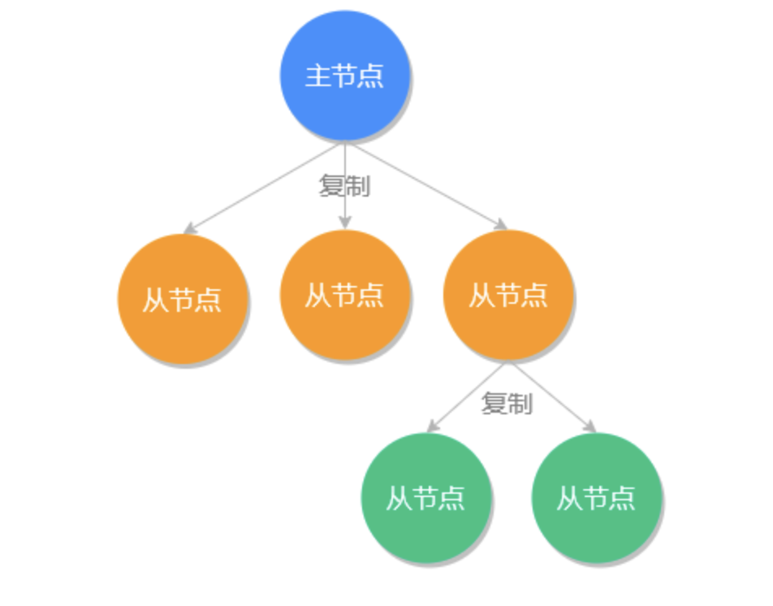
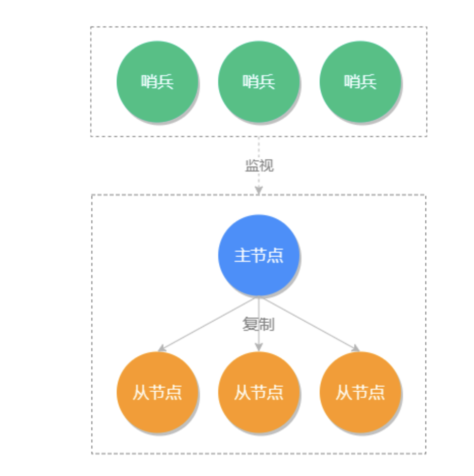
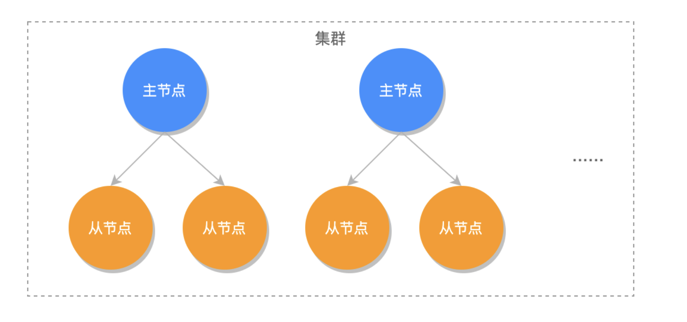
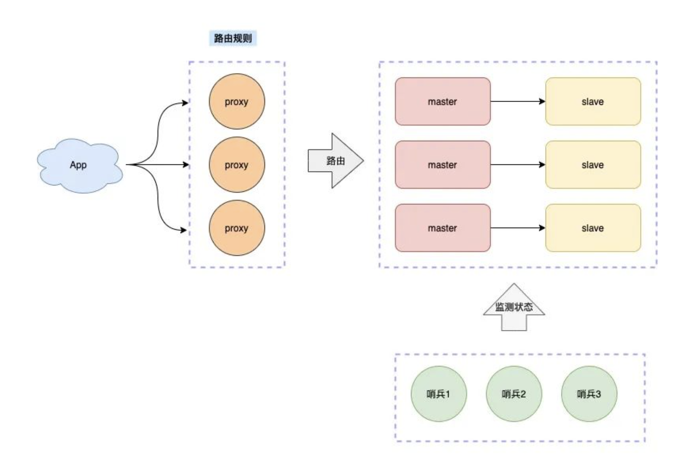

# Redis 集群详解

Redis 支持三种集群方案
* 主从复制模式
* 哨兵模式 Sentinel
* 集群模式 Cluster

从这三种方案中，也能看到Redis集群的演变

## 主从复制

主从同步（主从复制）是 Redis 高可用服务的基石，也是多机运行中最基础的一个。我们把主要存储数据的节点叫做主节点 (master），把其他通过复制主节点数据的副本节点叫做从节点 (slave）

在 Redis 中一个主节点可以拥有多个从节点，一个从节点也可以是其他服务器的主节点



主从同步的优点
* 性能方面：有了主从同步之后，可以把查询任务分配给从服务器，用主服务器来执行写操作，这样极大的提高了程序运行的效率，把所有压力分摊到各个服务器了
* 高可用：当有了主从同步之后，当主服务器节点宕机之后，可以很迅速的把从节点提升为主节点，为 Redis 服务器的宕机恢复节省了宝贵的时间
* 防止数据丢失：当主服务器磁盘坏掉之后，其他从服务器还保留着相关的数据，不至于数据全部丢失

注意事项
* 数据一致性问题
  * 当从服务器已经完成和主服务的数据同步之后，再新增的命令会以异步的方式发送至从服务器，在这个过程中主从同步会有短暂的数据不一致，如在这个异步同步发生之前主服务器宕机了，会造成数据不一致
  * key的过期时间如果是使用的expire设置，那么主从过期时间将会不同，存在同步时间差。如果对过期时间要求严格需要使用expireat，设置绝对时间
* 从服务器只读性
  * 默认在情况下，处于复制模式的主服务器既可以执行写操作也可以执行读操作，而从服务器则只能执行读操作。
  * 可以在从服务器上执行 config set replica-read-only no 命令，使从服务器开启写模式，但需要注意以下几点
    * 在从服务器上写的数据不会同步到主服务器
    * 当键值相同时主服务器上的数据可以覆盖从服务器
    * 在进行完整数据同步时，从服务器数据会被清空

### 数据同步

* 完整数据同步
  * 当有新的从服务器连接时，为了保障多个数据库的一致性，主服务器会执行一次 bgsave 命令生成一个 RDB 文件，然后再以 Socket 的方式发送给从服务器，从服务器收到 RDB 文件之后再把所有的数据加载到自己的程序中，就完成了一次全量的数据同步
* 部分数据同步
  * Redis 2.8 的优化方法是当从服务离线之后，主服务器会把离线之后的写入命令，存储在一个特定大小的队列中，队列是可以保证先进先出的执行顺序的，当从服务器重写恢复上线之后，主服务会判断离线这段时间内的命令是否还在队列中，如果在就直接把队列中的数据发送给从服务器，这样就避免了完整同步的资源浪费。
* 无盘数据同步
  * 从前面的内容我们可以得知，在第一次主从连接的时候，会先产生一个 RDB 文件，再把 RDB 文件发送给从服务器，如果主服务器是非固态硬盘的时候，系统的 I/O 操作是非常高的，为了缓解这个问题，Redis 2.8.18 新增了无盘复制功能，无盘复制功能不会在本地创建 RDB 文件，而是会派生出一个子进程，然后由子进程通过 Socket 的方式，直接将 RDB 文件写入到从服务器，这样主服务器就可以在不创建RDB文件的情况下，完成与从服务器的数据同步
  * 要使用无须复制功能，只需把配置项 repl-diskless-sync 的值设置为 yes 即可，它默认配置值为 no

### 操作命令
```
开启主从同步
在 Redis 运行过程中，我们可以使用 replicaof host port 命令，把自己设置为目标 IP 的从服务器，执行命令如下
127.0.0.1:6379> replicaof 127.0.0.1 6380

关闭主从同步
127.0.0.1:6379> role #查询当前角色
1) "slave" #从服务器
2) "192.168.1.71"
3) (integer) 6380
4) "connected"
5) (integer) 14
127.0.0.1:6379> replicaof no one #关闭同步
OK
127.0.0.1:6379> role #查询当前角色
1) "master" #主服务器
2) (integer) 1097
3) (empty list or set)
可以看出执行了 replicaof no one 命令之后，自己就从服务器变成主服务器了。

```

## 哨兵模式
主从复制模式，它是属于 Redis 多机运行的基础，但这种模式本身存在一个致命的问题，当主节点奔溃之后，需要人工干预才能恢复 Redis 的正常使用。

例如，我们有 3 台服务器做了主从复制，一个主服务器 A 和两个从服务器 B、C，当 A 发生故障之后，需要人工把 B 服务器设置为主服务器，同时再去 C 服务器设置成从服务器并且从主服务器 B 同步数据，如果是发生在晚上或者从服务器节点很多的情况下，对于人工来说想要立即实现恢复的难度很多，所以我们需要一个自动的工具——Redis Sentinel（哨兵模式）来把手动的过程变成自动的，让 Redis 拥有自动容灾恢复（failover）的能力。

Redis Sentinel 的最小分配单位是一主一从。

Sentinel 集群示意图如下：


### 工作原理

哨兵的工作原理是这样的，首先每个 Sentinel 会以每秒钟 1 次的频率，向已知的主服务器、从服务器和以及其他 Sentinel 实例，发送一个 PING 命令。

如果最后一次有效回复 PING 命令的时间超过 down-after-milliseconds 所配置的值（默认 30s），那么这个实例会被 Sentinel 标记为主观下线。

如果一个主服务器被标记为主观下线，那么正在监视这个主服务器的所有 Sentinel 节点，要以每秒 1 次的频率确认 主服务器的确进入了主观下线状态。

如果有足够数量（quorum 配置值）的 Sentinel 在指定的时间范围内同意这一判断，那么这个主服务器被标记为客观下线。此时所有的 Sentinel 会按照规则协商自动选出新的主节点。

一般情况下 Sentinel 集群的数量取大于 1 的奇数，例如 3、5、7、9，而 quorum 的配置要根据 Sentinel 的数量来发生变化，例如 Sentinel 是 3 台，那么对应的 quorum 最好是 2，如果 Sentinel 是 5 台，那么 quorum 最好是 3，它表示当有 3 台 Sentinel 都确认主节点下线了，就可以确定主节点真的下线了。

与 quorum 参数相关的有两个概念：主观下线和客观下线。

当 Sentinel 集群中，有一个 Sentinel 认为主服务器已经下线时，它会将这个主服务器标记为主观下线（Subjectively Down，SDOWN），然后询问集群中的其他 Sentinel，是否也认为该服务器已下线，当同意主服务器已下线的 Sentinel 数量达到 quorum 参数所指定的数量时，Sentinel 就会将相应的主服务器标记为客观下线（Objectively down，ODOWN），然后开始对其进行故障转移

### 自动容灾恢复

#### 新主节点竞选优先级设置
我们可以 redis.conf 中的 replica-priority 选项来设置竞选新主节点的优先级，它的默认值是 100，它的最大值也是 100，这个值越小它的权重就越高，例如从节点 A 的 replica-priority 值为 100，从节点 B 的值为 50，从节点 C 的值为 5，那么在竞选时从节点 C 会作为新的主节点。

#### 新主节点竞选规则
新主节点的竞选会排除不符合条件的从节点，然后再剩余的从节点按照优先级来挑选。首先来说，存在以下条件的从节点会被排除：
* 排除所有已经下线以及长时间没有回复心跳检测的疑似已下线从服务器；
* 排除所有长时间没有与主服务器通信，数据状态过时的从服务器；
* 排除所有优先级（replica-priority）为 0 的服务器。

符合条件的从节点竞选顺序：
* 优先级最高的从节点将会作为新主节点；
* 优先级相等则判断复制偏移量，偏移量最大的从节点获胜；
* 如果以上两个条件都相同，选择 Redis 运行时随机生成 ID 最小那个为新的主服务器。

#### 旧主节点恢复上线
如果之前的旧主节点恢复上线，会作为从节点运行在主从服务器模式中。

### 操作命令

```

# 配置
sentinel.conf，这个配置文件中必须包含监听的主节点信息
sentinel monitor mymaster 127.0.0.1 6379 1

# 启动命令
./src/redis-sentinel sentinel.conf

```

### Sentinel 集群

上面我们演示了单个 Sentinel 的启动，但生产环境我们不会只启动一台 Sentinel，因为如果启动一台 Sentinel 假如它不幸宕机的话，就不能提供自动容灾的服务了，不符合我们高可用的宗旨，所以我们会在不同的物理机上启动多个 Sentinel 来组成 Sentinel 集群，来保证 Redis 服务的高可用。

启动 Sentinel 集群的方法很简单，和上面启动单台的方式一样，我们只需要把多个 Sentinel 监听到一个主服务器节点，那么多个 Sentinel 就会自动发现彼此，并组成一个 Sentinel 集群

## 集群模式

Redis Cluster 是 Redis 3.0 版本推出的 Redis 集群方案，它将数据分布在不同的服务区上，以此来降低系统对单主节点的依赖，并且可以大大的提高 Redis 服务的读写性能。

Redis 将所有的数据分为 16384 个 slots（槽），每个节点负责其中的一部分槽位，当有 Redis 客户端连接集群时，会得到一份集群的槽位配置信息，这样它就可以直接把请求命令发送给对应的节点进行处理。

Redis Cluster 是无代理模式去中心化的运行模式，客户端发送的绝大数命令会直接交给相关节点执行，这样大部分情况请求命令无需转发，或仅转发一次的情况下就能完成请求与响应，所以集群单个节点的性能与单机 Redis 服务器的性能是非常接近的，因此在理论情况下，当水平扩展一倍的主节点就相当于请求处理的性能也提高了一倍，所以 Redis Cluster 的性能是非常高的。

Redis Cluster 是采用的客户端分片

Redis Cluster 架构图如下所示：


### 创建集群

* 使用create-cluster 工具搭建集群
```
# 创建集群
./create-cluster start

# 组建集群
./create-cluster create 

# 查看集群节点信息
cluster nodes

# 关闭集群
./create-cluster stop 

# 清理集群
./create-cluster clean

```

* 手动搭建 Redis Cluster
在实际生产环境中我们需要使用手动添加配置的方式搭建 Redis 集群，为此我们先要把 Redis 安装包复制到 node1 到 node6 文件中，因为我们要安装 6 个节点，3 主 3 从

```

# 开启集群模式
redis.conf
cluster-enabled yes

# 启动节点
./src/redis-server redis.conf

把这些节点串连成一个集群，并为它们指定对应的槽位
redis-cli --cluster create 127.0.0.1:30001 127.0.0.1:30002 127.0.0.1:30003 127.0.0.1:30004 127.0.0.1:30005 127.0.0.1:30006 --cluster-replicas 1

create 后面跟多个节点，表示把这些节点作为整个集群的节点，而 cluster-replicas 表示给集群中的主节点指定从节点的数量，1 表示为每个主节点设置一个从节点

```

### 动态增删节点

#### 增加主节点
```
cluster meet ip:port
redis-cli --cluster add-node 添加节点ip:port 集群某节点ip:port
```

#### 添加从节点
```
cluster replicate nodeId
```

#### 删除节点

从节点的话，直接可以删除成功。

主节点删除，需要先把自己的槽位转让出去，然后才可以删除成功

```
cluster forget nodeId
```

### 重新分片
使用 reshard 命令，对槽位（slots）进行重新分配

```

redis-cli --cluster reshard 127.0.0.1:30007

```

### 槽位定位算法

Redis 集群**总共的**槽位数是 16384 个，每一个主节点负责维护一部分槽以及槽所映射的键值数据，Redis 集群默认会对要存储的 key 值使用 CRC16 算法进行 hash 得到一个整数值，然后用这个整数值对 16384 进行取模来得到具体槽位，公式为：
slot = CRC16(key) % 16383

### 负载均衡

在 Redis 集群负载不均衡的情况下，我们可以使用 rebalance 命令重新分配各个节点负责的槽数量，从而使得各个节点的负载压力趋于平衡，从而提高 Redis 集群的整体运行效率。

```
redis-cli --cluster rebalance 127.0.0.1:30007
```

需要注意的是，即使输入 rebalance 命令，但它可能不会执行，当它认为没有必要进行分配时会直接退出，如下所示：

### Codis & Twemproxy

服务端分片指的是，路由规则不放在客户端来做，而是在客户端和服务端之间增加一个「中间代理层」，这个代理就是我们经常听到的 Proxy。

而数据的路由规则，就放在这个 Proxy 层来维护。

这样一来，你就无需关心服务端有多少个 Redis 节点了，只需要和这个 Proxy 交互即可。

Proxy 会把你的请求根据路由规则，转发到对应的 Redis 节点上，而且，当集群实例不足以支撑更大的流量请求时，还可以横向扩容，添加新的 Redis 实例提升性能，这一切对于你的客户端来说，都是透明无感知的。

业界开源的 Redis 分片集群方案，例如 Twemproxy、Codis 就是采用的这种方案。Codis与Twemproxy的区别是，Twemproxy更加轻量级，功能简单，只是简单的分片，不提供扩容和数据均衡能力。Codis相对功能更强大，提供扩容和数据均衡能力，但是需要搭配Redis的改造版，Redis升级不灵活，后续维护难以保障。



## QA

Redis Cluster是使用的一致性hash吗，在一致性hash的基础上但不完全是。采用了一致性hash的大量分槽模式，但是槽与服务节点的映射并不相同

## 参考
[Redis 主从同步](https://learn.lianglianglee.com/%E4%B8%93%E6%A0%8F/Redis%20%E6%A0%B8%E5%BF%83%E5%8E%9F%E7%90%86%E4%B8%8E%E5%AE%9E%E6%88%98/36%20%E5%AE%9E%E6%88%98%EF%BC%9ARedis%20%E4%B8%BB%E4%BB%8E%E5%90%8C%E6%AD%A5.md)
[Redis 哨兵模式](https://learn.lianglianglee.com/%E4%B8%93%E6%A0%8F/Redis%20%E6%A0%B8%E5%BF%83%E5%8E%9F%E7%90%86%E4%B8%8E%E5%AE%9E%E6%88%98/37%20%E5%AE%9E%E6%88%98%EF%BC%9ARedis%E5%93%A8%E5%85%B5%E6%A8%A1%E5%BC%8F%EF%BC%88%E4%B8%8A%EF%BC%89.md)
[Redis 集群模式](https://learn.lianglianglee.com/%E4%B8%93%E6%A0%8F/Redis%20%E6%A0%B8%E5%BF%83%E5%8E%9F%E7%90%86%E4%B8%8E%E5%AE%9E%E6%88%98/39%20%E5%AE%9E%E6%88%98%EF%BC%9ARedis%20%E9%9B%86%E7%BE%A4%E6%A8%A1%E5%BC%8F%EF%BC%88%E4%B8%8A%EF%BC%89.md)


