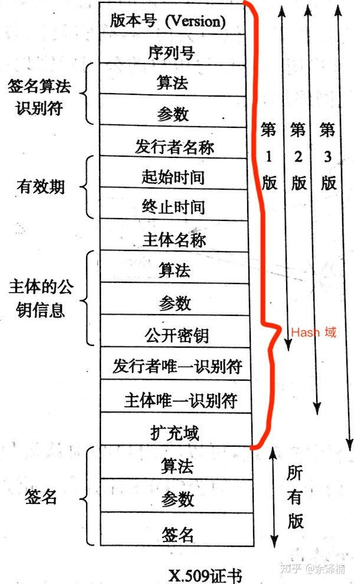

# 加密证书

## 安全传输数据
### CIA三要素
  * 机密性（Confidentiality）： 指确保数据在传输和存储过程中的私密性。主要的手段是加密、权限管理和敏感信息脱敏。
  * 完整性（Integrity）： 指确保数据内容完成，没有被篡改。主要手段是数字签名。
  * 可用性（Availability）： 指确保服务保持可用状态。

### 如何实现传输安全
  * 加密：将明文转换为密文，只有期望的接收方有能力将密文解密为明文，即使密文被攻击者窃取也无法理解数据的内容。
  * 验证完整性： 对原始数据计算摘要，并将数据和摘要一起交付给通信对方。接收方收到后也对数据计算摘要，并比较是否和接受的摘要一致，借此判断接收的数据是否被篡改。不过，因为收到的摘要也可能被篡改，所以需要使用更安全的手段：数字签名。
  * 认证数据来源： 数字签名能够验证数据完整性，同时也能认证数据来源，防止伪装。

## 加密方式
### 对称加密
  * 加密和解密的秘钥是相同的
  * DES，AES
  * 性能优于非对称加密

### 非对称加密
  * 加密和解密的秘钥是不相同的
  * RSA

## 摘要
  * 是不可逆的
  * 就像人的指纹一样，可以代表一个人，只要内容发生了改变，计算出来的摘要也应该变化
  * 一般做法是先将原数据进行 Hash 运算，得到的 Hash 值就叫做摘要

## 数字签名
  * 数字签名也叫作数字指纹，它是消息摘要算法和非对称加密算法的结合体，能够验证数据的完整性，并且认证数据的来源
  * 签名
    * 先计算数据的摘要，再使用私钥对摘要进行加密生成签名，将数据和签名一并发送给接收方
  * 验签
    * 先使用相同的摘要算法计算接收数据的摘要，再使用预先得到的公钥解密签名，对比解密的签名和计算的摘要是否一致。若一致，则说明数据没有被篡改

```java
    //支付宝 发起支付请求  加签过程
    private <T extends AlipayResponse> RequestParametersHolder getRequestHolderWithSign(AlipayRequest<?> request,String accessToken, String appAuthToken,
String appCertSN, String targetAppId) throws AlipayApiException {
        ......
            String signContent = AlipaySignature.getSignatureContent(requestHolder);
            protocalMustParams.put(AlipayConstants.SIGN, getSigner().sign(signContent, this.signType, charset));
        
        ......
        return requestHolder;
    }
    
		//签名
    public String sign(String sourceContent, String signType, String charset) {
        String sign = null;
        try {
            sign = AlipaySignature.rsaSign(sourceContent, this.privateKey, charset, signType);
        } catch (AlipayApiException e) {
            throw new RuntimeException(e);
        }
        return sign;
    }
    
    //支付宝 收到支付回调 验签过程
    public static boolean rsaCertCheckV1(Map<String, String> params, String alipayPublicCertPath, String charset, String signType) throws AlipayApiException {
        String publicKey = getAlipayPublicKey(alipayPublicCertPath);
        return rsaCheckV1(params, publicKey, charset, signType);
    }
    
    public static boolean rsaCheckV1(Map<String, String> params, String publicKey,
String charset, String signType) throws AlipayApiException {
        String sign = params.get("sign");
        String content = getSignCheckContentV1(params);
        return rsaCheck(content, sign, publicKey, charset, signType);
    }
    
    public static boolean rsaCheck(String content, String sign, String publicKey, String charset,String signType) throws AlipayApiException {
        return AsymmetricManager.getByName(signType).verify(content, charset, publicKey, sign);
    }

```

## 加密证书

### 存在的背景
  * 我们使用数字签名的前提是，对方拥有公钥。但是在发放公钥的过程中，也可能被冒充，冒充者把自己的公钥，发给了对方。加密证书就是为了解决这个问题而存在的，用来安全的发放公钥。

### CA
* 证书颁发机构(Certificate Authority)
* 是负责发放和管理数字证书的权威机构，并作为电子商务交易中受信任的第三方，承担公钥体系中公钥的合法性检验的责任

### 概念
  * 数字证书也可以看做公钥的数字签名。CA用自己的私钥，对申请证书者提交的持有人信息、公钥等信息，加签生产了公钥证书。使用CA的公钥证书，可以进行验签通过。从而获取没有被篡改和未被伪造的公钥。

### 组成部分
  * 持有人信息
  * 证书有效期
    * 起始时间和终止时间
  * 公钥  
  * 证书签名
    * 用颁发者的私钥对证书签名，防止证书内容没有被篡改
  * 颁发者信息   
    * DN，颁发者的可识别名称
  * 证书签名采用的算法
    * SHA-1-RSA
  * 版本号
    * 1、2、3，版本号会影响证书的一些特定信息
  * 序列号
    * 颁发者给证书的唯一序列号

### 根证书
  * 证书颁发机构是有层级关系的，下级 CA 的证书是需要由上级 CA 签名的。
  * 根证书：CA认证中心给自己颁发的证书, 是信任链的起始点。
  * 电脑或浏览器中，会预先下载很多根证书

## X.509 标准

### 概述
目前我们所提到的数字证书都是基于 ITU 制定的 X.509 标准
*  

### X509Certificate
* java.security.cert.X509Certificate
  * getVersion() 版本号
  * getSerialNumber()  序列号
  * getEncoded() 公钥信息  
  * getSignature() 签名  
* demo share.security.X509CertificateDemo

## 参考文档
[加密、摘要、签名、证书，一次说明白](https://juejin.cn/post/6995549209348816909)
[一文彻底搞懂加密、数字签名和数字证书](https://segmentfault.com/a/1190000024523772)