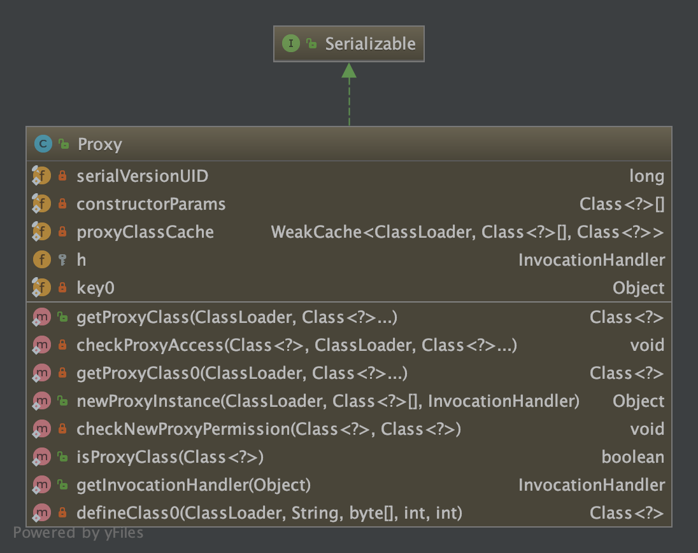
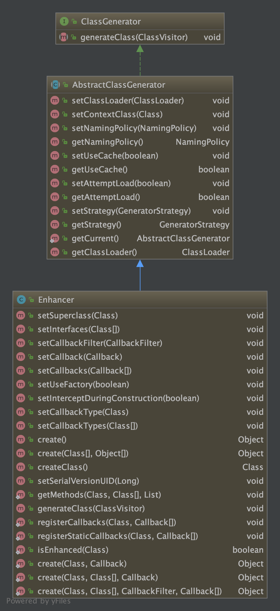

# AOP动态代理

常用的动态代理分为JDK动态代理和CGLIB动态代理两种

- JDK动态代理只能对有接口实现的类进行代理
- CGLIB动态代理对有/无接口实现的类都可进行代理

## JDK动态代理

### 使用示例

```java
public interface HelloService {
    void hello();
}

public class HelloServiceImpl implements HelloService {
    @Override
    public void hello() {
        System.out.println("hello");
    }
}

public class XXXInvocationHandler implements InvocationHandler {
    private Object targetObject;
    public XXXInvocationHandler(Object targetObject) {
        this.targetObject = targetObject;
    }
  
    @Override
    public Object invoke(Object proxy, Method method, Object[] args) throws Throwable {
        System.out.println("JDK-插前边");
        Object result= method.invoke(targetObject, args);
        System.out.println("JDK-插后边");
        return result;
    }
}

//Proxy.newProxyInstance使用方法，传入代理接口以及被代理的实例
private static void testJDKDynamicProxy() {
    // 当前线程的类加载器
    ClassLoader classLoader = Thread.currentThread().getContextClassLoader();
    HelloService helloService = (HelloService) Proxy.newProxyInstance(classLoader, new Class[]{HelloService.class}, new XXXInvocationHandler(new HelloServiceImpl()));
    helloService.hello();
}
```


```sequence
title: JDK动态代理
participant Proxy as proxy
participant WeakCache as cache
participant Factory as factory
participant ProxyClassFactory as proxyClassFactory 
participant ProxyGenerator as generator
participant Class as cl
participant Constructor as ctor

proxy->proxy:getProxyClass0
proxy->cache:get(loader, interfaces)
cache->factory:new 新建工厂
factory-->cache:
cache->factory:get
factory->proxyClassFactory:apply
proxyClassFactory->generator:创建代理类generateProxyClass
generator-->proxyClassFactory:返回代理类
proxyClassFactory-->factory:返回代理类
factory-->cache:返回代理类
proxy->cl:getConstructor获取代理类构造函数
cl-->proxy:返回构造函数Constructor
proxy->ctor:创建代理类实例newInstance
ctor-->proxy:返回实例
```

### JDK代理类结构
```java
//继承了Proxy类，并实现指定接口
public final class $Proxy0 extends Proxy implements HelloService {
    private static Method m1;
    private static Method m3;
    private static Method m2;
    private static Method m0;
  
  	//调用父类Proxy的构造函数，传入InvocationHandler
    public $Proxy0(InvocationHandler var1) throws  {
        super(var1);
    }

    public final boolean equals(Object var1) throws  {
        try {
            return (Boolean)super.h.invoke(this, m1, new Object[]{var1});
        } catch (RuntimeException | Error var3) {
            throw var3;
        } catch (Throwable var4) {
            throw new UndeclaredThrowableException(var4);
        }
    }
		//实现了接口的方法，并调用InvocationHandler处理逻辑
    public final void hello() throws  {
        try {
            super.h.invoke(this, m3, (Object[])null);
        } catch (RuntimeException | Error var2) {
            throw var2;
        } catch (Throwable var3) {
            throw new UndeclaredThrowableException(var3);
        }
    }

    public final String toString() throws  {
        try {
            return (String)super.h.invoke(this, m2, (Object[])null);
        } catch (RuntimeException | Error var2) {
            throw var2;
        } catch (Throwable var3) {
            throw new UndeclaredThrowableException(var3);
        }
    }

    public final int hashCode() throws  {
        try {
            return (Integer)super.h.invoke(this, m0, (Object[])null);
        } catch (RuntimeException | Error var2) {
            throw var2;
        } catch (Throwable var3) {
            throw new UndeclaredThrowableException(var3);
        }
    }

    static {
        try {
            m1 = Class.forName("java.lang.Object").getMethod("equals", Class.forName("java.lang.Object"));
            m3 = Class.forName("share.spring.aop.demo.HelloService").getMethod("hello");
            m2 = Class.forName("java.lang.Object").getMethod("toString");
            m0 = Class.forName("java.lang.Object").getMethod("hashCode");
        } catch (NoSuchMethodException var2) {
            throw new NoSuchMethodError(var2.getMessage());
        } catch (ClassNotFoundException var3) {
            throw new NoClassDefFoundError(var3.getMessage());
        }
    }
}
```


## CGLIB动态代理
	Spring直接完整地引入了CGLIB源码，看到包名中含有cglib的包，应该都是引入的CGLIB源代码

### 使用示例
```java
//可代理无接口的类型，HelloServiceImpl未实现任何接口
public class HelloServiceImpl{
    public void hello() {
        System.out.println("hello");
    }
}

//Enhancer使用方法，传入父类，不需要传入被代理实例
private static void testCGLIBProxy() {
    Enhancer enhancer = new Enhancer();
    enhancer.setSuperclass(HelloServiceImpl.class);
    enhancer.setCallback(new MethodInterceptor() {
        @Override
        public Object intercept(Object proxy, Method method, Object[] objects, MethodProxy methodProxy) throws Throwable {
          	System.out.println("CGLIB-插前边");
          	//invokeSuper是调用父类的方法，父类的方法是没有被代理过的。因为此行代码处于代理方法的执行中，如果调用invoke方法相当于重复调用代理方法，会出现死循环
          	//CGLIB是如何做到不使用反射来调用目标对象的方法的，MethodProxy是核心
          	Object object = methodProxy.invokeSuper(proxy, objects);
           	System.out.println("CGLIB-插后边");
            return object;
            }
        });
    HelloServiceImpl helloService= (HelloServiceImpl)enhancer.create();
    helloService.hello();
}
```




### CGLIB代理类结构

```java
public class HelloServiceImpl$$EnhancerByCGLIB$$488c150 extends HelloServiceImpl implements Factory {
    private boolean CGLIB$BOUND;
    public static Object CGLIB$FACTORY_DATA;
    private static final ThreadLocal CGLIB$THREAD_CALLBACKS;
    private static final Callback[] CGLIB$STATIC_CALLBACKS;
    private MethodInterceptor CGLIB$CALLBACK_0;
    private static Object CGLIB$CALLBACK_FILTER;
    private static final Method CGLIB$hello$0$Method;
    private static final MethodProxy CGLIB$hello$0$Proxy;
    private static final Object[] CGLIB$emptyArgs;
    private static final Method CGLIB$equals$1$Method;
    private static final MethodProxy CGLIB$equals$1$Proxy;
    private static final Method CGLIB$toString$2$Method;
    private static final MethodProxy CGLIB$toString$2$Proxy;
    private static final Method CGLIB$hashCode$3$Method;
    private static final MethodProxy CGLIB$hashCode$3$Proxy;
    private static final Method CGLIB$clone$4$Method;
    private static final MethodProxy CGLIB$clone$4$Proxy;

    static void CGLIB$STATICHOOK1() {
        CGLIB$THREAD_CALLBACKS = new ThreadLocal();
        CGLIB$emptyArgs = new Object[0];
        Class var0 = Class.forName("share.spring.aop.demo.HelloServiceImpl$$EnhancerByCGLIB$$488c150");
        Class var1;
        Method[] var10000 = ReflectUtils.findMethods(new String[]{"equals", "(Ljava/lang/Object;)Z", "toString", "()Ljava/lang/String;", "hashCode", "()I", "clone", "()Ljava/lang/Object;"}, (var1 = Class.forName("java.lang.Object")).getDeclaredMethods());
        CGLIB$equals$1$Method = var10000[0];
        CGLIB$equals$1$Proxy = MethodProxy.create(var1, var0, "(Ljava/lang/Object;)Z", "equals", "CGLIB$equals$1");
        CGLIB$toString$2$Method = var10000[1];
        CGLIB$toString$2$Proxy = MethodProxy.create(var1, var0, "()Ljava/lang/String;", "toString", "CGLIB$toString$2");
        CGLIB$hashCode$3$Method = var10000[2];
        CGLIB$hashCode$3$Proxy = MethodProxy.create(var1, var0, "()I", "hashCode", "CGLIB$hashCode$3");
        CGLIB$clone$4$Method = var10000[3];
        CGLIB$clone$4$Proxy = MethodProxy.create(var1, var0, "()Ljava/lang/Object;", "clone", "CGLIB$clone$4");
        CGLIB$hello$0$Method = ReflectUtils.findMethods(new String[]{"hello", "()V"}, (var1 = Class.forName("share.spring.aop.demo.HelloServiceImpl")).getDeclaredMethods())[0];
        CGLIB$hello$0$Proxy = MethodProxy.create(var1, var0, "()V", "hello", "CGLIB$hello$0");
    }
		//未代理的方法
    final void CGLIB$hello$0() {
        super.hello();
    }

  	//代理后的方法
    public final void hello() {
        MethodInterceptor var10000 = this.CGLIB$CALLBACK_0;
        if (this.CGLIB$CALLBACK_0 == null) {
            CGLIB$BIND_CALLBACKS(this);
            var10000 = this.CGLIB$CALLBACK_0;
        }

        if (var10000 != null) {
            var10000.intercept(this, CGLIB$hello$0$Method, CGLIB$emptyArgs, CGLIB$hello$0$Proxy);
        } else {
            super.hello();
        }
    }

   ******
     
    public static MethodProxy CGLIB$findMethodProxy(Signature var0) {
        String var10000 = var0.toString();
        switch(var10000.hashCode()) {
        case -792725149:
            if (var10000.equals("hello()V")) {
                return CGLIB$hello$0$Proxy;
            }
            break;
        case -508378822:
            if (var10000.equals("clone()Ljava/lang/Object;")) {
                return CGLIB$clone$4$Proxy;
            }
            break;
        case 1826985398:
            if (var10000.equals("equals(Ljava/lang/Object;)Z")) {
                return CGLIB$equals$1$Proxy;
            }
            break;
        case 1913648695:
            if (var10000.equals("toString()Ljava/lang/String;")) {
                return CGLIB$toString$2$Proxy;
            }
            break;
        case 1984935277:
            if (var10000.equals("hashCode()I")) {
                return CGLIB$hashCode$3$Proxy;
            }
        }

        return null;
    }

  	******
    
    static {
        CGLIB$STATICHOOK1();
    }
}
```
```
除此之外，CGLIB还针对代理类和被代理类另外生成了两个FastClass，具体可以参考本项目的根目录share/spring/aop/demo/生成的几个class文件。
FastClass不使用反射（Constructor或Method）来调用委托类方法，而是动态生成一个新的类（继承FastClass），向类中写入委托类实例直接调用方法的语句，用模板方式解决Java语法不支持问题，同时改善Java反射性能。
使用者根据方法签名（方法名+参数类型）得到索引值，再通过索引值进入相应的方法调用语句，得到调用结果。
```

## AOP中的代理应用

### 前情回顾
```java
===============================wrapIfNecessary->createProxy==================================
/******  org.springframework.aop.framework.autoproxy.AbstractAutoProxyCreator#createProxy  ******/
protected Object createProxy(Class<?> beanClass, @Nullable String beanName,
        @Nullable Object[] specificInterceptors, TargetSource targetSource) {

    if (this.beanFactory instanceof ConfigurableListableBeanFactory) {
        // 为目标 Bean 的 BeanDefinition 对象设置一个属性
        // org.springframework.aop.framework.autoproxy.AutoProxyUtils.originalTargetClass -> 目标 Bean 的 Class 对象
        AutoProxyUtils.exposeTargetClass((ConfigurableListableBeanFactory) this.beanFactory, beanName, beanClass);
    }

    // <1> 创建一个代理工厂
    ProxyFactory proxyFactory = new ProxyFactory();
    // <2> 复制当前 ProxyConfig 的一些属性（例如 proxyTargetClass、exposeProxy）
    proxyFactory.copyFrom(this);

    /**
     * <3> 判断是否类代理，也就是是否开启 CGLIB 代理
     * 默认配置下为 `false`，参考 {@link org.springframework.context.annotation.EnableAspectJAutoProxy}
     */
    if (!proxyFactory.isProxyTargetClass()) {
        /*
         * <3.1> 如果这个 Bean 配置了进行类代理，则设置为 `proxyTargetClass` 为 `true`
         */
        if (shouldProxyTargetClass(beanClass, beanName)) {
            proxyFactory.setProxyTargetClass(true);
        }
        else {
            /*
             * <3.2> 检测当前 Bean 实现的接口是否包含可代理的接口
             * 如没有实现，则将 `proxyTargetClass` 设为 `true`，表示需要进行 CGLIB 提升
             */
            evaluateProxyInterfaces(beanClass, proxyFactory);
        }
    }

    /*
     * <4> 对入参的 Advisor 进一步处理，因为其中可能还存在 Advice 类型，需要将他们包装成 DefaultPointcutAdvisor 对象
     * 如果配置了 `interceptorNames` 拦截器，也会添加进来
     */
    Advisor[] advisors = buildAdvisors(beanName, specificInterceptors);
    // <5> 代理工厂添加 Advisor 数组
    proxyFactory.addAdvisors(advisors);
    // <6> 代理工厂设置 TargetSource 对象
    proxyFactory.setTargetSource(targetSource);
    // <7> 对 ProxyFactory 进行加工处理，抽象方法，目前没有子类实现
    customizeProxyFactory(proxyFactory);

    proxyFactory.setFrozen(this.freezeProxy);
    // <8> 是否这个 AdvisedSupport 配置管理器已经过滤过目标类（默认为 false）
    if (advisorsPreFiltered()) {
        // 设置 `preFiltered` 为 `true`
        // 这样 Advisor 们就不会根据 ClassFilter 进行过滤了，而直接通过 MethodMatcher 判断是否处理被拦截方法
        proxyFactory.setPreFiltered(true);
    }

    // <9> 通过 ProxyFactory 代理工厂创建代理对象
    return proxyFactory.getProxy(getProxyClassLoader());
}

/******  org.springframework.aop.framework.ProxyFactory#getProxy(java.lang.ClassLoader)  ******/
public Object getProxy(ClassLoader classLoader) {
  //【创建代理的核心逻辑，getProxy下期分解】
		return createAopProxy().getProxy(classLoader);
}

protected final synchronized AopProxy createAopProxy() {
		if (!this.active) {
			activate();
		}
		return getAopProxyFactory().createAopProxy(this);
}

/******  org.springframework.aop.framework.DefaultAopProxyFactory#createAopProxy  ******/
	public AopProxy createAopProxy(AdvisedSupport config) throws AopConfigException {
		/*
		 * <1> 判断是否满足下面三个条件的其中一个
		 */
		if (config.isOptimize() // 需要优化，默认为 `false`
				|| config.isProxyTargetClass() // 使用类代理，也就是使用 CGLIB 动态代理
				|| hasNoUserSuppliedProxyInterfaces(config) // 目标类没有实现接口
		) {
			// <1.1> 获取目标类
			Class<?> targetClass = config.getTargetClass();
			if (targetClass == null) {
				throw new AopConfigException("TargetSource cannot determine target class: " +
						"Either an interface or a target is required for proxy creation.");
			}
			/*
			 * <1.2> 如果目标类是一个接口或者是 java.lang.reflect.Proxy 的子类
			 * 则还是使用 JDK 动态代理，创建一个 JdkDynamicAopProxy 对象，传入 AdvisedSupport 配置管理器，并返回
			 */
			if (targetClass.isInterface() || Proxy.isProxyClass(targetClass)) {
				return new JdkDynamicAopProxy(config);
			}
			// <1.3> 使用 CGLIB 动态代理，创建一个  ObjenesisCglibAopProxy 对象，传入 AdvisedSupport 配置管理器，并返回
			return new ObjenesisCglibAopProxy(config);
		}
		// <2> 否则
		else {
			// 使用 JDK 动态代理，创建一个 JdkDynamicAopProxy 对象，传入 AdvisedSupport 配置管理器，并返回
			return new JdkDynamicAopProxy(config);
		}
	}

```

### JdkDynamicAopProxy

```java
/**
获取执行方法对应的拦截器，组成拦截器链条，依次递归调用
**/
final class JdkDynamicAopProxy implements AopProxy, InvocationHandler, Serializable {

	******
  
	@Override
	public Object getProxy() {
		return getProxy(ClassUtils.getDefaultClassLoader());
	}

	@Override
	public Object getProxy(@Nullable ClassLoader classLoader) {
		if (logger.isTraceEnabled()) {
			logger.trace("Creating JDK dynamic proxy: " + this.advised.getTargetSource());
		}
		// <1> 获取需要代理的接口（目标类实现的接口，会加上 Spring 内部的几个接口，例如 SpringProxy）
		Class<?>[] proxiedInterfaces = AopProxyUtils.completeProxiedInterfaces(this.advised, true);
		// <2> 判断目标类是否重写了 `equals` 或者 `hashCode` 方法
		// 没有重写在拦截到这两个方法的时候，会调用当前类的实现
		findDefinedEqualsAndHashCodeMethods(proxiedInterfaces);
		// <3> 调用 JDK 的 Proxy#newProxyInstance(..) 方法创建代理对象
		// 传入的参数就是当前 ClassLoader 类加载器、需要代理的接口、InvocationHandler 实现类
		return Proxy.newProxyInstance(classLoader, proxiedInterfaces, this);
	}

	******
    
	/**
	 * 代理对象的拦截处理
	 *
	 * Implementation of {@code InvocationHandler.invoke}.
	 * <p>Callers will see exactly the exception thrown by the target,
	 * unless a hook method throws an exception.
	 */
	@Override
	@Nullable
	public Object invoke(Object proxy, Method method, Object[] args) throws Throwable {
		Object oldProxy = null;
		boolean setProxyContext = false;

		// <1> 获取目标类的 TargetSource 对象，用于获取目标类
		TargetSource targetSource = this.advised.targetSource;
		Object target = null;

		try {
      // <2>
			******
        
			Object retVal;
			// <3> 如果 `expose-proxy` 属性为 `true`，则需要暴露当前代理对象
			if (this.advised.exposeProxy) {
				// Make invocation available if necessary.
				// <3.1> 向 AopContext 中设置代理对象，并记录 ThreadLocal 之前存放的代理对象
				// 这样一来，在 Advice 或者被拦截方法中可以通过 AopContext 获取到这个代理对象
				oldProxy = AopContext.setCurrentProxy(proxy);
				// <3.2> 标记这个代理对象被暴露了
				setProxyContext = true;
			}

			// Get as late as possible to minimize the time we "own" the target,
			// in case it comes from a pool.
			// <4> 获取目标对象，以及它的 Class 对象
			target = targetSource.getTarget();
			Class<?> targetClass = (target != null ? target.getClass() : null);

			// Get the interception chain for this method.
			// <5> 获取能够应用于该方法的所有拦截器（有序）
			// 不同的 AspectJ 根据 @Order 排序
			// 同一个 AspectJ 中的 Advice 排序：AspectJAfterThrowingAdvice > AfterReturningAdviceInterceptor > AspectJAfterAdvice > AspectJAroundAdvice > MethodBeforeAdviceInterceptor
			List<Object> chain = this.advised.getInterceptorsAndDynamicInterceptionAdvice(method, targetClass);

			// Check whether we have any advice. If we don't, we can fallback on direct
			// reflective invocation of the target, and avoid creating a MethodInvocation.
			// <6> 如果拦截器链为空，则直接执行目标方法
			if (chain.isEmpty()) {
				// We can skip creating a MethodInvocation: just invoke the target directly
				// Note that the final invoker must be an InvokerInterceptor so we know it does
				// nothing but a reflective operation on the target, and no hot swapping or fancy proxying.
				// <6.1> 参数适配处理
				Object[] argsToUse = AopProxyUtils.adaptArgumentsIfNecessary(method, args);
				// <6.2> 执行目标方法（反射），并获取返回结果
				retVal = AopUtils.invokeJoinpointUsingReflection(target, method, argsToUse);
			}
			// <7> 否则，需要根据拦截器链去执行目标方法
			else {
				// We need to create a method invocation...
				// <7.1> 创建一个方法调用器，并将前面第 `5` 步获取到的拦截器链传入其中
				// 该对象就是 Joinpoint 对象
				MethodInvocation invocation = new ReflectiveMethodInvocation(proxy, target, method, args, targetClass, chain);
				// Proceed to the joinpoint through the interceptor chain.
				//【核心实现】 <7.2> 执行目标方法，以及所有的 MethodInterceptor 方法拦截器（Advice 通知器），并获取返回结果
				retVal = invocation.proceed();
			}

			******
			return retVal;
		}
		finally {
			// <12> 如果目标对象不为空，且 TargetSource 不是静态的（表示每次都得返回一个新的目标对象）
			// 那么需要释放当前获取到的目标对象，通常情况下我们的单例 Bean 对应的都是 SingletonTargetSource，不需要释放
			if (target != null && !targetSource.isStatic()) {
				// Must have come from TargetSource.
				targetSource.releaseTarget(target);
			}
			// <13> 如果暴露了当前代理对象，则需要将之前的代理对象重新设置到 ThreadLocal 中
			if (setProxyContext) {
				// Restore old proxy.
				AopContext.setCurrentProxy(oldProxy);
			}
		}
	}
	
  ******
}

===============================================================================================================
public class ReflectiveMethodInvocation implements ProxyMethodInvocation, Cloneable {
	
  ******

	protected ReflectiveMethodInvocation(
			Object proxy, @Nullable Object target, Method method, @Nullable Object[] arguments,
			@Nullable Class<?> targetClass, List<Object> interceptorsAndDynamicMethodMatchers) {

		this.proxy = proxy;
		this.target = target;
		this.targetClass = targetClass;
		// 获取目标方法，如果是桥接方法则会找到目标方法
		this.method = BridgeMethodResolver.findBridgedMethod(method);
		// 对该方法参数进行适配处理（如果有必要）
		this.arguments = AopProxyUtils.adaptArgumentsIfNecessary(method, arguments);
		this.interceptorsAndDynamicMethodMatchers = interceptorsAndDynamicMethodMatchers;
	}

	******

	/**
	 * 对于该方法的第 `1` 步，你是否有疑问
	 * 为什么执行完最后一个拦截器才执行目标方法，后置通知器不是需要等目标方法执行后才进行处理的吗？
	 *
	 * 首先我们看看 {@link MethodInterceptor#invoke(MethodInvocation)} 方法，它的入参就是当前对象的类型
	 * 每次执行 MethodInterceptor 方法拦截器时都会传入 `this` 当前对象
	 *
	 * 我们进入到 {@link org.springframework.aop.aspectj.AspectJAfterAdvice#invoke(MethodInvocation)} 方法看看
	 * 它又会进入 `this` 当前对象的 `proceed()` 方法，在 finally 语句块中才执行后置通知器
	 * 所以它还是会先执行目标方法，然后才执行后置通知器
	 */
	@Override
	@Nullable
	public Object proceed() throws Throwable {
		// We start with an index of -1 and increment early.
		// <1> 如果当前已经执行完的拦截器的位置索引就是最后一个，那么即可执行目标方法
		if (this.currentInterceptorIndex == this.interceptorsAndDynamicMethodMatchers.size() - 1) {
			// 执行目标方法（底层反射机制）
			return invokeJoinpoint();
		}

		// <2> 按顺序获取拦截器
		Object interceptorOrInterceptionAdvice =
				this.interceptorsAndDynamicMethodMatchers.get(++this.currentInterceptorIndex);
		/**
		 * <3> 如果是 InterceptorAndDynamicMethodMatcher 类型，表示 MethodMatcher 在真正的执行时需要做一些检测
		 * 参考 {@link DefaultAdvisorChainFactory#getInterceptorsAndDynamicInterceptionAdvice }
		 */
		if (interceptorOrInterceptionAdvice instanceof InterceptorAndDynamicMethodMatcher) {
			// Evaluate dynamic method matcher here: static part will already have
			// been evaluated and found to match.
			InterceptorAndDynamicMethodMatcher dm =
					(InterceptorAndDynamicMethodMatcher) interceptorOrInterceptionAdvice;
			Class<?> targetClass = (this.targetClass != null ? this.targetClass : this.method.getDeclaringClass());
			// <3.1> 通过 MethodMatcher 对目标方法进行匹配
			if (dm.methodMatcher.matches(this.method, targetClass, this.arguments)) {
				// 匹配通过，则执行这个拦截器，并传递当前对象
				return dm.interceptor.invoke(this);
			}
			// <3.2> 否则，直接跳过这个拦截器
			else {
				// Dynamic matching failed.
				// Skip this interceptor and invoke the next in the chain.
				return proceed();
			}
		}
		else {
			// It's an interceptor, so we just invoke it: The pointcut will have
			// been evaluated statically before this object was constructed.
			// <4> 否则执行这个拦截器，并传递当前对象
			return ((MethodInterceptor) interceptorOrInterceptionAdvice).invoke(this);
		}
	}

	/**
	 * Invoke the joinpoint using reflection.
	 * Subclasses can override this to use custom invocation.
	 * @return the return value of the joinpoint
	 * @throws Throwable if invoking the joinpoint resulted in an exception
	 */
	@Nullable
	protected Object invokeJoinpoint() throws Throwable {
		return AopUtils.invokeJoinpointUsingReflection(this.target, this.method, this.arguments);
	}
  
	******
}
```


### ObjenesisCglibAopProxy

```java
=============父类CglibAopProxy===========
class CglibAopProxy implements AopProxy, Serializable {

	// Constants for CGLIB callback array indices
	// 因为 CGLIB 设置的 Callback 是一个数组，下面定义了数组中固定几个拦截器的位置
	// 进行 AOP 代理的通用拦截器
	private static final int AOP_PROXY = 0;
	// 执行目标方法的拦截器
	private static final int INVOKE_TARGET = 1;
	// 空的 Callback 对象，对于 finalize() 方法，不需要进行任何处理
	private static final int NO_OVERRIDE = 2;
	// 目标对象调度器，用于获取目标对象
	private static final int DISPATCH_TARGET = 3;
	// 配置管理器的调度器，会返回一个 AdvisedSupport 对象
	private static final int DISPATCH_ADVISED = 4;
	// 处理 `equals(Object)` 方法的拦截器
	private static final int INVOKE_EQUALS = 5;
	// 处理 `hashCode()` 方法的拦截器
	private static final int INVOKE_HASHCODE = 6;

	/** Logger available to subclasses; static to optimize serialization. */
	protected static final Log logger = LogFactory.getLog(CglibAopProxy.class);

	/** Keeps track of the Classes that we have validated for final methods. */
	private static final Map<Class<?>, Boolean> validatedClasses = new WeakHashMap<>();

	/** 代理对象的配置信息，例如保存了 TargetSource 目标类来源、能够应用于目标类的所有 Advisor */
	protected final AdvisedSupport advised;

	/** 创建代理对象的构造方法入参 */
	@Nullable
	protected Object[] constructorArgs;

	/** 创建代理对象的构造方法的入参类型 */
	@Nullable
	protected Class<?>[] constructorArgTypes;

	/** Dispatcher used for methods on Advised. 配置管理器的调度器，会返回一个 AdvisedSupport 对象 */
	private final transient AdvisedDispatcher advisedDispatcher;

	/**
	 * 缓存方法的调用器数组索引
	 * key：方法名称
	 * value：方法对应的方法调用器在 Callback 数组中的位置
	 */
	private transient Map<String, Integer> fixedInterceptorMap = Collections.emptyMap();

	// 方法调用器在 Callback 数组中的偏移量
	private transient int fixedInterceptorOffset;

	public CglibAopProxy(AdvisedSupport config) throws AopConfigException {
		Assert.notNull(config, "AdvisedSupport must not be null");
		if (config.getAdvisors().length == 0 // 没有 Advisor，表示没有任何动作
				&& config.getTargetSource() == AdvisedSupport.EMPTY_TARGET_SOURCE) // 没有来源
		{
			throw new AopConfigException("No advisors and no TargetSource specified");
		}
		this.advised = config;
		this.advisedDispatcher = new AdvisedDispatcher(this.advised);
	}
  
  @Override
public Object getProxy() { return getProxy(null); }

@Override
public Object getProxy(@Nullable ClassLoader classLoader) {
    try {
        // <1> 获取目标类
        Class<?> rootClass = this.advised.getTargetClass();
        Assert.state(rootClass != null, "Target class must be available for creating a CGLIB proxy");

        // <2> 将目标类作为被代理的类
        Class<?> proxySuperClass = rootClass;
        // <3> 如果目标类已经被 CGLIB 提升（名称包含 `$$` 符号）
        if (ClassUtils.isCglibProxyClass(rootClass)) {
            // <3.1> 获取目标类的父类作为被代理的类
            proxySuperClass = rootClass.getSuperclass();
            // <3.2> 获取目标类实现的接口，并添加至当前 AdvisedSupport 配置管理器中
            // 例如 `@Configuration` 注解的 Bean 会被 CGLIB 提升，实现了 EnhancedConfiguration 接口
            Class<?>[] additionalInterfaces = rootClass.getInterfaces();
            for (Class<?> additionalInterface : additionalInterfaces) {
                this.advised.addInterface(additionalInterface);
            }
        }

        // Validate the class, writing log messages as necessary.
        // <4> 进行校验，仅打印日志，例如 final 修饰的方法不能被 CGLIB 提升
        validateClassIfNecessary(proxySuperClass, classLoader);

        // Configure CGLIB Enhancer...
        // <5> 创建 CGLIB 的增强类，并进行接下来的配置
        Enhancer enhancer = createEnhancer();
        if (classLoader != null) {
            enhancer.setClassLoader(classLoader);
            // `useCache` 默认为 `true`，可通过 `cglib.useCache` 系统参数指定
            if (classLoader instanceof SmartClassLoader &&
                    ((SmartClassLoader) classLoader).isClassReloadable(proxySuperClass)) {
                enhancer.setUseCache(false);
            }
        }
        // <5.1> 设置被代理的类
        enhancer.setSuperclass(proxySuperClass);
        // <5.2> 设置需要代理的接口（可能没有，不过都会加上 Spring 内部的几个接口，例如 SpringProxy）
        enhancer.setInterfaces(AopProxyUtils.completeProxiedInterfaces(this.advised));
        // <5.3> 设置命名策略，默认生成的代理对象的名称中包含 '$$' 和 'BySpringCGLIB'
        enhancer.setNamingPolicy(SpringNamingPolicy.INSTANCE);
        enhancer.setStrategy(new ClassLoaderAwareUndeclaredThrowableStrategy(classLoader));

        // <5.4> 获取回调接口，也就是 MethodInterceptor 方法拦截器
        Callback[] callbacks = getCallbacks(rootClass);
        Class<?>[] types = new Class<?>[callbacks.length];
        for (int x = 0; x < types.length; x++) {
            types[x] = callbacks[x].getClass();
        }
        // fixedInterceptorMap only populated at this point, after getCallbacks call above
        // <5.5> 设置 Callback 过滤器，用于筛选出方法对应的 Callback 回调接口
        enhancer.setCallbackFilter(new ProxyCallbackFilter(
                this.advised.getConfigurationOnlyCopy(), this.fixedInterceptorMap, this.fixedInterceptorOffset));
        enhancer.setCallbackTypes(types);

        // Generate the proxy class and create a proxy instance.
        // <6> 创建代理对象，CGLIG 字节码替身，创建目标类的子类
        return createProxyClassAndInstance(enhancer, callbacks);
    }
    catch (CodeGenerationException | IllegalArgumentException ex) {
        // 抛出 AopConfigException 异常
    }
    catch (Throwable ex) {
        // 抛出 AopConfigException 异常
    }
}

  
  private Callback[] getCallbacks(Class<?> rootClass) throws Exception {
    // Parameters used for optimization choices...
    // <1> 获取代理对象的三个配置信息
    // `exposeProxy` 是否暴露代理对象，通常为 `false`
    boolean exposeProxy = this.advised.isExposeProxy();
    // `isFrozen` 配置管理器是否被冻结，通常为 `false`
    boolean isFrozen = this.advised.isFrozen();
    // `isStatic` 是否是静态的目标对象，也就是说目标对象是否每次都需要创建，通常为 `true`
    boolean isStatic = this.advised.getTargetSource().isStatic();

    // Choose an "aop" interceptor (used for AOP calls).
    // <2> 【重点】创建目标对象的拦截器，MethodInterceptor 方法拦截器，会对目标对象的方法进行拦截处理，之前筛选出来的 Advisor 会在这个里面被调用
    Callback aopInterceptor = new DynamicAdvisedInterceptor(this.advised);

    // Choose a "straight to target" interceptor. (used for calls that are
    // unadvised but can return this). May be required to expose the proxy.
    // <3> 创建目标对象的执行器，用于执行目标方法
    Callback targetInterceptor;
    // <3.1> 如果需要暴露当前代理对象，则通过 AopContext 进行暴露，放入 ThreadLocal 中，其他的和下面都相同
    if (exposeProxy) {
        targetInterceptor = (isStatic ?
                new StaticUnadvisedExposedInterceptor(this.advised.getTargetSource().getTarget()) :
                new DynamicUnadvisedExposedInterceptor(this.advised.getTargetSource()));
    }
    // <3.2> 否则，不暴露
    else {
        targetInterceptor = (isStatic ?
                // <3.2.1> 用于执行方法代理对象，并对最终的返回结果进一步处理（返回结果是否需要为代理对象，返回结果是否不能为空）
                new StaticUnadvisedInterceptor(this.advised.getTargetSource().getTarget()) :
                // <3.2.2> 和上者的区别就是，每次拦截都会重新获取目标对象，结束后释放该目标对象
                new DynamicUnadvisedInterceptor(this.advised.getTargetSource()));
    }

    // Choose a "direct to target" dispatcher (used for
    // unadvised calls to static targets that cannot return this).
    // <4> 目标对象调度器，用于获取目标对象
    Callback targetDispatcher = (isStatic ?
            // <4.1> 目标对象的调度器，用于获取当前目标对象
            new StaticDispatcher(this.advised.getTargetSource().getTarget()) :
            // <4.2> 目标对象的调度器，空的 Callback，不做任何处理
            new SerializableNoOp());

    // <5> 生成主要的几个回调接口，也就是上面创建的几个 Callback，放入 `mainCallbacks` 数组
    Callback[] mainCallbacks = new Callback[] {
            // 0：进行 AOP 代理的通用拦截器
            aopInterceptor,  // for normal advice
            // 1：执行目标方法的拦截器
            targetInterceptor,  // invoke target without considering advice, if optimized
            // 2：空的 Callback 对象，例如 `finalize()` 方法，不需要进行任何处理
            new SerializableNoOp(),  // no override for methods mapped to this
            // 3：目标对象调度器，用于获取目标对象
            targetDispatcher,
            // 4：配置管理器的调度器，会返回一个 AdvisedSupport 对象
            // 因为代理对象会实现 Advised 接口，拦截到其里面的方法时，需要调用当前 AdvisedSupport 的方法
            this.advisedDispatcher,
            // 5：处理 `equals(Object)` 方法的拦截器
            new EqualsInterceptor(this.advised),
            // 6：处理 `hashCode()` 方法的拦截器
            new HashCodeInterceptor(this.advised)
    };

    Callback[] callbacks;

    // If the target is a static one and the advice chain is frozen,
    // then we can make some optimizations by sending the AOP calls
    // direct to the target using the fixed chain for that method.
    /*
     * <6> 如果目标对象不需要每次都创建，且当前 AdvisedSupport 配置管理器被冻结了，性能优化，可暂时忽略
     * 那么在创建代理对象的时候，就可以先将目标对象的每个方法对应的方法调用器解析出来，该过程有点性能损耗，这样在代理对象执行方法的时候性能有所提升
     * 不过由于这里会解析出许多方法调用器，会占有一定的内存，以空间换时间
     */
    if (isStatic && isFrozen) {
        Method[] methods = rootClass.getMethods();
        Callback[] fixedCallbacks = new Callback[methods.length];
        this.fixedInterceptorMap = new HashMap<>(methods.length);

        // TODO: small memory optimization here (can skip creation for methods with no advice)
        /*
         * <6.1> 遍历目标对象所有的方法
         */
        for (int x = 0; x < methods.length; x++) {
            Method method = methods[x];
            // <6.1.1> 获取能够应用于该方法的所有拦截器（有序）
            // 不同的 AspectJ 根据 @Order 排序
            // 同一个 AspectJ 中的 Advice 排序：AspectJAfterThrowingAdvice > AfterReturningAdviceInterceptor > AspectJAfterAdvice > AspectJAroundAdvice > MethodBeforeAdviceInterceptor
            List<Object> chain = this.advised.getInterceptorsAndDynamicInterceptionAdvice(method, rootClass);
            // <6.1.2> 创建一个方法调用器
            fixedCallbacks[x] = new FixedChainStaticTargetInterceptor(
                    chain, this.advised.getTargetSource().getTarget(), this.advised.getTargetClass());
            // <6.1.3> 将每个方法的对应的调用器的位置索引缓存起来
            this.fixedInterceptorMap.put(methods.toString(), x);
        }

        // Now copy both the callbacks from mainCallbacks
        // and fixedCallbacks into the callbacks array.
        callbacks = new Callback[mainCallbacks.length + fixedCallbacks.length];
        // <6.2> 将 `mainCallbacks` 复制到 `callbacks` 数组
        System.arraycopy(mainCallbacks, 0, callbacks, 0, mainCallbacks.length);
        // <6.3> 将 `fixedCallbacks` 复制到 `callbacks` 数组（拼接在后面）
        System.arraycopy(fixedCallbacks, 0, callbacks, mainCallbacks.length, fixedCallbacks.length);
        // <6.4> 记录一个已生成的方法调用器的偏移量
        this.fixedInterceptorOffset = mainCallbacks.length;
    }
    // <7> 否则，不进行解析，取上面的几个主要的 Callback
    else {
        callbacks = mainCallbacks;
    }
    // <8> 返回这个目标对象对应的 Callback 数组
    return callbacks;
}
}

========================================================================================

class ObjenesisCglibAopProxy extends CglibAopProxy {

	/**
	 * 创建一个 Objenesis 对象
	 * [**Objenesis**](http://objenesis.org/) 是一个小型 Java 库，目的是为一些特殊的 Class 对象实例化一个对象
	 * 应用场景：
	 * 1. 序列化，远程调用和持久化 - 对象需要实例化并存储为到一个特殊的状态，而没有调用代码
	 * 2. 代理，AOP 库和 Mock 对象 - 类可以被子类继承而子类不用担心父类的构造器
	 * 3. 容器框架 - 对象可以以非标准的方式被动态实例化
	 */
	private static final SpringObjenesis objenesis = new SpringObjenesis();

	public ObjenesisCglibAopProxy(AdvisedSupport config) {
		super(config);
	}

	@Override
	protected Object createProxyClassAndInstance(Enhancer enhancer, Callback[] callbacks) {
		// <1> 先创建代理对象的 Class 对象（目标类的子类）
		Class<?> proxyClass = enhancer.createClass();
		Object proxyInstance = null;

		// <2> 是否使用 Objenesis 来实例化代理对象，默认会
		// 可通过 在 `spring.properties` 文件中添加 `spring.objenesis.ignore=false` 来禁止
		if (objenesis.isWorthTrying()) {
			try {
				// <2.1> 通过 Objenesis 实例化代理对象（非标准方式，不使用构造方法进行实例化）
				proxyInstance = objenesis.newInstance(proxyClass, enhancer.getUseCache());
			}
			catch (Throwable ex) {
				logger.debug("Unable to instantiate proxy using Objenesis, " +
						"falling back to regular proxy construction", ex);
			}
		}

		// <3> 如果借助 Objenesis 实例化代理对象失败
		if (proxyInstance == null) {
			// Regular instantiation via default constructor...
			try {
				// <3.1> 选择构造器，指定了参数则使用对应的构造器，否则使用默认构造器
				Constructor<?> ctor = (this.constructorArgs != null ?
						proxyClass.getDeclaredConstructor(this.constructorArgTypes) :
						proxyClass.getDeclaredConstructor());
				ReflectionUtils.makeAccessible(ctor);
				// <3.2> 通过构造器实例化代理对象（反射）
				proxyInstance = (this.constructorArgs != null ?
						ctor.newInstance(this.constructorArgs) : ctor.newInstance());
			}
			catch (Throwable ex) {
				throw new AopConfigException("Unable to instantiate proxy using Objenesis, " +
						"and regular proxy instantiation via default constructor fails as well", ex);
			}
		}

		// <4> 设置 Callback 数组
		((Factory) proxyInstance).setCallbacks(callbacks);
		// <5> 返回代理对象
		return proxyInstance;
	}
}

```

```
QA:关于JDK动态代理和CGLIB的性能讨论
	JDK动态代理的调用过程是通过反射实现的，而CGLIB是通过生成被代理类和代理类的字节码直接调用的，由于JDK老一些的版本反射性能较低，所以CGLIB更快一些。但是JDK近几年的版本反射性能已经有了明显提升，目前性能甚至超过CGLIB。
```

## 参考文档

[死磕Spring之AOP篇 - 初识JDK、CGLIB两种动态代理](https://www.cnblogs.com/lifullmoon/p/14654836.html)
[死磕Spring之AOP篇 - Spring AOP两种代理对象的拦截处理](https://www.cnblogs.com/lifullmoon/p/14654883.html)
[死磕Spring之AOP篇 - Spring AOP自动代理（三）创建代理对象](https://www.cnblogs.com/lifullmoon/p/14684886.html)
[关于 Java 反射效率问题](https://mirror.xyz/0xB94ce874bef7472b0B3D18BF5bDb7Ba74f2d110A/3xJ6XZLpBoUCEA1x-xtM6hMkeochbUR706DK1N4iZp0)

