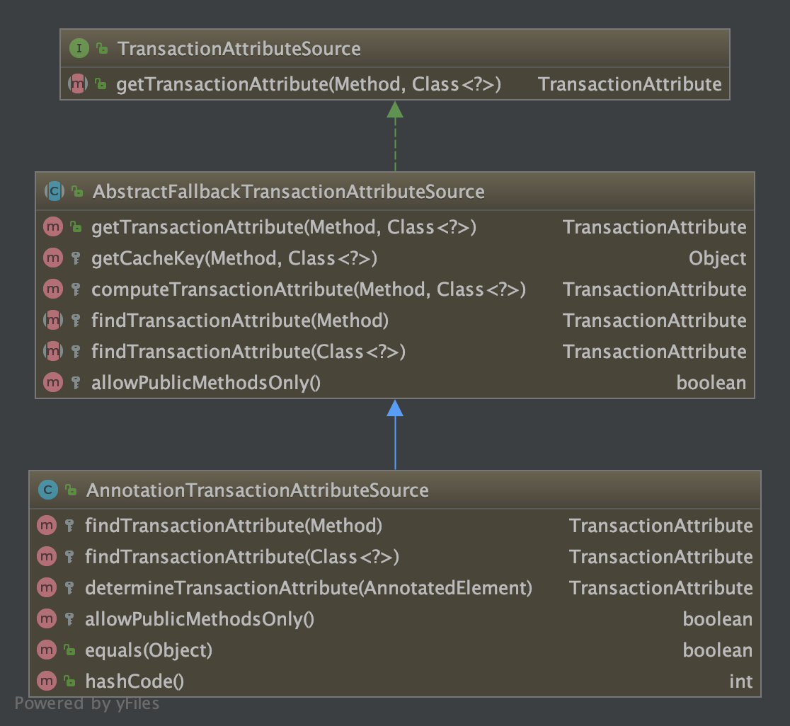
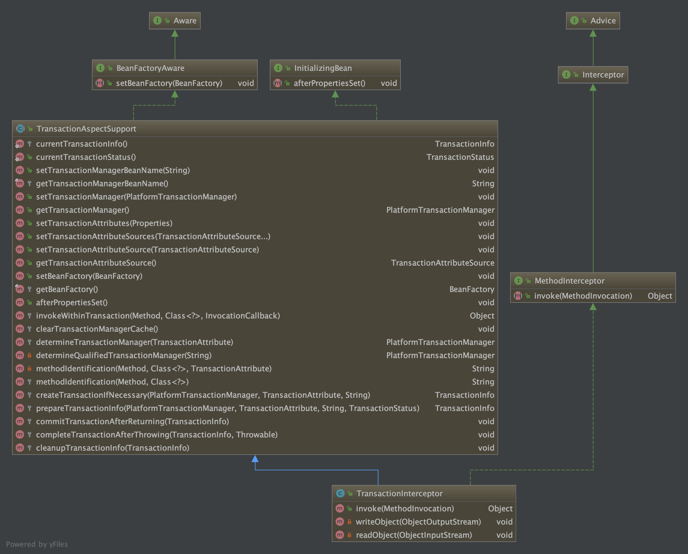
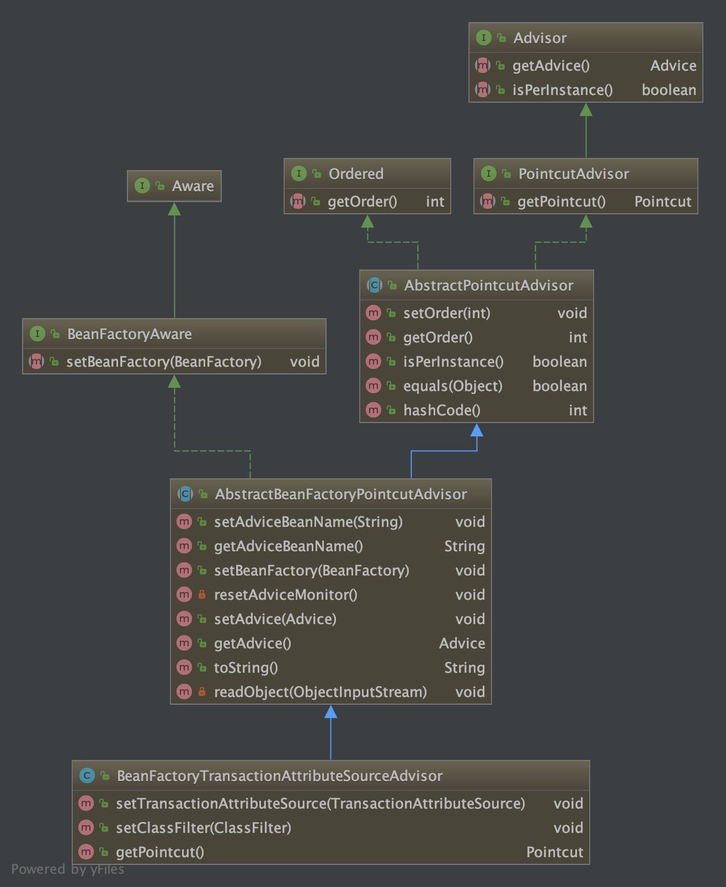
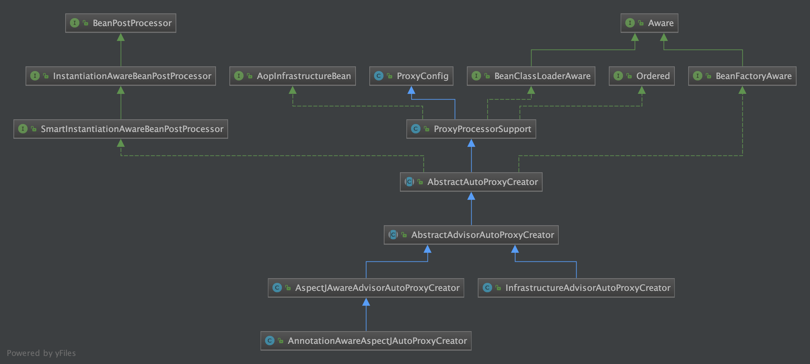

# Spring事务实现原理


## 核心API
TransactionDefinition：Spring 事务定义，包含超时时间、事务隔离级别等属性
TransactionAttribute：事务属性，继承自TransactionDefinition，增加了回滚异常类型
TransactionAttributeSource： Spring 事务属性源，获取TransactionAttribute
TransactionStatus：Spring 事务状态，是否新事物，是否有保存点，是否完成等信息
TransactionInfo：掌控所有事务相关的信息，包含事务管理器、事务状态、事务属性等
PlatformTransactionManager：Spring 平台事务管理器，负责提交回滚等事务操作
BeanFactoryTransactionAttributeSourceAdvisor：Spring 事务 PointAdvisor 实现
TransactionInterceptor：Spring 事务 MethodInterceptor 实现，事务拦截器

## 原理概括

	1.入口是在配置文件中配置<tx:annotation-driven />标签开启事务
	2.在spring-tx模块META-INF/spring.handlers文件中配置了自定义命名空间解析器，对应配置如下:
	http\://www.springframework.org/schema/tx=org.springframework.transaction.config.TxNamespaceHandler。Spring会加载‘=’后边的配置类解析‘=’前边的命名空间
	3.通过TxNamespaceHandler解析<tx:annotation-driven />，注册Advisor和处理事务的方法拦截器。此处就相当于走完了AOP的流程，后续就是执行AOP的步骤了
	4.Bean实例化时，通过AOP筛选带有@Transactional注解的类，应用Advisor生成代理实例
	5.执行事务方法时生成事务信息，并与当前线程绑定
	6.在方法正常执行的情况下提交事务，执行异常时回滚事务


## 注册Advisor

	开启事务配置项
	<tx:annotation-driven transaction-manager="transactionManager"/>
	
	spring-tx=>META-INF/spring.handlers文件内容如下:
	http://www.springframework.org/schema/tx = org.springframework.transaction.config.TxNamespaceHandler

```sequence
title: 注册 BeanFactoryTransactionAttributeSourceAdvisor
participant AnnotationDrivenBeanDefinitionParser as parser
participant AopAutoProxyConfigurer as configurer
participant AopNamespaceUtils as aopNamespaceUtils
participant AopConfigUtils as aopConfigUtils
participant BeanDefinitionRegistry as registry
participant CompositeComponentDefinition as ccd
participant ParserContext as parserContext

parser->configurer:configureAutoProxyCreator(element, parserContext)
configurer->aopNamespaceUtils:AopNamespaceUtils.registerAutoProxyCreatorIfNecessary(parserContext, element)
aopNamespaceUtils->aopConfigUtils:registerAutoProxyCreatorIfNecessary
aopConfigUtils->aopConfigUtils:registerOrEscalateApcAsRequired with InfrastructureAdvisorAutoProxyCreator
aopConfigUtils->registry:注册InfrastructureAdvisorAutoProxyCreator
registry-->aopConfigUtils:
aopConfigUtils-->aopNamespaceUtils:
aopNamespaceUtils-->configurer:
configurer->configurer:构造AnnotationTransactionAttributeSource sourceDef
configurer->configurer:构造TransactionInterceptor interceptorDef
configurer->configurer:构造BeanFactoryTransactionAttributeSourceAdvisor advisorDef
configurer->registry:注册BeanFactoryTransactionAttributeSourceAdvisor
registry-->configurer:
configurer->ccd:创建CompositeComponentDefinition并把sourceDef、interceptorDef、advisorDef设置到nestedComponents
ccd-->configurer:
configurer->parserContext:注册CompositeComponentDefinition
parserContext-->configurer:
configurer-->parser:
```

```java
/**
	 * Inner class to just introduce an AOP framework dependency when actually in proxy mode.
	 */
	private static class AopAutoProxyConfigurer {

		public static void configureAutoProxyCreator(Element element, ParserContext parserContext) {
			AopNamespaceUtils.registerAutoProxyCreatorIfNecessary(parserContext, element);

			String txAdvisorBeanName = TransactionManagementConfigUtils.TRANSACTION_ADVISOR_BEAN_NAME;
			if (!parserContext.getRegistry().containsBeanDefinition(txAdvisorBeanName)) {
				Object eleSource = parserContext.extractSource(element);

				// Create the TransactionAttributeSource definition.
				RootBeanDefinition sourceDef = new RootBeanDefinition(
						"org.springframework.transaction.annotation.AnnotationTransactionAttributeSource");
				sourceDef.setSource(eleSource);
				sourceDef.setRole(BeanDefinition.ROLE_INFRASTRUCTURE);
				String sourceName = parserContext.getReaderContext().registerWithGeneratedName(sourceDef);

				// Create the TransactionInterceptor definition.
				RootBeanDefinition interceptorDef = new RootBeanDefinition(TransactionInterceptor.class);
				interceptorDef.setSource(eleSource);
				interceptorDef.setRole(BeanDefinition.ROLE_INFRASTRUCTURE);
				registerTransactionManager(element, interceptorDef);
				interceptorDef.getPropertyValues().add("transactionAttributeSource", new RuntimeBeanReference(sourceName));
				String interceptorName = parserContext.getReaderContext().registerWithGeneratedName(interceptorDef);

				// Create the TransactionAttributeSourceAdvisor definition.
				RootBeanDefinition advisorDef = new RootBeanDefinition(BeanFactoryTransactionAttributeSourceAdvisor.class);
				advisorDef.setSource(eleSource);
				advisorDef.setRole(BeanDefinition.ROLE_INFRASTRUCTURE);
				advisorDef.getPropertyValues().add("transactionAttributeSource", new RuntimeBeanReference(sourceName));
				advisorDef.getPropertyValues().add("adviceBeanName", interceptorName);
				if (element.hasAttribute("order")) {
					advisorDef.getPropertyValues().add("order", element.getAttribute("order"));
				}
				parserContext.getRegistry().registerBeanDefinition(txAdvisorBeanName, advisorDef);

				CompositeComponentDefinition compositeDef = new CompositeComponentDefinition(element.getTagName(), eleSource);
				compositeDef.addNestedComponent(new BeanComponentDefinition(sourceDef, sourceName));
				compositeDef.addNestedComponent(new BeanComponentDefinition(interceptorDef, interceptorName));
				compositeDef.addNestedComponent(new BeanComponentDefinition(advisorDef, txAdvisorBeanName));
				parserContext.registerComponent(compositeDef);
			}
		}
	}
```

	AnnotationTransactionAttributeSource类图


	TransactionInterceptor类图


	BeanFactoryTransactionAttributeSourceAdvisor类图



## 解析注解
	事务注册的自动代理类是InfrastructureAdvisorAutoProxyCreator
	AOP注册的自动代理类是AnnotationAwareAspectJAutoProxyCreator



```java
public class BeanFactoryTransactionAttributeSourceAdvisor extends AbstractBeanFactoryPointcutAdvisor {

	/**
	 * 事务属性源对象，用于解析 @Transactional 注解
	 */
	@Nullable
	private TransactionAttributeSource transactionAttributeSource;

	/**
	 * Pointcut 对象，用于判断 JoinPoint 是否匹配
	 */
	private final TransactionAttributeSourcePointcut pointcut = new TransactionAttributeSourcePointcut() {
		@Override
		@Nullable
		protected TransactionAttributeSource getTransactionAttributeSource() {
			return transactionAttributeSource;
		}
	};
    
	public void setTransactionAttributeSource(TransactionAttributeSource transactionAttributeSource) {
		this.transactionAttributeSource = transactionAttributeSource;
	}

	public void setClassFilter(ClassFilter classFilter) {
		this.pointcut.setClassFilter(classFilter);
	}

	@Override
	public Pointcut getPointcut() {
		return this.pointcut;
	}
}

========================================TransactionAttributeSourcePointcut.java=========================================
abstract class TransactionAttributeSourcePointcut extends StaticMethodMatcherPointcut implements Serializable {

	@Override
	public boolean matches(Method method, Class<?> targetClass) {
		// <1> 目标类是 Spring 内部的事务相关类，则跳过，不需要创建代理对象
		if (TransactionalProxy.class.isAssignableFrom(targetClass) ||
				PlatformTransactionManager.class.isAssignableFrom(targetClass) ||
				PersistenceExceptionTranslator.class.isAssignableFrom(targetClass)) {
			return false;
		}
		// <2 获取 AnnotationTransactionAttributeSource 对象
		TransactionAttributeSource tas = getTransactionAttributeSource();
		// <3> 解析该方法相应的 @Transactional 注解，并将元信息封装成一个 TransactionAttribute 对象
		// 且缓存至 AnnotationTransactionAttributeSource 对象中
		//【核心逻辑】 <4> 如果有对应的 TransactionAttribute 对象，则表示匹配，需要进行事务的拦截处理
		return (tas == null || tas.getTransactionAttribute(method, targetClass) != null);
	}
}

========================================AbstractFallbackTransactionAttributeSource.java===============================
// AbstractFallbackTransactionAttributeSource.java
@Override
@Nullable
public TransactionAttribute getTransactionAttribute(Method method, @Nullable Class<?> targetClass) {
    // <1> java.lang.Object 内定义的方法跳过
    if (method.getDeclaringClass() == Object.class) {
        return null;
    }
    // First, see if we have a cached value.
    // <2> 获取缓存 Key，MethodClassKey 对象，关联 Method 和 Class 对象
    Object cacheKey = getCacheKey(method, targetClass);
    // <3> 尝试从缓存中获取该方法对应的 TransactionAttribute 对象
    TransactionAttribute cached = this.attributeCache.get(cacheKey);
    if (cached != null) {
        // Value will either be canonical value indicating there is no transaction attribute,
        // or an actual transaction attribute.
        // <3.1> 缓存中缓存的是一个空的 TransactionAttribute 对象
        // 表示没有相应的 @Transactional 注解，返回 `null`
        if (cached == NULL_TRANSACTION_ATTRIBUTE) {
            return null;
        }
        // <3.2> 返回缓存的 TransactionAttribute 对象
        else {
            return cached;
        }
    }
    // <4> 开始解析方法对应的 @Transactional 注解
    else {
        // 【核心逻辑】
        // <4.1> 解析该方法或者类上面的 @Transactional 注解，封装成 RuleBasedTransactionAttribute 对象
        // 优先从方法上面解析该注解，其次从类上解析该注解，没有的话返回的是 `null`
        TransactionAttribute txAttr = computeTransactionAttribute(method, targetClass);
        // Put it in the cache.
        // <4.2> 如果是 `null`，则缓存一个空的 TransactionAttribute 对象
        if (txAttr == null) {
            this.attributeCache.put(cacheKey, NULL_TRANSACTION_ATTRIBUTE);
        }
        // <4.3> 否则，将该 TransactionAttribute 对象缓存
        else {
            String methodIdentification = ClassUtils.getQualifiedMethodName(method, targetClass);
            if (txAttr instanceof DefaultTransactionAttribute) {
                // 设置方法的描述符（类名.方法名）
                ((DefaultTransactionAttribute) txAttr).setDescriptor(methodIdentification);
            }
            this.attributeCache.put(cacheKey, txAttr);
        }
        // <4.4> 返回这个 TransactionAttribute 对象
        return txAttr;
    }
}  
  
// AbstractFallbackTransactionAttributeSource.java
@Nullable
protected TransactionAttribute computeTransactionAttribute(Method method, @Nullable Class<?> targetClass) {
    // Don't allow no-public methods as required.
    // 如果不允许非 public 修饰的方法（默认允许），则判断是否为 public 修饰，不是的话返回 null
    if (allowPublicMethodsOnly() && !Modifier.isPublic(method.getModifiers())) {
        return null;
    }

    // The method may be on an interface, but we need attributes from the target class.
    // If the target class is null, the method will be unchanged.
    // 获取方法对象（而不是桥接方法）
    Method specificMethod = AopUtils.getMostSpecificMethod(method, targetClass);

    // First try is the method in the target class.
    // 通过 SpringTransactionAnnotationParser 解析方法上面的 @Transactional 注解
    // 并将注解的元信息封装到 RuleBasedTransactionAttribute 中，没有注解的话返回 null
    TransactionAttribute txAttr = findTransactionAttribute(specificMethod);
    if (txAttr != null) {
        // 存在的话直接返回
        return txAttr;
    }

    // Second try is the transaction attribute on the target class.
    // 如果方法上面没有，则尝试解析类上面的 @Transactional 注解
    txAttr = findTransactionAttribute(specificMethod.getDeclaringClass());
    // 存在这个注解，且方法是用户级别（不是 Spring 内部合成的）
    if (txAttr != null && ClassUtils.isUserLevelMethod(method)) {
        return txAttr;
    }

    // 如果还没有找到 @Transactional 注解的元信息，则尝试从原 Method 对象中查找
    if (specificMethod != method) {
        // Fallback is to look at the original method.
        // 处理过程如上
        txAttr = findTransactionAttribute(method);
        if (txAttr != null) {
            return txAttr;
        }
        // Last fallback is the class of the original method.
        // 处理过程如上
        txAttr = findTransactionAttribute(method.getDeclaringClass());
        if (txAttr != null && ClassUtils.isUserLevelMethod(method)) {
            return txAttr;
        }
    }

    return null;
}

```


## 事务拦截

### Spring事务传播机制

 

```sequence
title: 事务拦截
participant TransactionInterceptor as interceptor
participant PlatformTransactionManager as txmanager
participant DataSourceTransactionObject as dsto
participant TransactionSynchronizationManager as tsm
participant TransactionInfo as txInfo
participant InvocationCallback as invocation

interceptor->interceptor:invokeWithinTransaction
interceptor->interceptor:createTransactionIfNecessary
interceptor->txmanager:getTransaction
txmanager->txmanager:doGetTransaction
txmanager->dsto:创建DataSourceTransactionObject
dsto-->txmanager:
txmanager->tsm:获取ConnectionHolder
tsm-->txmanager:
txmanager->dsto:设置ConnectionHolder
dsto-->txmanager:
txmanager-->interceptor:
interceptor->interceptor:prepareTransactionInfo
interceptor->txInfo:创建TransactionInfo
txInfo-->interceptor:
interceptor->txInfo:bindToThread
txInfo-->interceptor:
interceptor->invocation:执行被拦截的逻辑
invocation-->interceptor:
interceptor->interceptor:completeTransactionAfterThrowing
interceptor->interceptor:cleanupTransactionInfo
interceptor->interceptor:commitTransactionAfterReturning
```

```java
============================TransactionInterceptor.java============================
@Override
@Nullable
public Object invoke(MethodInvocation invocation) throws Throwable {
    // 目标类
    Class<?> targetClass = (invocation.getThis() != null ? AopUtils.getTargetClass(invocation.getThis()) : null);

    // 在事务中执行方法调用器
    return invokeWithinTransaction(invocation.getMethod(), targetClass, invocation::proceed);
}

// 父类TransactionAspectSupport.java
protected Object invokeWithinTransaction(Method method, @Nullable Class<?> targetClass,
        final InvocationCallback invocation) throws Throwable {

    // If the transaction attribute is null, the method is non-transactional.
    TransactionAttributeSource tas = getTransactionAttributeSource();
    // <1> 获取 `@Transactional` 注解对应的 TransactionAttribute 对象（如果在 AnnotationTransactionAttributeSource 解析过则取缓存）
    final TransactionAttribute txAttr = (tas != null ? tas.getTransactionAttribute(method, targetClass) : null);
    // <2> 获取 PlatformTransactionManager 事务管理器（可以指定，没有指定则获取默认的）
    final PlatformTransactionManager tm = determineTransactionManager(txAttr);
    // <3> 获取方法的唯一标识，默认都是 `类名.方法名`
    final String joinpointIdentification = methodIdentification(method, targetClass, txAttr);

    // <4> 如果已有 `@Transactional` 注解对应的 TransactionAttribute 对象，或者是一个非回调偏向的事务管理器（默认不是）
    if (txAttr == null || !(tm instanceof CallbackPreferringPlatformTransactionManager)) {
        // 【核心逻辑】
        // <4.1> 创建 TransactionInfo 事务信息对象，绑定在 ThreadLocal 中
        // 包含一个 DefaultTransactionStatus 事务状态对象
        TransactionInfo txInfo = createTransactionIfNecessary(tm, txAttr, joinpointIdentification);

        Object retVal;
        try {
            // <4.2> 继续执行方法调用器
            retVal = invocation.proceedWithInvocation();
        }
        catch (Throwable ex) {
          	//【核心逻辑】
            // <4.3> 如果捕获到异常，则在这里完成事务，进行回滚或者提交
            completeTransactionAfterThrowing(txInfo, ex);
            throw ex;
        }
        finally {
          	//【核心逻辑】
            // <4.4> `finally` 语句块，释放 ThreadLocal 中的 TransactionInfo 对象，设置为上一个事务信息对象（没有的话为空）
            cleanupTransactionInfo(txInfo);
        }
      	//【核心逻辑】
        // <4.5> 正常情况，到这里完成事务
        commitTransactionAfterReturning(txInfo);
        // <4.6> 返回执行结果
        return retVal;
    }
    // <5> 否则，就是支持回调的事务管理器，编程式事务（回调偏向），暂时忽略
    else {
        // .....
    }
}

```

## QA

AOP会注册一个①AnnotationAwareAspectJAutoProxyCreator实现了BeanPostProcessor，tx会注册②InfrastructureAdvisorAutoProxyCreator实现了BeanPostProcessor，这两个BeanPostProcessor会在Bean实例化时依次生成proxy，那么会不会导致生成了proxy的proxy?

答：不会，①和②都是AutoProxyCreator，AutoProxyCreator全局只会出现一个。当注册时org.springframework.aop.config.AopConfigUtils#registerOrEscalateApcAsRequired有个逻辑来判断repositiry中已注册的优先级，再决定是否覆盖

​		①的优先级比②高

​			如果先注册了①再注册②，会忽略②。

​			如果先注册了②再注册①，会用①替换repositiry中的②。


## 参考文档
[死磕Spring之AOP篇 - Spring事务详解](https://www.cnblogs.com/lifullmoon/p/14755976.html)
[@Transaction源码深度解析](https://mp.weixin.qq.com/s?__biz=MzA5MTkxMDQ4MQ==&mid=2648937715&idx=2&sn=2d8534f9788bfa4678554d858ec93ab3&chksm=88620ccdbf1585db4d407fb0270b334812785a7614a2e4d365a9fdeb1661dc737913618c73fc&scene=178&cur_album_id=1318969124223238148#rd)