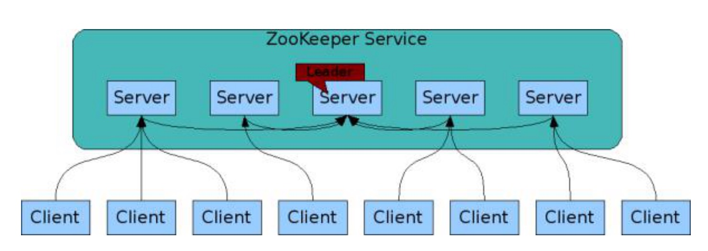
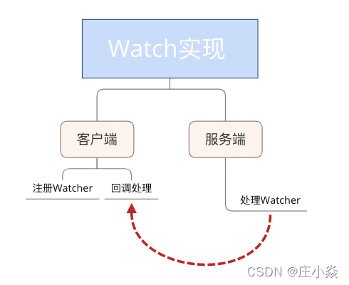
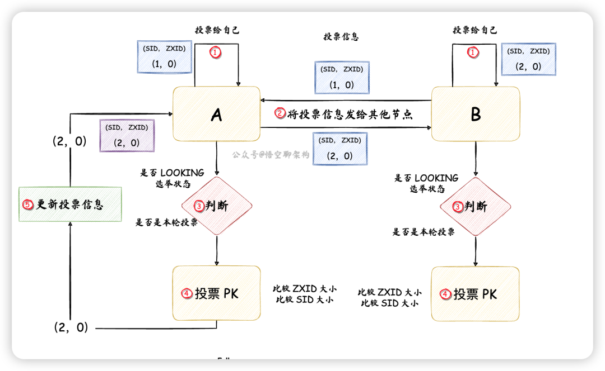
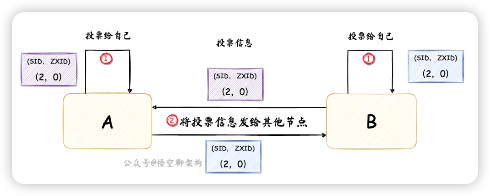
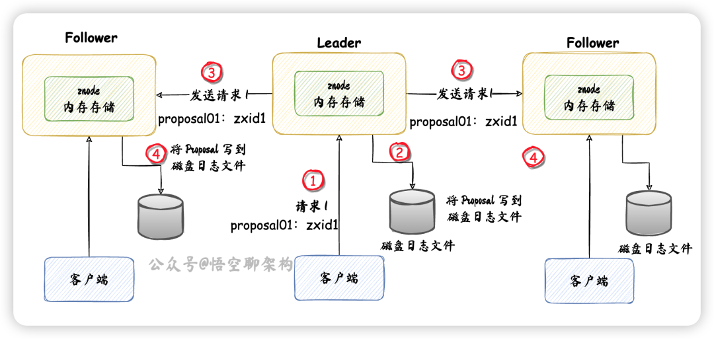
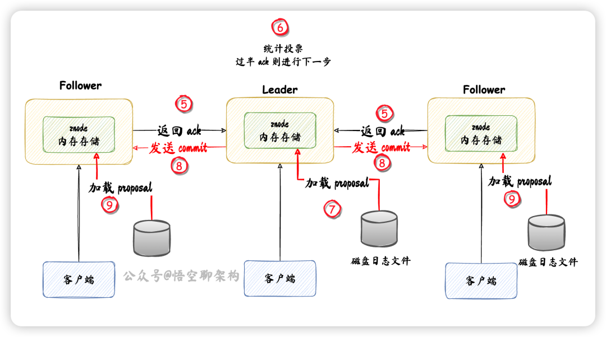
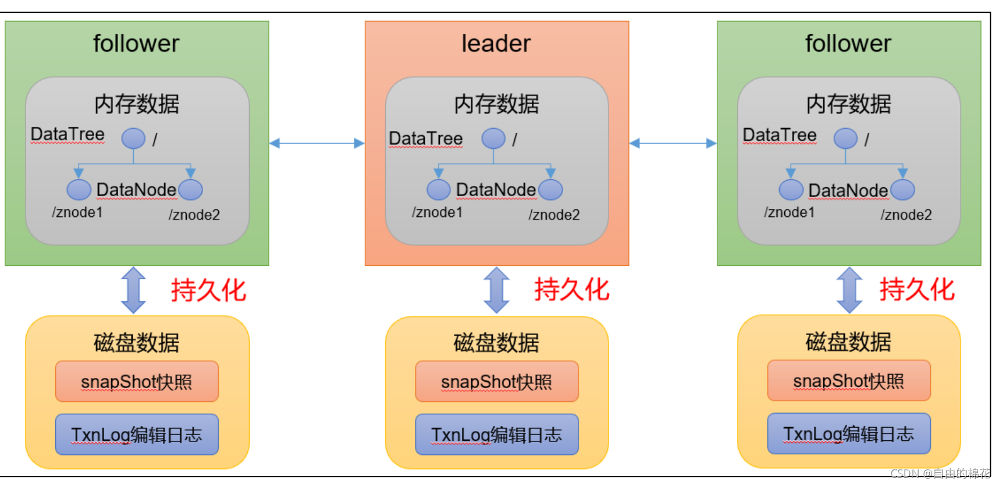
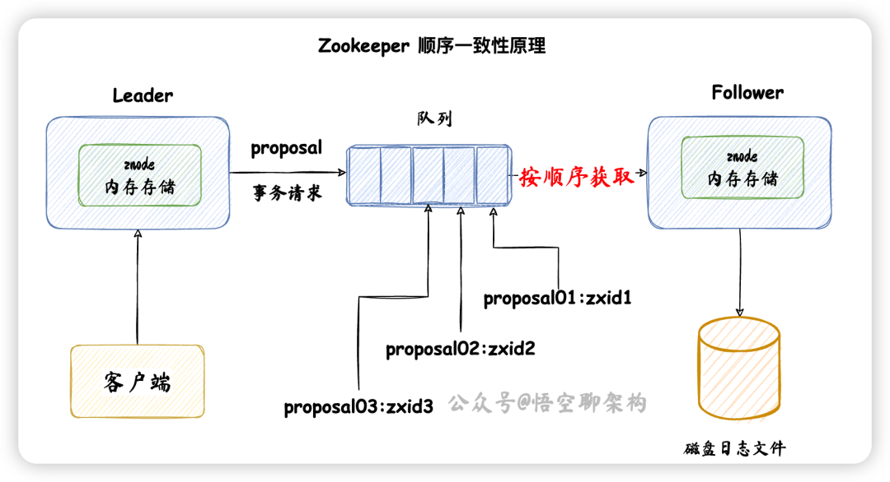

## **概述** 

ZooKeeper 是一个开源的分布式协调服务(基于k-v形式存储)，用**Java语言**来开发的。由雅虎公司创建，是google chubby 的开源实现。ZooKeeper的设计目标是将那些复杂且容易出错的分布式一致性服务封装起来，构成一个高效可靠的原语集（由若干条指令组成的，完成一定功能的一个过程），并且以一系列简单易用的接口提供给用户使用。

      总结：它是一个为分布式应用提供一致性服务的软件，提供的功能包括：配置维护、域名服务（服务注册/发现）、分布式同步、组服务等。

源码地址：https://github.com/apache/zookeeper


## 基本设计

​		Zookeeper 允许程序通过一个共享的类似于标准文件系统的有组织的分层命名空间分布式处理协调。命名空间包括：数据寄存器 - 在 Zookeeper 中叫 znodes, 它和文件、目录一样。和一般文件系统的不同之处是，它的设计就是为了存储，Zookeeper 的数据保持在内存中，这就意味着它可以实现高吞吐量和低延迟的数据。 

​		Zookeeper 的实现提供了一个优质的高性能、高可用，严格的访问顺序。Zookeeper 的性能方面意味着它可以用于大型的分布式系统。可靠性方面防止它成为一个单点故障。严格的顺序意味着可以在客户端实现复杂的同步原件。 

​		复制。像分布式处理一样，Zookeeper 自己在处理协调的时候要复制多个主机。




​		Zookeeper 服务的组成部分必须彼此都知道彼此，它们维持了一个内存状态影像， 与事务日志、快照在一个持久化的存储中。只要大多数的服务器是可用的，Zookeeper 服务就是可用的。

​		客户端连接到一个单独的服务。客户端保持了一个 TCP 连接，通过这个 TCP 连接发送请求、获取响应、获取 watch 事件、和发送心跳。如果这个连接断了，会自动连接到其他不同的服务器。

​		序列。Zookeeper 用数字标记每一个更新，用它来反射出所有的事务顺序。随后的操作可以使用这个顺序去实现更高级的抽象，例如同步原件。

​		快速。它在"Read-dominant"工作负载中特别快。Zookeeper 应用运行在数以千计的机器上，并且它通常在读多写少的时候运行的最好，读写大概比例在 10:1。


## **数据模型和分层的命名空间**

Zookeeper 提供的命名空间非常像一个标准的文件系统。一个名字是一系列的以' /'隔开的一个路径元素。Zookeeper 命名空间中所有的节点都是通过路径识别。


## **节点和临时节点**

​		不像标准的文件系统，Zookeeper 命名空间中的每个节点可以有数据也可以有子目录。它就像一个既可以是文件也可以是目录的文件系统。(Zookeeper 被设计成保存协调数据：状态信息，配置，位置信息，等等，所以每个节点存储的数据通常较小，通常在 1 个字节到数千字节的范围之内)我们使用术语**znode**来表明 Zookeeper 的**数据节点**。 

​		znode 维持了一个 stat 结构，它包括数据变化的版本号、访问控制列表变化、和时间戳，允许缓存验证和协调更新。每当 znode 的数据有变化，版本号就会增加。 例如，每当客户端检索数据时同时它也获取数据的版本信息。 

​		Zookeeper 还有一个临时节点的概念。这些 znode 和 session 存活的一样长，session 创建时存活，当 session 结束，也跟着删除。


## Watch

​		Zookeeper 支持 watch 的概念。客户端可以在 znode 上设置一个 watch。当 znode 发生变化时触发并移除 watch。当 watch 被触发时，客户端会接收到一个包说明 znode 有变化了。




## 保证

Zookeeper 是非常简单和高效的。因为它的目标就是，作为建设复杂服务的基础， 比如同步。zookeeper 提供了一套保证，他们包括： 

1. 顺序一致性 - 来自客户端的更新会按顺序应用。 
2.  原子性 - 更新成功或者失败，没有局部的结果产生。 
3. 唯一系统映像 - 一个客户端不管连接到哪个服务端都会看到同样的视图。
4.  可靠性- 一旦一个更新被应用，它将从更新的时间开始一直保持到一个客户端重写更新。
5. 时效性 - 系统中的客户端视图在特定的时间点保证成为是最新的。  


## 核心实现（zab协议）

Zab协议 的全称是**Zookeeper Atomic Broadcast**（Zookeeper原子广播）。

**Zookeeper 是通过 Zab 协议来保证分布式事务的最终一致性**。

1. Zab协议是为[分布式](https://so.csdn.net/so/search?q=分布式&spm=1001.2101.3001.7020)协调服务Zookeeper专门设计的一种 **支持崩溃恢复** 的 **原子广播协议** ，是Zookeeper保证数据一致性的核心算法。Zab借鉴了Paxos算法，但又不像Paxos那样，是一种通用的分布式一致性算法。**它是特别为Zookeeper设计的支持崩溃恢复的原子广播协议**。
2. 在Zookeeper中主要依赖Zab协议来实现数据一致性，基于该协议，zk实现了一种主备模型（即Leader和Follower模型）的系统架构来保证集群中各个副本之间数据的一致性。
   这里的主备系统架构模型，就是指只有一台服务器（Leader）负责处理外部的写事务请求，然后Leader服务器将数据同步到其他Follower节点。

Zookeeper 客户端会随机的链接到 zookeeper 集群中的一个节点，如果是读请求，就直接从当前节点中读取数据；如果是写请求，那么节点就会向 Leader 提交事务，Leader 接收到事务提交，会广播该事务，只要超过半数节点写入成功，该事务就会被提交。

### zxid

ZXID 也就是事务ID，为了保证事务的顺序一致性，zookeeper 采用了递增的事务 id 号（ZXID）来标识事务。所有的提议（proposal）都在被提出的时候加上了 ZXID。

实现中ZXID 是一个 64 位的数字，它高32位是epoch（ZAB协议通过epoch编号来区分 Leader 周期变化的策略）用来标识 leader 关系是否 改变，每次一个 leader 被选出来，它都会有一个新的 epoch=（原来的epoch+1），标识当前属于那个leader的 统治时期。

低32位用于递增计数 。

### Zookeeper 各节点的角色

Leader：

- 负责处理客户端发送的读、写事务请求。这里的事务请求可以理解这个请求具有事务的 ACID 特性。
- 同步写事务请求给其他节点，且需要保证事务的顺序性。
- 状态为 LEADING。

Follower：

- 负责处理客户端发送的读请求
- 转发写事务请求给 Leader。
- 参与 Leader 的选举。
- 状态为 FOLLOWING。

Observer：

- 和 Follower 一样，唯一不同的是，不参与 Leader 的选举，且状态为 OBSERING。

- 可以用来线性扩展读的 QPS。

  

### 启动阶段选 Leader

Zookeeper 刚启动的时候，多个节点需要找出一个 Leader。怎么找呢，就是用投票。

比如集群中有两个节点，A 和 B，原理图如下所示：




​		（上图 2步骤，投票信息上下颠倒了）

- 节点 A 先投票给自己，投票信息包含节点 id(SID) 和一个 ZXID，如 (1,0)。SID 是配置好的，且唯一，ZXID 是唯一的递增编号。

- 节点 B 先投票给自己，投票信息为(2,0)。

- 然后节点 A 和 B 将自己的投票信息投票给集群中所有节点。

- 节点 A 收到节点 B 的投票信息后，检查下节点 B 的状态是否是本轮投票，以及是否是正在选举(LOOKING)的状态。

- 投票 PK：节点 A 会将自己的投票和别人的投票进行 PK，如果别的节点发过来的 ZXID 较大，则把自己的投票信息更新为别的节点发过来的投票信息，如果 ZXID 相等，则比较 SID。这里节点 A 和 节点 B 的 ZXID 相同，SID 的话，**节点 B 要大些**，所以节点 A 更新投票信息为(2，0)，然后将投票信息再次发送出去。而节点 B 不需要更新投票信息，但是下一轮还需要再次将投票发出去。

  

这个时候节点 A 的投票信息为(2，0)，如下图所示：



- 统计投票：每一轮投票，都会统计每台节点收到的投票信息，判断是否有过半的节点收到了相同的投票信息。节点 A 和 节点 B 收到的投票信息都为(2，0)，且数量来说，大于一半节点的数量，所以将节点 B 选出来作为 Leader。
- 更新节点状态：节点 A 作为 Follower，更新状态为 FOLLOWING，节点 B 作为 Leader，更新状态为 LEADING。

### 运行期间，Leader 宕机后的选新Leader

在 Zookeeper 运行期间，Leader 会一直保持为 LEADING 状态，直到 Leader 宕机了，这个时候就要重新选 Leader，而选举过程和启动阶段的选举过程基本一致。

需要注意的点：

- 剩下的 Follower 进行选举，Observer 不参与选举。
- 投票信息中的 zxid 用的是本地磁盘日志文件中的。如果这个节点上的 zxid 较大，就会被当选为 Leader。如果 Follower 的 zxid 都相同，则 Follower 的节点 id 较大的会被选为 Leader。

### 节点之间同步数据过程

不同的客户端可以分别连接到主节点或备用节点。

而客户端发送读写请求时是不知道自己连的是Leader 还是 Follower，如果客户端连的是主节点，发送了写请求，那么 Leader 执行 2PC(两阶段提交协议)同步给其他 Follower 和 Observer 就可以了。但是如果客户端连的是 Follower，发送了写请求，那么 Follower 会将写请求转发给 Leader，然后 Leader 再进行 2PC 同步数据给 Follower。

两阶段提交协议：

- 第一阶段：Leader 先发送 proposal 给 Follower，Follower 发送 ack 响应给 Leader。如果收到的 ack 过半，则进入下一阶段。
- 第二阶段： Leader 从磁盘日志文件加载数据到内存中，Leader 发送 commit 消息给 Follower，Follower 加载数据到内存中。

我们来看下 Leader 同步数据的流程（提案先落盘）：



- ① 客户端发送写事务请求。
- ② Leader 收到写请求后，转化为一个 "proposal01：zxid1" 事务请求，存到磁盘日志文件。
- ③ 发送 proposal 给其他 Follower。
- ④ Follower 收到 proposal 后，Follower 写磁盘日志文件。


接着我们看下 Follower 收到 Leader 发送的 proposal 事务请求后，怎么处理的：



- ⑤ Follower 返回 ack 给 Leader。
- ⑥ Leader 收到超过一半的 ack，进行下一阶段
- ⑦ Leader 将磁盘中的日志文件的 proposal 加载到 znode 内存数据结构中。
- ⑧ Leader 发送 commit 消息给所有 Follower 和 Observer。
- ⑨ Follower 收到 commit 消息后，将 磁盘中数据加载到 znode 内存数据结构中。

现在 Leader 和 Follower 的数据都是在内存数据中的，且是一致的，客户端从 Leader 和 Follower 读到的数据都是一致的**（最终一致性）**。


### 持久化（故障恢复）

​		ZooKeeper的数据的持久化主要是依赖两种文件，第一种是**snapshot快照文件**，一种是**log日志文件**。对于snapshot文件存储的是这个DataTree和session内存的快照，对于log文件则是顺序存储的事务日志。

​		可以通过配置snapCount配置每间隔事务请求个数，生成快照，数据存储在dataDir 指定的目录中，可以通过如下方式进行查看快照数据（ 为了避免集群中所有机器在同一时间进行快照，实际的快照生成时机为事务数达到 [snapCount/2  + 随机数(随机数范围为1 ~ snapCount/2 )] 个数时开始快照）。

​		ZooKeeper进行事务日志文件操作的时候会频繁进行磁盘IO操作，事务日志的不断追加写操作会触发底层磁盘IO为文件开辟新的磁盘块，即磁盘Seek。因此，为了提升磁盘IO的效率，Zookeeper在创建事务日志文件的时候就进行文件空间的预分配- 即在创建文件的时候，就向操作系统申请一块大一点的磁盘块。这个预分配的磁盘大小可以通过系统参数 zookeeper.preAllocSize 进行配置，默认64M。




### ZAB 的顺序一致性原理

Leader 发送 proposal 时，其实会为每个 Follower 创建一个队列，都往各自的队列中发送 proposal。

如下图所示是 Zookeeper 的消息广播流程：



客户端发送了三条写事务请求，对应的 proposal 为：

```
proposal01:zxid1
proposal02:zxid2
proposal03:zxid3
```

Leader 收到请求后，依次放到队列中，然后 Follower 依次从队列中获取请求，这样就保证了数据的顺序性。


### Zookeeper 到底是不是强一致性？

官方定义：**最终一致性、顺序一致性**

不保证强一致性，为什么呢？

因为 Leader 再发送 commit 消息给所有 Follower 和 Observer 后，它们并不是同时完成 commit 的。

比如因为网络原因，不同节点收到的 commit 较晚，那么提交的时间也较晚，就会出现多个节点的数据不一致，但是经过短暂的时间后，所有节点都 commit 后，数据就保持同步了。

另外 Zookeeper 支持强一致性，就是手动调用 sync 方法来保证所有节点都 commit 才算成功。  


### Leader 宕机数据丢失问题

第一种情况：

假设 Leader 已经将消息写入了本地磁盘，但是还没有发送 proposal 给 Follower，这个时候 Leader 宕机了。

那就需要选新的 Leader，新 Leader 发送 proposal 的时候，包含的 zxid 自增规律会发生一次变化：

- zxid 的高 32 位自增 1 一次，高 32 位代表 Leader 的版本号。
- zxid 的低 32 位自增 1，后续还是继续保持自增长。

当老 Leader 恢复后，会转成 Follower，Leader 发送最新的 proposal 给它时，发现本地磁盘的 proposal 的 zxid 的高 32 位小于新 Leader 发送的 proposal，就丢弃自己的 proposal。

第二种情况：

如果 Leader 成功发送了 commit 消息给 Follower，但是所有或者部分 Follower 还没来得及 commit 这个 proposal，也就是加载磁盘中的 proposal 到 内存中，这个时候 Leader 宕机了。

那么就需要选出磁盘日志中 zxid 最大的 Follower，如果 zxid 相同，则比较节点 id，节点 id 大的作为 Leader。

**告诉客户端成了，那就肯定成了，没有告诉客户端成了则不一定没成**


## 使用案例

### Zookeeper 分布式锁实现

#### 排他锁

排他锁（Exclusive Locks），又被称为写锁或独占锁，如果事务T1对数据对象O1加上排他锁，那么整个加锁期间，只允许事务T1对O1进行读取和更新操作，其他任何事务都不能进行读或写。

定义锁：

```
/exclusive_lock/lock
```

**实现方式：**

利用 zookeeper 的同级节点的唯一性特性，在需要获取排他锁时，所有的客户端试图通过调用 create() 接口，在 **/exclusive_lock** 节点下创建临时子节点 **/exclusive_lock/lock**，最终只有一个客户端能创建成功，那么此客户端就获得了分布式锁。同时，所有没有获取到锁的客户端可以在 **/exclusive_lock** 节点上注册一个子节点变更的 watcher 监听事件，以便重新争取获得锁。

#### 读写锁

读写锁。如果事务T1对数据对象O1加上了共享锁，那么当前事务只能对O1进行读取操作，其他事务也只能对这个数据对象加共享锁，直到该数据对象上的所有共享锁都释放。

定义锁:

```
/shared_lock/[hostname]-请求类型W/R-序号
```

**实现方式：**

1、客户端调用 create 方法创建类似定义锁方式的临时顺序节点。


2、客户端调用 getChildren 接口来获取所有已创建的子节点列表。

3、判断是否获得锁，对于读请求如果所有比自己小的子节点都是读请求或者没有比自己序号小的子节点，表明已经成功获取共享锁，同时开始执行度逻辑。对于写请求，如果自己不是序号最小的子节点，那么就进入等待。

4、如果没有获取到共享锁，**读请求**向比自己序号小的**最后一个写请求**节点注册 watcher 监听，**写请求**向比自己序号小的**最后一个节点**注册watcher 监听。

实际开发过程中，可以 curator 工具包封装的API帮助我们实现分布式锁。

```
<dependency>
  <groupId>org.apache.curator</groupId>
  <artifactId>curator-recipes</artifactId>
  <version>x.x.x</version>
</dependency>
```

curator 的几种锁方案 ：

- 1、**InterProcessMutex**：分布式可重入排它锁
- 2、**InterProcessSemaphoreMutex**：分布式排它锁
- 3、**InterProcessReadWriteLock**：分布式读写锁


## 参考文档
[七张图彻底讲清楚ZooKeeper分布式锁的实现原理](https://juejin.cn/post/6844903729406148622)
[拜托，面试请不要再问我Redis分布式锁的实现原理！](https://juejin.cn/post/6844903717641142285)